# Guía y Laboratorio: Patrones Esenciales de Software para tu Proyecto de Portafolio

## Datos generales

**Asignatura:** TPY1101 – Taller Aplicado de Programación
**Duración estimada del laboratorio:** 1 hora 30 minutos
**Modalidad:** Individual o en equipos del proyecto de portafolio
**Stack de referencia:** React (frontend) y Node.js + Express (backend)
**Audiencia:** estudiantes desarrollando el proyecto de portafolio 2026-01
**Prerequisitos:** haber entregado la EP1 (contexto, problema, objetivos, stack tentativo).

---

## 0. Cómo está organizado este documento

Este material está pensado como **una guía que podrás volver a consultar durante todo el semestre**, no como un listado enciclopédico. Por eso se limita a los patrones más usados en la industria y en los proyectos de la asignatura.

**Parte A – Fundamentos:**
- Por qué existen los patrones (teoría).
- **4 patrones esenciales de frontend** (con React).
- **5 patrones esenciales de backend** (con Node.js).
- **4 estilos de arquitectura** (con diagramas).
- Estructura de carpetas recomendada.
- Plataformas cloud gratuitas.

**Parte B – Recomendación específica para cada grupo del curso 2026-01:**
- Grupo 1 (MapacheSecure), Grupo 2 (Deckora), Grupo 3 (NoLimits), Grupo 4 (40dB), Grupo 5 (Pop Study), Grupo 6 (Generador de Landing Pages con IA), Grupo 7 (AGENTE X).
- Cada grupo recibe una tarjeta con los patrones que debe aplicar, el diagrama tentativo y las plataformas cloud sugeridas.

**Parte C – Actividad de 90 minutos:**
- Ejercicio guiado para que cada equipo produzca un documento de arquitectura real para su proyecto.

---

# PARTE A – FUNDAMENTOS

---

## 1. ¿Por qué existen los patrones de diseño?

### 1.1. Definición

Un **patrón de diseño** es una solución reutilizable, probada y documentada a un **problema recurrente** en el desarrollo de software. No es una receta exacta ni un fragmento de código listo para copiar: es una **forma de organizar el código** que la industria ha validado después de décadas de prueba y error.

La referencia fundacional es el libro *Design Patterns: Elements of Reusable Object-Oriented Software* (1994), conocido como "GoF" (Gang of Four). Desde entonces el concepto se ha extendido a patrones arquitectónicos, patrones de frontend, patrones de backend, patrones de integración y otros.

### 1.2. ¿Por qué importan en tu proyecto?

Elegir un patrón adecuado reduce el costo de:

1. **agregar funcionalidades** sin romper lo existente;
2. **probar el sistema** por partes;
3. **cambiar una dependencia** (la base de datos, un proveedor de email, un gateway de pago) sin reescribir todo;
4. **incorporar a un compañero nuevo** al proyecto, porque el código sigue una convención conocida;
5. **defender las decisiones técnicas** en la presentación final del portafolio.

### 1.3. ¿Cuándo NO usar un patrón?

El peor error en proyectos de estudiantes es **aplicar patrones sofisticados a problemas simples**. Un CRUD de 3 tablas no necesita microservicios ni Clean Architecture. Antes de elegir un patrón, pregúntate:

- ¿Qué problema concreto me resuelve?
- ¿Estoy agregando complejidad a cambio de un beneficio real?
- ¿Mis compañeros lo van a entender?

Si no puedes responder las tres, probablemente no necesitas ese patrón.

### 1.4. Historia breve de los patrones de diseño

Antes de estudiar patrones concretos es útil entender **de dónde vienen**. Los patrones no nacieron en la programación, y esa historia explica por qué están redactados como están (problema → contexto → solución).

**1977 — Christopher Alexander y los patrones arquitectónicos.**
El concepto de "patrón" fue introducido por el arquitecto Christopher Alexander en su libro *A Pattern Language: Towns, Buildings, Construction* (1977). Alexander analizaba cómo las ciudades, los barrios y los edificios tienen problemas que se repiten (por ejemplo, "cómo organizar la entrada de una casa para que dé privacidad sin aislar") y propuso un catálogo de 253 patrones nombrados, cada uno con su contexto, problema y solución. La idea nuclear —**dar nombre a soluciones recurrentes para poder hablar de ellas**— se conservará intacta en el mundo del software.

**1987 — Beck y Cunningham llevan la idea al software.**
Kent Beck y Ward Cunningham fueron los primeros en aplicar las ideas de Alexander al diseño de software. En la conferencia OOPSLA de 1987 presentaron un trabajo sobre cómo enseñar diseño de interfaces de usuario en Smalltalk usando un "lenguaje de patrones". Esta semilla derivó en una comunidad activa durante los años 90.

**1994 — La "Gang of Four" (GoF).**
El libro *Design Patterns: Elements of Reusable Object-Oriented Software* de Erich Gamma, Richard Helm, Ralph Johnson y John Vlissides (1994) —conocido simplemente como "GoF"— catalogó 23 patrones clásicos orientados a objetos. Hasta hoy es la referencia obligada. Los 23 patrones se agrupan en tres familias:

| Familia | Qué resuelve | Patrones representativos |
|---|---|---|
| **Creacionales** | Cómo crear objetos de forma flexible | Singleton, Factory Method, Abstract Factory, Builder, Prototype |
| **Estructurales** | Cómo componer objetos en estructuras más grandes | Adapter, Decorator, Facade, Composite, Proxy, Bridge, Flyweight |
| **De comportamiento** | Cómo colaboran los objetos entre sí | Observer, Strategy, Command, Iterator, Template Method, State, Chain of Responsibility, Mediator, Memento, Visitor, Interpreter |

**1996 — POSA y patrones arquitectónicos.**
La serie *Pattern-Oriented Software Architecture* (Buschmann, Meunier, Rohnert, Sommerlad y Stal, 1996) extendió el concepto más allá de clases y objetos hacia **patrones arquitectónicos**: Layers, Pipes and Filters, Broker, Model-View-Controller, Microkernel. Es el puente entre diseño y arquitectura.

**2002 — Fowler y los patrones empresariales.**
Martin Fowler publicó *Patterns of Enterprise Application Architecture*, un catálogo de patrones para sistemas de gestión: Repository, Service Layer, Active Record, Data Mapper, Unit of Work, Domain Model, DTO. La mayoría de los patrones de backend que se usan hoy en Node.js, Java o .NET se popularizaron aquí.

**2003 — Hohpe y Woolf, integración.**
*Enterprise Integration Patterns* (Hohpe y Woolf) catalogó cómo se comunican sistemas diferentes entre sí: Message Channel, Publish-Subscribe, Message Router, Saga. Es la base de las arquitecturas event-driven y de microservicios.

**2005-2015 — Patrones modernos.**
A medida que el software se mueve al navegador, al móvil y a la nube surgen nuevas familias: patrones frontend reactivos (Flux, Redux, MVVM), patrones de concurrencia (Reactor, Actor), y patrones cloud (Circuit Breaker, Bulkhead, Retry, Sidecar) documentados por Microsoft Azure Cloud Design Patterns y el AWS Well-Architected Framework.

**2018-actualidad — Patrones de React y del ecosistema JavaScript.**
Con la llegada de React Hooks (2018) nacen los **custom hooks**, el **Provider Pattern**, y la formalización de **Component-Based Architecture** como paradigma dominante en el frontend.

**Idea clave.** Cada patrón nació porque una comunidad se cansó de resolver el mismo problema de formas incompatibles. El patrón es, entonces, **un atajo cultural compartido**: cuando dices "usemos Repository", todo el equipo sabe qué estructura de código esperar.

### 1.5. Principios fundamentales: SOLID

Los principios **SOLID** fueron formulados por Robert C. Martin ("Uncle Bob") alrededor del año 2000 y son la base sobre la que descansan casi todos los patrones orientados a objetos. No son reglas rígidas: son **criterios de diseño** que, cuando se respetan, tienden a producir código flexible, testeable y sostenible.

SOLID es un acrónimo de cinco principios: **S**ingle Responsibility, **O**pen/Closed, **L**iskov Substitution, **I**nterface Segregation, **D**ependency Inversion.

#### S — Single Responsibility Principle (SRP)

*"Una clase debe tener una y solo una razón para cambiar."*

Si una clase hace varias cosas distintas, cada una de ellas puede motivar un cambio, y cada cambio arriesga romper las otras funcionalidades.

**Violación típica:** una clase `Usuario` que valida sus datos, los guarda en la base de datos y además envía emails de bienvenida.

```js
// MAL: Usuario tiene tres razones para cambiar
class Usuario {
  constructor(data) { this.data = data; }

  validar() { /* reglas de validación */ }
  guardar() { /* lógica de persistencia en PostgreSQL */ }
  enviarBienvenida() { /* SMTP, plantillas HTML, etc. */ }
}
```

Si cambia la base de datos, hay que tocar `Usuario`. Si cambia el proveedor de email, hay que tocarlo otra vez. Si cambian las reglas de validación, idem. Tres responsabilidades mezcladas.

```js
// BIEN: cada clase tiene una sola razón para cambiar
class Usuario { constructor(data) { Object.assign(this, data); } }
class ValidadorUsuario { validar(u) { /* ... */ } }
class RepositorioUsuarios { guardar(u) { /* ... */ } }
class ServicioEmail { enviarBienvenida(u) { /* ... */ } }
```

Patrones relacionados: Repository, Service Layer, DTO, Controller.

#### O — Open/Closed Principle (OCP)

*"Las entidades deben estar abiertas a la extensión, pero cerradas a la modificación."*

Un módulo debe permitir agregar comportamiento nuevo sin tocar el código existente. Esto se logra normalmente con **polimorfismo**.

**Violación típica:** un `if/else` gigante sobre un tipo.

```js
// MAL: cada nuevo método de pago obliga a modificar esta función
function procesarPago(tipo, monto) {
  if (tipo === 'webpay') { /* ... */ }
  else if (tipo === 'paypal') { /* ... */ }
  else if (tipo === 'stripe') { /* ... */ }
}
```

```js
// BIEN: patrón Strategy. Agregar un nuevo método es crear una clase nueva.
class PagoWebpay   { procesar(monto) { /* ... */ } }
class PagoPaypal   { procesar(monto) { /* ... */ } }
class PagoStripe   { procesar(monto) { /* ... */ } }

function procesarPago(estrategia, monto) {
  return estrategia.procesar(monto);
}
```

Patrones relacionados: Strategy, Template Method, Decorator, Plugin Architecture.

#### L — Liskov Substitution Principle (LSP)

*"Un objeto de una subclase debe poder sustituir a uno de su clase padre sin alterar la corrección del programa."*

**Ejemplo clásico: Rectangle/Square.** Un cuadrado "es un" rectángulo, pero si la subclase `Cuadrado` obliga a que ancho y alto sean iguales, un código que hace `rect.setAncho(10); rect.setAlto(5)` dejará de funcionar cuando reciba un `Cuadrado`.

```js
// MAL: Cuadrado rompe la expectativa de Rectangulo
class Rectangulo {
  setAncho(w) { this.w = w; }
  setAlto(h)  { this.h = h; }
  area() { return this.w * this.h; }
}
class Cuadrado extends Rectangulo {
  setAncho(w) { this.w = this.h = w; }
  setAlto(h)  { this.w = this.h = h; }
}

function test(r) { r.setAncho(10); r.setAlto(5); console.assert(r.area() === 50); }
test(new Rectangulo()); // OK
test(new Cuadrado());   // FALLA
```

**Solución:** no derivar Cuadrado de Rectangulo. Ambos son Figuras, pero no comparten el mismo contrato de "setAncho/setAlto".

Patrones relacionados: diseño por contrato, composición sobre herencia.

#### I — Interface Segregation Principle (ISP)

*"Los clientes no deben ser forzados a depender de métodos que no usan."*

Mejor **muchas interfaces pequeñas y específicas** que una interfaz grande y genérica.

```ts
// MAL: una interfaz "multifunción" obliga a implementar todo
interface IDispositivoOficina {
  imprimir(doc: string): void;
  escanear(doc: string): void;
  enviarFax(doc: string): void;
}
// Una impresora básica no hace fax, pero igual debe implementarlo
```

```ts
// BIEN: interfaces pequeñas y combinables
interface IImpresora { imprimir(doc: string): void; }
interface IEscaner  { escanear(doc: string): void; }
interface IFax      { enviarFax(doc: string): void; }

class ImpresoraBasica implements IImpresora { imprimir(d) { /* ... */ } }
class Multifuncional implements IImpresora, IEscaner, IFax { /* ... */ }
```

Patrones relacionados: Adapter, Facade, Role Interfaces.

#### D — Dependency Inversion Principle (DIP)

*"Depende de abstracciones, no de implementaciones concretas."*

Las clases de alto nivel (servicios) no deben conocer a las de bajo nivel (drivers, librerías); ambas deben depender de una interfaz compartida.

```js
// MAL: el servicio instancia directamente una clase concreta
const PostgresRepo = require('./donantes.postgres');
class DonantesService {
  constructor() { this.repo = new PostgresRepo(); } // acoplado a Postgres
}
```

```js
// BIEN: el servicio recibe el repositorio por inyección
class DonantesService {
  constructor(repo) { this.repo = repo; } // acepta cualquier implementación
}
// En tests puedes pasar un repo en memoria; en producción, uno Postgres.
```

Patrones relacionados: Repository, Service Layer, Dependency Injection, Strategy.

#### Relación entre SOLID y los patrones de esta guía

| Patrón | Principio SOLID dominante |
|---|---|
| Component-Based (React) | SRP (cada componente con una responsabilidad) |
| Custom Hooks | SRP + DIP (lógica separada de UI) |
| Provider / Context | DIP (componentes dependen de una abstracción de estado) |
| Layered Architecture | SRP + DIP (capas con roles claros) |
| Repository | DIP (abstracción sobre la base de datos) |
| Service Layer | SRP (lógica de negocio centralizada) |
| DTO + Validación | ISP (contratos específicos por endpoint) |
| Middleware | OCP (agregar middleware no modifica el resto) |
| Strategy (pagos, notificaciones) | OCP + DIP |
| MVC | SRP (Model/View/Controller separados) |

### 1.6. Cohesión y acoplamiento

SOLID se apoya en dos conceptos más antiguos que se enseñan desde los años 70: **cohesión** y **acoplamiento**, formulados por Larry Constantine y popularizados por Yourdon & Constantine (1979) y luego por Meyer.

#### Cohesión (alta es bueno)

La **cohesión** mide qué tan enfocado está un módulo en una sola tarea. Un módulo con alta cohesión contiene código que "va junto" porque sirve a un mismo propósito.

| Tipo de cohesión | Significado | Calidad |
|---|---|---|
| **Funcional** | Todos los elementos cooperan para una única tarea bien definida | Óptima |
| **Secuencial** | La salida de un elemento es la entrada del siguiente | Buena |
| **De comunicación** | Los elementos operan sobre los mismos datos | Aceptable |
| **Procedural** | Los elementos siguen un orden, pero no comparten datos | Débil |
| **Temporal** | Los elementos se ejecutan en el mismo momento (ej. "inicialización") | Débil |
| **Lógica** | Los elementos se agrupan porque son "del mismo tipo" (ej. todas las utilidades) | Débil |
| **Coincidental** | Agrupación arbitraria, sin relación real | Pésima |

Un `services/donantes.service.js` con funciones `crear`, `listar`, `eliminar` tiene cohesión **funcional**: todo gira en torno al concepto "donante". Un archivo `utils.js` que mezcla `formatoRut`, `enviarEmail`, `generarPDF` tiene cohesión **coincidental**: nada une esas funciones salvo que al autor le dio flojera crear tres archivos.

#### Acoplamiento (bajo es bueno)

El **acoplamiento** mide qué tan dependiente es un módulo de los detalles internos de otros. Cuanto más acoplamiento, más frágil es el sistema: cambiar una cosa rompe otra.

| Tipo de acoplamiento | Significado | Calidad |
|---|---|---|
| **Por datos** | Se pasan solo los datos estrictamente necesarios como parámetros | Óptimo |
| **Por estampa** | Se pasa una estructura completa aunque solo se use una parte | Bueno |
| **De control** | Un módulo le dice a otro "qué hacer" con un flag | Aceptable |
| **Externo** | Dependencia de un formato o protocolo externo (JSON, CSV, protocolo de red) | Aceptable |
| **Común** | Varios módulos comparten una variable global mutable | Malo |
| **De contenido** | Un módulo accede a detalles internos de otro (por ejemplo, sus propiedades privadas) | Pésimo |

**Regla general:** busca **alta cohesión** dentro de cada módulo y **bajo acoplamiento** entre módulos.

#### Cómo los patrones mueven ambas palancas

- **Interfaces / abstracciones (Repository, Strategy):** reducen acoplamiento. El service depende del contrato, no del motor de base de datos.
- **Inversión de dependencias (DIP):** el módulo de alto nivel no conoce al de bajo nivel; ambos conocen una interfaz común.
- **Responsabilidad única (SRP):** aumenta cohesión. Cada módulo tiene un solo "para qué".
- **Middleware / Pipeline:** cada paso tiene una responsabilidad y es intercambiable.
- **Custom Hooks:** separan lógica (fetch, estado) de presentación, bajando acoplamiento entre UI y datos.

### 1.7. Principios complementarios

Además de SOLID y cohesión/acoplamiento, hay un puñado de principios cortos que vale la pena memorizar porque aparecen en todas las revisiones de código de la industria.

#### DRY — Don't Repeat Yourself

Formulado por Andy Hunt y Dave Thomas en *The Pragmatic Programmer* (1999): *"cada pieza de conocimiento debe tener una representación única, inequívoca y autoritativa dentro de un sistema."*

La duplicación no es solo código copiado: son **reglas de negocio repetidas**. Si el cálculo del IVA aparece en el frontend, en el backend y en un PDF de factura, cualquier cambio de la tasa exige modificar tres lugares y arriesgarse a dejar alguno desactualizado.

```js
// MAL: regla de negocio repetida
// frontend
const total = items.reduce((s,i) => s + i.precio*i.cantidad, 0) * 1.19;
// backend
const total = items.reduce((s,i) => s + i.precio*i.cantidad, 0) * 1.19;
```

```js
// BIEN: la regla vive en un único lugar compartido
// packages/utils/iva.js
export const TASA_IVA = 0.19;
export const aplicarIva = (neto) => neto * (1 + TASA_IVA);
```

**Cuidado con el DRY fanático.** Fowler advierte que a veces dos fragmentos **parecen** iguales por coincidencia. Abstraer prematuramente genera acoplamientos artificiales peores que la duplicación. Regla práctica: "duplicar dos veces es barato, duplicar tres veces no".

#### KISS — Keep It Simple, Stupid

Atribuido a Kelly Johnson (ingeniero de Lockheed, años 60), enuncia que la mayoría de los sistemas funcionan mejor si se mantienen simples. En software: prefiere soluciones directas, legibles y con pocos conceptos.

```js
// MAL: generalización prematura
function ejecutarAccion(tipo, payload, opciones={}, handlers={}) { /* 80 líneas */ }

// BIEN: funciones específicas y claras
function crearDonante(data) { /* ... */ }
function eliminarDonante(id) { /* ... */ }
```

#### YAGNI — You Aren't Gonna Need It

Principio de Extreme Programming, formulado por Kent Beck y Ron Jeffries (~1999). Traducido: *"no agregues funcionalidad hasta que realmente la necesites."*

Un parámetro "por si acaso", una interfaz genérica "por si algún día", un sistema de plugins "para cuando crezca" suelen convertirse en lastre. El 80% de esas funcionalidades nunca se usan.

Aplicación concreta al portafolio: **no construyas microservicios porque "algún día podría escalar"**. Construye un monolito modular; si algún día escala, extrae servicios.

#### Separation of Concerns (SoC)

Introducido por Edsger W. Dijkstra en *On the role of scientific thought* (1974). Cada problema debe estar aislado de los otros. Ejemplos cotidianos:

- HTML (estructura), CSS (presentación), JavaScript (comportamiento).
- Controller (HTTP), Service (negocio), Repository (persistencia).
- Componente presentacional, Custom Hook (lógica), Store (estado global).

Si un cambio de un "concern" te obliga a tocar varios archivos, la separación está mal hecha.

#### Law of Demeter — "no hables con los amigos de tus amigos"

Propuesto en el proyecto Demeter (Lieberherr, 1987). Un objeto solo debería llamar métodos de:

1. sí mismo,
2. sus parámetros,
3. los objetos que él mismo crea,
4. sus atributos directos.

**No debe** navegar cadenas largas del tipo `a.b.c.d.haz()`.

```js
// MAL: violación de Demeter
function imprimirCiudad(pedido) {
  console.log(pedido.cliente.direccion.ciudad.nombre);
}
```

```js
// BIEN: expón la información necesaria a través de una abstracción
class Pedido {
  get ciudadCliente() { return this.cliente.direccion.ciudad.nombre; }
}
console.log(pedido.ciudadCliente);
```

La ley de Demeter reduce el acoplamiento: cuando cambie la estructura interna de `Cliente` o `Direccion`, solo `Pedido` se entera.

### 1.8. Anti-patrones más frecuentes en proyectos de estudiantes

Un **anti-patrón** es una solución que se repite en muchos proyectos y que **parece buena** pero genera más problemas de los que resuelve. Saber reconocerlos es tan importante como saber aplicar patrones.

#### God Object / God Class

**Síntoma visible:** una clase o archivo de 800+ líneas que "hace todo" (autenticación, reglas de negocio, SQL, emails, logs).
**Por qué ocurre:** falta de planificación y miedo a crear archivos nuevos. Se empieza con algo pequeño y se va agregando "solo una cosa más".
**Qué patrón lo evita:** SRP, Layered Architecture, Service Layer, Repository.
**Ejemplo:** un `donantesController.js` que además valida RUT, conecta a la base de datos, envía correos y genera PDFs.

#### Spaghetti Code

**Síntoma visible:** flujos de control enredados, `if` anidados a 6 niveles, `goto` lógicos (llamadas impredecibles entre funciones), ausencia de estructura.
**Por qué ocurre:** ausencia de diseño previo, desarrollo puramente reactivo ("agrego cosas hasta que pase el test").
**Qué patrón lo evita:** MVC, Layered, Middleware Pipeline, State Machine.
**Ejemplo:** un handler de Express que, dentro de un `try/catch`, valida, consulta, transforma, envía email y escribe en logs, todo mezclado.

#### Copy-Paste Programming

**Síntoma visible:** 12 archivos con el mismo fragmento de código, ligeramente distinto en cada uno. Al corregir un bug hay que hacerlo 12 veces.
**Por qué ocurre:** prisa y desconocimiento de abstracciones.
**Qué patrón lo evita:** DRY, funciones utilitarias, Custom Hooks, Service Layer, Strategy.
**Ejemplo:** tres componentes React con el mismo `useEffect` para hacer fetch a distintas URLs, cuando un `useFetch(url)` lo resuelve.

#### Golden Hammer

**Síntoma visible:** *"tengo este patrón y lo aplico a todo."* El clásico: el que acaba de aprender Redux y mete Redux hasta para un contador local.
**Por qué ocurre:** entusiasmo por una tecnología recién aprendida.
**Qué patrón lo evita:** ninguno "técnico"; lo evita la disciplina y la pregunta "¿qué problema concreto resuelve esto aquí?".
**Ejemplo:** usar microservicios para una app de 3 pantallas; usar GraphQL para un formulario de contacto; usar Clean Architecture completa para un CRUD de 4 tablas.

#### Premature Optimization

**Síntoma visible:** código retorcido, ilegible, "optimizado" para ahorrar milisegundos que nadie va a notar.
**Por qué ocurre:** la famosa frase de Donald Knuth (1974): *"la optimización prematura es la raíz de todos los males"*. El programador cree que sabe dónde estará el cuello de botella antes de medirlo.
**Qué patrón lo evita:** medir primero (profiling), optimizar después. Principio YAGNI.
**Ejemplo:** reescribir un `map` legible en un bucle `for` de bajo nivel para ahorrar 3 ms en una API que tarda 300 ms en responder por la red.

#### Hardcoding

**Síntoma visible:** URLs, credenciales, rutas de archivos, tasas de impuesto, límites de paginación quemados directamente en el código fuente.
**Por qué ocurre:** es más rápido escribir `"http://localhost:3000"` que configurar variables de entorno.
**Qué patrón lo evita:** configuración externa (12-Factor App), archivos `.env`, `config/env.js`.
**Ejemplo:** `const API = 'http://mi-app.onrender.com/api'` en 30 componentes. Al cambiar el dominio, fallan todos.

#### Not Invented Here (NIH)

**Síntoma visible:** reescribir librerías estándar porque "así la controlo mejor" (un sistema de validación hecho a mano cuando existe Zod; un router casero cuando existe React Router).
**Por qué ocurre:** orgullo, desconfianza, desconocimiento del ecosistema.
**Qué patrón lo evita:** investigar el estado del arte antes de escribir.
**Ejemplo:** un `miORM.js` de 400 líneas cuando Prisma o Sequelize ya lo hacen.

#### Big Ball of Mud

Formalizado por Foote & Yoder en el paper *Big Ball of Mud* (1997). Es la arquitectura "de facto" más común del mundo: **no hay arquitectura**. Todo depende de todo, los nombres no significan nada, los límites no existen.

**Síntoma visible:** nadie del equipo puede explicar en un diagrama cómo funciona el sistema. Cada cambio rompe algo inesperado.
**Por qué ocurre:** falta de diseño inicial, presión de plazos, rotación del equipo.
**Qué patrón lo evita:** Layered, Hexagonal, Modular Monolith, DDD.
**Ejemplo:** un backend donde el controlador llama al repositorio, y el repositorio llama de vuelta al controlador; donde las rutas están dispersas en cinco archivos; donde la conexión a DB se abre en 20 lugares distintos.

#### Microservice Premium

Concepto introducido por Martin Fowler en el artículo *MicroservicePremium* (2015). Advierte que los microservicios tienen un **costo fijo de complejidad** (despliegue, monitoreo, comunicación entre servicios, consistencia eventual, pruebas end-to-end) que solo se paga cuando el sistema es lo suficientemente grande.

**Síntoma visible:** un proyecto de 3 pantallas partido en 8 microservicios, cada uno con su propio repositorio y su propia base de datos, requiriendo Docker Compose para correr en local.
**Por qué ocurre:** aplicar una arquitectura de Netflix a un proyecto de portafolio.
**Qué patrón lo evita:** *Monolith First* (también de Fowler, 2015): empezar con un monolito modular y extraer microservicios **solo** cuando haya evidencia de que se necesitan.
**Ejemplo:** en un proyecto educativo, el "servicio-auth", el "servicio-donantes" y el "servicio-reportes" pueden vivir felices dentro de un único monolito modular.

#### Tabla resumen de anti-patrones

| Anti-patrón | Detectalo por... | Mitiga con... |
|---|---|---|
| God Object | archivo de 800+ líneas | SRP, Service Layer |
| Spaghetti Code | sin capas, flujos impredecibles | Layered, MVC |
| Copy-Paste | misma lógica en N lugares | DRY, Custom Hooks, Service |
| Golden Hammer | aplicar el mismo patrón a todo | Revisar el "¿qué problema resuelve?" |
| Premature Optimization | código ilegible "rápido" | Medir primero, YAGNI |
| Hardcoding | valores mágicos | 12-Factor, variables de entorno |
| Not Invented Here | reescribir librerías estándar | Investigar ecosistema |
| Big Ball of Mud | nadie puede diagramar el sistema | Layered, Modular Monolith |
| Microservice Premium | microservicios antes de necesitarlos | Monolith First |

---

## 2. Patrones esenciales de Frontend (React)

En esta sección se presentan los **cuatro patrones más importantes** de React. Con estos cuatro puedes construir el 90 % de los proyectos web del portafolio.

---

### 2.1. Componentes como unidad básica (Component-Based Architecture)

#### ¿Qué es?

Es la **idea fundacional de React, Vue, Angular y Svelte**: la interfaz se construye como un árbol de piezas pequeñas e independientes llamadas componentes. Cada componente es una función que recibe datos (`props`) y devuelve una porción de UI.

#### ¿Qué problema resuelve?

Antes de los frameworks modernos, los sitios web se construían con bloques gigantes de HTML y JavaScript acoplados. Cualquier cambio afectaba todo. El enfoque en componentes permite:

- **reutilizar** la misma pieza (un botón, un input, una tarjeta) en muchas pantallas;
- **aislar** el comportamiento: un bug en la tarjeta de donante no afecta a la barra de navegación;
- **probar por partes**, con herramientas como Jest o React Testing Library;
- **documentar visualmente** con Storybook.

#### Principios

1. **Responsabilidad única:** cada componente debe tener una sola razón para cambiar.
2. **Composición sobre herencia:** es preferible meter componentes dentro de otros (`<Tarjeta>{hijo}</Tarjeta>`) que heredar clases.
3. **Props para arriba, eventos para abajo:** los datos fluyen del padre al hijo; los eventos suben por callbacks.
4. **Estado lo más local posible:** solo elevar estado cuando dos componentes hermanos lo necesitan.

#### Ejemplo mínimo

```jsx
function Boton({ texto, variante = 'primario', onClick }) {
  const estilos = {
    primario: 'bg-blue-600 text-white',
    peligro: 'bg-red-600 text-white',
    secundario: 'bg-gray-200 text-black'
  };
  return (
    <button className={`px-4 py-2 rounded ${estilos[variante]}`} onClick={onClick}>
      {texto}
    </button>
  );
}
```

#### Ejemplo de composición

```jsx
function Tarjeta({ titulo, children }) {
  return (
    <div className="border rounded p-4 shadow">
      <h3 className="font-bold">{titulo}</h3>
      <div className="mt-2">{children}</div>
    </div>
  );
}

// Uso: la tarjeta no sabe qué contiene, solo renderiza
<Tarjeta titulo="Donantes activos">
  <p>Total: 120</p>
  <Boton texto="Ver listado" onClick={...} />
</Tarjeta>
```

#### Ejemplo con datos (donantes de una fundación)

```jsx
function DonanteItem({ donante, onEliminar }) {
  return (
    <li className="flex justify-between border-b py-2">
      <span>{donante.nombre} — ${donante.monto.toLocaleString('es-CL')}</span>
      <Boton texto="Eliminar" variante="peligro" onClick={() => onEliminar(donante.rut)} />
    </li>
  );
}

function ListaDonantes({ donantes, onEliminar }) {
  if (donantes.length === 0) return <p>Sin donantes registrados.</p>;
  return (
    <ul>
      {donantes.map(d => (
        <DonanteItem key={d.rut} donante={d} onEliminar={onEliminar} />
      ))}
    </ul>
  );
}
```

#### ¿Cuándo usarlo?

**Siempre.** Es el patrón base de React. La pregunta no es si usarlo, sino cómo organizar tus componentes (ver patrón siguiente).

#### Pros

- Código reutilizable y testeable.
- Comunidad enorme, mucha documentación.
- Facilita trabajo en equipo (cada persona puede desarrollar un componente).

#### Contras

- Árboles de componentes muy profundos pueden ser difíciles de seguir.
- Es fácil caer en "prop drilling" (pasar props por 5 niveles); se soluciona con Context o state management (sección 2.3).

#### Cierre teórico

**Origen:** la idea de "componentes" en interfaces de usuario viene de la década de 1990 (Smalltalk MVC, Visual Basic, Delphi). React la popularizó en 2013 cuando Jordan Walke (Facebook) lanzó la librería; Vue (Evan You, 2014), Angular 2 (Google, 2016) y Svelte (Rich Harris, 2016) siguieron el mismo modelo. El paper académico *Component-Based Software Engineering* de Szyperski (1998) es la referencia clásica.

**Principios SOLID que aplica:** **SRP** (cada componente tiene una única responsabilidad visual) y **OCP** (se extiende la UI añadiendo nuevos componentes, no modificando los existentes). La composición (`children`) encarna el principio "composition over inheritance".

**Anti-patrón que evita:** **God Component** (un único archivo JSX de 1 000 líneas que pinta toda la pantalla) y **Spaghetti Code** en el frontend. Sin componentes se termina en un "big ball of mud" de HTML + JS acoplados.

**Comparación con patrones similares:**
- *Component-Based vs MVC clásico:* MVC separa Model/View/Controller en capas horizontales; Component-Based divide la UI en piezas verticales autocontenidas. Son complementarios.
- *Component-Based vs Web Components (estándar W3C):* los Web Components son nativos del navegador y framework-agnósticos; los componentes de React son conceptos de la librería y viven solo dentro de ella.

**Cuándo NO usarlo:** realmente nunca en React, pero hay que evitar **fragmentación excesiva** (crear 40 componentes triviales para una página muy simple) porque entorpece la lectura más de lo que ayuda. Regla práctica: un componente justifica su existencia si se reutiliza, si encapsula estado propio o si reduce la complejidad local.

---

### 2.2. Custom Hooks + Separación de lógica y presentación

#### ¿Qué es?

Un **custom hook** es una función de JavaScript que usa otros hooks de React (`useState`, `useEffect`, etc.) y encapsula **lógica reutilizable**. Por convención empiezan con `use` (ej: `useAuth`, `useFetch`, `useDonantes`).

La **separación de lógica y presentación** significa mover la lógica (fetch de datos, validaciones, transformaciones) a hooks, dejando que los componentes solo rendericen UI.

#### ¿Qué problema resuelve?

En React es muy fácil mezclar lógica y UI en el mismo componente, lo que produce:

- componentes gigantes (200+ líneas) imposibles de entender;
- lógica duplicada en distintas pantallas;
- imposibilidad de testear la lógica sin renderizar la UI;
- dificultad para ver "qué hace" un componente de un vistazo.

Extraer la lógica a un hook convierte el componente en una pieza visual simple.

#### Principios

1. Si usas el mismo `useEffect` en dos componentes, extráelo a un hook.
2. El componente debe leerse casi como un diseño: qué elementos hay y cómo se conectan.
3. La regla de oro: un componente que tiene más `useEffect` que JSX probablemente necesita un hook.

#### Ejemplo 1: hook genérico `useFetch`

```jsx
// hooks/useFetch.js
import { useState, useEffect } from 'react';

export function useFetch(url) {
  const [data, setData] = useState(null);
  const [cargando, setCargando] = useState(true);
  const [error, setError] = useState(null);

  useEffect(() => {
    let cancelado = false;
    setCargando(true);

    fetch(url)
      .then(r => r.json())
      .then(d => { if (!cancelado) setData(d); })
      .catch(e => { if (!cancelado) setError(e); })
      .finally(() => { if (!cancelado) setCargando(false); });

    return () => { cancelado = true; };
  }, [url]);

  return { data, cargando, error };
}
```

#### Ejemplo 2: hook específico `useDonantes` (encapsula toda la lógica de donantes)

```jsx
// hooks/useDonantes.js
import { useState, useEffect } from 'react';

export function useDonantes() {
  const [donantes, setDonantes] = useState([]);
  const [cargando, setCargando] = useState(true);

  const cargar = async () => {
    setCargando(true);
    const r = await fetch('/api/donantes');
    setDonantes(await r.json());
    setCargando(false);
  };

  const eliminar = async (rut) => {
    await fetch(`/api/donantes/${rut}`, { method: 'DELETE' });
    setDonantes(prev => prev.filter(d => d.rut !== rut));
  };

  const crear = async (datos) => {
    const r = await fetch('/api/donantes', {
      method: 'POST',
      headers: { 'Content-Type': 'application/json' },
      body: JSON.stringify(datos)
    });
    const nuevo = await r.json();
    setDonantes(prev => [...prev, nuevo]);
  };

  useEffect(() => { cargar(); }, []);

  return { donantes, cargando, eliminar, crear };
}
```

#### Ejemplo 3: componente que solo presenta

```jsx
// components/DonantesPage.jsx
function DonantesPage() {
  const { donantes, cargando, eliminar, crear } = useDonantes();

  if (cargando) return <p>Cargando…</p>;

  return (
    <div>
      <h1>Donantes</h1>
      <FormularioDonante onSubmit={crear} />
      <ListaDonantes donantes={donantes} onEliminar={eliminar} />
    </div>
  );
}
```

Observa cómo el componente **no tiene ningún `fetch`**, solo consume el hook. Eso se llama **componente presentacional**.

#### Otros hooks comunes

```jsx
// useDebounce: retrasa un valor para evitar llamar a la API en cada tecla
export function useDebounce(valor, ms = 300) {
  const [debounced, setDebounced] = useState(valor);
  useEffect(() => {
    const t = setTimeout(() => setDebounced(valor), ms);
    return () => clearTimeout(t);
  }, [valor, ms]);
  return debounced;
}

// useLocalStorage: persiste estado entre recargas
export function useLocalStorage(clave, inicial) {
  const [valor, setValor] = useState(() => {
    const s = localStorage.getItem(clave);
    return s ? JSON.parse(s) : inicial;
  });
  useEffect(() => localStorage.setItem(clave, JSON.stringify(valor)), [clave, valor]);
  return [valor, setValor];
}
```

#### ¿Cuándo usarlo?

Siempre que un componente tenga **más de un `useEffect`** o **lógica que se repite**.

#### Pros

- Componentes pequeños y fáciles de leer.
- Lógica testeable por separado.
- Reutilización real (un hook puede usarse en 10 pantallas).

#### Contras

- Requiere disciplina: es fácil dejar lógica dentro del componente si uno tiene apuro.

#### Cierre teórico

**Origen:** los **Hooks** fueron introducidos en React 16.8 (febrero de 2019), presentados por Sophie Alpert y Dan Abramov en React Conf 2018. Reemplazaron la estrategia anterior basada en componentes de clase + HOCs + render props. El concepto de "extraer lógica reutilizable" viene de mucho antes (Mixins en Vue, Traits en Scala, Higher-Order Components en React pre-16.8).

**Principios SOLID que aplica:** **SRP** (el hook hace una sola cosa: gestionar un pedazo de estado/efecto) y **DIP** (el componente depende de la abstracción del hook, no de `fetch`, `axios` o la librería concreta). Favorece además **DRY** al evitar copiar `useEffect` en múltiples componentes.

**Anti-patrón que evita:** **Copy-paste programming** (tres componentes con el mismo bloque de fetch), **God Component** (componente que mezcla UI y lógica de negocio) y **Premature Abstraction** si el hook está bien diseñado alrededor de un caso concreto.

**Comparación con patrones similares:**
- *Custom Hook vs HOC (Higher-Order Component):* el HOC envuelve un componente para inyectarle props (`withAuth(Componente)`); el Custom Hook es una función simple que el componente llama (`const auth = useAuth()`). Los hooks son más legibles y componibles, y por eso reemplazaron a los HOCs en React moderno.
- *Custom Hook vs Render Props:* render props usa una función como hijo (`<DataProvider>{data => ...}</DataProvider>`); los hooks cumplen el mismo fin sin el anidamiento JSX.
- *Custom Hook vs Service class (backend-style):* ambos encapsulan lógica, pero el hook integra el ciclo de vida de React (re-render, cleanup) y no tiene sentido fuera de un componente.

**Cuándo NO usarlo:** si la lógica se usa solo **una vez** y es muy corta (dos líneas), un hook no vale la pena: deja el código en el componente. Tampoco extraigas un hook "por si acaso" (YAGNI): crea el hook cuando veas la repetición real.

---

### 2.3. Manejo de estado global (Provider Pattern / Store)

#### ¿Qué es?

Un mecanismo para compartir datos entre componentes **que están muy separados en el árbol**, sin tener que pasar props a través de todos los niveles intermedios ("prop drilling").

Hay tres implementaciones típicas:

1. **React Context + useReducer** (nativo, sin librerías).
2. **Zustand** (store global simple, muy liviano).
3. **Redux Toolkit** (el estándar industrial clásico, más ceremonioso).

#### ¿Qué problema resuelve?

Ejemplo típico: el usuario autenticado debe estar disponible en la barra de navegación, en el perfil, en las rutas protegidas y en el logout. Pasar `usuario` como prop por cada componente es tedioso y frágil.

#### Cuándo elegir qué

| Situación | Herramienta recomendada |
|---|---|
| Estado compartido entre 2-3 componentes cercanos | Elevar el estado al padre común |
| Estado global simple (tema, usuario, idioma) | React Context |
| Estado global complejo con mucha lógica | Zustand |
| Proyectos grandes que requieren convenciones estrictas | Redux Toolkit |

#### Ejemplo 1: React Context + custom hook (auth)

```jsx
// context/AuthContext.jsx
import { createContext, useContext, useState } from 'react';

const AuthContext = createContext(null);

export function AuthProvider({ children }) {
  const [usuario, setUsuario] = useState(null);

  const login = async (email, password) => {
    const r = await fetch('/api/auth/login', {
      method: 'POST',
      headers: { 'Content-Type': 'application/json' },
      body: JSON.stringify({ email, password })
    });
    const datos = await r.json();
    setUsuario(datos.usuario);
    localStorage.setItem('token', datos.token);
  };

  const logout = () => {
    setUsuario(null);
    localStorage.removeItem('token');
  };

  return (
    <AuthContext.Provider value={{ usuario, login, logout }}>
      {children}
    </AuthContext.Provider>
  );
}

export const useAuth = () => useContext(AuthContext);
```

```jsx
// Uso en main.jsx
<AuthProvider>
  <Router>
    <App />
  </Router>
</AuthProvider>

// Uso en cualquier componente
function Navbar() {
  const { usuario, logout } = useAuth();
  return (
    <nav>
      {usuario ? <span>Hola, {usuario.nombre} <button onClick={logout}>Salir</button></span>
               : <Link to="/login">Iniciar sesión</Link>}
    </nav>
  );
}
```

#### Ejemplo 2: Zustand (más simple que Redux, recomendado para la mayoría de proyectos)

```jsx
// stores/carritoStore.js
import { create } from 'zustand';

export const useCarrito = create((set) => ({
  items: [],
  agregar: (producto) => set(s => ({ items: [...s.items, producto] })),
  quitar: (id) => set(s => ({ items: s.items.filter(i => i.id !== id) })),
  vaciar: () => set({ items: [] }),
  total: () => { /* calcula total */ }
}));
```

```jsx
// Uso directo, sin Provider
function BotonAgregar({ producto }) {
  const agregar = useCarrito(s => s.agregar);
  return <Boton texto="Agregar" onClick={() => agregar(producto)} />;
}

function CarritoIcono() {
  const cantidad = useCarrito(s => s.items.length);
  return <span>🛒 {cantidad}</span>;
}
```

#### Ejemplo 3: Redux Toolkit (si el equipo prefiere el estándar clásico)

```jsx
// store/carritoSlice.js
import { createSlice } from '@reduxjs/toolkit';

const carritoSlice = createSlice({
  name: 'carrito',
  initialState: { items: [] },
  reducers: {
    agregar: (state, action) => { state.items.push(action.payload); },
    quitar: (state, action) => { state.items = state.items.filter(i => i.id !== action.payload); }
  }
});

export const { agregar, quitar } = carritoSlice.actions;
export default carritoSlice.reducer;
```

#### ¿Cuándo NO usarlo?

Si el estado solo lo necesitan 1-2 componentes cercanos, usar Context o un store global es sobreingeniería. Prefiere pasar props.

#### Cierre teórico

**Origen:** el **Provider Pattern** es una aplicación del patrón clásico **Observer** (GoF 1994) y del patrón **Inversion of Control** (Fowler, 2005). En React se formalizó con Context API (2018). Los stores globales provienen de la arquitectura **Flux** propuesta por Facebook en 2014, que inspiró **Redux** (Dan Abramov, 2015) y luego **MobX** (Michel Weststrate, 2015) y **Zustand** (Poimandres, 2019). Redux a su vez bebe de la programación funcional (Elm Architecture) y del patrón CQRS.

**Principios SOLID que aplica:** **DIP** (los componentes no conocen cómo se gestiona el estado; solo consumen la abstracción del hook/selector), **SRP** (el store tiene la única responsabilidad de mantener un pedazo del estado de la app) y **OCP** (agregar acciones nuevas no modifica las existentes).

**Anti-patrón que evita:** **Prop drilling** (pasar la misma prop por 5 componentes intermedios que no la usan) y el **Global Variable anti-pattern** (guardar estado en `window` o variables módulo). Bien usado, también evita **God Component** en componentes de alto nivel que concentrarían todo el estado.

**Comparación con patrones similares:**
- *Context vs Redux:* Context es simple y nativo pero re-renderiza a todos los consumidores en cada cambio; Redux optimiza con selectores y middleware pero añade boilerplate. Context se usa para datos estables (usuario, tema, idioma); Redux para estado grande y cambiante.
- *Redux vs Zustand:* Redux impone reducer + action + dispatcher; Zustand te deja escribir funciones que llaman a `set` directamente. Zustand gana en brevedad; Redux gana en trazabilidad (DevTools, time-travel).
- *Provider Pattern vs Singleton:* el Singleton clásico es un objeto único en memoria; el Provider es una jerarquía de componentes React, permite múltiples instancias (ej. dos temas en dos secciones) y respeta la composición.

**Cuándo NO usarlo:** para estado **local** de un componente (un input controlado, un modal abierto/cerrado). Tampoco uses stores globales si la app tiene pocas pantallas y el estado pasa naturalmente por props. La regla 3/3 de muchos equipos: "si no está en 3 pantallas ni cruza 3 niveles, no va al store global".

---

### 2.4. Estrategias de renderizado: CSR, SSR, SSG, ISR

#### ¿Qué es?

No es un patrón de código, sino **dónde y cuándo se genera el HTML** que recibe el usuario. Cada opción tiene consecuencias importantes para SEO, performance y costos.

| Estrategia | Se renderiza en | Cuándo | Ejemplo de uso |
|---|---|---|---|
| **CSR** (Client-Side) | Navegador, en tiempo real | En cada carga | Dashboard, app interna, herramientas |
| **SSR** (Server-Side) | Servidor, en cada petición | Dato muy fresco | Noticias, redes sociales, feed |
| **SSG** (Static Site Generation) | Build time | Datos rara vez cambian | Blog, docs, landing |
| **ISR** (Incremental Static Regeneration) | Build + revalidación | SSG + datos semi-dinámicos | E-commerce, catálogos |

#### ¿Qué problema resuelve?

El SEO y el tiempo de carga dependen fuertemente del HTML que llega al navegador. Una SPA clásica (CSR) entrega un HTML vacío y ejecuta JavaScript para llenarlo, lo que Google no siempre indexa bien y resulta lento en conexiones pobres.

#### Ejemplo CSR (Vite + React)

```jsx
// main.jsx
import { createRoot } from 'react-dom/client';
import App from './App';
createRoot(document.getElementById('root')).render(<App />);
```

Todo se renderiza en el navegador. Excelente para apps internas; malo para SEO.

#### Ejemplo SSR con Next.js (App Router)

```jsx
// app/noticias/page.jsx – Server Component por defecto
export default async function Page() {
  const r = await fetch('https://api.ejemplo.cl/noticias', { cache: 'no-store' });
  const noticias = await r.json();
  return (
    <ul>
      {noticias.map(n => <li key={n.id}>{n.titulo}</li>)}
    </ul>
  );
}
```

El HTML sale listo desde el servidor en cada request.

#### Ejemplo SSG con Next.js

```jsx
// app/blog/[slug]/page.jsx
export async function generateStaticParams() {
  const posts = await getPosts();
  return posts.map(p => ({ slug: p.slug }));
}

export default async function Post({ params }) {
  const post = await getPost(params.slug);
  return <article><h1>{post.titulo}</h1>{post.contenido}</article>;
}
```

Se genera HTML estático en el build. Ideal para blogs y documentación.

#### Ejemplo ISR

```jsx
export const revalidate = 60; // HTML estático pero se regenera cada 60 s
export default async function Catalogo() {
  const productos = await fetch('/api/productos').then(r => r.json());
  return <Grilla productos={productos} />;
}
```

#### Regla práctica

- **¿Importa el SEO?** Elige SSR, SSG o ISR (con Next.js).
- **¿Es una app interna (admin, dashboard, herramienta)?** CSR con Vite + React es suficiente.

#### Cierre teórico

**Origen:** el **SSR** es tan antiguo como la web (PHP, 1995; Active Server Pages, 1996). El **CSR** se popularizó con AngularJS (2010) y React (2013). El **SSG** nació con generadores estáticos como Jekyll (2008) y explotó con Gatsby (2015) y la filosofía JAMstack (Mathias Biilmann, Netlify, 2015). El **ISR** es una innovación de Next.js (Vercel, 2020) que combina lo mejor de SSG y SSR.

**Principios SOLID que aplica:** **SRP** a nivel de arquitectura (cada estrategia tiene un único propósito de renderizado) y **OCP** (Next.js permite elegir la estrategia por ruta sin modificar el resto de la app). La decisión encaja más con principios de *performance* y *accesibilidad* que con SOLID estricto.

**Anti-patrón que evita:** **Golden Hammer** (aplicar CSR a todo aunque el sitio sea un blog), **Premature Optimization** (elegir SSR porque "suena rápido" sin medir) y **SEO Invisible** (SPA puras que Google ve como páginas vacías).

**Comparación con patrones similares:**
- *CSR vs SSR:* CSR desplaza el trabajo al navegador; SSR lo concentra en el servidor. CSR es barato de alojar (CDN estático + API); SSR requiere runtime Node en el servidor.
- *SSR vs SSG:* SSR genera HTML en cada request (dato fresco, más costo por request); SSG lo genera en el build (muy rápido y barato, pero dato "congelado").
- *SSG vs ISR:* SSG requiere rebuild completo para actualizar; ISR regenera páginas individuales bajo demanda con una ventana de caché.
- *CSR + React Query vs SSR:* a veces un CSR con React Query y caché agresivo iguala la experiencia del SSR sin la complejidad.

**Cuándo NO usarlo:**
- *CSR:* no usar en landings, blogs o e-commerce donde el SEO es crítico.
- *SSR:* no usar si las páginas cambian poco (sobrecoste innecesario de computar HTML en cada request).
- *SSG:* no usar si los datos cambian varias veces por hora; el rebuild es lento.
- *ISR:* evitar si la latencia inicial del usuario que dispara la regeneración es inaceptable (hay estrategias de revalidación on-demand para esto).

---

## 3. Patrones esenciales de Backend (Node.js)

Cinco patrones que cubren el 90 % de los backends de portafolio.

---

### 3.1. Arquitectura en Capas (Layered Architecture)

#### ¿Qué es?

Divide el backend en **capas apiladas** con responsabilidades claras:

```
Request → Controller → Service → Repository → Base de datos
```

- **Routes:** definen qué URL corresponde a qué controller.
- **Controller:** recibe la petición HTTP y delega.
- **Service:** contiene las **reglas de negocio**.
- **Repository:** habla con la base de datos.
- **Model / Entity:** representa las estructuras de datos.

#### ¿Qué problema resuelve?

Sin capas, un solo archivo hace todo: lee la petición, valida, calcula, habla con la base de datos y devuelve JSON. Resultado: archivos de 500 líneas, imposibles de testear y cambiar.

Las capas separan responsabilidades. Si mañana cambias de Postgres a MongoDB, solo tocas el repository. Si la regla "un donante no puede donar montos negativos" cambia, solo tocas el service.

#### Principios

1. Una capa solo puede llamar a la capa inmediatamente inferior.
2. La capa superior NO debe saber detalles de implementación de la inferior.
3. La lógica de negocio vive en **services**, no en controllers.

#### Ejemplo completo (Node + Express + PostgreSQL)

```
src/
├── config/
│   └── db.js
├── routes/
│   └── donantes.routes.js
├── controllers/
│   └── donantes.controller.js
├── services/
│   └── donantes.service.js
├── repositories/
│   └── donantes.repository.js
├── middleware/
│   └── errorHandler.js
├── app.js
└── server.js
```

```js
// config/db.js
const { Pool } = require('pg');
module.exports = new Pool({ connectionString: process.env.DATABASE_URL });
```

```js
// repositories/donantes.repository.js
const pool = require('../config/db');

async function findAll() {
  const { rows } = await pool.query('SELECT * FROM donantes ORDER BY rut');
  return rows;
}

async function findByRut(rut) {
  const { rows } = await pool.query('SELECT * FROM donantes WHERE rut = $1', [rut]);
  return rows[0] ?? null;
}

async function insert({ rut, nombre, monto }) {
  const { rows } = await pool.query(
    'INSERT INTO donantes (rut, nombre, monto) VALUES ($1, $2, $3) RETURNING *',
    [rut, nombre, monto]
  );
  return rows[0];
}

async function remove(rut) {
  const { rowCount } = await pool.query('DELETE FROM donantes WHERE rut = $1', [rut]);
  return rowCount > 0;
}

module.exports = { findAll, findByRut, insert, remove };
```

```js
// services/donantes.service.js
const repo = require('../repositories/donantes.repository');

async function listar() {
  return repo.findAll();
}

async function crear(data) {
  if (data.monto < 0) throw Object.assign(new Error('Monto inválido'), { status: 400 });
  if (await repo.findByRut(data.rut)) {
    throw Object.assign(new Error('RUT duplicado'), { status: 409 });
  }
  return repo.insert(data);
}

async function eliminar(rut) {
  const ok = await repo.remove(rut);
  if (!ok) throw Object.assign(new Error('No encontrado'), { status: 404 });
}

module.exports = { listar, crear, eliminar };
```

```js
// controllers/donantes.controller.js
const service = require('../services/donantes.service');

async function listar(req, res, next) {
  try { res.json(await service.listar()); } catch (e) { next(e); }
}

async function crear(req, res, next) {
  try { res.status(201).json(await service.crear(req.body)); } catch (e) { next(e); }
}

async function eliminar(req, res, next) {
  try { await service.eliminar(+req.params.rut); res.status(204).send(); } catch (e) { next(e); }
}

module.exports = { listar, crear, eliminar };
```

```js
// routes/donantes.routes.js
const router = require('express').Router();
const c = require('../controllers/donantes.controller');

router.get('/', c.listar);
router.post('/', c.crear);
router.delete('/:rut', c.eliminar);

module.exports = router;
```

```js
// app.js
const express = require('express');
const donantes = require('./routes/donantes.routes');
const errorHandler = require('./middleware/errorHandler');

const app = express();
app.use(express.json());
app.use('/api/donantes', donantes);
app.use(errorHandler);
module.exports = app;
```

```js
// server.js
const app = require('./app');
app.listen(process.env.PORT || 3000, () => console.log('API viva'));
```

#### Regla de oro

**Si el código tiene `req` o `res`, no es un service.** Si el código tiene SQL, no es un controller. Mantén esas líneas de separación y todo se ordena.

#### Pros y contras

**Pros:** simple, probado, didáctico, el estándar en cursos y empresas medianas.
**Contras:** si el negocio es muy complejo, puede quedarse corto (ahí se evoluciona a Hexagonal).

#### Cierre teórico

**Origen:** la arquitectura en capas es uno de los patrones arquitectónicos más antiguos, formalizado en *Pattern-Oriented Software Architecture* (POSA, Buschmann et al., 1996) bajo el nombre *Layers*. La variante moderna con las capas "Controller / Service / Repository" se popularizó con *Patterns of Enterprise Application Architecture* de Martin Fowler (2002) y con los frameworks Spring (Java) y ASP.NET. Tradicionalmente se habla de "n-tier architecture" desde los años 90.

**Principios SOLID que aplica:** **SRP** (cada capa tiene una única razón para cambiar: protocolo HTTP, reglas de negocio, persistencia) y **DIP** (las capas superiores dependen de abstracciones de las inferiores). Al respetar la regla "una capa solo llama a la inmediatamente inferior" se mantiene bajo acoplamiento.

**Anti-patrón que evita:** **God Object** (un archivo que hace todo), **Spaghetti Code** y **Big Ball of Mud**. Es la primera defensa contra un backend enredado.

**Comparación con patrones similares:**
- *Layered vs MVC:* MVC es la capa superior (cómo hablan Controller, Model, View); Layered añade las subcapas Service y Repository entre Model y Controller. Hoy casi siempre se combinan.
- *Layered vs Hexagonal / Clean / Onion:* Layered es una pila lineal; Hexagonal (Alistair Cockburn, 2005) y Clean Architecture (Robert C. Martin, 2012) usan anillos concéntricos y puertos/adaptadores para aislar el dominio aún más. Son una evolución natural cuando el negocio se vuelve complejo.
- *Layered vs Vertical Slice:* Vertical Slice (Jimmy Bogard, 2015) divide por funcionalidad (feature) en lugar de por capa. Es más liviano en proyectos pequeños pero mezcla preocupaciones.

**Cuándo NO usarlo:** no vale la pena montar cuatro capas para un backend trivial (ej. un único endpoint que lee un valor y lo devuelve). Tampoco es ideal para procesos CPU-intensivos o pipelines de datos donde Pipes & Filters encaja mejor. En proyectos de alta complejidad de dominio (banca, seguros), Clean o Hexagonal ofrecen mejor aislamiento que Layered puro.

---

### 3.2. MVC (Model-View-Controller)

#### ¿Qué es?

El patrón arquitectónico más conocido de la historia del backend. Divide la aplicación en:

- **Model:** los datos y las reglas de cómo se manipulan.
- **View:** la presentación (en backend tradicional, una plantilla HTML; en APIs modernas, JSON).
- **Controller:** el intermediario que recibe el input, llama al Model, elige la View.

Framework-representantes: Django, Laravel, Ruby on Rails, ASP.NET MVC, Spring MVC.

#### Relación con Layered

En proyectos Node.js modernos, **MVC y Layered se combinan**: MVC es la visión general (quién habla con quién), y Layered añade las subcapas Service y Repository. En la práctica hoy casi nadie hace "MVC puro" sin Service Layer.

#### Ejemplo MVC clásico en Node (con plantillas EJS)

```js
// models/donante.js
const pool = require('../config/db');
module.exports = {
  all: async () => (await pool.query('SELECT * FROM donantes')).rows,
  crear: async (d) => (await pool.query('INSERT INTO donantes VALUES($1,$2,$3) RETURNING *',
    [d.rut, d.nombre, d.monto])).rows[0]
};
```

```js
// controllers/donantesController.js
const Donante = require('../models/donante');

exports.index = async (req, res) => {
  const donantes = await Donante.all();
  res.render('donantes/index', { donantes });
};

exports.nuevo = (req, res) => res.render('donantes/nuevo');

exports.crear = async (req, res) => {
  await Donante.crear(req.body);
  res.redirect('/donantes');
};
```

```ejs
<!-- views/donantes/index.ejs -->
<h1>Donantes</h1>
<ul>
  <% donantes.forEach(d => { %>
    <li><%= d.nombre %> – $<%= d.monto %></li>
  <% }); %>
</ul>
<a href="/donantes/nuevo">Agregar</a>
```

```js
// app.js
app.set('view engine', 'ejs');
const c = require('./controllers/donantesController');
app.get('/donantes', c.index);
app.get('/donantes/nuevo', c.nuevo);
app.post('/donantes', c.crear);
```

#### ¿Cuándo elegirlo?

Cuando el backend **renderiza HTML** (proyectos Laravel/Rails-style), o cuando quieres una visión muy clásica. Si el backend es una **API REST** (el caso del 95 % de los proyectos del curso), se prefiere Layered + Service Layer.

#### Cierre teórico

**Origen:** MVC fue formulado por Trygve Reenskaug en los Xerox PARC en 1978-1979 mientras diseñaba el entorno Smalltalk-80. Es posiblemente el patrón arquitectónico más antiguo del software orientado a objetos. Su adopción masiva vino con frameworks como Ruby on Rails (David Heinemeier Hansson, 2004), Django (2005), Spring MVC (2003) y ASP.NET MVC (2009). Está documentado también en POSA (Buschmann et al., 1996).

**Principios SOLID que aplica:** **SRP** (Model, View y Controller tienen responsabilidades netamente distintas) y **DIP** (el Controller trabaja contra un Model abstracto; la View recibe los datos sin saber de dónde vienen). El patrón Observer original conecta Model y View.

**Anti-patrón que evita:** **Big Ball of Mud** en aplicaciones con UI. Antes de MVC era común mezclar SQL, HTML y lógica en un único script PHP/ASP.

**Comparación con patrones similares:**
- *MVC vs MVP (Model-View-Presenter):* en MVP el Presenter concentra toda la lógica y la View es pasiva (más fácil de testear). Se usa en Android y en apps de escritorio.
- *MVC vs MVVM (Model-View-ViewModel):* MVVM introduce data binding bidireccional entre View y ViewModel (Vue, Angular, WPF). El ViewModel es un modelo "amigable" para la vista.
- *MVC vs Layered + REST:* en una API JSON moderna, la "View" se diluye (JSON), el Controller delega en Service, y la lógica de negocio vive en Service. Es lo que se llama comúnmente "MVC adaptado a APIs".

**Cuándo NO usarlo:** en APIs REST puras no renderizas vistas, por lo que la "V" queda reducida a serialización JSON — en ese caso, la capa "Layered" explica mejor la realidad. Tampoco es ideal para apps fuertemente reactivas con UI compleja (ahí brilla MVVM).

---

### 3.3. Repository Pattern

#### ¿Qué es?

Una **abstracción** sobre el acceso a la base de datos. El service nunca ve SQL ni la librería del driver; llama a métodos como `repo.findByRut(123)` y confía en que "algo" hace la consulta.

Así, puedes tener varias implementaciones del mismo repositorio intercambiables:

- `DonanteRepositoryPostgres` (producción, con PostgreSQL).
- `DonanteRepositoryMongo` (si cambias de DB).
- `DonanteRepositoryMemory` (para tests unitarios).

#### ¿Qué problema resuelve?

1. **Independencia de la base de datos:** cambiar Postgres por Mongo no requiere tocar services.
2. **Testeo:** puedes probar la lógica con un repositorio en memoria sin levantar una DB real.
3. **Consultas reutilizables:** si "buscar donantes activos" se usa en 3 lugares, vive en el repo.

#### Ejemplo: repositorio intercambiable

```js
// repositories/donantes.postgres.js
const pool = require('../config/db');
module.exports = {
  async findAll() { return (await pool.query('SELECT * FROM donantes')).rows; },
  async findByRut(rut) {
    const { rows } = await pool.query('SELECT * FROM donantes WHERE rut=$1', [rut]);
    return rows[0] ?? null;
  },
  async insert(d) {
    const { rows } = await pool.query(
      'INSERT INTO donantes VALUES($1,$2,$3) RETURNING *',
      [d.rut, d.nombre, d.monto]
    );
    return rows[0];
  }
};

// repositories/donantes.memory.js (ideal para tests)
let datos = [];
module.exports = {
  async findAll() { return [...datos]; },
  async findByRut(rut) { return datos.find(d => d.rut === rut) ?? null; },
  async insert(d) { datos.push(d); return d; },
  _reset() { datos = []; }
};
```

```js
// services/donantes.service.js (recibe el repo como dependencia)
function crearService(repo) {
  return {
    async listar() { return repo.findAll(); },
    async crear(d) {
      if (await repo.findByRut(d.rut)) throw new Error('Duplicado');
      return repo.insert(d);
    }
  };
}
module.exports = crearService;

// Uso en producción
const repoProd = require('./repositories/donantes.postgres');
const service = require('./services/donantes.service')(repoProd);

// Uso en tests
const repoMem = require('./repositories/donantes.memory');
const serviceTest = require('./services/donantes.service')(repoMem);
```

#### ¿Cuándo usarlo?

- Siempre que te interese tener tests unitarios reales.
- Cuando el proyecto podría migrar de base de datos en el futuro.
- Cuando las mismas consultas se repiten en distintos services.

Si tu proyecto es un prototipo pequeño, puedes saltártelo. Pero en un portafolio serio, demostrar este patrón sube la calidad percibida.

#### Cierre teórico

**Origen:** el patrón **Repository** fue formalizado por Eric Evans en *Domain-Driven Design: Tackling Complexity in the Heart of Software* (2003) y por Martin Fowler en *Patterns of Enterprise Application Architecture* (2002). La idea de "tratar la colección de entidades como si estuviera en memoria" es la clave: ocultar que detrás hay SQL, un ORM o una API.

**Principios SOLID que aplica:** **DIP** (el service depende de la abstracción del repositorio, no de PostgreSQL) y **SRP** (el repositorio solo se ocupa de persistencia). Habilita además el **principio de testabilidad** porque permite intercambiar la implementación por una en memoria en pruebas unitarias.

**Anti-patrón que evita:** **Hardcoded data access** (SQL salpicado por todo el proyecto), **Vendor Lock-in a nivel de código** (atarse a una librería de base de datos en cada controlador) y **Copy-paste** de consultas.

**Comparación con patrones similares:**
- *Repository vs DAO (Data Access Object):* el DAO es más "bajo nivel": un método por operación SQL (`findById`, `updateColumn`). El Repository es más "domain-oriented": expresa colecciones de objetos del dominio (`findActivos`, `buscarPorMembresiaVigente`). En la práctica, en Node.js muchos proyectos llaman "repository" a lo que técnicamente es un DAO; no es un error grave, pero vale saberlo.
- *Repository vs Active Record:* en Active Record (Rails, Eloquent) la entidad sabe guardarse a sí misma (`usuario.save()`). El Repository es lo opuesto: la entidad es un objeto "tonto" y el repository hace el trabajo. Active Record es más ágil en proyectos pequeños; Repository escala mejor.
- *Repository vs ORM directo:* usar Prisma o Sequelize directamente en el controller es técnicamente posible, pero acopla todo al ORM. Envolverlo en un repository aísla ese detalle.
- *Repository vs Query Builder:* un query builder (Knex) es una herramienta que facilita escribir SQL seguro; el repository lo **encapsula** detrás de métodos del dominio.

**Cuándo NO usarlo:** en scripts de una sola vez, prototipos muy pequeños o cuando el ORM usado es lo suficientemente bueno como para ser tratado como una abstracción por sí mismo. Si tu proyecto jamás cambiará de base de datos y no necesitas tests unitarios, agregar una capa de repositorios puede ser YAGNI.

---

### 3.4. DTO + Validación de entrada

#### ¿Qué es?

Un **DTO (Data Transfer Object)** es un objeto pensado para viajar entre capas o entre cliente y servidor. Define la **forma esperada de los datos**.

La **validación** es el proceso de verificar que los datos recibidos cumplen el DTO: tipos correctos, campos requeridos, rangos válidos.

Librerías populares en Node: **Zod, Joi, class-validator, Yup**.

#### ¿Qué problema resuelve?

**Nunca** confíes en el cliente. Sin validación, un atacante (o un bug de tu frontend) puede mandar `{ rut: "hola", monto: -99999 }` y romper tu base de datos.

Ventajas del DTO:

1. Mensajes de error claros ("el campo monto debe ser ≥ 0").
2. Seguridad básica (rechaza ataques triviales).
3. Documentación implícita (el DTO es una especificación).

#### Ejemplo con Zod (recomendado en 2026)

```js
// dtos/donante.dto.js
const { z } = require('zod');

const crearDonanteDTO = z.object({
  rut: z.number().int().positive(),
  nombre: z.string().min(2).max(80),
  monto: z.number().nonnegative(),
  email: z.string().email().optional()
});

module.exports = { crearDonanteDTO };
```

```js
// middleware/validate.js
module.exports = (schema) => (req, res, next) => {
  const r = schema.safeParse(req.body);
  if (!r.success) {
    return res.status(400).json({
      error: 'Datos inválidos',
      detalles: r.error.issues
    });
  }
  req.body = r.data; // datos ya limpios y tipados
  next();
};
```

```js
// routes/donantes.routes.js
const validate = require('../middleware/validate');
const { crearDonanteDTO } = require('../dtos/donante.dto');

router.post('/', validate(crearDonanteDTO), controller.crear);
```

#### Ejemplo con Joi

```js
const Joi = require('joi');

const schema = Joi.object({
  rut: Joi.number().integer().positive().required(),
  nombre: Joi.string().min(2).max(80).required(),
  monto: Joi.number().min(0).required(),
  email: Joi.string().email().optional()
});

// Middleware equivalente
module.exports = (s) => (req, res, next) => {
  const { error, value } = s.validate(req.body);
  if (error) return res.status(400).json({ error: error.details });
  req.body = value;
  next();
};
```

#### ¿Cuándo usarlo?

**En toda ruta que reciba body** (POST, PUT, PATCH). También en query params cuando son importantes.

#### Cierre teórico

**Origen:** el concepto de **DTO (Data Transfer Object)** fue formalizado por Martin Fowler en *Patterns of Enterprise Application Architecture* (2002) en el contexto de sistemas distribuidos (llamadas remotas entre servidores EJB). La idea es transportar datos entre procesos minimizando el número de llamadas. La validación declarativa con *schemas* es mucho más reciente: JSON Schema (borrador IETF desde 2009), Joi (Hapi, 2013) y Zod (Colin McDonnell, 2020) son los representantes modernos en el ecosistema JavaScript.

**Principios SOLID que aplica:** **ISP** (cada endpoint declara una interfaz de datos específica en lugar de aceptar un objeto genérico), **SRP** (la validación está separada del controller y del service) y **OCP** (agregar un campo nuevo al DTO no rompe los endpoints existentes).

**Anti-patrón que evita:** **Primitive Obsession** (pasar objetos sueltos sin tipar), **Inyección SQL / NoSQL** por falta de validación, **Garbage in, garbage out** (guardar datos basura en la base de datos), **God Object** (mandar y recibir un único objeto `data` con todo mezclado).

**Comparación con patrones similares:**
- *DTO vs Entity / Model:* la Entity representa un objeto del dominio con comportamiento y reglas; el DTO es una estructura **plana** sin lógica. Nunca expongas tus entidades completas al cliente: mapea a un DTO.
- *DTO vs ViewModel:* el ViewModel es la forma del dato pensada específicamente para una vista (con campos derivados, labels listos). El DTO es más neutro, pensado para transporte.
- *Validación con Zod vs Joi vs class-validator:* Zod deriva tipos TypeScript automáticamente (`z.infer<typeof schema>`); Joi es anterior y funciona en JavaScript puro; class-validator usa decoradores (estilo NestJS / Java).
- *DTO vs Schema-first APIs (OpenAPI):* OpenAPI genera la documentación y los stubs; los DTOs de Zod pueden convertirse a OpenAPI con librerías como `zod-to-openapi`.

**Cuándo NO usarlo:** endpoints **GET** sin cuerpo a veces no requieren DTO explícito (solo validación mínima del query). En proyectos muy pequeños o prototipos de un solo sprint, validar manualmente con `if` puede ser aceptable, pero no se recomienda: es la capa más barata de añadir y la que más bugs previene.

---

### 3.5. Middleware Pipeline

#### ¿Qué es?

Patrón nativo de Express (y muy común en Koa, Fastify, ASP.NET Core, Django). La petición pasa por una **cadena de funciones**; cada una puede inspeccionarla, modificarla, responderla o pasarla al siguiente.

```
Request → [logger] → [cors] → [auth] → [validate] → [controller] → Response
```

#### ¿Qué problema resuelve?

Evita repetir lógica (autenticación, logging, CORS, rate limiting) en cada ruta. Se declara una vez y se aplica a todas.

#### Ejemplos típicos

```js
// middleware/logger.js
module.exports = (req, res, next) => {
  const inicio = Date.now();
  res.on('finish', () => {
    console.log(`${req.method} ${req.url} ${res.statusCode} ${Date.now() - inicio}ms`);
  });
  next();
};

// middleware/auth.js
const jwt = require('jsonwebtoken');
module.exports = (req, res, next) => {
  const token = req.headers.authorization?.split(' ')[1];
  if (!token) return res.status(401).json({ error: 'Falta token' });
  try {
    req.user = jwt.verify(token, process.env.JWT_SECRET);
    next();
  } catch {
    res.status(401).json({ error: 'Token inválido' });
  }
};

// middleware/errorHandler.js
module.exports = (err, req, res, next) => {
  const status = err.status ?? 500;
  console.error(`[${status}]`, err.message);
  res.status(status).json({ error: err.message });
};

// middleware/rateLimit.js (simple)
const cuentas = new Map();
module.exports = (req, res, next) => {
  const ip = req.ip;
  const ahora = Date.now();
  const reg = cuentas.get(ip) ?? { count: 0, reset: ahora + 60000 };
  if (ahora > reg.reset) { reg.count = 0; reg.reset = ahora + 60000; }
  reg.count++;
  cuentas.set(ip, reg);
  if (reg.count > 100) return res.status(429).json({ error: 'Muchas peticiones' });
  next();
};
```

```js
// app.js
const app = express();
app.use(express.json());
app.use(require('./middleware/logger'));
app.use(require('./middleware/rateLimit'));

app.use('/api/publico', require('./routes/publico.routes'));
app.use('/api/privado', require('./middleware/auth'), require('./routes/privado.routes'));

app.use(require('./middleware/errorHandler'));
```

#### ¿Cuándo usarlo?

Siempre. Es parte de cómo Express funciona. La pregunta es **cuáles middlewares** incorporas: logger, cors, helmet (seguridad), auth, validate, rate limit, error handler.

#### Cierre teórico

**Origen:** el patrón de **cadena de procesamiento** viene del patrón clásico **Chain of Responsibility** (GoF, 1994) y del patrón **Pipes and Filters** (POSA, 1996; heredado a su vez de UNIX, 1973). Su aplicación al mundo web se hizo famosa con el middleware de **Ruby Rack** (2007), adoptado después por **Connect** y **Express** (TJ Holowaychuk, 2010) en Node.js, y hoy presente en Koa, Fastify, ASP.NET Core, Django y FastAPI.

**Principios SOLID que aplica:** **SRP** (cada middleware se ocupa de una sola cosa: logging, auth, CORS), **OCP** (puedes insertar un middleware nuevo sin tocar los demás) y **DIP** (el controller no sabe ni le importa qué preprocesamientos pasaron antes).

**Anti-patrón que evita:** **Copy-paste programming** (repetir la verificación de token en cada handler), **God Controller** (controller que mezcla auth + validación + negocio + logging), **Cross-Cutting Concerns no manejados** (logs dispersos, auth inconsistente).

**Comparación con patrones similares:**
- *Middleware vs Decorator:* el Decorator (GoF) envuelve un objeto para añadirle comportamiento; el middleware envuelve una petición HTTP. Son primos conceptuales.
- *Middleware vs Interceptor (Java/.NET):* idéntico en espíritu; la diferencia es cosmética según el framework.
- *Middleware vs AOP (Aspect-Oriented Programming):* AOP inserta comportamiento transversal en cualquier punto del código (no solo HTTP). Middleware es AOP aplicado al pipeline web.
- *Middleware vs Filter de servlets Java:* mismos conceptos, distinta terminología.

**Cuándo NO usarlo:** si un comportamiento solo aplica a una única ruta, declararlo como middleware global es confuso; mejor llamarlo dentro del controller. También, cadenas demasiado largas de middleware (>10 pasos) dificultan el debugging: al primer bug, nadie sabe en qué paso ocurrió. Mantén la cadena corta y documentada.

---

## 4. Arquitecturas más comunes (con diagramas)

De las múltiples arquitecturas posibles, estas **cuatro** cubren lo que necesita un portafolio.

---

### 4.1. Monolito clásico

Un solo proyecto desplegable con todo (frontend, backend, DB).

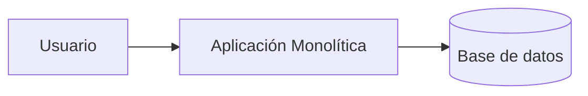

**Variante con Next.js full-stack** (frontend y backend en el mismo proyecto):

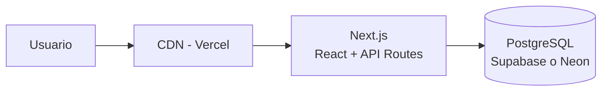

**Pros:** simple, rápido, fácil de debuggear.
**Contras:** escalar partes por separado es complicado.
**Cuándo:** casi siempre para un portafolio. La industria está revalorando el monolito.

#### Cierre teórico

**Origen:** el monolito es la arquitectura "por defecto" desde los inicios del software. El término tomó connotaciones negativas a mediados de los 2010 con la moda de microservicios, pero **Martin Fowler** lo rescató en 2015 con su artículo *MonolithFirst* ("empieza con un monolito"). Empresas como Shopify, Basecamp (DHH) y GitHub defienden públicamente sus monolitos en producción. Stack Overflow corrió durante años como un monolito clásico en .NET atendiendo millones de usuarios.

**Cuándo elegirla:**
- equipos pequeños (1-6 personas);
- alcance acotado y requerimientos claros;
- despliegue rápido, presupuesto limitado;
- proyectos de portafolio, MVPs, hackathons;
- la mayoría de SaaS tempranos (pre-product-market-fit).

**Cuándo evitarla:**
- equipos grandes (>20 desarrolladores trabajando en paralelo) donde el roce sobre un solo repositorio se vuelve doloroso;
- dominios muy heterogéneos (parte batch, parte real-time, parte ML) que requieren runtimes distintos;
- necesidad real de escalar módulos de forma independiente (un servicio golpeado 1000x más que el resto).

**Costo oculto:** aunque se ve simple, un monolito **mal diseñado internamente** se convierte en un Big Ball of Mud: todo depende de todo, los cambios son arriesgados, los tiempos de build se disparan. La "simpleza" del monolito solo se mantiene si por dentro respetas Layered/Modular. También hay costos de despliegue: un bug mínimo obliga a redeployar toda la app.

---

### 4.2. Monolito Modular

Un solo despliegue internamente dividido en **módulos independientes**. Es el mejor balance entre simpleza y buen diseño.

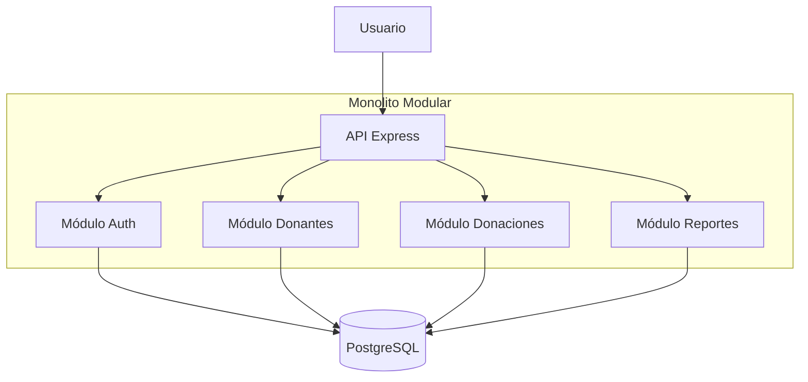

**Pros:** todo en un proceso (simple) pero con separación clara. Si algún día hace falta microservicios, es fácil extraer un módulo.
**Cuándo:** proyectos medianos del portafolio con varias áreas de negocio (auth + gestión + reportes).

#### Cierre teórico

**Origen:** el **Modular Monolith** fue popularizado por Simon Brown (creador del modelo C4) alrededor de 2015 en conferencias como DDD Europe y resumido en su charla *Modular Monoliths*. Está emparentado con *Package by Feature* (Robert C. Martin) y con el estilo de desarrollo de Shopify, que en 2020 publicó *Deconstructing the Monolith: Designing Software that Maximizes Developer Productivity* describiendo cómo operan un monolito Ruby con cientos de desarrolladores.

**Cuándo elegirla:**
- proyecto con varias áreas claramente separables (auth, donantes, donaciones, reportes);
- equipo mediano (5-15 personas) organizado por módulo;
- se sospecha que en el futuro podría requerirse extraer microservicios;
- se quiere una arquitectura limpia sin pagar el precio de microservicios desde el día uno.

**Cuándo evitarla:**
- proyectos muy pequeños (1-2 módulos): la ceremonia de separación aporta poco valor;
- equipos sin disciplina de fronteras: si nadie respeta los límites entre módulos, vuelve a ser un Big Ball of Mud con carpetas bonitas;
- dominios donde la comunicación entre módulos debe ser asíncrona real (mejor event-driven).

**Costo oculto:** mantener los límites entre módulos requiere disciplina y revisión de código constante. Es fácil que un desarrollador, por ir rápido, importe directamente desde otro módulo saltando la frontera pública (la "interfaz" del módulo). Sin linters o reglas de arquitectura (ej. `dependency-cruiser`), la modularidad se erosiona en meses.

---

### 4.3. Cliente-Servidor (SPA + API REST)

La arquitectura más común: un frontend (React SPA o App móvil) consume una API REST.

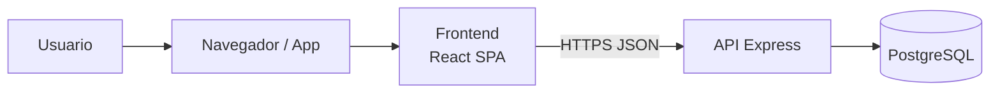

**Con autenticación JWT:**

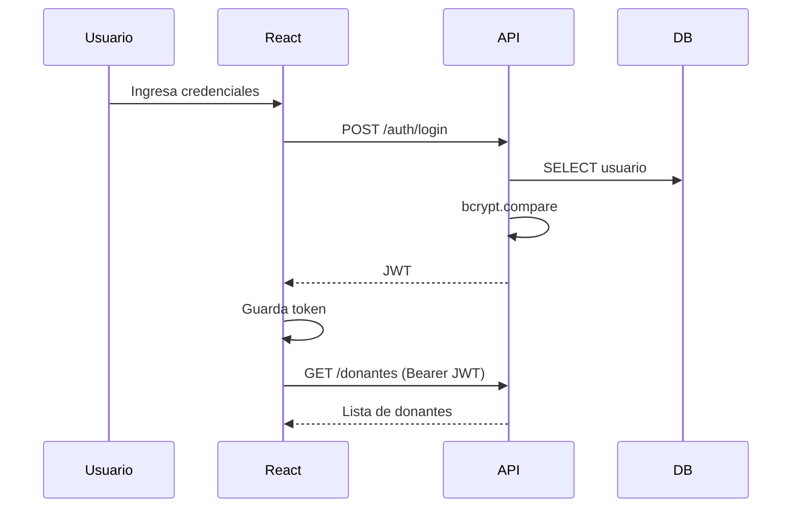

**Cuándo:** la arquitectura por defecto para apps interactivas, dashboards, apps móviles con backend propio.

#### Cierre teórico

**Origen:** el modelo **cliente-servidor** es anterior a la web misma y apareció con sistemas distribuidos en los años 80 (X Window System, 1984; bases de datos cliente/servidor). **REST** (Representational State Transfer) fue definido por Roy Fielding en su tesis doctoral en la Universidad de California, Irvine (2000); es el estilo arquitectónico sobre el que se diseñó HTTP. La variante moderna **SPA (Single Page Application) + REST** se popularizó con Gmail (2004), AngularJS (2010) y explotó con React y Vue a partir de 2013.

**Cuándo elegirla:**
- aplicación interactiva con muchos cambios de pantalla sin recarga (dashboards, CRMs, backoffice);
- separación clara entre equipo frontend y backend;
- múltiples clientes (web + iOS + Android + terceros) consumiendo la misma API;
- arquitectura por defecto para portafolios del curso.

**Cuándo evitarla:**
- sitios muy estáticos orientados a SEO (blog, docs, landings) → prefiere SSG/SSR con JAMstack;
- aplicaciones offline-first complejas → evalúa PWA o apps nativas;
- cuando **GraphQL** u otras tecnologías resuelven mejor el problema de n+1 o subconsultas (APIs gráficas complejas).

**Costo oculto:**
- mantener **sincronía de contratos**: si el backend cambia un campo, el frontend se rompe. Se mitiga con tipos compartidos (TypeScript + OpenAPI).
- gestión de **CORS**, cookies seguras, CSRF y autenticación (JWT vs sesión).
- duplicación de validación: una vez en el cliente (UX), otra vez en el servidor (seguridad). Ambas son obligatorias.
- overhead de red: cada interacción requiere una ida y vuelta HTTP.

---

### 4.4. Event-Driven (orientada a eventos)

Los componentes se comunican publicando y consumiendo eventos a través de un bus o cola (Redis Pub/Sub, RabbitMQ, MQTT para IoT).

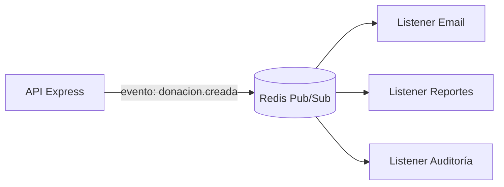

**Variante IoT con MQTT:**

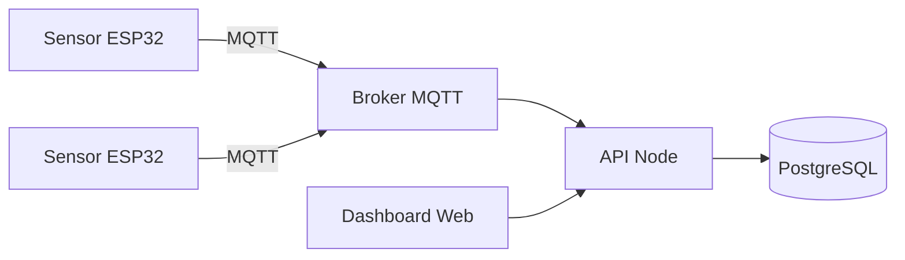

**Cuándo:** integraciones entre sistemas, procesos asíncronos (envío de correos, generación de reportes pesados), IoT, chat en tiempo real.

#### Cierre teórico

**Origen:** el estilo **event-driven** se remonta al patrón **Observer** (GoF, 1994) y fue formalizado a nivel arquitectónico en *Enterprise Integration Patterns* (Gregor Hohpe & Bobby Woolf, 2003). Kafka (LinkedIn, 2011) lo llevó a escala planetaria. Netflix popularizó la combinación **microservicios + eventos** con su arquitectura reactiva (Adrian Cockcroft, ~2013). El protocolo **MQTT** (IBM, 1999) es el estándar de facto para IoT de bajo consumo.

**Cuándo elegirla:**
- procesos **asíncronos** que no pueden bloquear la respuesta HTTP (envío de emails, generación de PDF, webhooks a terceros);
- **integración entre sistemas** débilmente acoplados (varios consumidores interesados en el mismo evento);
- **IoT**: decenas o miles de dispositivos publicando telemetría;
- **chat / colaboración en tiempo real** (Socket.io, WebSockets);
- arquitecturas reactivas que deben absorber picos de carga con una cola.

**Cuándo evitarla:**
- flujos request/response simples (el típico "dame la lista de donantes"): no necesitas un bus de eventos;
- equipos sin experiencia en sistemas distribuidos: la depuración de una cadena de eventos es significativamente más difícil que una llamada HTTP directa;
- proyectos pequeños donde la **consistencia fuerte** es necesaria (un pago que debe confirmarse sí o sí antes de continuar).

**Costo oculto:**
- **debugging distribuido**: trazar un bug implica seguir un evento por 3-4 servicios y leer logs correlacionados. Se mitiga con OpenTelemetry, correlation IDs y dashboards como Jaeger o Tempo.
- **entrega "at-least-once"**: la mayoría de brokers no garantizan entrega exacta; tu código debe ser **idempotente** (si procesa el mismo evento dos veces, no debe duplicar efectos).
- **orden de eventos**: si dos eventos llegan en desorden, el resultado puede ser incorrecto. Herramientas como Kafka ordenan por partición, pero esto impone restricciones.
- **dead-letter queues**: eventos que fallan repetidamente deben ir a una cola de errores o se pierden silenciosamente.

---

## 5. Estructura de carpetas recomendada

### 5.1. Frontend React (Vite) – estructura por features

Recomendada para la mayoría de los proyectos del curso.

```
app-web/
├── src/
│   ├── app/
│   │   ├── App.jsx
│   │   ├── routes.jsx
│   │   └── providers.jsx         ← Auth, Theme, QueryClient
│   ├── shared/
│   │   ├── components/           ← Boton, Input, Modal...
│   │   ├── hooks/                ← useDebounce, useFetch
│   │   ├── lib/                  ← api.js (axios configurado)
│   │   └── utils/
│   ├── features/
│   │   ├── auth/
│   │   │   ├── components/
│   │   │   ├── hooks/useAuth.js
│   │   │   ├── services/authService.js
│   │   │   └── index.js
│   │   └── donantes/
│   │       ├── components/
│   │       ├── hooks/useDonantes.js
│   │       ├── services/donantesService.js
│   │       └── index.js
│   └── main.jsx
└── package.json
```

### 5.2. Frontend Next.js (App Router)

Si el proyecto necesita SEO o renderizado en servidor.

```
app-web/
├── app/
│   ├── (public)/
│   │   ├── page.jsx
│   │   └── login/page.jsx
│   ├── (dashboard)/
│   │   ├── layout.jsx                    ← protegido
│   │   └── donantes/
│   │       ├── page.jsx
│   │       └── nuevo/page.jsx
│   ├── api/donantes/route.js             ← endpoints
│   └── layout.jsx
├── components/
├── lib/
└── package.json
```

### 5.3. Backend Node Express – estructura Layered

**La recomendada por defecto.**

```
api/
├── src/
│   ├── config/
│   │   ├── env.js
│   │   └── db.js
│   ├── middleware/
│   │   ├── auth.js
│   │   ├── errorHandler.js
│   │   ├── logger.js
│   │   └── validate.js
│   ├── routes/
│   │   ├── index.js
│   │   ├── donantes.routes.js
│   │   └── auth.routes.js
│   ├── controllers/
│   │   ├── donantes.controller.js
│   │   └── auth.controller.js
│   ├── services/
│   │   ├── donantes.service.js
│   │   └── auth.service.js
│   ├── repositories/
│   │   └── donantes.repository.js
│   ├── dtos/
│   │   └── donante.dto.js
│   ├── app.js
│   └── server.js
├── tests/
│   ├── unit/
│   └── integration/
├── .env.example
├── .gitignore
├── package.json
└── README.md
```

### 5.4. Monorepo (frontend + backend en un solo repo)

```
mi-proyecto/
├── apps/
│   ├── web/                 ← React/Next.js
│   └── api/                 ← Node Express
├── packages/
│   ├── types/               ← tipos compartidos
│   └── utils/
├── package.json
└── README.md
```

---

## 6. Plataformas cloud gratuitas (resumen práctico 2025-2026)

| Componente | Plataforma recomendada | Alternativa |
|---|---|---|
| **Frontend React** | Vercel | Netlify, Cloudflare Pages |
| **Frontend estático / blog** | Cloudflare Pages | GitHub Pages, Netlify |
| **API Node.js** | Render | Railway, Fly.io |
| **API Serverless** | Vercel Functions | Cloudflare Workers |
| **PostgreSQL** | Supabase | Neon, Render Postgres |
| **MySQL** | Railway | PlanetScale (con reservas) |
| **NoSQL** | Firebase Firestore | MongoDB Atlas |
| **Redis / Cache / Colas** | Upstash | Railway Redis |
| **Auth lista para usar** | Supabase Auth | Clerk, Firebase Auth |
| **Storage de archivos** | Supabase Storage | Cloudflare R2, Cloudinary |
| **Email transaccional** | Resend (3 000/mes) | SendGrid, Brevo |
| **CI/CD** | GitHub Actions | GitLab CI |
| **Monitoreo** | Sentry (free tier) | BetterStack |

### Advertencias importantes

- **Render gratis duerme** los servicios web tras 15 min sin tráfico. La primera request después del sueño demora 30-60 s.
- **Los free tiers cambian.** Revisa las páginas oficiales antes de decidir.
- **Evita vendor lock-in extremo.** Firebase Firestore es difícil de migrar; Supabase (PostgreSQL estándar) es más portable.

---

## 6.5. Mapa mental: patrón → principio → problema que resuelve

Esta tabla resume **todos** los patrones y estilos mencionados en las secciones anteriores, cruzándolos con el principio SOLID dominante, el problema concreto que resuelven y un ejemplo del mundo real. Úsala como hoja de referencia a la hora de justificar tus decisiones de arquitectura en el portafolio.

| Patrón / Estilo | Principio SOLID principal | Problema que resuelve | Ejemplo del mundo real |
|---|---|---|---|
| **Component-Based (React)** | SRP + OCP | UIs grandes son imposibles de mantener en un único archivo | Cada botón, tarjeta y formulario de Instagram es un componente reutilizable |
| **Custom Hooks** | SRP + DIP | Lógica duplicada y componentes gigantes mezclando UI y datos | `useQuery` de React Query encapsula fetching y caché |
| **Provider Pattern / Context** | DIP | Prop drilling: pasar datos por muchos niveles | Spotify usa Context para el tema oscuro/claro en toda la app |
| **Store global (Redux / Zustand)** | SRP + DIP | Estado compartido complejo entre muchas pantallas | El carrito de Amazon está en un store accesible desde todas las vistas |
| **CSR / SSR / SSG / ISR** | SRP arquitectónico | SEO y performance para distintos tipos de contenido | Wikipedia usa SSR; dev.to usa SSG + ISR; Notion usa CSR |
| **Layered Architecture** | SRP + DIP | Backend como "un solo archivo que hace todo" | API bancarias tradicionales con capas Controller/Service/Repository |
| **MVC** | SRP | Mezcla de SQL, HTML y lógica | Ruby on Rails, Django, Laravel, ASP.NET MVC |
| **Repository Pattern** | DIP + SRP | Atarse a una base de datos concreta; tests lentos | NestJS + TypeORM usa repositorios para abstraer Postgres/MySQL/Mongo |
| **Service Layer** | SRP | Reglas de negocio dispersas en controllers | Shopify separa "reglas de pricing" en servicios dedicados |
| **DTO + Validación** | ISP + SRP | Confiar en datos del cliente; inyecciones; errores silenciosos | Stripe valida cada request contra un schema antes de procesarla |
| **Middleware Pipeline** | OCP + SRP | Código transversal (logs, auth) repetido en cada ruta | Express middleware de Google Cloud Functions |
| **Strategy (implícito en pagos)** | OCP + DIP | `if/else` gigantes por tipo (pagos, notificaciones) | MercadoPago soporta tarjeta, transferencia, efectivo con una misma interfaz |
| **Observer / Event Bus** | OCP | Acoplar todos los consumidores al productor | Kafka en LinkedIn notifica "usuario conectado" a decenas de servicios |
| **Chain of Responsibility (middleware)** | OCP | Combinar pasos opcionales sin hard-coding | Pipeline de procesamiento de Express |
| **Monolito clásico** | — (arquitectura) | Over-engineering de microservicios en proyectos pequeños | Stack Overflow, Basecamp |
| **Monolito Modular** | SRP arquitectónico | Monolito sin estructura que se vuelve un "big ball of mud" | Shopify (Ruby) con módulos delimitados |
| **Microservicios** | SRP + DIP arquitectónico | Despliegue y escalado por equipos independientes | Netflix, Uber, Amazon |
| **Event-Driven Architecture** | OCP | Integraciones punto a punto frágiles | Sistemas de trading, IoT, notificaciones push |
| **Cliente-Servidor (SPA + API REST)** | SRP | Separar equipos frontend/backend; múltiples clientes | La mayoría de SaaS modernos (Slack, Trello) |
| **Serverless / FaaS** | SRP + escalabilidad | Mantener infraestructura cuando el tráfico es esporádico | Webhooks, procesamiento de imágenes, cron jobs ligeros |
| **JAMstack** | SoC | Performance y seguridad en sitios de contenido | Smashing Magazine, sitios de documentación |

## 6.6. Lecturas recomendadas (bibliografía ampliada)

Los libros y artículos siguientes son la **base intelectual** de esta guía. Un estudiante de segundo año no necesita leerlos todos de inmediato, pero conviene reconocer los títulos, saber de qué tratan y acudir a ellos cuando un tema concreto lo requiera. Están ordenados por orden de prioridad según utilidad inmediata para un proyecto de portafolio.

1. **Gamma, Helm, Johnson y Vlissides — *Design Patterns: Elements of Reusable Object-Oriented Software* (Addison-Wesley, 1994).**
   El libro fundacional de los 23 patrones GoF. Imprescindible para entender el vocabulario de la industria. Léelo en inglés o en la traducción "Patrones de diseño" de Pearson.

2. **Fowler — *Patterns of Enterprise Application Architecture* (Addison-Wesley, 2002).**
   Donde se formalizan Repository, Service Layer, Unit of Work, Data Mapper, Active Record, DTO. Es **el** libro de patrones para backend moderno.

3. **Martin — *Clean Architecture: A Craftsman's Guide to Software Structure and Design* (Prentice Hall, 2017).**
   Explica cómo encajar SOLID en una arquitectura en anillos con reglas de dependencia. Referencia para quien quiera evolucionar de Layered a Hexagonal.

4. **Martin — *Clean Code* (Prentice Hall, 2008).**
   Complemento del anterior, enfocado en cómo escribir funciones, clases y tests limpios. Muy didáctico para segundo año.

5. **Hohpe & Woolf — *Enterprise Integration Patterns* (Addison-Wesley, 2003).**
   El catálogo de referencia para sistemas basados en mensajes: Message Channel, Publish-Subscribe, Saga, Dead Letter Channel. Clave si tu proyecto usa colas o MQTT.

6. **Evans — *Domain-Driven Design: Tackling Complexity in the Heart of Software* (Addison-Wesley, 2003).**
   Introduce Bounded Context, Aggregate, Repository, Ubiquitous Language. Abrirlo cuando el dominio del proyecto es complejo y requiere modelado profundo.

7. **Nygard — *Release It! Design and Deploy Production-Ready Software* (Pragmatic Bookshelf, 2007; 2a ed. 2018).**
   Patrones de estabilidad en producción: Circuit Breaker, Bulkhead, Timeout, Handshaking. Leer antes de desplegar cualquier sistema que deba sobrevivir picos de tráfico.

8. **Newman — *Building Microservices* (O'Reilly, 2015; 2a ed. 2021).**
   Si en algún momento piensas en microservicios, es la mejor introducción. También aclara cuándo **no** usarlos.

9. **Richards & Ford — *Fundamentals of Software Architecture* (O'Reilly, 2020).**
   Una visión moderna y comparativa de estilos arquitectónicos. Muy útil para redactar la sección "Decisiones de Arquitectura" del portafolio.

10. **Cockburn — *Hexagonal Architecture* (artículo, 2005).**
    El paper original de puertos y adaptadores. Disponible gratuitamente en la web.

11. **Alexander — *A Pattern Language: Towns, Buildings, Construction* (Oxford University Press, 1977).**
    El origen del concepto de "patrón". No es software, pero leer el prefacio cambia tu forma de ver el diseño.

12. **Fowler — *Refactoring: Improving the Design of Existing Code* (2a ed., Addison-Wesley, 2018).**
    Los patrones no se aplican de una vez: se llega a ellos refactorizando. Este libro enseña cómo.

13. **Hunt & Thomas — *The Pragmatic Programmer* (2a ed., Addison-Wesley, 2019).**
    Origen del DRY y decenas de heurísticas de oficio. Imprescindible y breve.

14. **Brooks — *The Mythical Man-Month* (Addison-Wesley, 1975; ed. aniversario 1995).**
    Clásico sobre por qué los proyectos de software fallan. No es de patrones, pero todo ingeniero debería haberlo leído antes de graduarse.

15. **Foote & Yoder — *Big Ball of Mud* (paper, 1997).**
    El anti-patrón por excelencia. Corto, irónico, imprescindible.

### Artículos y recursos online gratuitos

- **Martin Fowler — *MonolithFirst* (2015):** [martinfowler.com/bliki/MonolithFirst.html](https://martinfowler.com/bliki/MonolithFirst.html). Por qué empezar con un monolito antes de microservicios.
- **Martin Fowler — *MicroservicePremium* (2015):** [martinfowler.com/bliki/MicroservicePremium.html](https://martinfowler.com/bliki/MicroservicePremium.html). El "peaje" de entrar en microservicios.
- **Microsoft — *Azure Cloud Design Patterns*:** catálogo oficial y gratuito de patrones cloud modernos (Circuit Breaker, Retry, Cache-Aside, CQRS, Saga, etc.).
- **Amazon — *AWS Well-Architected Framework*:** principios de diseño para aplicaciones en la nube, organizados en 6 pilares.
- **The Twelve-Factor App:** [12factor.net](https://12factor.net). Metodología de Heroku para construir SaaS modernos; base de las buenas prácticas de configuración, dependencias y despliegue.
- **Refactoring.Guru:** tutorial visual de los 23 patrones GoF + SOLID en múltiples lenguajes. Excelente para repasar.
- **Kent C. Dodds — Blog y cursos sobre React Patterns:** referencia moderna para Provider, Compound Components, State Reducer, Control Props.

### Cómo abordar la bibliografía

- **Si tienes una semana:** lee *The Pragmatic Programmer* y el paper *Big Ball of Mud*.
- **Si tienes un mes:** agrega *Clean Code* y el catálogo de Refactoring.Guru.
- **Si tienes un semestre:** agrega *Patterns of Enterprise Application Architecture* y *Fundamentals of Software Architecture*.
- **A lo largo de la carrera:** el resto, cuando el problema concreto lo pida.

---

# PARTE B – RECOMENDACIONES POR GRUPO (2026-01)

A continuación, una tarjeta personalizada para cada equipo del curso, con los patrones, la arquitectura y las plataformas sugeridas según la EP1 entregada.

> **Nota:** estas recomendaciones son un punto de partida. El equipo puede ajustarlas siempre que justifique el cambio en su documento de arquitectura.

---

## Grupo 1 – MapacheSecure
### Sistema móvil gamificado para autorregulación digital

**Tipo de aplicación:** App móvil (control parental) con sincronización cloud.

**Características relevantes de la EP1:**
- Bloqueo inteligente de apps.
- Motor de desafíos multimodal (gamificación).
- Economía de fichas y recompensas.
- Panel parental.
- Notificaciones y reportes.
- Sincronización cloud multi-dispositivo.

### Patrones recomendados

**Frontend móvil (React Native o Flutter):**
- **Component-Based Architecture** (obvio, es la base).
- **Custom Hooks + Separación de lógica** para manejar desafíos, fichas, bloqueos. Crea hooks como `useDesafios`, `useFichas`, `useBloqueo`.
- **State Management con Zustand** (app móvil con mucho estado compartido entre pantallas: puntos actuales, reglas activas, sesión del niño/padre).

**Backend (Node + Express):**
- **Layered Architecture** (Controller/Service/Repository).
- **DTO + Validación con Zod** para todas las rutas (especialmente las que envían reglas parentales).
- **Middleware Pipeline:** auth JWT (el padre autentica en un dispositivo distinto), logger, rate limit.
- **Repository Pattern:** útil para futuros cambios de BD y para testear la lógica gamificada sin DB real.

### Arquitectura recomendada

**Monolito modular con módulos:** `auth`, `usuarios`, `reglas`, `desafios`, `economia-fichas`, `reportes`, `sync`.

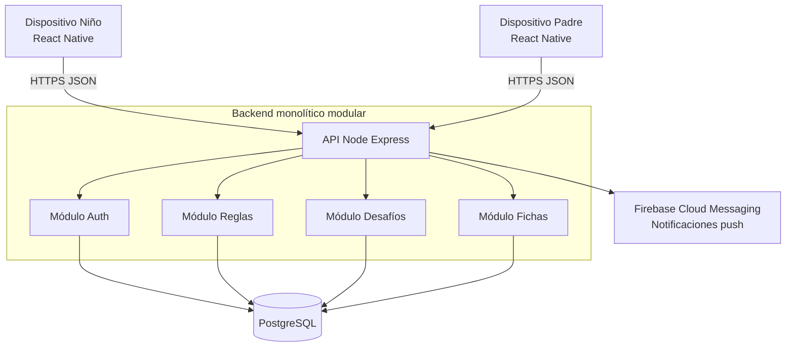

### Plataformas gratuitas sugeridas

| Componente | Plataforma |
|---|---|
| App móvil (desarrollo) | Expo + React Native |
| Backend API | Render o Railway |
| Base de datos | Supabase (PostgreSQL) |
| Auth | JWT propio (con bcrypt) o Supabase Auth |
| Notificaciones push | Firebase Cloud Messaging |
| Storage (iconos, imágenes) | Supabase Storage |

---

## Grupo 2 – Deckora
### Aplicación web para la optimización de la experiencia en entornos TCG

**Tipo de aplicación:** Web CRUD con búsqueda, comunidad y organización de torneos.

**Características relevantes de la EP1:**
- Gestión de colecciones, mazos.
- Organización y búsqueda de torneos.
- Visibilidad de tiendas y eventos.
- Seguimiento de rendimiento.

### Patrones recomendados

**Frontend (React + Vite o Next.js):**
- **Component-Based + Custom Hooks** para `useColeccion`, `useMazos`, `useTorneos`.
- **Provider Pattern (Context)** para el usuario autenticado.
- **SSR con Next.js** si quieren que los torneos y tiendas sean indexables por Google.

**Backend (Node + Express):**
- **Layered Architecture** completa.
- **Repository Pattern** (las queries de colecciones y torneos se van a repetir mucho).
- **DTO + Zod** (inscripciones a torneos, creación de mazos).
- **Middleware Pipeline** con auth JWT.

### Arquitectura recomendada

**Monolito modular.**

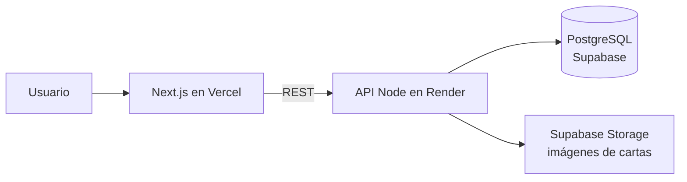

### Plataformas gratuitas sugeridas

| Componente | Plataforma |
|---|---|
| Frontend | Vercel (Next.js) |
| Backend | Render |
| DB | Supabase (PostgreSQL) |
| Auth | Supabase Auth o JWT propio |
| Storage imágenes | Supabase Storage o Cloudinary |

---

## Grupo 3 – NoLimits
### Plataforma digital para visualización y comparación de contenido multimedia

**Tipo de aplicación:** Plataforma web tipo agregador / homologador (reseñas, comparaciones).

**Características relevantes de la EP1:**
- Consolida información multimedia de distintas fuentes.
- Comparaciones entre plataformas.
- Reseñas y evaluaciones.
- Homologación de soluciones.

### Patrones recomendados

**Frontend (Next.js, por SEO):**
- **Component-Based + Custom Hooks.**
- **SSR o ISR** (muy importante: un agregador necesita que Google indexe las fichas).
- **Provider Pattern** para tema y usuario.
- **Component Composition** intensivo (ficha, tarjeta de reseña, comparador lado a lado).

**Backend (Node + Express):**
- **Layered Architecture.**
- **Repository Pattern + Service Layer** con consultas complejas (rankings, comparaciones).
- **Strategy Pattern (opcional):** si consumen varias APIs externas (IGN, RAWG, IMDB), una estrategia por cada fuente.
- **Cache en Redis (Upstash)** para resultados de búsqueda frecuentes.

### Arquitectura recomendada

**Cliente-servidor con ISR en el frontend** y API con cache.

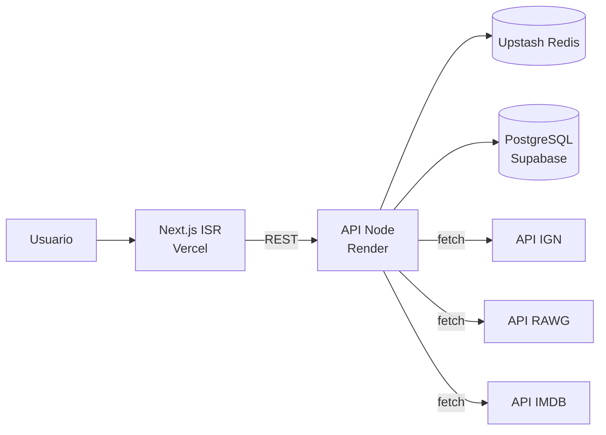

### Plataformas gratuitas sugeridas

| Componente | Plataforma |
|---|---|
| Frontend | Vercel (Next.js con ISR) |
| Backend | Render |
| DB | Supabase |
| Cache | Upstash Redis |
| Auth | Supabase Auth |

---

## Grupo 4 – 40dB
### Monitoreo colaborativo de ruido urbano (Municipalidad de Maipú)

**Tipo de aplicación:** Plataforma web con IoT + reportes ciudadanos + dashboard municipal.

**Características relevantes de la EP1:**
- App web para reporte ciudadano (mic + geolocalización).
- Prototipo IoT con ESP32 + sensor de sonido.
- Backend / API REST.
- Dashboard municipal con heatmap y filtros.
- Modelo B2G (Business to Government).

### Patrones recomendados

**Frontend (Next.js o Vite + React):**
- **Component-Based + Custom Hooks** (`useMicrofono`, `useGeolocalizacion`, `useReportes`).
- **Provider Pattern** para el rol (ciudadano vs municipal).
- **Libreria de mapas** (Leaflet o Mapbox) en componentes reutilizables; heatmap como organismo.

**Backend (Node + Express):**
- **Layered Architecture.**
- **Repository Pattern** con **PostgreSQL + PostGIS** (para queries geoespaciales).
- **DTO + Zod** para reportes (validar rango de dB, coordenadas válidas).
- **Event-Driven para IoT:** los ESP32 envían vía **MQTT** a un broker (HiveMQ Cloud gratis), un listener Node ingesta y persiste.
- **Middleware de auth** diferenciado: anónimo para reportes, JWT municipal para dashboard.

### Arquitectura recomendada

**Cliente-servidor con capa event-driven para IoT.**

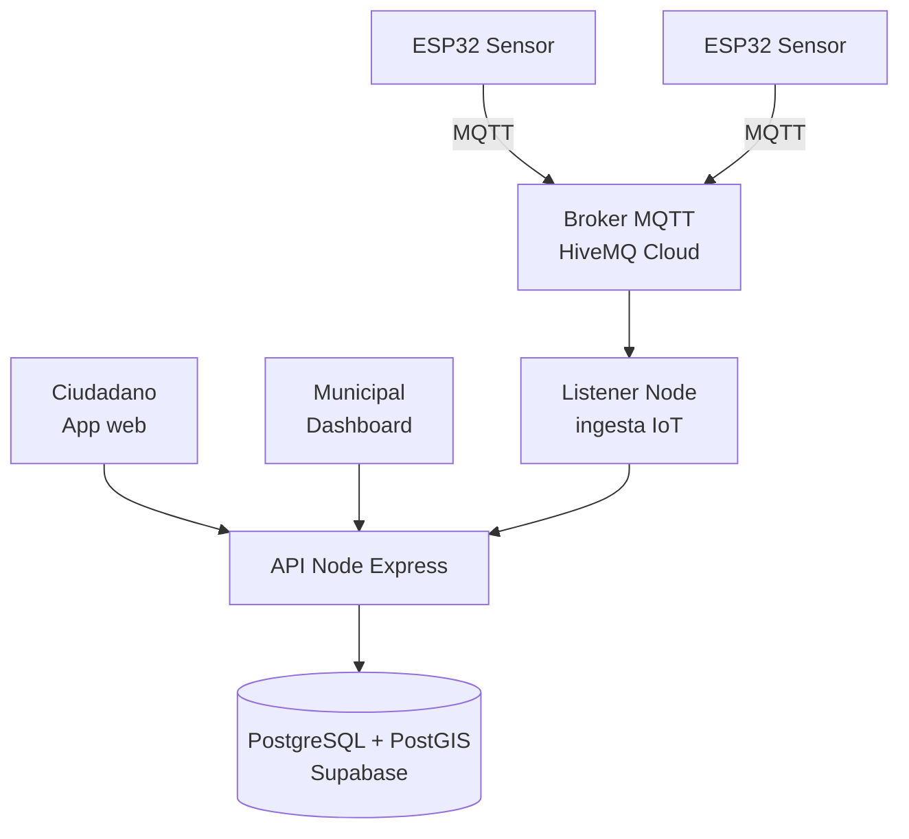

### Plataformas gratuitas sugeridas

| Componente | Plataforma |
|---|---|
| Frontend web | Vercel |
| Backend | Render o Railway |
| DB geoespacial | Supabase (PostgreSQL con extensión PostGIS) |
| Broker MQTT | HiveMQ Cloud free tier |
| Mapas | Leaflet + OpenStreetMap (gratis) |

---

## Grupo 5 – Pop Study
### Plataforma web para autogestión académica (estudiantes de ed. superior)

**Tipo de aplicación:** Web para gestión académica (apuntes, cálculo de notas, planificación).

**Observación importante:** la EP1 menciona "arquitectura de microservicios". **Recomendación docente: evaluar si es realmente necesario.** Para un equipo de 2 personas y un MVP, un **monolito modular bien diseñado es casi siempre mejor**, y se puede extraer a microservicios después si hace falta. Es mejor defender un monolito bien hecho que microservicios mal implementados.

### Patrones recomendados

**Frontend (React + Vite o Next.js):**
- **Component-Based + Custom Hooks** (`useCursos`, `useNotas`, `useCalendario`).
- **State global con Zustand** para el usuario, cursos actuales, configuración.
- **Component Composition** para dashboard, ramo, evaluación.

**Backend (Node + Express):**
- **Layered Architecture** con módulos claros (si quieren mantener la visión de microservicios, que los módulos estén muy bien separados para extraerlos después).
- **Repository Pattern.**
- **DTO + Zod.**
- **Service Layer:** la lógica de cálculo de notas, exigencias y proyecciones va aquí.

### Arquitectura recomendada

**Monolito modular** (justificable más fácilmente que microservicios en un MVP).

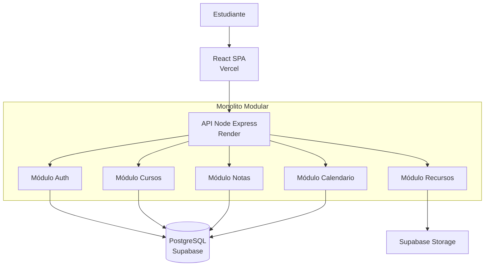

### Plataformas gratuitas sugeridas

| Componente | Plataforma |
|---|---|
| Frontend | Vercel |
| Backend | Render |
| DB | Supabase |
| Auth | Supabase Auth (incluye Google/GitHub login) |
| Storage apuntes | Supabase Storage |

---

## Grupo 6 – Plataforma web para creación automatizada de Landing Pages con IA

**Tipo de aplicación:** Web + IA para generar HTML/CSS/JS automáticamente.

**Características relevantes de la EP1:**
- Formulario de captura de info del negocio.
- Integración con una IA para generar código.
- Opciones escalonadas de personalización.
- Democratización para microempresarios.

### Patrones recomendados

**Frontend (React + Vite):**
- **Component-Based + Custom Hooks** (`useWizard`, `useGeneracion`, `usePreview`).
- **State global con Zustand** para el wizard multi-paso.
- **Provider Pattern** para sesión.
- **Component Composition** para el preview en iframe.

**Backend (Node + Express):**
- **Layered Architecture.**
- **Repository Pattern.**
- **DTO + Zod** (crítico: el prompt de entrada debe ser validado para evitar inyección de prompt).
- **Strategy Pattern (opcional pero potente):** una estrategia por cada proveedor de IA (OpenAI, Claude, Gemini). Así pueden cambiar sin tocar el resto del código.
- **Queue pattern:** la generación puede demorar 30+ s. Úsar BullMQ o Upstash QStash para procesamiento asíncrono; el frontend poll-ea o escucha por WebSocket/SSE.

### Arquitectura recomendada

**Cliente-servidor + cola asíncrona.**

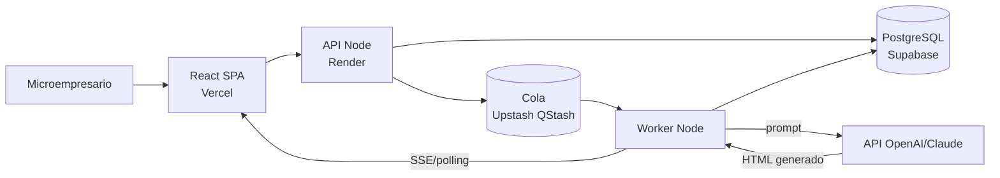

### Plataformas gratuitas sugeridas

| Componente | Plataforma |
|---|---|
| Frontend | Vercel |
| Backend | Render |
| DB | Supabase |
| Cola | Upstash QStash (gratis con límites) |
| IA | OpenAI API (créditos iniciales) o Claude API |
| Hosting de landings generadas | Vercel / Cloudflare Pages (deploy dinámico) |

---

## Grupo 7 – AGENTE X
### Plataforma web de Inteligencia de Negocios Conversacional (BI) con agentes de IA

**Tipo de aplicación:** Web chat + agentes IA con RAG + consumo de APIs dinámicas.

**Características relevantes de la EP1:**
- Chat conversacional con agentes IA.
- RAG (Retrieval Augmented Generation) con documentos privados.
- Segregación de contexto por agente.
- Integración con DeepSeek (Python intermediario).
- Despliegue en VPS propio con Nginx + Node + MySQL + PM2.
- JWT propio, SSE para estados asíncronos.
- Proyecto individual (1 persona full-stack).

### Patrones recomendados

**Frontend (React + Vite):**
- **Component-Based + Custom Hooks** (`useChat`, `useAgente`, `useDocumentos`).
- **State global con Zustand** para conversaciones y agentes activos.
- **Provider Pattern** para auth JWT.
- **SSE (Server-Sent Events)** para mostrar "Consultando BD…", "Leyendo documento…", "Respondiendo…" (ya planificado en la EP1).

**Backend (Node + Express + Python intermediario):**
- **Layered Architecture** rigurosa (proyecto individual → disciplina estricta).
- **Repository Pattern** (MySQL — historial, usuarios, agentes, permisos).
- **DTO + Zod** (chat messages, uploads).
- **Middleware Pipeline:** auth JWT, logger, rate limit (crítico con IA paga), manejo de uploads (multer).
- **Strategy Pattern:** cada agente es una estrategia con su propio set de documentos/APIs permitidos.
- **Factory Pattern:** fabrica la instancia correcta del agente según rol del usuario.
- **Observer / Event Emitter:** para emitir los estados asíncronos por SSE.

### Arquitectura recomendada

**Cliente-servidor con intermediario Python y SSE.**

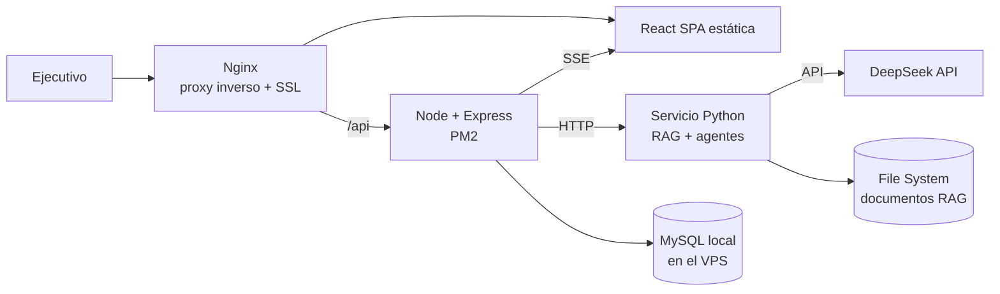

### Plataformas gratuitas sugeridas

| Componente | Plataforma |
|---|---|
| Hosting | VPS propio (ya definido en la EP1) |
| Alternativa VPS gratuito | Fly.io free tier (limitado) o Oracle Cloud Always Free |
| IA | DeepSeek (elegido) |
| Monitoreo | Sentry free tier |
| Backup MySQL | Script cron + rclone a Cloudflare R2 (10 GB gratis) |

**Advertencia:** un VPS propio es excelente para aprender, pero recuerden respaldar todo. Si algo falla en producción, no hay proveedor que lo recupere automáticamente.

---

## Tabla comparativa rápida de los 7 grupos

| Grupo | Proyecto | Tipo | Patrones críticos | Arquitectura |
|---|---|---|---|---|
| 1 | MapacheSecure | App móvil | Component, Custom Hooks, Zustand, Layered, DTO | Monolito modular |
| 2 | Deckora | Web TCG | Component, Custom Hooks, Layered, Repository, DTO | Monolito modular |
| 3 | NoLimits | Agregador multimedia | SSR/ISR, Component, Strategy, Repository | Cliente-servidor + cache |
| 4 | 40dB | Web + IoT | Component, Event-Driven (MQTT), Layered, PostGIS | Cliente-servidor + event-driven |
| 5 | Pop Study | Gestión académica | Component, Zustand, Layered, Repository | Monolito modular (no microservicios) |
| 6 | Landing Pages IA | Web + IA | Strategy, Queue, Layered, Component, Zustand | Cliente-servidor + cola asíncrona |
| 7 | AGENTE X | Chat BI con IA | Strategy, Factory, Observer, Layered, SSE, Custom Hooks | Cliente-servidor + intermediario Python |

---

# PARTE C – ACTIVIDAD DE LABORATORIO (90 minutos)

## 7. Propósito de la actividad

Al finalizar, cada equipo tendrá un documento `ARQUITECTURA.md` en el repositorio con:

1. Los patrones frontend y backend justificados.
2. El diagrama de arquitectura y un diagrama de secuencia.
3. El stack tecnológico con plataformas de despliegue concretas.
4. La estructura de carpetas creada en el repo.
5. Un prototipo mínimo que demuestre la factibilidad técnica.

## 8. Organización del tiempo

| Bloque | Tiempo | Actividad |
|---|---|---|
| 1 | 10 min | Leer tu tarjeta de grupo (sección 6 de este documento) |
| 2 | 15 min | Analizar el proyecto: contexto y requisitos |
| 3 | 20 min | Redactar patrones elegidos, arquitectura y 2 diagramas |
| 4 | 20 min | Stack, plataformas y creación de la estructura de carpetas |
| 5 | 15 min | Prototipo mínimo (local o desplegado) |
| 6 | 10 min | Documentación final + commit y push |

## 9. Bloque 1 – Leer tu tarjeta de grupo (10 min)

Cada equipo debe leer con atención su tarjeta en la Parte B (Grupo 1, 2, 3, 4, 5, 6 o 7). Esa tarjeta es el punto de partida: pueden aceptar las recomendaciones o justificar por qué se apartan.

**Checkpoint 1:** el equipo puede mencionar los patrones recomendados para su proyecto.

## 10. Bloque 2 – Análisis (15 min)

Crea un archivo `ARQUITECTURA.md` en el repositorio del proyecto y completa:

```markdown
# Arquitectura del Proyecto – [Nombre del proyecto]

## 1. Contexto
- **Problema que resuelve:**
- **Usuarios objetivo:**
- **Volumen estimado de usuarios primer año:**
- **Tipo de aplicación:** (web / móvil / web + IoT / API)

## 2. Requisitos funcionales clave
- (3 a 5 bullets)

## 3. Requisitos no funcionales clave
- Seguridad:
- Rendimiento:
- Escalabilidad:
- Disponibilidad:
- Presupuesto (idealmente $0 en MVP):
```

**Checkpoint 2:** las secciones 1-3 están completas.

## 11. Bloque 3 – Patrones, arquitectura y diagramas (20 min)

Añade:

```markdown
## 4. Patrones de frontend
- **Patrón principal:** (Component-Based + Custom Hooks)
- **State management:** (Context / Zustand / Redux)
- **Renderizado:** (CSR / SSR / SSG / ISR)
- **Por qué:**

## 5. Patrones de backend
- **Arquitectura:** (Layered / MVC)
- **Repository Pattern:** sí / no – por qué
- **Validación:** (Zod / Joi)
- **Otros patrones:** (Strategy, Factory, Observer, Queue, etc.)
- **Por qué:**

## 6. Arquitectura general
- **Estilo:** (monolito / monolito modular / cliente-servidor / event-driven)
- **Justificación:**

## 7. Diagramas

### 7.1. Arquitectura general
(Diagrama Mermaid — puedes partir del diagrama de tu tarjeta de grupo y adaptarlo)

### 7.2. Diagrama de secuencia del caso de uso principal
(Diagrama Mermaid: flujo de una acción clave, por ejemplo "crear donante" o "recibir reporte IoT")
```

**Checkpoint 3:** patrones elegidos, justificados, y los dos diagramas incluidos.

## 12. Bloque 4 – Stack, plataformas y carpetas (20 min)

Añade:

```markdown
## 8. Stack tecnológico
- **Lenguaje frontend:**
- **Framework frontend:**
- **Librerías clave:** (state, routing, UI)
- **Lenguaje backend:**
- **Framework backend:**
- **Librerías clave:** (ORM, validación, auth)
- **Base de datos:**

## 9. Plataformas de despliegue
| Componente | Plataforma | Límites del free tier |
|---|---|---|
| Frontend | | |
| Backend | | |
| Base de datos | | |
| Auth | | |
| Storage/otros | | |

## 10. Estructura de carpetas creada
(Pega aquí la estructura elegida — usa la sección 5 como referencia)

## 11. Riesgos identificados
- (3 bullets concretos: ej. "Render duerme tras 15 min, mitigación: ping cada 10 min con cron-job.org")
```

**Obligatorio:** crear las carpetas reales según la estructura (aunque estén vacías):

```powershell
# Ejemplo para backend Layered en Windows
mkdir api, api\src, api\src\config, api\src\middleware, api\src\routes
mkdir api\src\controllers, api\src\services, api\src\repositories, api\src\dtos
```

**Checkpoint 4:** stack, plataformas, carpetas reales creadas en el repo.

## 13. Bloque 5 – Prototipo mínimo (15 min)

Elige **una** opción y demuestra que funciona:

- **A)** "Hola mundo" del frontend desplegado en Vercel / Netlify / Cloudflare Pages.
- **B)** API mínima con `/health` y `/items` corriendo en local, probada con `Invoke-RestMethod` o Thunder Client.
- **C)** Conexión a Supabase o Firebase desde un script mínimo.
- **D)** End-to-end: frontend mínimo en Vercel + API mínima en Render haciendo fetch.

**Checkpoint 5:** evidencia visible (URL pública o captura de pantalla).

## 14. Bloque 6 – Cierre, commit y push (10 min)

Añade al `ARQUITECTURA.md`:

```markdown
## 12. Prototipo realizado
- **Opción:** (A, B, C o D)
- **Evidencia:** (URL o ruta a captura)

## 13. Próximos pasos (3 bullets concretos)

## 14. Reflexión del equipo
- ¿Qué patrón entendimos mejor durante la actividad?
- ¿Qué riesgo nos preocupa más y cómo lo vamos a mitigar?
- ¿Qué necesitamos investigar antes de avanzar?
```

Y hacer:

```bash
git add .
git commit -m "docs(arquitectura): documento inicial y estructura de carpetas"
git push
```

## 15. Entregables

1. `ARQUITECTURA.md` con las secciones 1-14.
2. Estructura de carpetas creada en el repo.
3. **2 diagramas Mermaid mínimo.**
4. Evidencia del prototipo (URL o captura).
5. Commit y push hecho por al menos un integrante.

## 16. Criterios de evaluación

| Criterio | Puntaje |
|---|---|
| Patrones frontend y backend identificados y justificados | 20 % |
| Arquitectura coherente con el proyecto | 15 % |
| Dos diagramas Mermaid claros | 15 % |
| Plataformas cloud con free tier y límites documentados | 15 % |
| Estructura de carpetas creada | 10 % |
| Prototipo mínimo funcionando | 15 % |
| Identificación de al menos 3 riesgos reales | 10 % |

## 17. Errores comunes a evitar

- **Elegir microservicios "porque suena profesional":** un monolito modular bien hecho vale más.
- **Confundir framework con patrón:** React no es un patrón, es una librería que usa "component-based".
- **No probar el free tier desde el día uno:** Render cambia límites, Firebase tiene cuotas diarias.
- **No documentar riesgos:** sin riesgos escritos, la defensa queda débil.
- **Mezclar responsabilidades:** si el controller hace SQL o el service toca `req`/`res`, perdiste la ventaja del patrón.
- **Abusar de state management global:** la mayoría del estado debe ser local.

## 18. Glosario rápido

- **BaaS:** Backend as a Service (Supabase, Firebase).
- **CDN:** red de distribución de contenido.
- **CI/CD:** Integración y Despliegue Continuos.
- **Cold start:** retraso al despertar un servicio serverless.
- **DTO:** Data Transfer Object, objeto que viaja entre capas.
- **Free tier:** plan gratuito con límites.
- **JAMstack:** JavaScript + APIs + Markup precompilado.
- **JWT:** JSON Web Token, estándar para autenticación.
- **MQTT:** protocolo ligero para IoT.
- **PostGIS:** extensión geoespacial de PostgreSQL.
- **RAG:** Retrieval-Augmented Generation, técnica de IA.
- **SSE:** Server-Sent Events, streaming unidireccional servidor → cliente.
- **SPA:** Single Page Application.

## 19. Referencias

- Fowler, M. *Patterns of Enterprise Application Architecture* (referencia para Layered y Repository).
- Gamma, E. et al. *Design Patterns* (GoF).
- Docs oficiales: React, Next.js, Express, Zod, Zustand, Redux Toolkit, Supabase, Vercel, Render.
- Mermaid Live Editor: https://mermaid.live

## 20. Cierre

Esta guía busca que eligas patrones **con criterio, no por moda**. Lo que la rúbrica del portafolio premia no es la tecnología más nueva, sino la capacidad de explicar **por qué** tu elección resuelve el problema del cliente y **cómo** tu código refleja esa decisión. Tu tarjeta de grupo es el punto de partida: constrúyela, adáptala, justifícala y defiéndela al final del semestre.
