# Guía y Laboratorio: Patrones de Diseño, Arquitectura y Despliegue para tu Proyecto

## Datos generales

**Asignatura:** TPY1101 – Taller Aplicado de Programación
**Duración estimada del laboratorio:** 1 hora 30 minutos
**Modalidad:** Individual o en equipos del proyecto de portafolio
**Tipo de material:** Guía de referencia exhaustiva + actividad práctica
**Stack de referencia para los ejemplos:** React (frontend) y Node.js + Express (backend)
**Prerequisitos:** Haber definido la problemática, el alcance y el tipo de aplicación (web, móvil, API, dashboard) del proyecto de portafolio.

---

## 0. Cómo usar este documento

Este material tiene dos partes claramente separadas:

1. **Parte A – Guía de referencia exhaustiva:** contenido teórico con ejemplos extensos en **React (frontend)** y **Node.js (backend)**. Incluye patrones de diseño, estructuras de carpetas recomendadas, arquitecturas con múltiples diagramas, stacks tecnológicos y plataformas cloud gratuitas.
2. **Parte B – Actividad de 90 minutos:** ejercicio práctico para que cada equipo seleccione, justifique y documente el patrón, la arquitectura y la plataforma de despliegue de su proyecto.

La idea es que primero leas la Parte A con tu proyecto en mente y luego apliques lo aprendido en la Parte B.

> **Nota importante:** los ejemplos usan **React** y **Node.js** por ser el stack más común en los portafolios de la asignatura. Los patrones son válidos para cualquier otro stack (Angular, Vue, Django, FastAPI, Spring, .NET).

---

# PARTE A – GUÍA DE REFERENCIA

---

## 1. ¿Por qué importan los patrones y la arquitectura?

Cuando un proyecto crece, el mayor costo no es escribir el código, sino **mantenerlo, extenderlo y corregirlo**. Un patrón de diseño es una solución reutilizable a un problema conocido, y una arquitectura es la forma en que se organizan los componentes de una aplicación.

Elegir bien al inicio reduce el costo de:

- agregar nuevas funcionalidades sin romper las existentes;
- probar el sistema por partes;
- cambiar la base de datos o el framework sin reescribir todo;
- desplegar la aplicación en la nube;
- que otro desarrollador entienda el proyecto rápidamente.

En este curso, el proyecto de portafolio debe **justificar** por qué se eligió un patrón y una arquitectura. Esta guía te entrega los elementos para hacerlo.

---

## 2. Patrones de diseño de frontend (ejemplos con React)

### 2.1. MVC / MVP / MVVM

Son tres variantes de una misma idea: separar la **vista**, el **modelo** y un intermediario que coordina ambos.

| Patrón | Intermediario | Dónde se usa hoy |
|---|---|---|
| **MVC** (Model-View-Controller) | Controller | Django, Laravel, ASP.NET MVC, Ruby on Rails |
| **MVP** (Model-View-Presenter) | Presenter | Android clásico, aplicaciones de escritorio |
| **MVVM** (Model-View-ViewModel) | ViewModel | Angular, Vue, WPF, SwiftUI, Jetpack Compose |

#### Ejemplo MVC en React (simulado con hooks)

```jsx
// Model: encapsula los datos y reglas del dominio
const donantesModel = {
  lista: [],
  async cargar() {
    const res = await fetch('/api/donantes');
    this.lista = await res.json();
    return this.lista;
  },
  agregar(d) { this.lista.push(d); }
};

// Controller: función que orquesta
function useDonantesController() {
  const [donantes, setDonantes] = useState([]);
  const cargar = async () => setDonantes(await donantesModel.cargar());
  const agregar = (d) => { donantesModel.agregar(d); setDonantes([...donantesModel.lista]); };
  return { donantes, cargar, agregar };
}

// View: solo renderiza
function DonantesView() {
  const { donantes, cargar } = useDonantesController();
  useEffect(() => { cargar(); }, []);
  return <ul>{donantes.map(d => <li key={d.rut}>{d.nombre}</li>)}</ul>;
}
```

#### Ejemplo MVVM en React (con estado observable mediante un custom hook)

```jsx
// ViewModel: expone el estado y las operaciones
function useDonanteFormViewModel() {
  const [nombre, setNombre] = useState('');
  const [monto, setMonto] = useState(0);
  const [errores, setErrores] = useState({});

  const validar = () => {
    const e = {};
    if (nombre.length < 2) e.nombre = 'Muy corto';
    if (monto < 0) e.monto = 'No negativo';
    setErrores(e);
    return Object.keys(e).length === 0;
  };

  const guardar = async () => {
    if (!validar()) return false;
    await fetch('/api/donantes', { method: 'POST', body: JSON.stringify({ nombre, monto }) });
    return true;
  };

  return { nombre, setNombre, monto, setMonto, errores, guardar };
}

// View: solo enlaza con el ViewModel
function DonanteForm() {
  const vm = useDonanteFormViewModel();
  return (
    <form onSubmit={e => { e.preventDefault(); vm.guardar(); }}>
      <input value={vm.nombre} onChange={e => vm.setNombre(e.target.value)} />
      {vm.errores.nombre && <small>{vm.errores.nombre}</small>}
      <input type="number" value={vm.monto} onChange={e => vm.setMonto(+e.target.value)} />
      <button>Guardar</button>
    </form>
  );
}
```

**Cuándo usarlo en React:** cuando el formulario o vista tiene mucha lógica (validaciones, transformaciones, cálculos). Extraer esa lógica a un "ViewModel" (custom hook) mantiene la vista limpia.

---

### 2.2. Component-Based Architecture

La UI se construye como un árbol de **componentes reutilizables**. Es el patrón dominante en React, Vue, Svelte y Angular.

#### Ejemplo básico

```jsx
function Boton({ texto, variante = 'primario', onClick }) {
  const clases = {
    primario: 'bg-blue-600 text-white',
    peligro: 'bg-red-600 text-white',
    secundario: 'bg-gray-200 text-black'
  };
  return <button className={`px-4 py-2 rounded ${clases[variante]}`} onClick={onClick}>{texto}</button>;
}

function App() {
  return (
    <div>
      <Boton texto="Guardar" variante="primario" onClick={() => {}} />
      <Boton texto="Eliminar" variante="peligro" onClick={() => {}} />
    </div>
  );
}
```

#### Ejemplo de composición (mejor que herencia)

```jsx
function Tarjeta({ children, titulo }) {
  return (
    <div className="border rounded p-4 shadow">
      <h3 className="font-bold">{titulo}</h3>
      <div className="mt-2">{children}</div>
    </div>
  );
}

function Dashboard() {
  return (
    <>
      <Tarjeta titulo="Donantes">
        <p>Total: 120</p>
      </Tarjeta>
      <Tarjeta titulo="Montos">
        <BarChart data={...} />
      </Tarjeta>
    </>
  );
}
```

#### Ejemplo de Compound Components

Varios componentes que comparten estado implícito. Muy usado en librerías tipo Radix UI o Reach UI.

```jsx
const TabsContext = createContext();

function Tabs({ children, defaultTab }) {
  const [activo, setActivo] = useState(defaultTab);
  return <TabsContext.Provider value={{ activo, setActivo }}>{children}</TabsContext.Provider>;
}

function Tab({ id, children }) {
  const { activo, setActivo } = useContext(TabsContext);
  return (
    <button className={activo === id ? 'font-bold underline' : ''} onClick={() => setActivo(id)}>
      {children}
    </button>
  );
}

function TabPanel({ id, children }) {
  const { activo } = useContext(TabsContext);
  return activo === id ? <div>{children}</div> : null;
}

// Uso:
<Tabs defaultTab="resumen">
  <Tab id="resumen">Resumen</Tab>
  <Tab id="detalle">Detalle</Tab>
  <TabPanel id="resumen"><Resumen /></TabPanel>
  <TabPanel id="detalle"><Detalle /></TabPanel>
</Tabs>
```

#### Ejemplo de Render Props

```jsx
function Fetcher({ url, children }) {
  const [data, setData] = useState(null);
  const [cargando, setCargando] = useState(true);
  useEffect(() => {
    fetch(url).then(r => r.json()).then(d => { setData(d); setCargando(false); });
  }, [url]);
  return children({ data, cargando });
}

// Uso:
<Fetcher url="/api/donantes">
  {({ data, cargando }) => cargando ? <p>Cargando…</p> : <ListaDonantes donantes={data} />}
</Fetcher>
```

#### Ejemplo de Higher-Order Component (HOC)

```jsx
function withAuth(Componente) {
  return function Protegido(props) {
    const { usuario } = useAuth();
    if (!usuario) return <Navigate to="/login" />;
    return <Componente {...props} usuario={usuario} />;
  };
}

const DashboardProtegido = withAuth(Dashboard);
```

**Cuándo elegirlo:** es casi obligatorio en React. Solo debes decidir **qué variante** (composición, compound, render props, HOC) encaja mejor con tu caso.

---

### 2.3. Container / Presentational (Smart / Dumb)

Separa los componentes en dos tipos:

- **Container (Smart):** conoce la lógica, pide datos, mantiene estado.
- **Presentational (Dumb):** solo recibe props y renderiza.

#### Ejemplo completo

```jsx
// ────── Presentational: sin lógica, fácil de testear y Storybookear ──────
function ListaDonantesView({ donantes, onEliminar, cargando }) {
  if (cargando) return <p>Cargando…</p>;
  if (!donantes.length) return <p>No hay donantes.</p>;
  return (
    <ul>
      {donantes.map(d => (
        <li key={d.rut}>
          {d.nombre} – ${d.monto}
          <button onClick={() => onEliminar(d.rut)}>Eliminar</button>
        </li>
      ))}
    </ul>
  );
}

// ────── Container: conecta con la API ──────
function ListaDonantesContainer() {
  const [donantes, setDonantes] = useState([]);
  const [cargando, setCargando] = useState(true);

  useEffect(() => {
    fetch('/api/donantes')
      .then(r => r.json())
      .then(d => { setDonantes(d); setCargando(false); });
  }, []);

  const eliminar = async (rut) => {
    await fetch(`/api/donantes/${rut}`, { method: 'DELETE' });
    setDonantes(prev => prev.filter(d => d.rut !== rut));
  };

  return <ListaDonantesView donantes={donantes} cargando={cargando} onEliminar={eliminar} />;
}
```

#### Versión moderna con custom hook + React Query

```jsx
// Hook: reemplaza al "Container" tradicional
function useDonantes() {
  const qc = useQueryClient();
  const { data, isLoading } = useQuery({
    queryKey: ['donantes'],
    queryFn: () => fetch('/api/donantes').then(r => r.json())
  });
  const mEliminar = useMutation({
    mutationFn: (rut) => fetch(`/api/donantes/${rut}`, { method: 'DELETE' }),
    onSuccess: () => qc.invalidateQueries({ queryKey: ['donantes'] })
  });
  return { donantes: data ?? [], cargando: isLoading, eliminar: mEliminar.mutate };
}

// Vista (100% presentacional)
function ListaDonantes() {
  const { donantes, cargando, eliminar } = useDonantes();
  return <ListaDonantesView donantes={donantes} cargando={cargando} onEliminar={eliminar} />;
}
```

**Cuándo elegirlo:** cuando quieres reutilizar componentes visuales en distintas pantallas, facilitar tests unitarios y documentarlos en Storybook.

---

### 2.4. Atomic Design

Metodología que organiza los componentes como átomos de un sistema de diseño:

1. **Átomos:** botones, inputs, labels.
2. **Moléculas:** un campo de formulario (input + label + error).
3. **Organismos:** un formulario completo, una tarjeta de usuario.
4. **Plantillas:** estructura de página sin datos reales.
5. **Páginas:** plantillas con datos reales.

#### Estructura de carpetas recomendada

```
src/
├── components/
│   ├── atoms/
│   │   ├── Button.jsx
│   │   ├── Input.jsx
│   │   └── Label.jsx
│   ├── molecules/
│   │   ├── FormField.jsx
│   │   └── SearchBar.jsx
│   ├── organisms/
│   │   ├── DonanteForm.jsx
│   │   └── DonantesTable.jsx
│   ├── templates/
│   │   └── DashboardTemplate.jsx
│   └── pages/
│       └── DashboardPage.jsx
```

#### Ejemplos de cada nivel

```jsx
// ── ÁTOMO: Input ──
export function Input({ error, ...props }) {
  return (
    <input
      className={`border px-2 py-1 rounded ${error ? 'border-red-500' : 'border-gray-300'}`}
      {...props}
    />
  );
}

// ── ÁTOMO: Label ──
export function Label({ children, htmlFor }) {
  return <label htmlFor={htmlFor} className="text-sm font-medium">{children}</label>;
}

// ── MOLÉCULA: FormField (Label + Input + error) ──
export function FormField({ id, label, error, ...inputProps }) {
  return (
    <div className="mb-3">
      <Label htmlFor={id}>{label}</Label>
      <Input id={id} error={error} {...inputProps} />
      {error && <small className="text-red-500">{error}</small>}
    </div>
  );
}

// ── ORGANISMO: DonanteForm ──
export function DonanteForm({ onSubmit }) {
  const [nombre, setNombre] = useState('');
  const [monto, setMonto] = useState(0);
  const [errores, setErrores] = useState({});

  const handle = (e) => {
    e.preventDefault();
    const err = {};
    if (nombre.length < 2) err.nombre = 'Muy corto';
    if (monto < 0) err.monto = 'Monto inválido';
    setErrores(err);
    if (!Object.keys(err).length) onSubmit({ nombre, monto });
  };

  return (
    <form onSubmit={handle}>
      <FormField id="nombre" label="Nombre" value={nombre} onChange={e => setNombre(e.target.value)} error={errores.nombre} />
      <FormField id="monto" label="Monto" type="number" value={monto} onChange={e => setMonto(+e.target.value)} error={errores.monto} />
      <Button texto="Guardar" />
    </form>
  );
}

// ── PÁGINA ──
export function NuevoDonantePage() {
  const nav = useNavigate();
  return (
    <DashboardTemplate titulo="Nuevo donante">
      <DonanteForm onSubmit={async (data) => {
        await fetch('/api/donantes', { method: 'POST', body: JSON.stringify(data) });
        nav('/donantes');
      }} />
    </DashboardTemplate>
  );
}
```

**Cuándo elegirlo:** proyectos con un sistema de diseño (Figma detrás) o equipos que comparten una librería visual.

---

### 2.5. Flux / Redux / Store centralizado

Patrón para manejar el **estado global** con flujo unidireccional.

#### Ejemplo con Redux Toolkit

```jsx
// store/carritoSlice.js
import { createSlice } from '@reduxjs/toolkit';

export const carritoSlice = createSlice({
  name: 'carrito',
  initialState: { items: [] },
  reducers: {
    agregar: (state, action) => { state.items.push(action.payload); },
    quitar: (state, action) => { state.items = state.items.filter(i => i.id !== action.payload); },
    vaciar: (state) => { state.items = []; }
  }
});
export const { agregar, quitar, vaciar } = carritoSlice.actions;
export default carritoSlice.reducer;

// store/index.js
import { configureStore } from '@reduxjs/toolkit';
import carrito from './carritoSlice';
export const store = configureStore({ reducer: { carrito } });

// Uso en componente:
function BotonAgregar({ producto }) {
  const dispatch = useDispatch();
  return <button onClick={() => dispatch(agregar(producto))}>Agregar</button>;
}

function Carrito() {
  const items = useSelector(s => s.carrito.items);
  return <p>{items.length} productos</p>;
}
```

#### Ejemplo con Zustand (más simple, sin boilerplate)

```jsx
import { create } from 'zustand';

export const useCarrito = create((set) => ({
  items: [],
  agregar: (p) => set((s) => ({ items: [...s.items, p] })),
  quitar: (id) => set((s) => ({ items: s.items.filter(i => i.id !== id) })),
  vaciar: () => set({ items: [] })
}));

// Uso:
function BotonAgregar({ producto }) {
  const agregar = useCarrito(s => s.agregar);
  return <button onClick={() => agregar(producto)}>Agregar</button>;
}
```

#### Ejemplo con Context + useReducer (sin librerías)

```jsx
const CarritoContext = createContext();

function carritoReducer(state, action) {
  switch (action.type) {
    case 'AGREGAR': return { ...state, items: [...state.items, action.payload] };
    case 'QUITAR': return { ...state, items: state.items.filter(i => i.id !== action.payload) };
    default: return state;
  }
}

export function CarritoProvider({ children }) {
  const [state, dispatch] = useReducer(carritoReducer, { items: [] });
  return <CarritoContext.Provider value={{ state, dispatch }}>{children}</CarritoContext.Provider>;
}

export function useCarrito() { return useContext(CarritoContext); }
```

**Regla práctica:**

- Estado local corto → `useState`.
- Estado compartido entre pocos componentes → `useContext + useReducer`.
- Estado complejo a través de toda la app → **Zustand** (simple) o **Redux Toolkit** (más estricto).

---

### 2.6. Custom Hooks (patrón específico de React)

Los custom hooks son el **mecanismo principal de reutilización de lógica** en React.

#### Ejemplos comunes

```jsx
// useFetch: pide datos a una URL
function useFetch(url) {
  const [data, setData] = useState(null);
  const [cargando, setCargando] = useState(true);
  const [error, setError] = useState(null);
  useEffect(() => {
    let cancelado = false;
    setCargando(true);
    fetch(url)
      .then(r => r.json())
      .then(d => !cancelado && setData(d))
      .catch(e => !cancelado && setError(e))
      .finally(() => !cancelado && setCargando(false));
    return () => { cancelado = true; };
  }, [url]);
  return { data, cargando, error };
}

// useDebounce: evita disparar acciones demasiado rápido
function useDebounce(valor, ms = 300) {
  const [debounced, setDebounced] = useState(valor);
  useEffect(() => {
    const t = setTimeout(() => setDebounced(valor), ms);
    return () => clearTimeout(t);
  }, [valor, ms]);
  return debounced;
}

// useLocalStorage: persiste estado en localStorage
function useLocalStorage(clave, initial) {
  const [valor, setValor] = useState(() => {
    const s = localStorage.getItem(clave);
    return s ? JSON.parse(s) : initial;
  });
  useEffect(() => {
    localStorage.setItem(clave, JSON.stringify(valor));
  }, [clave, valor]);
  return [valor, setValor];
}

// useAuth: acceso al usuario autenticado
function useAuth() {
  const [usuario, setUsuario] = useLocalStorage('usuario', null);
  const login = async (email, pass) => {
    const r = await fetch('/api/login', { method: 'POST', body: JSON.stringify({ email, pass }) });
    const u = await r.json();
    setUsuario(u);
  };
  const logout = () => setUsuario(null);
  return { usuario, login, logout };
}
```

**Regla práctica:** si usas la misma lógica con `useEffect` y `useState` en dos componentes distintos, extráela a un custom hook.

---

### 2.7. Provider Pattern (Contexto)

Inyecta dependencias globales sin "prop drilling".

```jsx
// ThemeProvider
const ThemeContext = createContext();
export function ThemeProvider({ children }) {
  const [tema, setTema] = useState('claro');
  const toggle = () => setTema(t => t === 'claro' ? 'oscuro' : 'claro');
  return <ThemeContext.Provider value={{ tema, toggle }}>{children}</ThemeContext.Provider>;
}
export const useTheme = () => useContext(ThemeContext);

// AuthProvider
const AuthContext = createContext();
export function AuthProvider({ children }) {
  const [usuario, setUsuario] = useState(null);
  // ...login, logout...
  return <AuthContext.Provider value={{ usuario, login, logout }}>{children}</AuthContext.Provider>;
}

// Composición en la raíz
function App() {
  return (
    <ThemeProvider>
      <AuthProvider>
        <Router>...</Router>
      </AuthProvider>
    </ThemeProvider>
  );
}
```

---

### 2.8. Error Boundary Pattern

Captura errores de render para evitar que toda la app se caiga.

```jsx
class ErrorBoundary extends React.Component {
  state = { error: null };
  static getDerivedStateFromError(error) { return { error }; }
  componentDidCatch(error, info) { console.error(error, info); }
  render() {
    if (this.state.error) {
      return <div className="p-4 bg-red-100">Algo salió mal. {String(this.state.error)}</div>;
    }
    return this.props.children;
  }
}

// Uso:
<ErrorBoundary>
  <Dashboard />
</ErrorBoundary>
```

---

### 2.9. CSR, SSR, SSG, ISR (estrategias de renderizado)

| Estrategia | Dónde se renderiza | Ejemplo |
|---|---|---|
| **CSR** | En el navegador | Create React App, Vite + React |
| **SSR** | En el servidor en cada petición | Next.js `getServerSideProps` / Server Components |
| **SSG** | En el build | Next.js `getStaticProps` / Astro |
| **ISR** | Estático con revalidación | Next.js `revalidate` |

#### CSR (React tradicional)

```jsx
// main.jsx (Vite)
ReactDOM.createRoot(document.getElementById('root')).render(<App />);
```

#### SSR con Next.js (App Router)

```jsx
// app/donantes/page.jsx – Server Component
export default async function Page() {
  const r = await fetch('https://api.fundacion.cl/donantes', { cache: 'no-store' });
  const donantes = await r.json();
  return (
    <ul>
      {donantes.map(d => <li key={d.rut}>{d.nombre}</li>)}
    </ul>
  );
}
```

#### SSG con Next.js

```jsx
// app/blog/[slug]/page.jsx
export async function generateStaticParams() {
  const posts = await getPosts();
  return posts.map(p => ({ slug: p.slug }));
}
export default async function Post({ params }) {
  const post = await getPost(params.slug);
  return <article>{post.title}</article>;
}
```

#### ISR con Next.js

```jsx
export const revalidate = 60; // regenera cada 60 segundos
export default async function Page() {
  const data = await fetch('https://api.ejemplo.cl/datos').then(r => r.json());
  return <Vista datos={data} />;
}
```

---

### 2.10. BFF (Backend For Frontend)

Un pequeño backend pensado para servir a un frontend específico.

```jsx
// bff/server.js (Node + Express)
app.get('/bff/perfil', async (req, res) => {
  const [user, orders, notifs] = await Promise.all([
    fetch('https://users-api/perfil').then(r => r.json()),
    fetch('https://orders-api/recientes').then(r => r.json()),
    fetch('https://notifs-api/pendientes').then(r => r.json())
  ]);
  res.json({ user, orders, notifs });
});

// React consume una sola llamada:
const { data } = useFetch('/bff/perfil');
```

---

### 2.11. Microfrontends

Dividir la aplicación en varias apps independientes. Para portafolios es **sobreingeniería**. Solo mencionado por completitud.

---

## 3. Patrones de diseño de backend (ejemplos con Node.js)

### 3.1. Arquitectura en Capas (Layered / N-Tier)

La más común y recomendable para empezar. Divide el backend en capas con responsabilidades claras:

```
Request → Controller → Service → Repository → DB
                                    ↓
Response ← Controller ← Service ← Repository
```

#### Ejemplo completo en Node.js + Express + PostgreSQL

```
src/
├── routes/
│   └── donantes.routes.js
├── controllers/
│   └── donantes.controller.js
├── services/
│   └── donantes.service.js
├── repositories/
│   └── donantes.repository.js
├── db/
│   └── pool.js
├── middleware/
│   └── errorHandler.js
└── index.js
```

```js
// db/pool.js
const { Pool } = require('pg');
const pool = new Pool({ connectionString: process.env.DATABASE_URL });
module.exports = pool;

// repositories/donantes.repository.js
const pool = require('../db/pool');

async function findAll() {
  const { rows } = await pool.query('SELECT * FROM donantes ORDER BY rut');
  return rows;
}
async function findByRut(rut) {
  const { rows } = await pool.query('SELECT * FROM donantes WHERE rut = $1', [rut]);
  return rows[0] ?? null;
}
async function insert({ rut, nombre, monto }) {
  const { rows } = await pool.query(
    'INSERT INTO donantes (rut, nombre, monto) VALUES ($1, $2, $3) RETURNING *',
    [rut, nombre, monto]
  );
  return rows[0];
}
async function remove(rut) {
  const { rowCount } = await pool.query('DELETE FROM donantes WHERE rut = $1', [rut]);
  return rowCount > 0;
}

module.exports = { findAll, findByRut, insert, remove };

// services/donantes.service.js
const repo = require('../repositories/donantes.repository');

async function listar() { return repo.findAll(); }
async function crear(data) {
  if (data.monto < 0) throw Object.assign(new Error('Monto inválido'), { status: 400 });
  const existente = await repo.findByRut(data.rut);
  if (existente) throw Object.assign(new Error('RUT duplicado'), { status: 409 });
  return repo.insert(data);
}
async function eliminar(rut) {
  const ok = await repo.remove(rut);
  if (!ok) throw Object.assign(new Error('No encontrado'), { status: 404 });
}

module.exports = { listar, crear, eliminar };

// controllers/donantes.controller.js
const service = require('../services/donantes.service');

async function listar(req, res, next) {
  try { res.json(await service.listar()); } catch (e) { next(e); }
}
async function crear(req, res, next) {
  try { res.status(201).json(await service.crear(req.body)); } catch (e) { next(e); }
}
async function eliminar(req, res, next) {
  try { await service.eliminar(+req.params.rut); res.status(204).send(); } catch (e) { next(e); }
}

module.exports = { listar, crear, eliminar };

// routes/donantes.routes.js
const router = require('express').Router();
const c = require('../controllers/donantes.controller');

router.get('/', c.listar);
router.post('/', c.crear);
router.delete('/:rut', c.eliminar);

module.exports = router;

// middleware/errorHandler.js
module.exports = (err, req, res, next) => {
  const status = err.status ?? 500;
  res.status(status).json({ error: err.message });
};

// index.js
const express = require('express');
const donantes = require('./routes/donantes.routes');
const errorHandler = require('./middleware/errorHandler');
const app = express();

app.use(express.json());
app.use('/api/donantes', donantes);
app.use(errorHandler);

app.listen(3000, () => console.log('API en :3000'));
```

**Cuándo elegirlo:** patrón por defecto para cualquier proyecto de portafolio. Es simple, probado y didáctico.

---

### 3.2. MVC en backend

Modelo-Vista-Controlador cuando el backend renderiza HTML (EJS, Pug, Handlebars).

```js
// models/donante.js
const pool = require('../db/pool');
module.exports = {
  all: async () => (await pool.query('SELECT * FROM donantes')).rows
};

// controllers/donantesController.js
const Donante = require('../models/donante');
exports.index = async (req, res) => {
  const donantes = await Donante.all();
  res.render('donantes/index', { donantes });
};

// views/donantes/index.ejs
<ul>
  <% donantes.forEach(d => { %>
    <li><%= d.nombre %> – $<%= d.monto %></li>
  <% }); %>
</ul>

// app.js
app.set('view engine', 'ejs');
app.get('/donantes', require('./controllers/donantesController').index);
```

---

### 3.3. Repository Pattern (con inversión de dependencias)

Abstrae el acceso a la base de datos detrás de una interfaz.

```js
// repositories/donantes.repository.postgres.js
const pool = require('../db/pool');
module.exports = {
  async findAll() { return (await pool.query('SELECT * FROM donantes')).rows; },
  async findByRut(rut) { return (await pool.query('SELECT * FROM donantes WHERE rut=$1', [rut])).rows[0] ?? null; },
  async insert(d) { return (await pool.query('INSERT INTO donantes VALUES($1,$2,$3) RETURNING *', [d.rut, d.nombre, d.monto])).rows[0]; }
};

// repositories/donantes.repository.memory.js (para tests)
let datos = [];
module.exports = {
  async findAll() { return [...datos]; },
  async findByRut(rut) { return datos.find(d => d.rut === rut) ?? null; },
  async insert(d) { datos.push(d); return d; },
  _reset: () => { datos = []; }
};

// services/donantes.service.js (inyección por parámetro)
function crearService(repo) {
  return {
    async listar() { return repo.findAll(); },
    async crear(d) {
      if (await repo.findByRut(d.rut)) throw new Error('Duplicado');
      return repo.insert(d);
    }
  };
}
module.exports = crearService;

// Producción
const repoProd = require('./repositories/donantes.repository.postgres');
const service = require('./services/donantes.service')(repoProd);

// Tests
const repoMem = require('./repositories/donantes.repository.memory');
const serviceTest = require('./services/donantes.service')(repoMem);
```

**Beneficio:** el `service` ya no depende de la base de datos real. Puedes testearlo con la versión en memoria sin levantar Postgres.

---

### 3.4. Service Layer

Todas las reglas de negocio en servicios independientes del framework web.

```js
// services/donaciones.service.js
const donanteRepo = require('../repositories/donantes.repository');
const emailService = require('./email.service');

async function registrarDonacion({ rut, nombre, monto, correo }) {
  if (monto < 1000) throw Object.assign(new Error('Monto mínimo $1000'), { status: 400 });

  let donante = await donanteRepo.findByRut(rut);
  if (!donante) {
    donante = await donanteRepo.insert({ rut, nombre, monto: 0 });
  }
  await donanteRepo.sumarMonto(rut, monto);
  await emailService.enviarAgradecimiento(correo, monto);

  return { rut, totalDonado: donante.monto + monto };
}

module.exports = { registrarDonacion };
```

**Regla práctica:** si el código tiene `req` o `res`, no es un servicio, es un controller.

---

### 3.5. DTO (Data Transfer Object) + Validación

#### Con Zod

```js
const { z } = require('zod');

const crearDonanteDTO = z.object({
  rut: z.number().int().positive(),
  nombre: z.string().min(2).max(80),
  monto: z.number().nonnegative(),
  email: z.string().email().optional()
});

// Middleware de validación
function validar(schema) {
  return (req, res, next) => {
    const r = schema.safeParse(req.body);
    if (!r.success) return res.status(400).json({ error: r.error.issues });
    req.body = r.data;
    next();
  };
}

// Uso:
router.post('/', validar(crearDonanteDTO), controller.crear);
```

#### Con Joi

```js
const Joi = require('joi');

const crearDonanteSchema = Joi.object({
  rut: Joi.number().integer().positive().required(),
  nombre: Joi.string().min(2).max(80).required(),
  monto: Joi.number().min(0).required()
});

function validar(schema) {
  return (req, res, next) => {
    const { error, value } = schema.validate(req.body);
    if (error) return res.status(400).json({ error: error.details });
    req.body = value;
    next();
  };
}
```

---

### 3.6. Middleware Pipeline

La petición pasa por una cadena de funciones.

```js
// middleware/logger.js
module.exports = (req, res, next) => {
  console.log(`${new Date().toISOString()} ${req.method} ${req.url}`);
  next();
};

// middleware/auth.js
const jwt = require('jsonwebtoken');
module.exports = (req, res, next) => {
  const token = req.headers.authorization?.split(' ')[1];
  if (!token) return res.status(401).json({ error: 'No autorizado' });
  try {
    req.user = jwt.verify(token, process.env.JWT_SECRET);
    next();
  } catch {
    res.status(401).json({ error: 'Token inválido' });
  }
};

// middleware/rateLimit.js (simple)
const cuentas = new Map();
module.exports = (req, res, next) => {
  const ip = req.ip;
  const ahora = Date.now();
  const reg = cuentas.get(ip) ?? { cnt: 0, reset: ahora + 60000 };
  if (ahora > reg.reset) { reg.cnt = 0; reg.reset = ahora + 60000; }
  reg.cnt++;
  cuentas.set(ip, reg);
  if (reg.cnt > 100) return res.status(429).json({ error: 'Demasiadas peticiones' });
  next();
};

// middleware/errorHandler.js
module.exports = (err, req, res, next) => {
  console.error(err);
  res.status(err.status ?? 500).json({ error: err.message });
};

// Uso en index.js:
app.use(logger);
app.use(rateLimit);
app.use('/api/privado', auth, rutasPrivadas);
app.use('/api/publico', rutasPublicas);
app.use(errorHandler);
```

---

### 3.7. Singleton

Una sola instancia global. Útil para conexiones.

```js
// db/pool.js – Singleton implícito (módulos Node se cachean)
const { Pool } = require('pg');
const pool = new Pool({ connectionString: process.env.DATABASE_URL, max: 10 });
module.exports = pool;

// logger/logger.js – Singleton explícito
class Logger {
  static instance;
  static getInstance() {
    if (!this.instance) this.instance = new Logger();
    return this.instance;
  }
  info(msg) { console.log(`[INFO] ${msg}`); }
  error(msg) { console.error(`[ERROR] ${msg}`); }
}
module.exports = Logger.getInstance();
```

**Cuidado:** abusar del Singleton dificulta las pruebas. Preferir inyección cuando sea posible.

---

### 3.8. Factory

Crea objetos sin exponer la lógica de construcción.

```js
// factories/notificacionFactory.js
const EmailNotifier = require('../notifiers/email');
const SmsNotifier = require('../notifiers/sms');
const PushNotifier = require('../notifiers/push');

function crearNotificador(canal) {
  switch (canal) {
    case 'email': return new EmailNotifier();
    case 'sms': return new SmsNotifier();
    case 'push': return new PushNotifier();
    default: throw new Error(`Canal no soportado: ${canal}`);
  }
}
module.exports = { crearNotificador };

// Uso:
const { crearNotificador } = require('./factories/notificacionFactory');
const notificador = crearNotificador(usuario.canalPreferido);
await notificador.enviar(mensaje);
```

---

### 3.9. Strategy

Intercambia algoritmos en tiempo de ejecución.

```js
// strategies/pago/webpay.strategy.js
module.exports = {
  async cobrar(monto, datos) {
    // llamada a Webpay
    return { ok: true, proveedor: 'webpay', id: 'WP123' };
  }
};

// strategies/pago/mercadopago.strategy.js
module.exports = {
  async cobrar(monto, datos) {
    // llamada a MercadoPago
    return { ok: true, proveedor: 'mercadopago', id: 'MP456' };
  }
};

// services/pagos.service.js
const strategies = {
  webpay: require('../strategies/pago/webpay.strategy'),
  mercadopago: require('../strategies/pago/mercadopago.strategy')
};

async function procesarPago(proveedor, monto, datos) {
  const estrategia = strategies[proveedor];
  if (!estrategia) throw new Error(`Proveedor no soportado: ${proveedor}`);
  return estrategia.cobrar(monto, datos);
}

module.exports = { procesarPago };
```

---

### 3.10. Observer / Event Emitter

Notificar a varios interesados cuando pasa algo.

```js
// events/bus.js
const EventEmitter = require('events');
const bus = new EventEmitter();
module.exports = bus;

// services/donaciones.service.js
const bus = require('../events/bus');
async function registrarDonacion(data) {
  const donacion = await repo.insert(data);
  bus.emit('donacion.creada', donacion); // Notifica a quien esté escuchando
  return donacion;
}

// listeners/email.listener.js
const bus = require('../events/bus');
const emailSvc = require('../services/email.service');
bus.on('donacion.creada', async (d) => {
  await emailSvc.enviarAgradecimiento(d.email, d.monto);
});

// listeners/reportes.listener.js
const bus = require('../events/bus');
const reportesSvc = require('../services/reportes.service');
bus.on('donacion.creada', async (d) => {
  await reportesSvc.actualizarTotales(d.monto);
});
```

**Beneficio:** el servicio de donaciones no sabe nada del email ni de reportes. Acoplamiento bajo.

---

### 3.11. Decorator (NestJS)

```ts
@Controller('donantes')
export class DonantesController {
  constructor(private service: DonantesService) {}

  @Get()
  async listar() {
    return this.service.listar();
  }

  @Post()
  @UseGuards(AuthGuard)
  async crear(@Body() dto: CrearDonanteDto) {
    return this.service.crear(dto);
  }
}
```

---

### 3.12. Hexagonal / Clean Architecture

El núcleo de negocio no conoce el framework ni la base de datos.

```
src/
├── domain/                   ← núcleo puro, sin frameworks
│   ├── entities/
│   │   └── Donante.js
│   └── ports/
│       ├── DonanteRepository.js       (interfaz)
│       └── Notificador.js             (interfaz)
├── application/              ← casos de uso
│   └── RegistrarDonacion.js
├── infrastructure/           ← adaptadores
│   ├── db/PostgresDonanteRepository.js
│   ├── email/ResendNotificador.js
│   └── http/ExpressServer.js
└── main.js                   ← cablea todo (composition root)
```

```js
// domain/entities/Donante.js
class Donante {
  constructor({ rut, nombre, monto }) {
    if (monto < 0) throw new Error('Monto inválido');
    this.rut = rut; this.nombre = nombre; this.monto = monto;
  }
}
module.exports = Donante;

// domain/ports/DonanteRepository.js
class DonanteRepository {
  async save(d) { throw new Error('No implementado'); }
  async findByRut(rut) { throw new Error('No implementado'); }
}
module.exports = DonanteRepository;

// application/RegistrarDonacion.js
class RegistrarDonacion {
  constructor(donanteRepo, notificador) {
    this.donanteRepo = donanteRepo;
    this.notificador = notificador;
  }
  async ejecutar({ rut, nombre, monto, email }) {
    const donante = new Donante({ rut, nombre, monto });
    await this.donanteRepo.save(donante);
    await this.notificador.agradecer(email, monto);
    return donante;
  }
}
module.exports = RegistrarDonacion;

// infrastructure/db/PostgresDonanteRepository.js
const DonanteRepository = require('../../domain/ports/DonanteRepository');
const pool = require('./pool');
class PostgresDonanteRepository extends DonanteRepository {
  async save(d) { await pool.query('INSERT INTO donantes VALUES($1,$2,$3)', [d.rut, d.nombre, d.monto]); }
  async findByRut(rut) { return (await pool.query('SELECT * FROM donantes WHERE rut=$1', [rut])).rows[0] ?? null; }
}
module.exports = PostgresDonanteRepository;

// main.js – composición
const express = require('express');
const PostgresDonanteRepository = require('./infrastructure/db/PostgresDonanteRepository');
const ResendNotificador = require('./infrastructure/email/ResendNotificador');
const RegistrarDonacion = require('./application/RegistrarDonacion');

const caso = new RegistrarDonacion(new PostgresDonanteRepository(), new ResendNotificador());
const app = express();
app.use(express.json());
app.post('/donaciones', async (req, res) => {
  const d = await caso.ejecutar(req.body);
  res.status(201).json(d);
});
app.listen(3000);
```

**Cuándo elegirla:** proyectos con reglas de negocio complejas y larga vida. Un poco excesivo para un portafolio pequeño, pero **excelente** para mostrar madurez técnica en la defensa.

---

### 3.13. Dependency Injection manual (Composition Root)

```js
// container.js – un lugar único donde se crean las dependencias
const pool = require('./db/pool');
const donantesRepo = require('./repositories/donantes.repository')(pool);
const emailService = require('./services/email.service')();
const donantesService = require('./services/donantes.service')(donantesRepo, emailService);
const donantesController = require('./controllers/donantes.controller')(donantesService);

module.exports = { donantesController };
```

---

### 3.14. CQRS y Event Sourcing

- **CQRS:** separa lectura (queries) de escritura (commands) con modelos distintos.
- **Event Sourcing:** guarda eventos, no estado.

Para portafolios es generalmente **sobreingeniería**. Mencionado por completitud.

---

## 4. Estructuras de carpetas recomendadas

Elegir la estructura correcta es tan importante como elegir el patrón. A continuación, **varias propuestas** según el tamaño y tipo del proyecto.

---

### 4.1. Frontend React – Estructura pequeña (MVP, 5-10 componentes)

Ideal para un proyecto recién empezando, con pocas vistas.

```
mi-app/
├── public/
├── src/
│   ├── components/        ← componentes reutilizables
│   │   ├── Boton.jsx
│   │   ├── Input.jsx
│   │   └── Navbar.jsx
│   ├── pages/             ← vistas de ruta
│   │   ├── Home.jsx
│   │   ├── Login.jsx
│   │   └── Dashboard.jsx
│   ├── hooks/             ← custom hooks
│   │   └── useAuth.js
│   ├── services/          ← llamadas a la API
│   │   └── api.js
│   ├── App.jsx
│   └── main.jsx
├── package.json
└── vite.config.js
```

---

### 4.2. Frontend React – Estructura mediana (Feature-based / "by feature")

Recomendada para la **mayoría de los portafolios**. Cada funcionalidad tiene su propia carpeta con todo lo que necesita.

```
mi-app/
├── src/
│   ├── app/
│   │   ├── App.jsx
│   │   ├── routes.jsx
│   │   └── providers.jsx        ← Theme, Auth, QueryClient
│   ├── shared/                  ← todo lo transversal
│   │   ├── components/
│   │   │   ├── Button.jsx
│   │   │   └── Modal.jsx
│   │   ├── hooks/
│   │   │   └── useDebounce.js
│   │   ├── lib/
│   │   │   └── api.js           ← axios/fetch configurado
│   │   ├── utils/
│   │   │   └── formatters.js
│   │   └── styles/
│   │       └── globals.css
│   ├── features/                ← una carpeta por funcionalidad
│   │   ├── auth/
│   │   │   ├── components/
│   │   │   │   └── LoginForm.jsx
│   │   │   ├── hooks/
│   │   │   │   └── useAuth.js
│   │   │   ├── services/
│   │   │   │   └── authService.js
│   │   │   └── index.js         ← exports públicos
│   │   ├── donantes/
│   │   │   ├── components/
│   │   │   │   ├── DonanteForm.jsx
│   │   │   │   └── DonantesTable.jsx
│   │   │   ├── hooks/
│   │   │   │   └── useDonantes.js
│   │   │   ├── services/
│   │   │   │   └── donantesService.js
│   │   │   ├── types.js
│   │   │   └── index.js
│   │   └── reportes/
│   │       └── …
│   └── main.jsx
└── package.json
```

**Ventaja:** si eliminas una feature, borras una sola carpeta.

---

### 4.3. Frontend React – Estructura Atomic Design (con sistema de diseño)

```
src/
├── components/
│   ├── atoms/
│   │   ├── Button/
│   │   │   ├── Button.jsx
│   │   │   ├── Button.test.jsx
│   │   │   └── Button.stories.jsx
│   │   ├── Input/
│   │   └── Label/
│   ├── molecules/
│   │   ├── FormField/
│   │   └── SearchBar/
│   ├── organisms/
│   │   ├── DonanteForm/
│   │   └── Navbar/
│   ├── templates/
│   │   └── DashboardTemplate.jsx
│   └── pages/
│       └── DashboardPage.jsx
├── hooks/
├── services/
└── App.jsx
```

---

### 4.4. Frontend con Next.js (App Router)

```
mi-app/
├── app/
│   ├── (public)/
│   │   ├── page.jsx                    ← /
│   │   └── login/page.jsx              ← /login
│   ├── (dashboard)/
│   │   ├── layout.jsx                  ← layout compartido protegido
│   │   ├── donantes/
│   │   │   ├── page.jsx                ← /donantes
│   │   │   ├── [rut]/page.jsx          ← /donantes/15274
│   │   │   └── nuevo/page.jsx          ← /donantes/nuevo
│   │   └── reportes/page.jsx
│   ├── api/
│   │   └── donantes/
│   │       ├── route.js                ← GET/POST /api/donantes
│   │       └── [rut]/route.js          ← GET/DELETE /api/donantes/:rut
│   ├── layout.jsx
│   └── globals.css
├── components/
├── lib/
│   ├── db.js
│   └── auth.js
├── middleware.js
└── package.json
```

---

### 4.5. Backend Node.js – Estructura pequeña (MVC simple)

Para APIs muy pequeñas o cuando recién se aprende.

```
api/
├── src/
│   ├── routes/
│   │   └── donantes.routes.js
│   ├── controllers/
│   │   └── donantes.controller.js
│   ├── models/
│   │   └── donante.model.js
│   ├── db/
│   │   └── pool.js
│   └── index.js
├── .env
└── package.json
```

---

### 4.6. Backend Node.js – Estructura mediana (Layered)

**La estructura recomendada para la mayoría de los portafolios.**

```
api/
├── src/
│   ├── config/
│   │   ├── env.js
│   │   └── db.js
│   ├── middleware/
│   │   ├── auth.js
│   │   ├── errorHandler.js
│   │   ├── logger.js
│   │   ├── rateLimit.js
│   │   └── validate.js
│   ├── routes/
│   │   ├── index.js
│   │   ├── donantes.routes.js
│   │   └── auth.routes.js
│   ├── controllers/
│   │   ├── donantes.controller.js
│   │   └── auth.controller.js
│   ├── services/
│   │   ├── donantes.service.js
│   │   ├── auth.service.js
│   │   └── email.service.js
│   ├── repositories/
│   │   └── donantes.repository.js
│   ├── dtos/
│   │   └── donante.dto.js
│   ├── utils/
│   │   └── errors.js
│   ├── app.js              ← configura Express
│   └── server.js           ← arranca el servidor
├── tests/
│   ├── unit/
│   └── integration/
├── .env.example
├── .gitignore
├── package.json
└── README.md
```

---

### 4.7. Backend Node.js – Estructura por features

Cuando la API crece y hay muchas áreas de negocio.

```
api/
├── src/
│   ├── config/
│   ├── shared/
│   │   ├── middleware/
│   │   └── utils/
│   ├── features/
│   │   ├── donantes/
│   │   │   ├── donantes.routes.js
│   │   │   ├── donantes.controller.js
│   │   │   ├── donantes.service.js
│   │   │   ├── donantes.repository.js
│   │   │   ├── donantes.dto.js
│   │   │   └── donantes.test.js
│   │   ├── donaciones/
│   │   │   └── …
│   │   └── reportes/
│   │       └── …
│   ├── app.js
│   └── server.js
└── package.json
```

---

### 4.8. Backend Node.js – Estructura Hexagonal / Clean

```
api/
├── src/
│   ├── domain/
│   │   ├── entities/
│   │   │   └── Donante.js
│   │   ├── ports/
│   │   │   ├── DonanteRepository.js
│   │   │   └── Notificador.js
│   │   └── errors.js
│   ├── application/
│   │   ├── use-cases/
│   │   │   ├── RegistrarDonacion.js
│   │   │   └── ListarDonantes.js
│   │   └── dtos/
│   ├── infrastructure/
│   │   ├── db/
│   │   │   └── PostgresDonanteRepository.js
│   │   ├── email/
│   │   │   └── ResendNotificador.js
│   │   └── http/
│   │       ├── express/
│   │       │   ├── server.js
│   │       │   ├── routes/
│   │       │   └── controllers/
│   │       └── middlewares/
│   └── main.js                 ← composition root
└── tests/
```

---

### 4.9. Backend Node.js – Estructura NestJS

```
api/
├── src/
│   ├── modules/
│   │   ├── donantes/
│   │   │   ├── dto/
│   │   │   ├── entities/
│   │   │   ├── donantes.controller.ts
│   │   │   ├── donantes.service.ts
│   │   │   ├── donantes.repository.ts
│   │   │   └── donantes.module.ts
│   │   └── auth/
│   ├── common/
│   │   ├── guards/
│   │   ├── interceptors/
│   │   └── pipes/
│   ├── app.module.ts
│   └── main.ts
└── test/
```

---

### 4.10. Monorepo (frontend + backend)

Cuando quieres frontend y backend en el mismo repositorio. Muy común en proyectos de portafolio.

```
mi-proyecto/
├── apps/
│   ├── web/               ← frontend React
│   │   └── src/…
│   └── api/               ← backend Node
│       └── src/…
├── packages/
│   ├── types/             ← tipos compartidos
│   │   └── src/donante.ts
│   ├── ui/                ← componentes compartidos
│   └── utils/
├── package.json
├── turbo.json             ← si usas Turborepo
└── README.md
```

---

## 5. Patrones de arquitectura de sistema (con diagramas)

A continuación, **múltiples diagramas Mermaid** listos para copiar en tu `ARQUITECTURA.md`.

---

### 5.1. Monolito clásico

Un solo proyecto desplegable con frontend, backend y (a veces) base de datos.

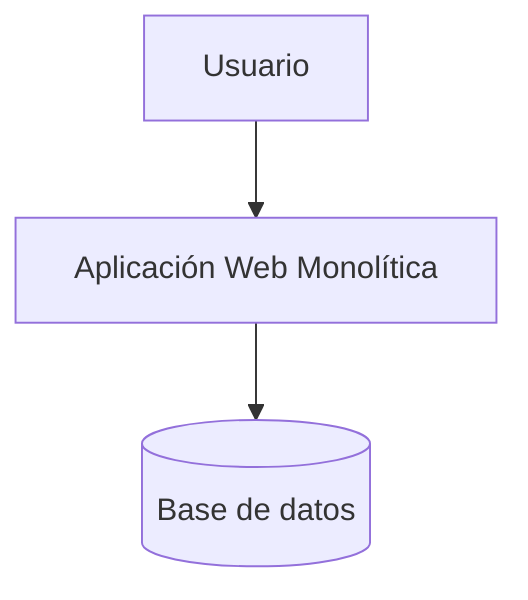

**Versión con frontend y backend en el mismo despliegue (Next.js full-stack):**

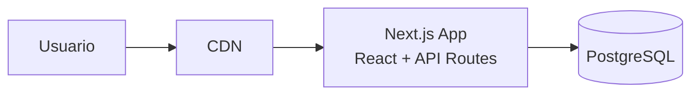

**Ventajas:** simple, rápido de desarrollar. **Desventajas:** escalar partes por separado es complicado. **Cuándo:** casi siempre para un portafolio.

---

### 5.2. Monolito Modular

Un solo despliegue pero internamente dividido en **módulos**.

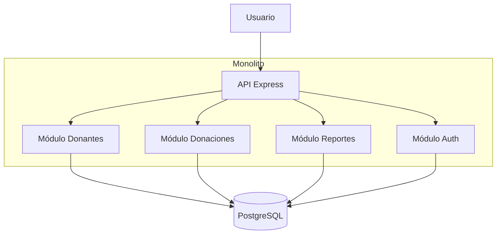

**Cuándo:** el punto ideal para un portafolio serio. Se puede migrar a microservicios después si hace falta.

---

### 5.3. Cliente-Servidor clásico (SPA + API)

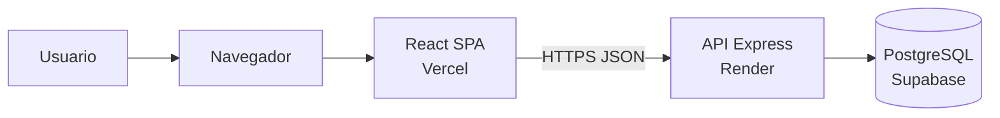

**Versión con autenticación:**

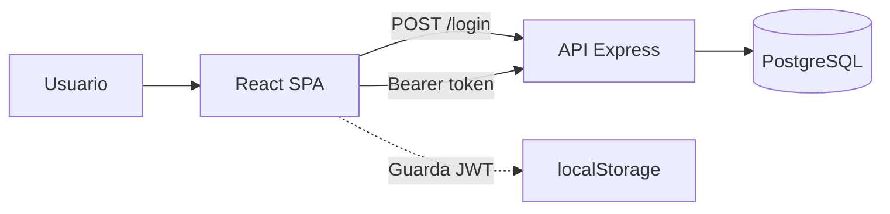

---

### 5.4. Arquitectura JAMstack

Frontend estático que consume APIs.

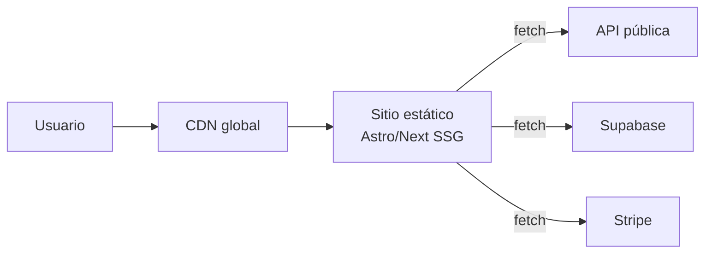

**Cuándo:** landings, blogs, documentación, e-commerce ligeros.

---

### 5.5. Serverless / Functions as a Service

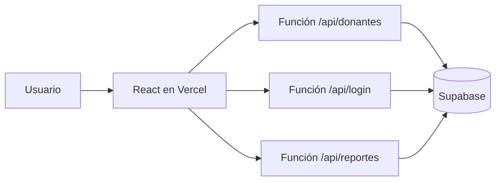

**Ventajas:** costo cero sin tráfico, escala automática. **Desventajas:** cold start, vendor lock-in.

---

### 5.6. Microservicios

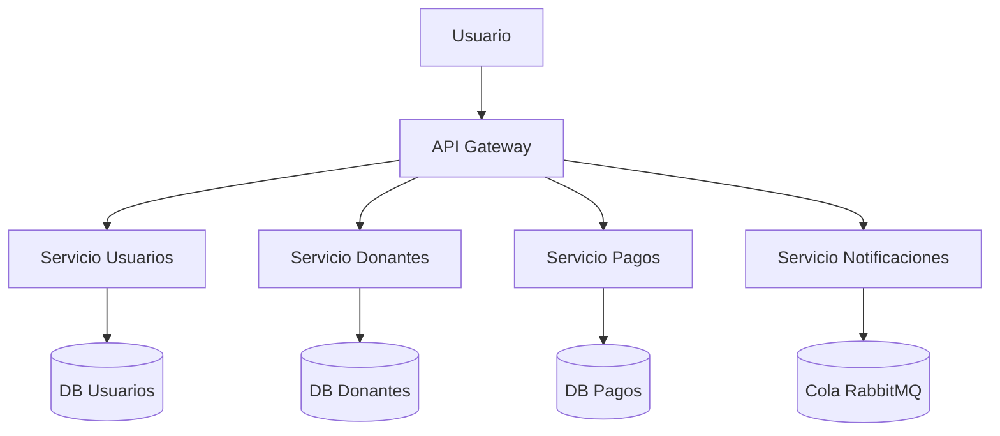

**Cuándo:** equipos grandes, escala alta. Rara vez apropiado para un portafolio.

---

### 5.7. Event-Driven Architecture

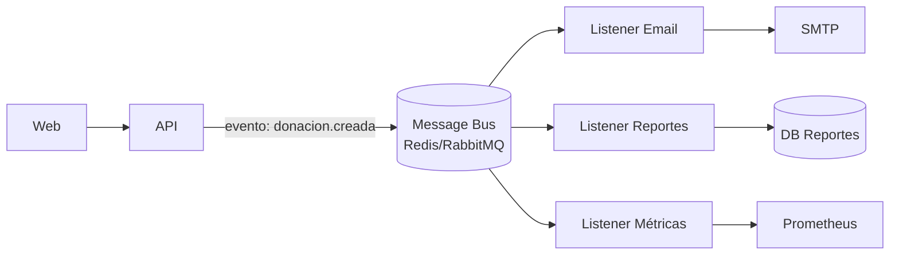

---

### 5.8. Real-time / WebSockets

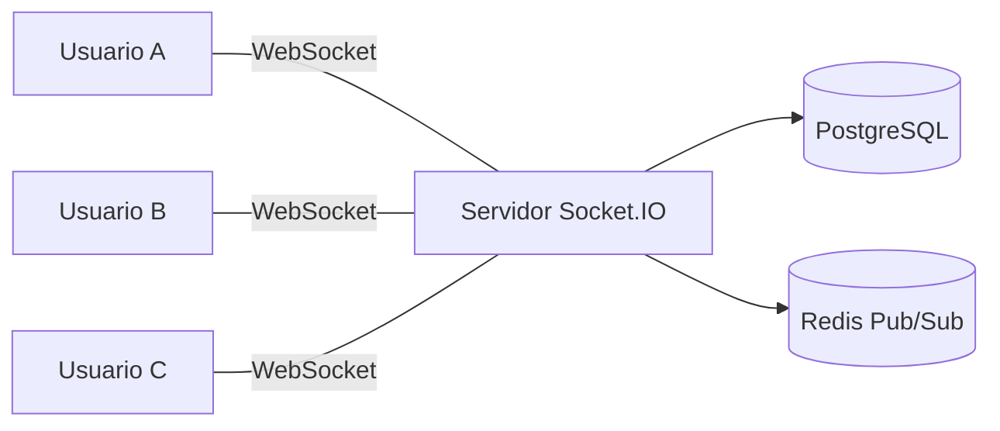

**Alternativa con BaaS (Supabase Realtime o Firebase):**

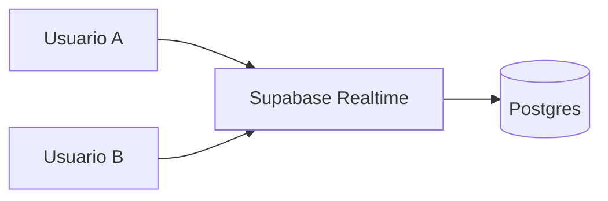

---

### 5.9. BFF (Backend For Frontend)

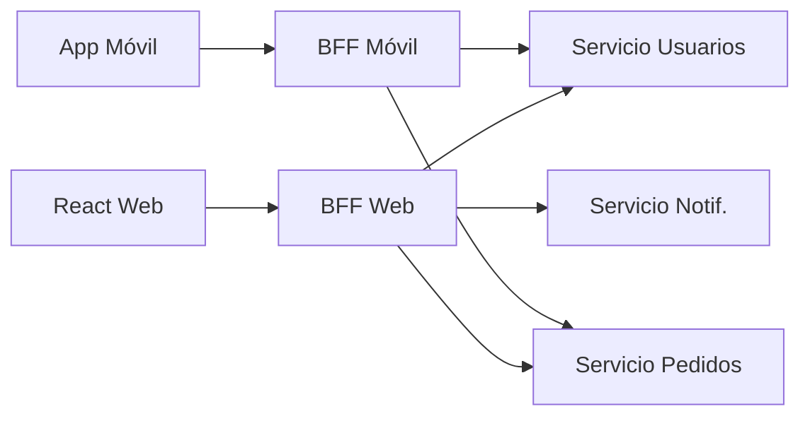

---

### 5.10. Microfrontends

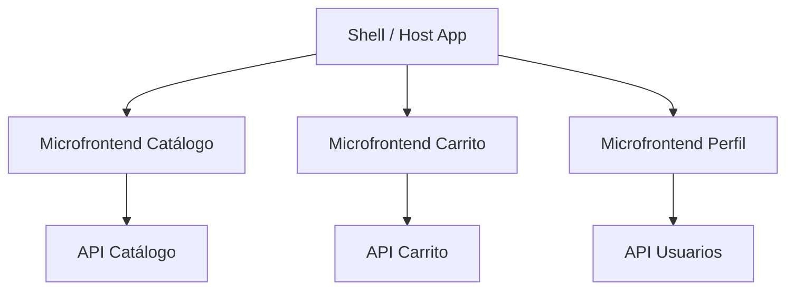

---

### 5.11. Despliegue típico de un portafolio

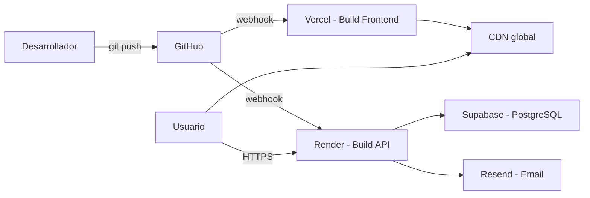

---

### 5.12. Diagrama de secuencia típico (login)

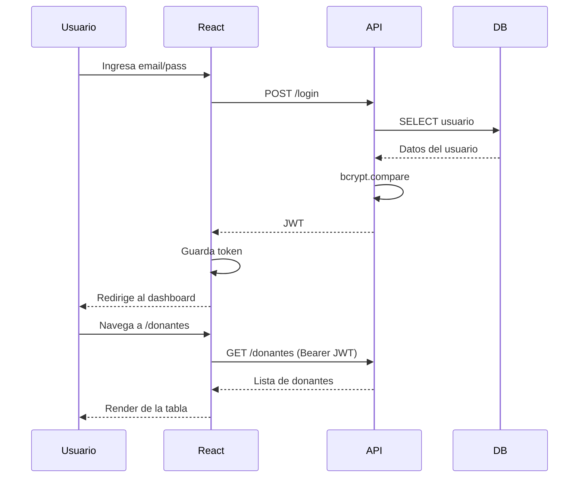

---

### 5.13. Diagrama C4 de contexto (para el nivel alto del proyecto)

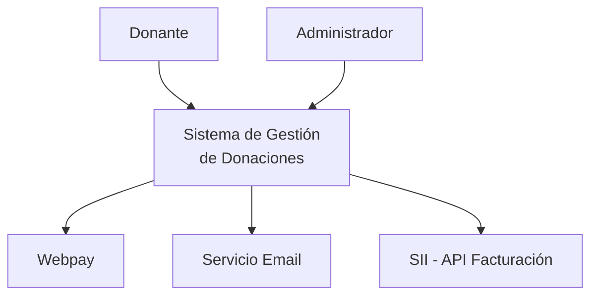

---

## 6. Stacks tecnológicos populares

| Stack | Frontend | Backend | DB | Ideal para |
|---|---|---|---|---|
| **MERN** | React | Node + Express | MongoDB | Prototipos, apps CRUD, tiempo real |
| **MEVN** | Vue | Node + Express | MongoDB | Igual que MERN, con Vue |
| **MEAN** | Angular | Node + Express | MongoDB | Proyectos grandes con tipado fuerte |
| **PERN** | React | Node + Express | PostgreSQL | Proyectos con datos relacionales |
| **Next.js Full-Stack** | Next.js (React) | API Routes Next | PostgreSQL (Neon, Supabase) | Webs modernas con SEO |
| **T3 Stack** | Next.js + Tailwind | tRPC + Prisma | PostgreSQL | Apps tipadas end-to-end |
| **Django + React** | React | Django REST Framework | PostgreSQL | Proyectos con mucha lógica de negocio |
| **Flask/FastAPI + Vue** | Vue | Python | PostgreSQL / SQLite | APIs rápidas, ciencia de datos |
| **Spring Boot + Angular** | Angular | Java Spring Boot | MySQL / PostgreSQL | Proyectos empresariales |
| **.NET + React** | React | ASP.NET Core | SQL Server / PostgreSQL | Empresas con ecosistema Microsoft |
| **Laravel + Livewire** | Blade / Livewire | PHP | MySQL | CRUD administrativos rápidos |
| **React Native / Flutter + API** | Móvil nativa | Cualquier backend | Cualquiera | Aplicaciones móviles |

---

## 7. Plataformas cloud gratuitas (al 2025-2026)

> Los límites cambian. Siempre verifica los planes vigentes antes de desplegar.

### 7.1. Frontend / sitios estáticos / JAMstack

| Plataforma | Fuerte en | Capa gratuita (aprox.) | Observaciones |
|---|---|---|---|
| **Vercel** | Next.js, React, Vite | 100 GB/mes de ancho, builds ilimitados en proyectos hobby | Ideal para Next.js; incluye Serverless Functions y Edge Functions |
| **Netlify** | Sitios estáticos, JAMstack | 100 GB/mes, 300 min build | Incluye formularios y Netlify Functions |
| **Cloudflare Pages** | Sitios estáticos + Workers | 500 builds/mes, ancho ilimitado | Muy rápido, excelente CDN global |
| **GitHub Pages** | Sitios estáticos puros | Gratis con límites suaves | Perfecto para documentación y portfolios |
| **Render (Static Sites)** | Sitios estáticos | Gratis con SSL | Muy simple de configurar |
| **Firebase Hosting** | Sitios + integración Firebase | 10 GB almacenamiento, 360 MB/día | Bueno si ya usas Firebase |

### 7.2. Backend (APIs, servidores Node, Python, etc.)

| Plataforma | Tipo | Capa gratuita (aprox.) | Notas |
|---|---|---|---|
| **Render** | Web services | Servicio gratis que se duerme tras inactividad | Muy usado en proyectos de estudiantes |
| **Railway** | Contenedores | Crédito mensual gratuito limitado | Excelente DX, deploy desde GitHub |
| **Fly.io** | VMs / contenedores | Capa gratuita reducida | Potente, despliegue en múltiples regiones |
| **Vercel Functions** | Serverless | Incluido en plan hobby | Límite de ejecución por función |
| **Cloudflare Workers** | Edge serverless | 100 000 req/día gratis | Muy baja latencia global |
| **Netlify Functions** | Serverless | 125 000 invocaciones/mes | Pensado para sitios Netlify |
| **Deno Deploy** | Edge (TypeScript) | Capa gratuita generosa | Ideal si usas Deno |
| **Glitch** | Node simple | Proyecto educativo | Ideal para demos, no producción |
| **Replit** | Multi-lenguaje | Capa gratuita limitada | Bueno para prototipos y clases |

### 7.3. Bases de datos gestionadas

| Plataforma | Tipo | Capa gratuita (aprox.) | Notas |
|---|---|---|---|
| **Supabase** | PostgreSQL + Auth + Storage + Realtime | 500 MB DB, 1 GB storage | BaaS muy completo |
| **Neon** | PostgreSQL serverless | ~0.5 GB | Branching de DB tipo Git |
| **Aiven for PostgreSQL** | PostgreSQL | Plan de evaluación | Muy estable |
| **Turso** | SQLite distribuido (libSQL) | Capa gratuita generosa | Perfecto para apps edge |
| **MongoDB Atlas** | MongoDB | 512 MB cluster gratis | Clásico para MERN |
| **Firebase Firestore** | NoSQL | 1 GB storage, 50 k lect/día | Excelente tiempo real |
| **PlanetScale** | MySQL | Plan gratuito limitado | Escalable, serverless |
| **Upstash Redis** | Redis serverless | 10 000 comandos/día | Ideal para caché y colas |
| **Railway Postgres/MySQL** | SQL | Incluido en crédito Railway | Simple integración |
| **Render Postgres** | PostgreSQL | Capa gratuita con expiración | Fácil de conectar |
| **CockroachDB Serverless** | SQL distribuida | 5 GB storage | Escalable globalmente |

### 7.4. Autenticación y BaaS

| Plataforma | Capacidad | Capa gratuita |
|---|---|---|
| **Supabase** | Auth + DB + Storage + Edge Functions | Gratis generoso |
| **Firebase** | Auth + Firestore + Functions + Hosting | Gratis generoso |
| **Clerk** | Autenticación lista para usar | Hasta N usuarios gratis |
| **Auth0** | Autenticación empresarial | 7 500 MAU gratis |
| **Appwrite** | Open-source BaaS | Self-hosted + plan cloud gratuito |
| **Pocketbase** | Backend en un solo binario | Gratis, se hostea donde quieras |

### 7.5. Almacenamiento de archivos e imágenes

| Plataforma | Uso | Capa gratuita |
|---|---|---|
| **Cloudinary** | Imágenes y video con transformaciones | 25 GB/mes |
| **Supabase Storage** | Archivos genéricos | 1 GB |
| **Firebase Storage** | Archivos genéricos | 5 GB |
| **Cloudflare R2** | Compatible S3 | 10 GB/mes |
| **Backblaze B2** | Almacenamiento barato | 10 GB |

### 7.6. Otras herramientas para el portafolio

- **GitHub Actions:** CI/CD gratis (2 000 min/mes en repos privados).
- **Sentry:** monitoreo de errores con plan gratuito.
- **Uptime Robot / BetterStack:** monitoreo de uptime gratuito.
- **LogTail / Axiom:** logging gratuito hasta cierto volumen.
- **n8n cloud / Make / Zapier:** automatizaciones con tier gratuito.

---

## 8. Matriz de decisión por tipo de proyecto

| Tipo de proyecto | Patrón frontend | Patrón backend | Arquitectura | Stack sugerido | Despliegue gratuito |
|---|---|---|---|---|---|
| **CRUD administrativo interno** | Component-based + Container/Presentational | MVC / Layered | Monolito | React + Express + PostgreSQL | Vercel + Render + Supabase |
| **Landing / sitio institucional** | SSG | — | JAMstack | Astro o Next.js | Vercel / Netlify / Cloudflare Pages |
| **E-commerce pequeño** | SSR/ISR | Layered + Repository + Service | Monolito modular | Next.js + Prisma + PostgreSQL | Vercel + Neon/Supabase |
| **Dashboard de indicadores** | Component-based + Store (Redux/Zustand) | Layered + Repository | Cliente-servidor clásico | React + FastAPI + PostgreSQL | Render + Neon + Vercel |
| **App móvil con sincronización** | Component-based (RN/Flutter) | BaaS o Layered | Cliente-servidor o BaaS | React Native + Firebase o Supabase | Firebase / Supabase |
| **Chat o app en tiempo real** | Component-based + WebSockets | Event-driven | Monolito + WebSockets | Node + Socket.IO + Redis o Supabase Realtime | Railway + Upstash Redis |
| **Plataforma educativa** | SSR + Component-based | Layered + Service | Monolito modular | Next.js + PostgreSQL + Clerk/Supabase Auth | Vercel + Neon |
| **API pública para terceros** | — | Layered + DTO + Middleware | Monolito o Serverless | FastAPI o NestJS | Render / Fly.io / Railway |
| **Marketplace de servicios** | SSR/ISR + Store | Layered + Repository + Event-driven | Monolito modular | Next.js + Prisma + PostgreSQL + Redis | Vercel + Supabase + Upstash |
| **Proyecto con integración IoT** | Component-based | Event-driven + MQTT | Microservicios simples | Node + MQTT broker + InfluxDB | Railway + HiveMQ Cloud |
| **Blog / documentación técnica** | SSG | — | JAMstack | Astro o Docusaurus | GitHub Pages / Netlify / Cloudflare |
| **Sistema de reservas / citas** | Component-based + SSR | Layered + Service | Monolito modular | Next.js + PostgreSQL + Auth | Vercel + Supabase |

---

## 9. Cómo justificar la elección en el proyecto de portafolio

En la documentación del proyecto debes responder:

1. **¿Qué problema resuelve el sistema?** (una frase clara).
2. **¿Qué tipo de usuarios lo usarán y cuántos se esperan en el primer año?** (afecta la arquitectura).
3. **¿Qué patrón frontend y por qué?** (componentes, store, SSR, etc.).
4. **¿Qué patrón backend y por qué?** (capas, repositorio, service layer).
5. **¿Qué arquitectura general?** (monolito, modular, serverless).
6. **¿Qué stack tecnológico?** (lenguaje, framework, DB).
7. **¿Dónde se desplegará?** (plataforma cloud, costos estimados, alternativas gratuitas).
8. **¿Qué riesgos tiene la elección?** (limitaciones del free tier, vendor lock-in, aprendizaje).
9. **¿Cómo se probará y mantendrá?** (tests, logs, monitoreo).

Esta justificación es parte de la rúbrica de evaluación.

---

# PARTE B – ACTIVIDAD DE LABORATORIO (90 minutos)

---

## 10. Propósito de la actividad

Al finalizar, cada equipo deberá haber **analizado, elegido, justificado y prototipado mínimamente** la arquitectura y el stack de su proyecto de portafolio, incluyendo la plataforma cloud gratuita donde se desplegará.

El entregable es un archivo `ARQUITECTURA.md` dentro del repositorio del proyecto del equipo, acompañado de una pequeña prueba funcional (un "hola mundo" desplegado o una API mínima corriendo en local) y la **estructura de carpetas inicial** ya creada.

---

## 11. Organización del tiempo

| Bloque | Tiempo | Actividad |
|---|---|---|
| 1 | 10 min | Lectura dirigida de la guía y chequeo de proyecto |
| 2 | 15 min | Análisis del tipo de proyecto y necesidades |
| 3 | 20 min | Selección y justificación de patrones y arquitectura |
| 4 | 20 min | Elección de stack, plataforma y creación de la estructura de carpetas |
| 5 | 15 min | Prototipo mínimo (local o desplegado) |
| 6 | 10 min | Documentación final y conclusión |

**Total: 90 minutos.**

---

## 12. Bloque 1 – Lectura dirigida (10 min)

Cada equipo debe leer las secciones 2, 3, 4 y 5 de esta guía con el caso de su proyecto en mente.

### Checkpoint 1

El equipo debe poder responder, en voz alta:

- ¿qué tipo de aplicación es (web, móvil, API, dashboard)?;
- ¿cuál es el usuario principal?;
- ¿qué datos se van a manejar?

---

## 13. Bloque 2 – Análisis del proyecto (15 min)

Responde en un archivo nuevo llamado `ARQUITECTURA.md` dentro del repositorio del equipo:

### Plantilla inicial

```markdown
# Arquitectura del Proyecto

## 1. Contexto
- **Nombre del proyecto:**
- **Problema que resuelve:**
- **Usuarios objetivo:**
- **Volumen estimado de usuarios en el primer año:**
- **Tipo de aplicación:** (web / móvil / API / dashboard / otro)

## 2. Requisitos funcionales clave
- (3 a 5 bullets)

## 3. Requisitos no funcionales clave
- Seguridad:
- Rendimiento:
- Escalabilidad esperada:
- Disponibilidad necesaria:
- Presupuesto (idealmente $0 en etapa inicial):
```

### Checkpoint 2

El archivo `ARQUITECTURA.md` existe en el repositorio y tiene las secciones 1, 2 y 3 completas.

---

## 14. Bloque 3 – Elección y justificación de patrones (20 min)

Agrega al archivo `ARQUITECTURA.md` lo siguiente, eligiendo **una opción justificada** en cada punto usando las secciones 2, 3 y 5 de esta guía.

```markdown
## 4. Patrón de frontend elegido
- **Patrón:** (p. ej. Component-based + Container/Presentational + Custom Hooks)
- **Por qué:** (2–3 líneas)
- **Alternativa descartada:** (y por qué se descartó)

## 5. Patrón de backend elegido
- **Patrón:** (p. ej. Layered + Repository + Service Layer + DTO)
- **Por qué:**
- **Alternativa descartada:**

## 6. Arquitectura general
- **Estilo:** (monolito / monolito modular / serverless / otro)
- **Por qué:**
- **Diagrama:** (ver más abajo)
```

### Diagramas obligatorios

El equipo debe incluir **al menos 2 diagramas Mermaid** en el `ARQUITECTURA.md`:

1. **Diagrama de arquitectura general** (similar a los de la sección 5).
2. **Diagrama de secuencia del caso de uso principal** (similar al 5.12).

### Checkpoint 3

El equipo tiene en `ARQUITECTURA.md`:

- el patrón frontend justificado;
- el patrón backend justificado;
- la arquitectura general justificada;
- los dos diagramas solicitados.

---

## 15. Bloque 4 – Stack, plataforma y estructura de carpetas (20 min)

Usando las secciones 4, 6 y 7 de esta guía, agrega al `ARQUITECTURA.md`:

```markdown
## 7. Stack tecnológico
- **Lenguaje frontend:**
- **Framework frontend:**
- **Lenguaje backend:**
- **Framework backend:**
- **Base de datos:**
- **Auth:**
- **Almacenamiento de archivos (si aplica):**

## 8. Plataforma de despliegue
| Componente | Plataforma | Por qué | Límites del plan gratuito |
|---|---|---|---|
| Frontend | | | |
| Backend | | | |
| Base de datos | | | |
| Auth | | | |
| Archivos/Imágenes | | | |

## 9. Estructura de carpetas inicial
(Pega aquí la estructura de carpetas elegida; basada en la sección 4)

## 10. Riesgos de la elección
- (3 bullets con riesgos reales: ej. "Render gratuito se duerme tras 15 min sin tráfico")
```

### Obligatorio: crear la estructura en el repo

El equipo debe **crear las carpetas reales** según la estructura elegida, aunque todavía estén vacías. Por ejemplo:

```powershell
# Frontend (React + Vite)
mkdir mi-app, mi-app\src, mi-app\src\app, mi-app\src\shared, mi-app\src\features
mkdir mi-app\src\shared\components, mi-app\src\shared\hooks, mi-app\src\shared\lib

# Backend (Node + Express, Layered)
mkdir api, api\src, api\src\config, api\src\middleware, api\src\routes
mkdir api\src\controllers, api\src\services, api\src\repositories, api\src\dtos
```

### Checkpoint 4

El `ARQUITECTURA.md` tiene stack, plataformas, riesgos y estructura de carpetas, y **las carpetas reales existen en el repositorio**.

---

## 16. Bloque 5 – Prototipo mínimo (15 min)

El equipo debe entregar **una prueba concreta**. Basta con **una** de estas opciones:

### Opción A – "Hola mundo" desplegado (Frontend)

1. Crear un `index.html` o proyecto Vite + React mínimo.
2. Desplegarlo en Vercel, Netlify o Cloudflare Pages.
3. Probar la URL pública.

### Opción B – API mínima corriendo en local (Backend)

1. Levantar una API con dos endpoints: `/health` y `/items` (lista dummy).
2. Probarla desde Postman, Thunder Client o `Invoke-RestMethod`.
3. Dejar el código en el repo.

### Opción C – BaaS conectado

1. Crear una tabla en Supabase o Firebase.
2. Insertar un registro manualmente.
3. Leer el registro desde un pequeño script frontend.

### Opción D – End-to-end mínimo (ambiciosa)

1. Frontend Vite + React desplegado en Vercel.
2. Backend Express + "Hello World" desplegado en Render.
3. El frontend hace fetch al backend y muestra la respuesta.

### Checkpoint 5

Existe una evidencia visible (URL pública o captura de pantalla) que demuestra que la elección tecnológica es factible.

---

## 17. Bloque 6 – Documentación final y conclusión (10 min)

Agrega al `ARQUITECTURA.md`:

```markdown
## 11. Prototipo realizado
- **Opción elegida:** (A, B, C o D)
- **Evidencia:** (URL pública o ruta a la captura)

## 12. Próximos pasos
- (3 bullets concretos)

## 13. Reflexión del equipo
- ¿Qué patrón entendimos mejor durante la actividad?
- ¿Qué riesgo nos preocupa más y cómo lo vamos a mitigar?
- ¿Qué necesitamos investigar más antes de avanzar?
```

Finalmente haz `git add`, `commit` y `push` del archivo `ARQUITECTURA.md` y de la estructura de carpetas.

---

## 18. Entregables

Cada equipo debe entregar:

1. El archivo `ARQUITECTURA.md` completo en el repositorio del proyecto.
2. **Al menos 2 diagramas Mermaid** (arquitectura general + secuencia).
3. **Estructura de carpetas creada** según la decisión del equipo.
4. Evidencia del prototipo mínimo (URL pública o captura).
5. Commit firmado por los integrantes del equipo.

---

## 19. Criterios de logro

El equipo aprueba la actividad si:

- eligió y justificó un patrón frontend y uno backend;
- seleccionó una arquitectura coherente con el proyecto;
- identificó plataformas cloud gratuitas viables para cada componente;
- creó la estructura de carpetas del proyecto;
- reconoció al menos 3 riesgos reales de su elección;
- presentó un prototipo funcional, aunque sea mínimo.

---

## 20. Desafío opcional

Si el equipo termina antes del tiempo, puede sumar cualquiera de estas extensiones:

- **A:** conectar el prototipo local con una base de datos gratuita (Supabase, Neon o Firebase).
- **B:** agregar un pipeline de CI simple con GitHub Actions que corra `npm test` o `pytest` en cada push.
- **C:** investigar y agregar una sección sobre **seguridad** (CORS, variables de entorno, manejo de secretos).
- **D:** preparar un diagrama de componentes C4 nivel 2 (ver ejemplo 5.13 como nivel 1).
- **E:** implementar un segundo patrón en código dentro del prototipo (por ejemplo, Repository y DTO en el backend).

---

## 21. Errores comunes a evitar

- **Elegir microservicios "porque suena profesional".** Un monolito modular bien diseñado es casi siempre mejor para el portafolio.
- **Usar bases de datos distintas por capricho.** Si no sabes NoSQL, empieza con PostgreSQL.
- **Depender de un único free tier sin plan B.** Anota siempre una alternativa.
- **Confundir patrón con framework.** React no es un patrón; el patrón es "component-based". Django no es un patrón; el patrón es MVC.
- **No documentar la decisión.** Una arquitectura sin justificación no se puede defender en la presentación final.
- **Mezclar responsabilidades entre capas.** Si tu controller habla con la base de datos, pierde el sentido la arquitectura en capas.
- **No probar con el free tier desde el día 1.** Muchas plataformas cambian límites; descúbrelo temprano.

---

## 22. Glosario rápido

- **API REST:** interfaz web basada en HTTP que permite a un cliente consumir recursos.
- **BaaS:** Backend as a Service. Servicio que entrega base de datos, auth, storage y funciones listas.
- **CDN:** Content Delivery Network. Distribuye archivos estáticos cerca del usuario.
- **CI/CD:** Integración y Despliegue Continuos.
- **Cold start:** retraso al despertar una función serverless que estaba apagada.
- **DTO:** Data Transfer Object. Estructura de datos que viaja entre capas o servicios.
- **Free tier:** plan gratuito de una plataforma cloud con límites definidos.
- **Higher-Order Component (HOC):** función que recibe un componente y devuelve otro con más comportamiento.
- **JAMstack:** arquitectura basada en JavaScript, APIs y Markup precompilado.
- **Middleware:** función intermedia que procesa una petición antes o después del controlador.
- **SPA:** Single Page Application.
- **SSR/SSG/CSR/ISR:** estrategias de renderizado.
- **Vendor lock-in:** dependencia excesiva de un proveedor cloud específico.

---

## 23. Referencias y lecturas recomendadas

- *Patterns of Enterprise Application Architecture* – Martin Fowler.
- *Clean Architecture* – Robert C. Martin.
- *Domain-Driven Design Distilled* – Vaughn Vernon.
- *Refactoring UI* – Adam Wathan & Steve Schoger (para Atomic Design).
- Documentación oficial de: React, Vue, Angular, Next.js, Express, NestJS, Django, FastAPI, Spring Boot.
- Documentación oficial de Vercel, Netlify, Render, Railway, Supabase, Firebase, Cloudflare.
- Mermaid Live Editor: https://mermaid.live (para practicar diagramas).

---

## 24. Cierre

Esta guía no pretende que memorices patrones, sino que aprendas a **elegirlos con criterio**. En la presentación final del proyecto de portafolio, tu equipo deberá **defender** estas decisiones. Si puedes explicar por qué escogiste un monolito modular con Next.js y Supabase en lugar de microservicios con AWS Lambda, y puedes mostrar **cómo se ve ese patrón en tu código React y Node**, habrás cumplido el objetivo de la asignatura.
