# Guía y Laboratorio: Patrones Esenciales de Software para tu Proyecto de Portafolio

## Datos generales

**Asignatura:** TPY1101 – Taller Aplicado de Programación
**Duración estimada del laboratorio:** 1 hora 30 minutos
**Modalidad:** Individual o en equipos del proyecto de portafolio
**Stack de referencia:** React (frontend) y Node.js + Express (backend)
**Audiencia:** estudiantes desarrollando el proyecto de portafolio 2026-01
**Prerequisitos:** haber entregado la EP1 (contexto, problema, objetivos, stack tentativo).

---

## 0. Cómo está organizado este documento

Este material está pensado como **una guía que podrás volver a consultar durante todo el semestre**, no como un listado enciclopédico. Por eso se limita a los patrones más usados en la industria y en los proyectos de la asignatura.

**Parte A – Fundamentos:**
- Por qué existen los patrones (teoría).
- **4 patrones esenciales de frontend** (con React).
- **5 patrones esenciales de backend** (con Node.js).
- **4 estilos de arquitectura** (con diagramas).
- Estructura de carpetas recomendada.
- Plataformas cloud gratuitas.

**Parte B – Recomendación específica para cada grupo del curso 2026-01:**
- Grupo 1 (MapacheSecure), Grupo 2 (Deckora), Grupo 3 (NoLimits), Grupo 4 (40dB), Grupo 5 (Pop Study), Grupo 6 (Generador de Landing Pages con IA), Grupo 7 (AGENTE X).
- Cada grupo recibe una tarjeta con los patrones que debe aplicar, el diagrama tentativo y las plataformas cloud sugeridas.

**Parte C – Actividad de 90 minutos:**
- Ejercicio guiado para que cada equipo produzca un documento de arquitectura real para su proyecto.

---

# PARTE A – FUNDAMENTOS

---

## 1. ¿Por qué existen los patrones de diseño?

### 1.1. Definición

Un **patrón de diseño** es una solución reutilizable, probada y documentada a un **problema recurrente** en el desarrollo de software. No es una receta exacta ni un fragmento de código listo para copiar: es una **forma de organizar el código** que la industria ha validado después de décadas de prueba y error.

La referencia fundacional es el libro *Design Patterns: Elements of Reusable Object-Oriented Software* (1994), conocido como "GoF" (Gang of Four). Desde entonces el concepto se ha extendido a patrones arquitectónicos, patrones de frontend, patrones de backend, patrones de integración y otros.

### 1.2. ¿Por qué importan en tu proyecto?

Elegir un patrón adecuado reduce el costo de:

1. **agregar funcionalidades** sin romper lo existente;
2. **probar el sistema** por partes;
3. **cambiar una dependencia** (la base de datos, un proveedor de email, un gateway de pago) sin reescribir todo;
4. **incorporar a un compañero nuevo** al proyecto, porque el código sigue una convención conocida;
5. **defender las decisiones técnicas** en la presentación final del portafolio.

### 1.3. ¿Cuándo NO usar un patrón?

El peor error en proyectos de estudiantes es **aplicar patrones sofisticados a problemas simples**. Un CRUD de 3 tablas no necesita microservicios ni Clean Architecture. Antes de elegir un patrón, pregúntate:

- ¿Qué problema concreto me resuelve?
- ¿Estoy agregando complejidad a cambio de un beneficio real?
- ¿Mis compañeros lo van a entender?

Si no puedes responder las tres, probablemente no necesitas ese patrón.

---

## 2. Patrones esenciales de Frontend (React)

En esta sección se presentan los **cuatro patrones más importantes** de React. Con estos cuatro puedes construir el 90 % de los proyectos web del portafolio.

---

### 2.1. Componentes como unidad básica (Component-Based Architecture)

#### ¿Qué es?

Es la **idea fundacional de React, Vue, Angular y Svelte**: la interfaz se construye como un árbol de piezas pequeñas e independientes llamadas componentes. Cada componente es una función que recibe datos (`props`) y devuelve una porción de UI.

#### ¿Qué problema resuelve?

Antes de los frameworks modernos, los sitios web se construían con bloques gigantes de HTML y JavaScript acoplados. Cualquier cambio afectaba todo. El enfoque en componentes permite:

- **reutilizar** la misma pieza (un botón, un input, una tarjeta) en muchas pantallas;
- **aislar** el comportamiento: un bug en la tarjeta de donante no afecta a la barra de navegación;
- **probar por partes**, con herramientas como Jest o React Testing Library;
- **documentar visualmente** con Storybook.

#### Principios

1. **Responsabilidad única:** cada componente debe tener una sola razón para cambiar.
2. **Composición sobre herencia:** es preferible meter componentes dentro de otros (`<Tarjeta>{hijo}</Tarjeta>`) que heredar clases.
3. **Props para arriba, eventos para abajo:** los datos fluyen del padre al hijo; los eventos suben por callbacks.
4. **Estado lo más local posible:** solo elevar estado cuando dos componentes hermanos lo necesitan.

#### Ejemplo mínimo

```jsx
function Boton({ texto, variante = 'primario', onClick }) {
  const estilos = {
    primario: 'bg-blue-600 text-white',
    peligro: 'bg-red-600 text-white',
    secundario: 'bg-gray-200 text-black'
  };
  return (
    <button className={`px-4 py-2 rounded ${estilos[variante]}`} onClick={onClick}>
      {texto}
    </button>
  );
}
```

#### Ejemplo de composición

```jsx
function Tarjeta({ titulo, children }) {
  return (
    <div className="border rounded p-4 shadow">
      <h3 className="font-bold">{titulo}</h3>
      <div className="mt-2">{children}</div>
    </div>
  );
}

// Uso: la tarjeta no sabe qué contiene, solo renderiza
<Tarjeta titulo="Donantes activos">
  <p>Total: 120</p>
  <Boton texto="Ver listado" onClick={...} />
</Tarjeta>
```

#### Ejemplo con datos (donantes de una fundación)

```jsx
function DonanteItem({ donante, onEliminar }) {
  return (
    <li className="flex justify-between border-b py-2">
      <span>{donante.nombre} — ${donante.monto.toLocaleString('es-CL')}</span>
      <Boton texto="Eliminar" variante="peligro" onClick={() => onEliminar(donante.rut)} />
    </li>
  );
}

function ListaDonantes({ donantes, onEliminar }) {
  if (donantes.length === 0) return <p>Sin donantes registrados.</p>;
  return (
    <ul>
      {donantes.map(d => (
        <DonanteItem key={d.rut} donante={d} onEliminar={onEliminar} />
      ))}
    </ul>
  );
}
```

#### ¿Cuándo usarlo?

**Siempre.** Es el patrón base de React. La pregunta no es si usarlo, sino cómo organizar tus componentes (ver patrón siguiente).

#### Pros

- Código reutilizable y testeable.
- Comunidad enorme, mucha documentación.
- Facilita trabajo en equipo (cada persona puede desarrollar un componente).

#### Contras

- Árboles de componentes muy profundos pueden ser difíciles de seguir.
- Es fácil caer en "prop drilling" (pasar props por 5 niveles); se soluciona con Context o state management (sección 2.3).

---

### 2.2. Custom Hooks + Separación de lógica y presentación

#### ¿Qué es?

Un **custom hook** es una función de JavaScript que usa otros hooks de React (`useState`, `useEffect`, etc.) y encapsula **lógica reutilizable**. Por convención empiezan con `use` (ej: `useAuth`, `useFetch`, `useDonantes`).

La **separación de lógica y presentación** significa mover la lógica (fetch de datos, validaciones, transformaciones) a hooks, dejando que los componentes solo rendericen UI.

#### ¿Qué problema resuelve?

En React es muy fácil mezclar lógica y UI en el mismo componente, lo que produce:

- componentes gigantes (200+ líneas) imposibles de entender;
- lógica duplicada en distintas pantallas;
- imposibilidad de testear la lógica sin renderizar la UI;
- dificultad para ver "qué hace" un componente de un vistazo.

Extraer la lógica a un hook convierte el componente en una pieza visual simple.

#### Principios

1. Si usas el mismo `useEffect` en dos componentes, extráelo a un hook.
2. El componente debe leerse casi como un diseño: qué elementos hay y cómo se conectan.
3. La regla de oro: un componente que tiene más `useEffect` que JSX probablemente necesita un hook.

#### Ejemplo 1: hook genérico `useFetch`

```jsx
// hooks/useFetch.js
import { useState, useEffect } from 'react';

export function useFetch(url) {
  const [data, setData] = useState(null);
  const [cargando, setCargando] = useState(true);
  const [error, setError] = useState(null);

  useEffect(() => {
    let cancelado = false;
    setCargando(true);

    fetch(url)
      .then(r => r.json())
      .then(d => { if (!cancelado) setData(d); })
      .catch(e => { if (!cancelado) setError(e); })
      .finally(() => { if (!cancelado) setCargando(false); });

    return () => { cancelado = true; };
  }, [url]);

  return { data, cargando, error };
}
```

#### Ejemplo 2: hook específico `useDonantes` (encapsula toda la lógica de donantes)

```jsx
// hooks/useDonantes.js
import { useState, useEffect } from 'react';

export function useDonantes() {
  const [donantes, setDonantes] = useState([]);
  const [cargando, setCargando] = useState(true);

  const cargar = async () => {
    setCargando(true);
    const r = await fetch('/api/donantes');
    setDonantes(await r.json());
    setCargando(false);
  };

  const eliminar = async (rut) => {
    await fetch(`/api/donantes/${rut}`, { method: 'DELETE' });
    setDonantes(prev => prev.filter(d => d.rut !== rut));
  };

  const crear = async (datos) => {
    const r = await fetch('/api/donantes', {
      method: 'POST',
      headers: { 'Content-Type': 'application/json' },
      body: JSON.stringify(datos)
    });
    const nuevo = await r.json();
    setDonantes(prev => [...prev, nuevo]);
  };

  useEffect(() => { cargar(); }, []);

  return { donantes, cargando, eliminar, crear };
}
```

#### Ejemplo 3: componente que solo presenta

```jsx
// components/DonantesPage.jsx
function DonantesPage() {
  const { donantes, cargando, eliminar, crear } = useDonantes();

  if (cargando) return <p>Cargando…</p>;

  return (
    <div>
      <h1>Donantes</h1>
      <FormularioDonante onSubmit={crear} />
      <ListaDonantes donantes={donantes} onEliminar={eliminar} />
    </div>
  );
}
```

Observa cómo el componente **no tiene ningún `fetch`**, solo consume el hook. Eso se llama **componente presentacional**.

#### Otros hooks comunes

```jsx
// useDebounce: retrasa un valor para evitar llamar a la API en cada tecla
export function useDebounce(valor, ms = 300) {
  const [debounced, setDebounced] = useState(valor);
  useEffect(() => {
    const t = setTimeout(() => setDebounced(valor), ms);
    return () => clearTimeout(t);
  }, [valor, ms]);
  return debounced;
}

// useLocalStorage: persiste estado entre recargas
export function useLocalStorage(clave, inicial) {
  const [valor, setValor] = useState(() => {
    const s = localStorage.getItem(clave);
    return s ? JSON.parse(s) : inicial;
  });
  useEffect(() => localStorage.setItem(clave, JSON.stringify(valor)), [clave, valor]);
  return [valor, setValor];
}
```

#### ¿Cuándo usarlo?

Siempre que un componente tenga **más de un `useEffect`** o **lógica que se repite**.

#### Pros

- Componentes pequeños y fáciles de leer.
- Lógica testeable por separado.
- Reutilización real (un hook puede usarse en 10 pantallas).

#### Contras

- Requiere disciplina: es fácil dejar lógica dentro del componente si uno tiene apuro.

---

### 2.3. Manejo de estado global (Provider Pattern / Store)

#### ¿Qué es?

Un mecanismo para compartir datos entre componentes **que están muy separados en el árbol**, sin tener que pasar props a través de todos los niveles intermedios ("prop drilling").

Hay tres implementaciones típicas:

1. **React Context + useReducer** (nativo, sin librerías).
2. **Zustand** (store global simple, muy liviano).
3. **Redux Toolkit** (el estándar industrial clásico, más ceremonioso).

#### ¿Qué problema resuelve?

Ejemplo típico: el usuario autenticado debe estar disponible en la barra de navegación, en el perfil, en las rutas protegidas y en el logout. Pasar `usuario` como prop por cada componente es tedioso y frágil.

#### Cuándo elegir qué

| Situación | Herramienta recomendada |
|---|---|
| Estado compartido entre 2-3 componentes cercanos | Elevar el estado al padre común |
| Estado global simple (tema, usuario, idioma) | React Context |
| Estado global complejo con mucha lógica | Zustand |
| Proyectos grandes que requieren convenciones estrictas | Redux Toolkit |

#### Ejemplo 1: React Context + custom hook (auth)

```jsx
// context/AuthContext.jsx
import { createContext, useContext, useState } from 'react';

const AuthContext = createContext(null);

export function AuthProvider({ children }) {
  const [usuario, setUsuario] = useState(null);

  const login = async (email, password) => {
    const r = await fetch('/api/auth/login', {
      method: 'POST',
      headers: { 'Content-Type': 'application/json' },
      body: JSON.stringify({ email, password })
    });
    const datos = await r.json();
    setUsuario(datos.usuario);
    localStorage.setItem('token', datos.token);
  };

  const logout = () => {
    setUsuario(null);
    localStorage.removeItem('token');
  };

  return (
    <AuthContext.Provider value={{ usuario, login, logout }}>
      {children}
    </AuthContext.Provider>
  );
}

export const useAuth = () => useContext(AuthContext);
```

```jsx
// Uso en main.jsx
<AuthProvider>
  <Router>
    <App />
  </Router>
</AuthProvider>

// Uso en cualquier componente
function Navbar() {
  const { usuario, logout } = useAuth();
  return (
    <nav>
      {usuario ? <span>Hola, {usuario.nombre} <button onClick={logout}>Salir</button></span>
               : <Link to="/login">Iniciar sesión</Link>}
    </nav>
  );
}
```

#### Ejemplo 2: Zustand (más simple que Redux, recomendado para la mayoría de proyectos)

```jsx
// stores/carritoStore.js
import { create } from 'zustand';

export const useCarrito = create((set) => ({
  items: [],
  agregar: (producto) => set(s => ({ items: [...s.items, producto] })),
  quitar: (id) => set(s => ({ items: s.items.filter(i => i.id !== id) })),
  vaciar: () => set({ items: [] }),
  total: () => { /* calcula total */ }
}));
```

```jsx
// Uso directo, sin Provider
function BotonAgregar({ producto }) {
  const agregar = useCarrito(s => s.agregar);
  return <Boton texto="Agregar" onClick={() => agregar(producto)} />;
}

function CarritoIcono() {
  const cantidad = useCarrito(s => s.items.length);
  return <span>🛒 {cantidad}</span>;
}
```

#### Ejemplo 3: Redux Toolkit (si el equipo prefiere el estándar clásico)

```jsx
// store/carritoSlice.js
import { createSlice } from '@reduxjs/toolkit';

const carritoSlice = createSlice({
  name: 'carrito',
  initialState: { items: [] },
  reducers: {
    agregar: (state, action) => { state.items.push(action.payload); },
    quitar: (state, action) => { state.items = state.items.filter(i => i.id !== action.payload); }
  }
});

export const { agregar, quitar } = carritoSlice.actions;
export default carritoSlice.reducer;
```

#### ¿Cuándo NO usarlo?

Si el estado solo lo necesitan 1-2 componentes cercanos, usar Context o un store global es sobreingeniería. Prefiere pasar props.

---

### 2.4. Estrategias de renderizado: CSR, SSR, SSG, ISR

#### ¿Qué es?

No es un patrón de código, sino **dónde y cuándo se genera el HTML** que recibe el usuario. Cada opción tiene consecuencias importantes para SEO, performance y costos.

| Estrategia | Se renderiza en | Cuándo | Ejemplo de uso |
|---|---|---|---|
| **CSR** (Client-Side) | Navegador, en tiempo real | En cada carga | Dashboard, app interna, herramientas |
| **SSR** (Server-Side) | Servidor, en cada petición | Dato muy fresco | Noticias, redes sociales, feed |
| **SSG** (Static Site Generation) | Build time | Datos rara vez cambian | Blog, docs, landing |
| **ISR** (Incremental Static Regeneration) | Build + revalidación | SSG + datos semi-dinámicos | E-commerce, catálogos |

#### ¿Qué problema resuelve?

El SEO y el tiempo de carga dependen fuertemente del HTML que llega al navegador. Una SPA clásica (CSR) entrega un HTML vacío y ejecuta JavaScript para llenarlo, lo que Google no siempre indexa bien y resulta lento en conexiones pobres.

#### Ejemplo CSR (Vite + React)

```jsx
// main.jsx
import { createRoot } from 'react-dom/client';
import App from './App';
createRoot(document.getElementById('root')).render(<App />);
```

Todo se renderiza en el navegador. Excelente para apps internas; malo para SEO.

#### Ejemplo SSR con Next.js (App Router)

```jsx
// app/noticias/page.jsx – Server Component por defecto
export default async function Page() {
  const r = await fetch('https://api.ejemplo.cl/noticias', { cache: 'no-store' });
  const noticias = await r.json();
  return (
    <ul>
      {noticias.map(n => <li key={n.id}>{n.titulo}</li>)}
    </ul>
  );
}
```

El HTML sale listo desde el servidor en cada request.

#### Ejemplo SSG con Next.js

```jsx
// app/blog/[slug]/page.jsx
export async function generateStaticParams() {
  const posts = await getPosts();
  return posts.map(p => ({ slug: p.slug }));
}

export default async function Post({ params }) {
  const post = await getPost(params.slug);
  return <article><h1>{post.titulo}</h1>{post.contenido}</article>;
}
```

Se genera HTML estático en el build. Ideal para blogs y documentación.

#### Ejemplo ISR

```jsx
export const revalidate = 60; // HTML estático pero se regenera cada 60 s
export default async function Catalogo() {
  const productos = await fetch('/api/productos').then(r => r.json());
  return <Grilla productos={productos} />;
}
```

#### Regla práctica

- **¿Importa el SEO?** Elige SSR, SSG o ISR (con Next.js).
- **¿Es una app interna (admin, dashboard, herramienta)?** CSR con Vite + React es suficiente.

---

## 3. Patrones esenciales de Backend (Node.js)

Cinco patrones que cubren el 90 % de los backends de portafolio.

---

### 3.1. Arquitectura en Capas (Layered Architecture)

#### ¿Qué es?

Divide el backend en **capas apiladas** con responsabilidades claras:

```
Request → Controller → Service → Repository → Base de datos
```

- **Routes:** definen qué URL corresponde a qué controller.
- **Controller:** recibe la petición HTTP y delega.
- **Service:** contiene las **reglas de negocio**.
- **Repository:** habla con la base de datos.
- **Model / Entity:** representa las estructuras de datos.

#### ¿Qué problema resuelve?

Sin capas, un solo archivo hace todo: lee la petición, valida, calcula, habla con la base de datos y devuelve JSON. Resultado: archivos de 500 líneas, imposibles de testear y cambiar.

Las capas separan responsabilidades. Si mañana cambias de Postgres a MongoDB, solo tocas el repository. Si la regla "un donante no puede donar montos negativos" cambia, solo tocas el service.

#### Principios

1. Una capa solo puede llamar a la capa inmediatamente inferior.
2. La capa superior NO debe saber detalles de implementación de la inferior.
3. La lógica de negocio vive en **services**, no en controllers.

#### Ejemplo completo (Node + Express + PostgreSQL)

```
src/
├── config/
│   └── db.js
├── routes/
│   └── donantes.routes.js
├── controllers/
│   └── donantes.controller.js
├── services/
│   └── donantes.service.js
├── repositories/
│   └── donantes.repository.js
├── middleware/
│   └── errorHandler.js
├── app.js
└── server.js
```

```js
// config/db.js
const { Pool } = require('pg');
module.exports = new Pool({ connectionString: process.env.DATABASE_URL });
```

```js
// repositories/donantes.repository.js
const pool = require('../config/db');

async function findAll() {
  const { rows } = await pool.query('SELECT * FROM donantes ORDER BY rut');
  return rows;
}

async function findByRut(rut) {
  const { rows } = await pool.query('SELECT * FROM donantes WHERE rut = $1', [rut]);
  return rows[0] ?? null;
}

async function insert({ rut, nombre, monto }) {
  const { rows } = await pool.query(
    'INSERT INTO donantes (rut, nombre, monto) VALUES ($1, $2, $3) RETURNING *',
    [rut, nombre, monto]
  );
  return rows[0];
}

async function remove(rut) {
  const { rowCount } = await pool.query('DELETE FROM donantes WHERE rut = $1', [rut]);
  return rowCount > 0;
}

module.exports = { findAll, findByRut, insert, remove };
```

```js
// services/donantes.service.js
const repo = require('../repositories/donantes.repository');

async function listar() {
  return repo.findAll();
}

async function crear(data) {
  if (data.monto < 0) throw Object.assign(new Error('Monto inválido'), { status: 400 });
  if (await repo.findByRut(data.rut)) {
    throw Object.assign(new Error('RUT duplicado'), { status: 409 });
  }
  return repo.insert(data);
}

async function eliminar(rut) {
  const ok = await repo.remove(rut);
  if (!ok) throw Object.assign(new Error('No encontrado'), { status: 404 });
}

module.exports = { listar, crear, eliminar };
```

```js
// controllers/donantes.controller.js
const service = require('../services/donantes.service');

async function listar(req, res, next) {
  try { res.json(await service.listar()); } catch (e) { next(e); }
}

async function crear(req, res, next) {
  try { res.status(201).json(await service.crear(req.body)); } catch (e) { next(e); }
}

async function eliminar(req, res, next) {
  try { await service.eliminar(+req.params.rut); res.status(204).send(); } catch (e) { next(e); }
}

module.exports = { listar, crear, eliminar };
```

```js
// routes/donantes.routes.js
const router = require('express').Router();
const c = require('../controllers/donantes.controller');

router.get('/', c.listar);
router.post('/', c.crear);
router.delete('/:rut', c.eliminar);

module.exports = router;
```

```js
// app.js
const express = require('express');
const donantes = require('./routes/donantes.routes');
const errorHandler = require('./middleware/errorHandler');

const app = express();
app.use(express.json());
app.use('/api/donantes', donantes);
app.use(errorHandler);
module.exports = app;
```

```js
// server.js
const app = require('./app');
app.listen(process.env.PORT || 3000, () => console.log('API viva'));
```

#### Regla de oro

**Si el código tiene `req` o `res`, no es un service.** Si el código tiene SQL, no es un controller. Mantén esas líneas de separación y todo se ordena.

#### Pros y contras

**Pros:** simple, probado, didáctico, el estándar en cursos y empresas medianas.
**Contras:** si el negocio es muy complejo, puede quedarse corto (ahí se evoluciona a Hexagonal).

---

### 3.2. MVC (Model-View-Controller)

#### ¿Qué es?

El patrón arquitectónico más conocido de la historia del backend. Divide la aplicación en:

- **Model:** los datos y las reglas de cómo se manipulan.
- **View:** la presentación (en backend tradicional, una plantilla HTML; en APIs modernas, JSON).
- **Controller:** el intermediario que recibe el input, llama al Model, elige la View.

Framework-representantes: Django, Laravel, Ruby on Rails, ASP.NET MVC, Spring MVC.

#### Relación con Layered

En proyectos Node.js modernos, **MVC y Layered se combinan**: MVC es la visión general (quién habla con quién), y Layered añade las subcapas Service y Repository. En la práctica hoy casi nadie hace "MVC puro" sin Service Layer.

#### Ejemplo MVC clásico en Node (con plantillas EJS)

```js
// models/donante.js
const pool = require('../config/db');
module.exports = {
  all: async () => (await pool.query('SELECT * FROM donantes')).rows,
  crear: async (d) => (await pool.query('INSERT INTO donantes VALUES($1,$2,$3) RETURNING *',
    [d.rut, d.nombre, d.monto])).rows[0]
};
```

```js
// controllers/donantesController.js
const Donante = require('../models/donante');

exports.index = async (req, res) => {
  const donantes = await Donante.all();
  res.render('donantes/index', { donantes });
};

exports.nuevo = (req, res) => res.render('donantes/nuevo');

exports.crear = async (req, res) => {
  await Donante.crear(req.body);
  res.redirect('/donantes');
};
```

```ejs
<!-- views/donantes/index.ejs -->
<h1>Donantes</h1>
<ul>
  <% donantes.forEach(d => { %>
    <li><%= d.nombre %> – $<%= d.monto %></li>
  <% }); %>
</ul>
<a href="/donantes/nuevo">Agregar</a>
```

```js
// app.js
app.set('view engine', 'ejs');
const c = require('./controllers/donantesController');
app.get('/donantes', c.index);
app.get('/donantes/nuevo', c.nuevo);
app.post('/donantes', c.crear);
```

#### ¿Cuándo elegirlo?

Cuando el backend **renderiza HTML** (proyectos Laravel/Rails-style), o cuando quieres una visión muy clásica. Si el backend es una **API REST** (el caso del 95 % de los proyectos del curso), se prefiere Layered + Service Layer.

---

### 3.3. Repository Pattern

#### ¿Qué es?

Una **abstracción** sobre el acceso a la base de datos. El service nunca ve SQL ni la librería del driver; llama a métodos como `repo.findByRut(123)` y confía en que "algo" hace la consulta.

Así, puedes tener varias implementaciones del mismo repositorio intercambiables:

- `DonanteRepositoryPostgres` (producción, con PostgreSQL).
- `DonanteRepositoryMongo` (si cambias de DB).
- `DonanteRepositoryMemory` (para tests unitarios).

#### ¿Qué problema resuelve?

1. **Independencia de la base de datos:** cambiar Postgres por Mongo no requiere tocar services.
2. **Testeo:** puedes probar la lógica con un repositorio en memoria sin levantar una DB real.
3. **Consultas reutilizables:** si "buscar donantes activos" se usa en 3 lugares, vive en el repo.

#### Ejemplo: repositorio intercambiable

```js
// repositories/donantes.postgres.js
const pool = require('../config/db');
module.exports = {
  async findAll() { return (await pool.query('SELECT * FROM donantes')).rows; },
  async findByRut(rut) {
    const { rows } = await pool.query('SELECT * FROM donantes WHERE rut=$1', [rut]);
    return rows[0] ?? null;
  },
  async insert(d) {
    const { rows } = await pool.query(
      'INSERT INTO donantes VALUES($1,$2,$3) RETURNING *',
      [d.rut, d.nombre, d.monto]
    );
    return rows[0];
  }
};

// repositories/donantes.memory.js (ideal para tests)
let datos = [];
module.exports = {
  async findAll() { return [...datos]; },
  async findByRut(rut) { return datos.find(d => d.rut === rut) ?? null; },
  async insert(d) { datos.push(d); return d; },
  _reset() { datos = []; }
};
```

```js
// services/donantes.service.js (recibe el repo como dependencia)
function crearService(repo) {
  return {
    async listar() { return repo.findAll(); },
    async crear(d) {
      if (await repo.findByRut(d.rut)) throw new Error('Duplicado');
      return repo.insert(d);
    }
  };
}
module.exports = crearService;

// Uso en producción
const repoProd = require('./repositories/donantes.postgres');
const service = require('./services/donantes.service')(repoProd);

// Uso en tests
const repoMem = require('./repositories/donantes.memory');
const serviceTest = require('./services/donantes.service')(repoMem);
```

#### ¿Cuándo usarlo?

- Siempre que te interese tener tests unitarios reales.
- Cuando el proyecto podría migrar de base de datos en el futuro.
- Cuando las mismas consultas se repiten en distintos services.

Si tu proyecto es un prototipo pequeño, puedes saltártelo. Pero en un portafolio serio, demostrar este patrón sube la calidad percibida.

---

### 3.4. DTO + Validación de entrada

#### ¿Qué es?

Un **DTO (Data Transfer Object)** es un objeto pensado para viajar entre capas o entre cliente y servidor. Define la **forma esperada de los datos**.

La **validación** es el proceso de verificar que los datos recibidos cumplen el DTO: tipos correctos, campos requeridos, rangos válidos.

Librerías populares en Node: **Zod, Joi, class-validator, Yup**.

#### ¿Qué problema resuelve?

**Nunca** confíes en el cliente. Sin validación, un atacante (o un bug de tu frontend) puede mandar `{ rut: "hola", monto: -99999 }` y romper tu base de datos.

Ventajas del DTO:

1. Mensajes de error claros ("el campo monto debe ser ≥ 0").
2. Seguridad básica (rechaza ataques triviales).
3. Documentación implícita (el DTO es una especificación).

#### Ejemplo con Zod (recomendado en 2026)

```js
// dtos/donante.dto.js
const { z } = require('zod');

const crearDonanteDTO = z.object({
  rut: z.number().int().positive(),
  nombre: z.string().min(2).max(80),
  monto: z.number().nonnegative(),
  email: z.string().email().optional()
});

module.exports = { crearDonanteDTO };
```

```js
// middleware/validate.js
module.exports = (schema) => (req, res, next) => {
  const r = schema.safeParse(req.body);
  if (!r.success) {
    return res.status(400).json({
      error: 'Datos inválidos',
      detalles: r.error.issues
    });
  }
  req.body = r.data; // datos ya limpios y tipados
  next();
};
```

```js
// routes/donantes.routes.js
const validate = require('../middleware/validate');
const { crearDonanteDTO } = require('../dtos/donante.dto');

router.post('/', validate(crearDonanteDTO), controller.crear);
```

#### Ejemplo con Joi

```js
const Joi = require('joi');

const schema = Joi.object({
  rut: Joi.number().integer().positive().required(),
  nombre: Joi.string().min(2).max(80).required(),
  monto: Joi.number().min(0).required(),
  email: Joi.string().email().optional()
});

// Middleware equivalente
module.exports = (s) => (req, res, next) => {
  const { error, value } = s.validate(req.body);
  if (error) return res.status(400).json({ error: error.details });
  req.body = value;
  next();
};
```

#### ¿Cuándo usarlo?

**En toda ruta que reciba body** (POST, PUT, PATCH). También en query params cuando son importantes.

---

### 3.5. Middleware Pipeline

#### ¿Qué es?

Patrón nativo de Express (y muy común en Koa, Fastify, ASP.NET Core, Django). La petición pasa por una **cadena de funciones**; cada una puede inspeccionarla, modificarla, responderla o pasarla al siguiente.

```
Request → [logger] → [cors] → [auth] → [validate] → [controller] → Response
```

#### ¿Qué problema resuelve?

Evita repetir lógica (autenticación, logging, CORS, rate limiting) en cada ruta. Se declara una vez y se aplica a todas.

#### Ejemplos típicos

```js
// middleware/logger.js
module.exports = (req, res, next) => {
  const inicio = Date.now();
  res.on('finish', () => {
    console.log(`${req.method} ${req.url} ${res.statusCode} ${Date.now() - inicio}ms`);
  });
  next();
};

// middleware/auth.js
const jwt = require('jsonwebtoken');
module.exports = (req, res, next) => {
  const token = req.headers.authorization?.split(' ')[1];
  if (!token) return res.status(401).json({ error: 'Falta token' });
  try {
    req.user = jwt.verify(token, process.env.JWT_SECRET);
    next();
  } catch {
    res.status(401).json({ error: 'Token inválido' });
  }
};

// middleware/errorHandler.js
module.exports = (err, req, res, next) => {
  const status = err.status ?? 500;
  console.error(`[${status}]`, err.message);
  res.status(status).json({ error: err.message });
};

// middleware/rateLimit.js (simple)
const cuentas = new Map();
module.exports = (req, res, next) => {
  const ip = req.ip;
  const ahora = Date.now();
  const reg = cuentas.get(ip) ?? { count: 0, reset: ahora + 60000 };
  if (ahora > reg.reset) { reg.count = 0; reg.reset = ahora + 60000; }
  reg.count++;
  cuentas.set(ip, reg);
  if (reg.count > 100) return res.status(429).json({ error: 'Muchas peticiones' });
  next();
};
```

```js
// app.js
const app = express();
app.use(express.json());
app.use(require('./middleware/logger'));
app.use(require('./middleware/rateLimit'));

app.use('/api/publico', require('./routes/publico.routes'));
app.use('/api/privado', require('./middleware/auth'), require('./routes/privado.routes'));

app.use(require('./middleware/errorHandler'));
```

#### ¿Cuándo usarlo?

Siempre. Es parte de cómo Express funciona. La pregunta es **cuáles middlewares** incorporas: logger, cors, helmet (seguridad), auth, validate, rate limit, error handler.

---

## 4. Arquitecturas más comunes (con diagramas)

De las múltiples arquitecturas posibles, estas **cuatro** cubren lo que necesita un portafolio.

---

### 4.1. Monolito clásico

Un solo proyecto desplegable con todo (frontend, backend, DB).

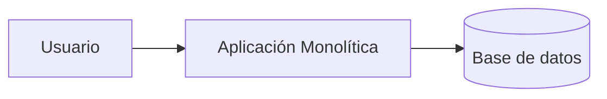

**Variante con Next.js full-stack** (frontend y backend en el mismo proyecto):

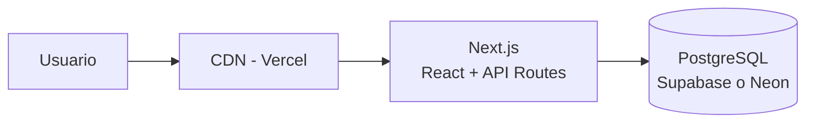

**Pros:** simple, rápido, fácil de debuggear.
**Contras:** escalar partes por separado es complicado.
**Cuándo:** casi siempre para un portafolio. La industria está revalorando el monolito.

---

### 4.2. Monolito Modular

Un solo despliegue internamente dividido en **módulos independientes**. Es el mejor balance entre simpleza y buen diseño.

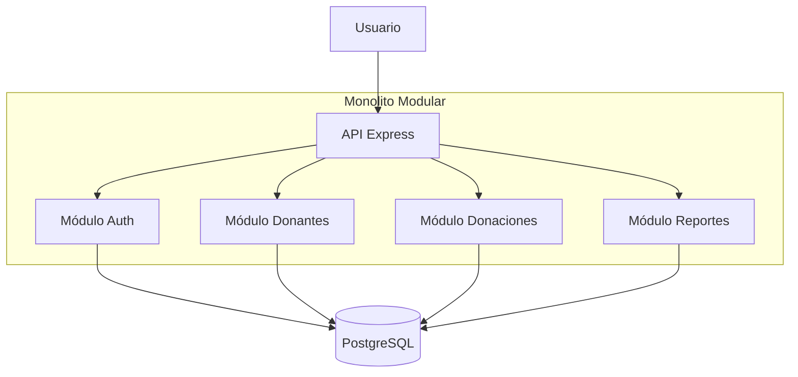

**Pros:** todo en un proceso (simple) pero con separación clara. Si algún día hace falta microservicios, es fácil extraer un módulo.
**Cuándo:** proyectos medianos del portafolio con varias áreas de negocio (auth + gestión + reportes).

---

### 4.3. Cliente-Servidor (SPA + API REST)

La arquitectura más común: un frontend (React SPA o App móvil) consume una API REST.

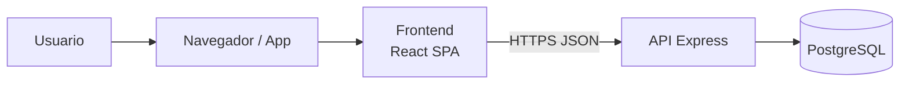

**Con autenticación JWT:**

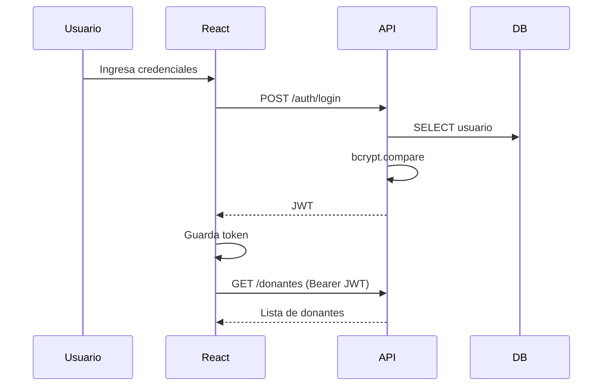

**Cuándo:** la arquitectura por defecto para apps interactivas, dashboards, apps móviles con backend propio.

---

### 4.4. Event-Driven (orientada a eventos)

Los componentes se comunican publicando y consumiendo eventos a través de un bus o cola (Redis Pub/Sub, RabbitMQ, MQTT para IoT).

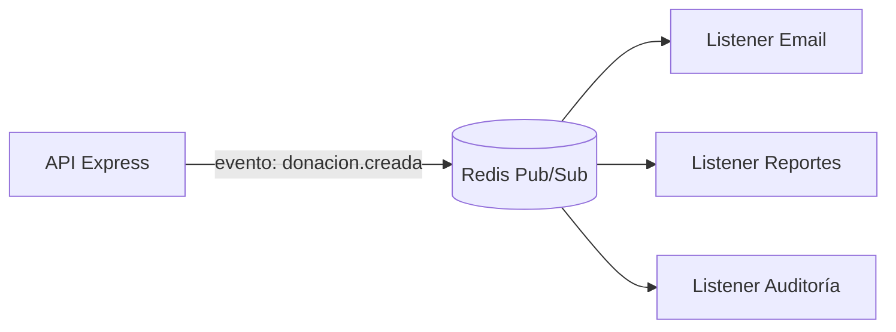

**Variante IoT con MQTT:**

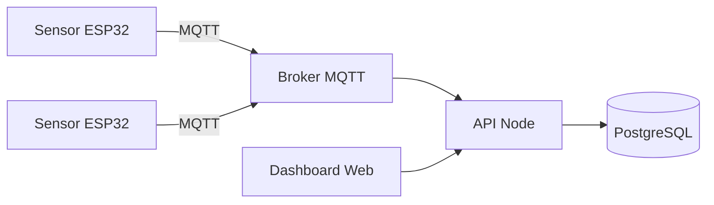

**Cuándo:** integraciones entre sistemas, procesos asíncronos (envío de correos, generación de reportes pesados), IoT, chat en tiempo real.

---

## 5. Estructura de carpetas recomendada

### 5.1. Frontend React (Vite) – estructura por features

Recomendada para la mayoría de los proyectos del curso.

```
app-web/
├── src/
│   ├── app/
│   │   ├── App.jsx
│   │   ├── routes.jsx
│   │   └── providers.jsx         ← Auth, Theme, QueryClient
│   ├── shared/
│   │   ├── components/           ← Boton, Input, Modal...
│   │   ├── hooks/                ← useDebounce, useFetch
│   │   ├── lib/                  ← api.js (axios configurado)
│   │   └── utils/
│   ├── features/
│   │   ├── auth/
│   │   │   ├── components/
│   │   │   ├── hooks/useAuth.js
│   │   │   ├── services/authService.js
│   │   │   └── index.js
│   │   └── donantes/
│   │       ├── components/
│   │       ├── hooks/useDonantes.js
│   │       ├── services/donantesService.js
│   │       └── index.js
│   └── main.jsx
└── package.json
```

### 5.2. Frontend Next.js (App Router)

Si el proyecto necesita SEO o renderizado en servidor.

```
app-web/
├── app/
│   ├── (public)/
│   │   ├── page.jsx
│   │   └── login/page.jsx
│   ├── (dashboard)/
│   │   ├── layout.jsx                    ← protegido
│   │   └── donantes/
│   │       ├── page.jsx
│   │       └── nuevo/page.jsx
│   ├── api/donantes/route.js             ← endpoints
│   └── layout.jsx
├── components/
├── lib/
└── package.json
```

### 5.3. Backend Node Express – estructura Layered

**La recomendada por defecto.**

```
api/
├── src/
│   ├── config/
│   │   ├── env.js
│   │   └── db.js
│   ├── middleware/
│   │   ├── auth.js
│   │   ├── errorHandler.js
│   │   ├── logger.js
│   │   └── validate.js
│   ├── routes/
│   │   ├── index.js
│   │   ├── donantes.routes.js
│   │   └── auth.routes.js
│   ├── controllers/
│   │   ├── donantes.controller.js
│   │   └── auth.controller.js
│   ├── services/
│   │   ├── donantes.service.js
│   │   └── auth.service.js
│   ├── repositories/
│   │   └── donantes.repository.js
│   ├── dtos/
│   │   └── donante.dto.js
│   ├── app.js
│   └── server.js
├── tests/
│   ├── unit/
│   └── integration/
├── .env.example
├── .gitignore
├── package.json
└── README.md
```

### 5.4. Monorepo (frontend + backend en un solo repo)

```
mi-proyecto/
├── apps/
│   ├── web/                 ← React/Next.js
│   └── api/                 ← Node Express
├── packages/
│   ├── types/               ← tipos compartidos
│   └── utils/
├── package.json
└── README.md
```

---

## 6. Plataformas cloud gratuitas (resumen práctico 2025-2026)

| Componente | Plataforma recomendada | Alternativa |
|---|---|---|
| **Frontend React** | Vercel | Netlify, Cloudflare Pages |
| **Frontend estático / blog** | Cloudflare Pages | GitHub Pages, Netlify |
| **API Node.js** | Render | Railway, Fly.io |
| **API Serverless** | Vercel Functions | Cloudflare Workers |
| **PostgreSQL** | Supabase | Neon, Render Postgres |
| **MySQL** | Railway | PlanetScale (con reservas) |
| **NoSQL** | Firebase Firestore | MongoDB Atlas |
| **Redis / Cache / Colas** | Upstash | Railway Redis |
| **Auth lista para usar** | Supabase Auth | Clerk, Firebase Auth |
| **Storage de archivos** | Supabase Storage | Cloudflare R2, Cloudinary |
| **Email transaccional** | Resend (3 000/mes) | SendGrid, Brevo |
| **CI/CD** | GitHub Actions | GitLab CI |
| **Monitoreo** | Sentry (free tier) | BetterStack |

### Advertencias importantes

- **Render gratis duerme** los servicios web tras 15 min sin tráfico. La primera request después del sueño demora 30-60 s.
- **Los free tiers cambian.** Revisa las páginas oficiales antes de decidir.
- **Evita vendor lock-in extremo.** Firebase Firestore es difícil de migrar; Supabase (PostgreSQL estándar) es más portable.

---

# PARTE B – RECOMENDACIONES POR GRUPO (2026-01)

A continuación, una tarjeta personalizada para cada equipo del curso, con los patrones, la arquitectura y las plataformas sugeridas según la EP1 entregada.

> **Nota:** estas recomendaciones son un punto de partida. El equipo puede ajustarlas siempre que justifique el cambio en su documento de arquitectura.

---

## Grupo 1 – MapacheSecure
### Sistema móvil gamificado para autorregulación digital

**Tipo de aplicación:** App móvil (control parental) con sincronización cloud.

**Características relevantes de la EP1:**
- Bloqueo inteligente de apps.
- Motor de desafíos multimodal (gamificación).
- Economía de fichas y recompensas.
- Panel parental.
- Notificaciones y reportes.
- Sincronización cloud multi-dispositivo.

### Patrones recomendados

**Frontend móvil (React Native o Flutter):**
- **Component-Based Architecture** (obvio, es la base).
- **Custom Hooks + Separación de lógica** para manejar desafíos, fichas, bloqueos. Crea hooks como `useDesafios`, `useFichas`, `useBloqueo`.
- **State Management con Zustand** (app móvil con mucho estado compartido entre pantallas: puntos actuales, reglas activas, sesión del niño/padre).

**Backend (Node + Express):**
- **Layered Architecture** (Controller/Service/Repository).
- **DTO + Validación con Zod** para todas las rutas (especialmente las que envían reglas parentales).
- **Middleware Pipeline:** auth JWT (el padre autentica en un dispositivo distinto), logger, rate limit.
- **Repository Pattern:** útil para futuros cambios de BD y para testear la lógica gamificada sin DB real.

### Arquitectura recomendada

**Monolito modular con módulos:** `auth`, `usuarios`, `reglas`, `desafios`, `economia-fichas`, `reportes`, `sync`.

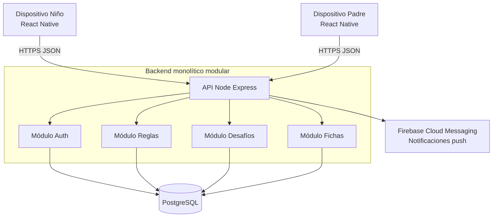

### Plataformas gratuitas sugeridas

| Componente | Plataforma |
|---|---|
| App móvil (desarrollo) | Expo + React Native |
| Backend API | Render o Railway |
| Base de datos | Supabase (PostgreSQL) |
| Auth | JWT propio (con bcrypt) o Supabase Auth |
| Notificaciones push | Firebase Cloud Messaging |
| Storage (iconos, imágenes) | Supabase Storage |

---

## Grupo 2 – Deckora
### Aplicación web para la optimización de la experiencia en entornos TCG

**Tipo de aplicación:** Web CRUD con búsqueda, comunidad y organización de torneos.

**Características relevantes de la EP1:**
- Gestión de colecciones, mazos.
- Organización y búsqueda de torneos.
- Visibilidad de tiendas y eventos.
- Seguimiento de rendimiento.

### Patrones recomendados

**Frontend (React + Vite o Next.js):**
- **Component-Based + Custom Hooks** para `useColeccion`, `useMazos`, `useTorneos`.
- **Provider Pattern (Context)** para el usuario autenticado.
- **SSR con Next.js** si quieren que los torneos y tiendas sean indexables por Google.

**Backend (Node + Express):**
- **Layered Architecture** completa.
- **Repository Pattern** (las queries de colecciones y torneos se van a repetir mucho).
- **DTO + Zod** (inscripciones a torneos, creación de mazos).
- **Middleware Pipeline** con auth JWT.

### Arquitectura recomendada

**Monolito modular.**

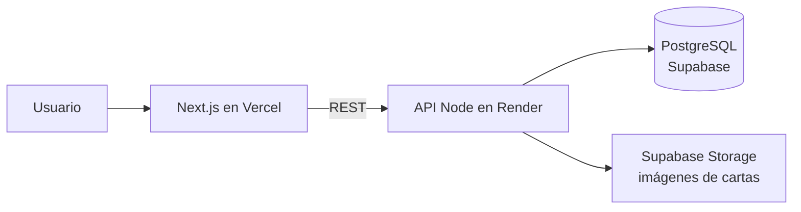

### Plataformas gratuitas sugeridas

| Componente | Plataforma |
|---|---|
| Frontend | Vercel (Next.js) |
| Backend | Render |
| DB | Supabase (PostgreSQL) |
| Auth | Supabase Auth o JWT propio |
| Storage imágenes | Supabase Storage o Cloudinary |

---

## Grupo 3 – NoLimits
### Plataforma digital para visualización y comparación de contenido multimedia

**Tipo de aplicación:** Plataforma web tipo agregador / homologador (reseñas, comparaciones).

**Características relevantes de la EP1:**
- Consolida información multimedia de distintas fuentes.
- Comparaciones entre plataformas.
- Reseñas y evaluaciones.
- Homologación de soluciones.

### Patrones recomendados

**Frontend (Next.js, por SEO):**
- **Component-Based + Custom Hooks.**
- **SSR o ISR** (muy importante: un agregador necesita que Google indexe las fichas).
- **Provider Pattern** para tema y usuario.
- **Component Composition** intensivo (ficha, tarjeta de reseña, comparador lado a lado).

**Backend (Node + Express):**
- **Layered Architecture.**
- **Repository Pattern + Service Layer** con consultas complejas (rankings, comparaciones).
- **Strategy Pattern (opcional):** si consumen varias APIs externas (IGN, RAWG, IMDB), una estrategia por cada fuente.
- **Cache en Redis (Upstash)** para resultados de búsqueda frecuentes.

### Arquitectura recomendada

**Cliente-servidor con ISR en el frontend** y API con cache.

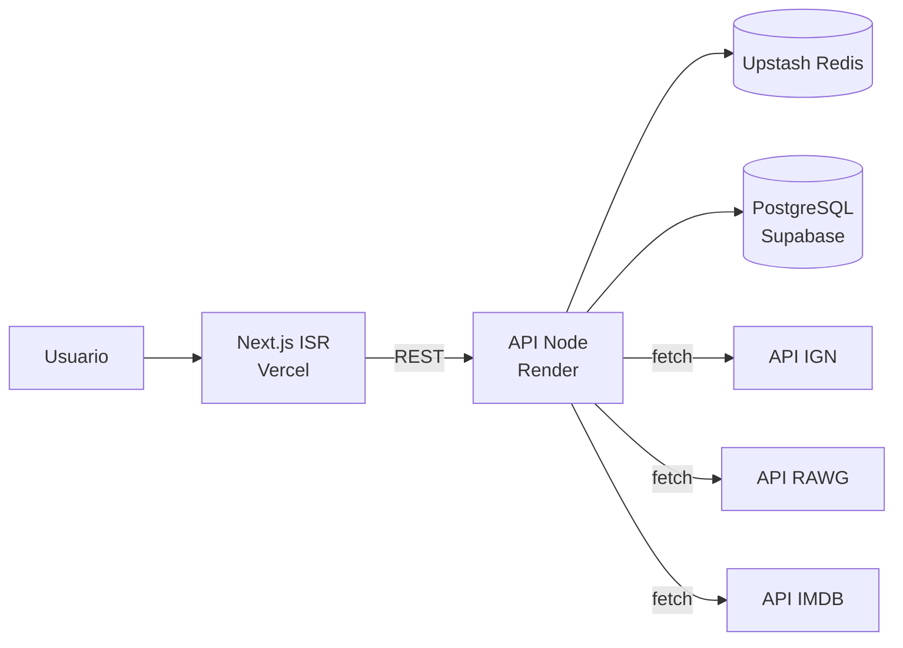

### Plataformas gratuitas sugeridas

| Componente | Plataforma |
|---|---|
| Frontend | Vercel (Next.js con ISR) |
| Backend | Render |
| DB | Supabase |
| Cache | Upstash Redis |
| Auth | Supabase Auth |

---

## Grupo 4 – 40dB
### Monitoreo colaborativo de ruido urbano (Municipalidad de Maipú)

**Tipo de aplicación:** Plataforma web con IoT + reportes ciudadanos + dashboard municipal.

**Características relevantes de la EP1:**
- App web para reporte ciudadano (mic + geolocalización).
- Prototipo IoT con ESP32 + sensor de sonido.
- Backend / API REST.
- Dashboard municipal con heatmap y filtros.
- Modelo B2G (Business to Government).

### Patrones recomendados

**Frontend (Next.js o Vite + React):**
- **Component-Based + Custom Hooks** (`useMicrofono`, `useGeolocalizacion`, `useReportes`).
- **Provider Pattern** para el rol (ciudadano vs municipal).
- **Libreria de mapas** (Leaflet o Mapbox) en componentes reutilizables; heatmap como organismo.

**Backend (Node + Express):**
- **Layered Architecture.**
- **Repository Pattern** con **PostgreSQL + PostGIS** (para queries geoespaciales).
- **DTO + Zod** para reportes (validar rango de dB, coordenadas válidas).
- **Event-Driven para IoT:** los ESP32 envían vía **MQTT** a un broker (HiveMQ Cloud gratis), un listener Node ingesta y persiste.
- **Middleware de auth** diferenciado: anónimo para reportes, JWT municipal para dashboard.

### Arquitectura recomendada

**Cliente-servidor con capa event-driven para IoT.**

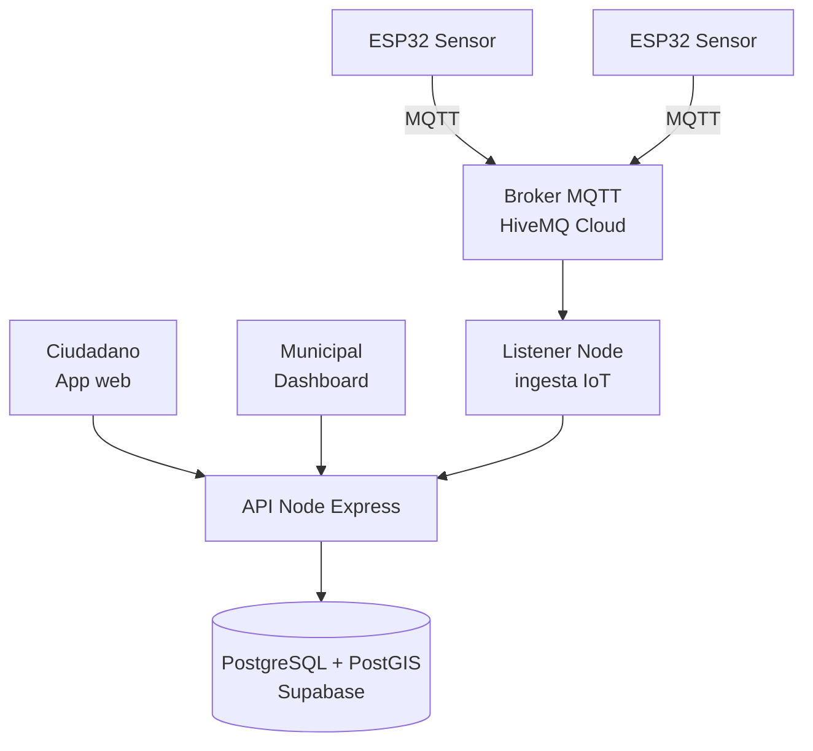

### Plataformas gratuitas sugeridas

| Componente | Plataforma |
|---|---|
| Frontend web | Vercel |
| Backend | Render o Railway |
| DB geoespacial | Supabase (PostgreSQL con extensión PostGIS) |
| Broker MQTT | HiveMQ Cloud free tier |
| Mapas | Leaflet + OpenStreetMap (gratis) |

---

## Grupo 5 – Pop Study
### Plataforma web para autogestión académica (estudiantes de ed. superior)

**Tipo de aplicación:** Web para gestión académica (apuntes, cálculo de notas, planificación).

**Observación importante:** la EP1 menciona "arquitectura de microservicios". **Recomendación docente: evaluar si es realmente necesario.** Para un equipo de 2 personas y un MVP, un **monolito modular bien diseñado es casi siempre mejor**, y se puede extraer a microservicios después si hace falta. Es mejor defender un monolito bien hecho que microservicios mal implementados.

### Patrones recomendados

**Frontend (React + Vite o Next.js):**
- **Component-Based + Custom Hooks** (`useCursos`, `useNotas`, `useCalendario`).
- **State global con Zustand** para el usuario, cursos actuales, configuración.
- **Component Composition** para dashboard, ramo, evaluación.

**Backend (Node + Express):**
- **Layered Architecture** con módulos claros (si quieren mantener la visión de microservicios, que los módulos estén muy bien separados para extraerlos después).
- **Repository Pattern.**
- **DTO + Zod.**
- **Service Layer:** la lógica de cálculo de notas, exigencias y proyecciones va aquí.

### Arquitectura recomendada

**Monolito modular** (justificable más fácilmente que microservicios en un MVP).

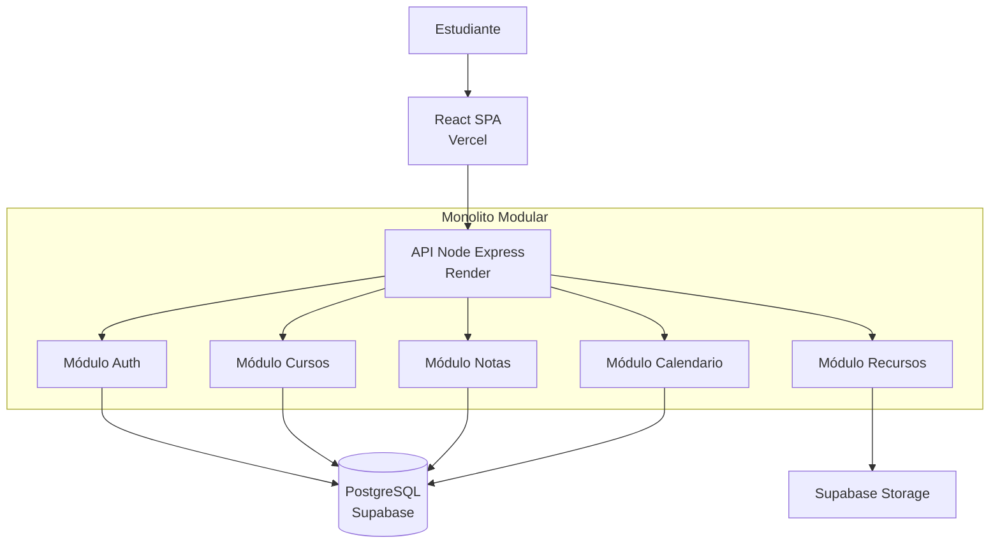

### Plataformas gratuitas sugeridas

| Componente | Plataforma |
|---|---|
| Frontend | Vercel |
| Backend | Render |
| DB | Supabase |
| Auth | Supabase Auth (incluye Google/GitHub login) |
| Storage apuntes | Supabase Storage |

---

## Grupo 6 – Plataforma web para creación automatizada de Landing Pages con IA

**Tipo de aplicación:** Web + IA para generar HTML/CSS/JS automáticamente.

**Características relevantes de la EP1:**
- Formulario de captura de info del negocio.
- Integración con una IA para generar código.
- Opciones escalonadas de personalización.
- Democratización para microempresarios.

### Patrones recomendados

**Frontend (React + Vite):**
- **Component-Based + Custom Hooks** (`useWizard`, `useGeneracion`, `usePreview`).
- **State global con Zustand** para el wizard multi-paso.
- **Provider Pattern** para sesión.
- **Component Composition** para el preview en iframe.

**Backend (Node + Express):**
- **Layered Architecture.**
- **Repository Pattern.**
- **DTO + Zod** (crítico: el prompt de entrada debe ser validado para evitar inyección de prompt).
- **Strategy Pattern (opcional pero potente):** una estrategia por cada proveedor de IA (OpenAI, Claude, Gemini). Así pueden cambiar sin tocar el resto del código.
- **Queue pattern:** la generación puede demorar 30+ s. Úsar BullMQ o Upstash QStash para procesamiento asíncrono; el frontend poll-ea o escucha por WebSocket/SSE.

### Arquitectura recomendada

**Cliente-servidor + cola asíncrona.**

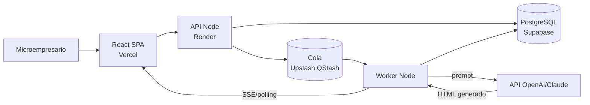

### Plataformas gratuitas sugeridas

| Componente | Plataforma |
|---|---|
| Frontend | Vercel |
| Backend | Render |
| DB | Supabase |
| Cola | Upstash QStash (gratis con límites) |
| IA | OpenAI API (créditos iniciales) o Claude API |
| Hosting de landings generadas | Vercel / Cloudflare Pages (deploy dinámico) |

---

## Grupo 7 – AGENTE X
### Plataforma web de Inteligencia de Negocios Conversacional (BI) con agentes de IA

**Tipo de aplicación:** Web chat + agentes IA con RAG + consumo de APIs dinámicas.

**Características relevantes de la EP1:**
- Chat conversacional con agentes IA.
- RAG (Retrieval Augmented Generation) con documentos privados.
- Segregación de contexto por agente.
- Integración con DeepSeek (Python intermediario).
- Despliegue en VPS propio con Nginx + Node + MySQL + PM2.
- JWT propio, SSE para estados asíncronos.
- Proyecto individual (1 persona full-stack).

### Patrones recomendados

**Frontend (React + Vite):**
- **Component-Based + Custom Hooks** (`useChat`, `useAgente`, `useDocumentos`).
- **State global con Zustand** para conversaciones y agentes activos.
- **Provider Pattern** para auth JWT.
- **SSE (Server-Sent Events)** para mostrar "Consultando BD…", "Leyendo documento…", "Respondiendo…" (ya planificado en la EP1).

**Backend (Node + Express + Python intermediario):**
- **Layered Architecture** rigurosa (proyecto individual → disciplina estricta).
- **Repository Pattern** (MySQL — historial, usuarios, agentes, permisos).
- **DTO + Zod** (chat messages, uploads).
- **Middleware Pipeline:** auth JWT, logger, rate limit (crítico con IA paga), manejo de uploads (multer).
- **Strategy Pattern:** cada agente es una estrategia con su propio set de documentos/APIs permitidos.
- **Factory Pattern:** fabrica la instancia correcta del agente según rol del usuario.
- **Observer / Event Emitter:** para emitir los estados asíncronos por SSE.

### Arquitectura recomendada

**Cliente-servidor con intermediario Python y SSE.**

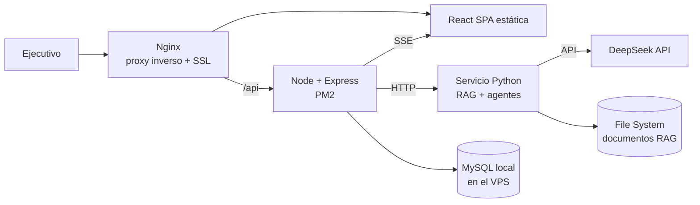

### Plataformas gratuitas sugeridas

| Componente | Plataforma |
|---|---|
| Hosting | VPS propio (ya definido en la EP1) |
| Alternativa VPS gratuito | Fly.io free tier (limitado) o Oracle Cloud Always Free |
| IA | DeepSeek (elegido) |
| Monitoreo | Sentry free tier |
| Backup MySQL | Script cron + rclone a Cloudflare R2 (10 GB gratis) |

**Advertencia:** un VPS propio es excelente para aprender, pero recuerden respaldar todo. Si algo falla en producción, no hay proveedor que lo recupere automáticamente.

---

## Tabla comparativa rápida de los 7 grupos

| Grupo | Proyecto | Tipo | Patrones críticos | Arquitectura |
|---|---|---|---|---|
| 1 | MapacheSecure | App móvil | Component, Custom Hooks, Zustand, Layered, DTO | Monolito modular |
| 2 | Deckora | Web TCG | Component, Custom Hooks, Layered, Repository, DTO | Monolito modular |
| 3 | NoLimits | Agregador multimedia | SSR/ISR, Component, Strategy, Repository | Cliente-servidor + cache |
| 4 | 40dB | Web + IoT | Component, Event-Driven (MQTT), Layered, PostGIS | Cliente-servidor + event-driven |
| 5 | Pop Study | Gestión académica | Component, Zustand, Layered, Repository | Monolito modular (no microservicios) |
| 6 | Landing Pages IA | Web + IA | Strategy, Queue, Layered, Component, Zustand | Cliente-servidor + cola asíncrona |
| 7 | AGENTE X | Chat BI con IA | Strategy, Factory, Observer, Layered, SSE, Custom Hooks | Cliente-servidor + intermediario Python |

---

# PARTE C – ACTIVIDAD DE LABORATORIO (90 minutos)

## 7. Propósito de la actividad

Al finalizar, cada equipo tendrá un documento `ARQUITECTURA.md` en el repositorio con:

1. Los patrones frontend y backend justificados.
2. El diagrama de arquitectura y un diagrama de secuencia.
3. El stack tecnológico con plataformas de despliegue concretas.
4. La estructura de carpetas creada en el repo.
5. Un prototipo mínimo que demuestre la factibilidad técnica.

## 8. Organización del tiempo

| Bloque | Tiempo | Actividad |
|---|---|---|
| 1 | 10 min | Leer tu tarjeta de grupo (sección 6 de este documento) |
| 2 | 15 min | Analizar el proyecto: contexto y requisitos |
| 3 | 20 min | Redactar patrones elegidos, arquitectura y 2 diagramas |
| 4 | 20 min | Stack, plataformas y creación de la estructura de carpetas |
| 5 | 15 min | Prototipo mínimo (local o desplegado) |
| 6 | 10 min | Documentación final + commit y push |

## 9. Bloque 1 – Leer tu tarjeta de grupo (10 min)

Cada equipo debe leer con atención su tarjeta en la Parte B (Grupo 1, 2, 3, 4, 5, 6 o 7). Esa tarjeta es el punto de partida: pueden aceptar las recomendaciones o justificar por qué se apartan.

**Checkpoint 1:** el equipo puede mencionar los patrones recomendados para su proyecto.

## 10. Bloque 2 – Análisis (15 min)

Crea un archivo `ARQUITECTURA.md` en el repositorio del proyecto y completa:

```markdown
# Arquitectura del Proyecto – [Nombre del proyecto]

## 1. Contexto
- **Problema que resuelve:**
- **Usuarios objetivo:**
- **Volumen estimado de usuarios primer año:**
- **Tipo de aplicación:** (web / móvil / web + IoT / API)

## 2. Requisitos funcionales clave
- (3 a 5 bullets)

## 3. Requisitos no funcionales clave
- Seguridad:
- Rendimiento:
- Escalabilidad:
- Disponibilidad:
- Presupuesto (idealmente $0 en MVP):
```

**Checkpoint 2:** las secciones 1-3 están completas.

## 11. Bloque 3 – Patrones, arquitectura y diagramas (20 min)

Añade:

```markdown
## 4. Patrones de frontend
- **Patrón principal:** (Component-Based + Custom Hooks)
- **State management:** (Context / Zustand / Redux)
- **Renderizado:** (CSR / SSR / SSG / ISR)
- **Por qué:**

## 5. Patrones de backend
- **Arquitectura:** (Layered / MVC)
- **Repository Pattern:** sí / no – por qué
- **Validación:** (Zod / Joi)
- **Otros patrones:** (Strategy, Factory, Observer, Queue, etc.)
- **Por qué:**

## 6. Arquitectura general
- **Estilo:** (monolito / monolito modular / cliente-servidor / event-driven)
- **Justificación:**

## 7. Diagramas

### 7.1. Arquitectura general
(Diagrama Mermaid — puedes partir del diagrama de tu tarjeta de grupo y adaptarlo)

### 7.2. Diagrama de secuencia del caso de uso principal
(Diagrama Mermaid: flujo de una acción clave, por ejemplo "crear donante" o "recibir reporte IoT")
```

**Checkpoint 3:** patrones elegidos, justificados, y los dos diagramas incluidos.

## 12. Bloque 4 – Stack, plataformas y carpetas (20 min)

Añade:

```markdown
## 8. Stack tecnológico
- **Lenguaje frontend:**
- **Framework frontend:**
- **Librerías clave:** (state, routing, UI)
- **Lenguaje backend:**
- **Framework backend:**
- **Librerías clave:** (ORM, validación, auth)
- **Base de datos:**

## 9. Plataformas de despliegue
| Componente | Plataforma | Límites del free tier |
|---|---|---|
| Frontend | | |
| Backend | | |
| Base de datos | | |
| Auth | | |
| Storage/otros | | |

## 10. Estructura de carpetas creada
(Pega aquí la estructura elegida — usa la sección 5 como referencia)

## 11. Riesgos identificados
- (3 bullets concretos: ej. "Render duerme tras 15 min, mitigación: ping cada 10 min con cron-job.org")
```

**Obligatorio:** crear las carpetas reales según la estructura (aunque estén vacías):

```powershell
# Ejemplo para backend Layered en Windows
mkdir api, api\src, api\src\config, api\src\middleware, api\src\routes
mkdir api\src\controllers, api\src\services, api\src\repositories, api\src\dtos
```

**Checkpoint 4:** stack, plataformas, carpetas reales creadas en el repo.

## 13. Bloque 5 – Prototipo mínimo (15 min)

Elige **una** opción y demuestra que funciona:

- **A)** "Hola mundo" del frontend desplegado en Vercel / Netlify / Cloudflare Pages.
- **B)** API mínima con `/health` y `/items` corriendo en local, probada con `Invoke-RestMethod` o Thunder Client.
- **C)** Conexión a Supabase o Firebase desde un script mínimo.
- **D)** End-to-end: frontend mínimo en Vercel + API mínima en Render haciendo fetch.

**Checkpoint 5:** evidencia visible (URL pública o captura de pantalla).

## 14. Bloque 6 – Cierre, commit y push (10 min)

Añade al `ARQUITECTURA.md`:

```markdown
## 12. Prototipo realizado
- **Opción:** (A, B, C o D)
- **Evidencia:** (URL o ruta a captura)

## 13. Próximos pasos (3 bullets concretos)

## 14. Reflexión del equipo
- ¿Qué patrón entendimos mejor durante la actividad?
- ¿Qué riesgo nos preocupa más y cómo lo vamos a mitigar?
- ¿Qué necesitamos investigar antes de avanzar?
```

Y hacer:

```bash
git add .
git commit -m "docs(arquitectura): documento inicial y estructura de carpetas"
git push
```

## 15. Entregables

1. `ARQUITECTURA.md` con las secciones 1-14.
2. Estructura de carpetas creada en el repo.
3. **2 diagramas Mermaid mínimo.**
4. Evidencia del prototipo (URL o captura).
5. Commit y push hecho por al menos un integrante.

## 16. Criterios de evaluación

| Criterio | Puntaje |
|---|---|
| Patrones frontend y backend identificados y justificados | 20 % |
| Arquitectura coherente con el proyecto | 15 % |
| Dos diagramas Mermaid claros | 15 % |
| Plataformas cloud con free tier y límites documentados | 15 % |
| Estructura de carpetas creada | 10 % |
| Prototipo mínimo funcionando | 15 % |
| Identificación de al menos 3 riesgos reales | 10 % |

## 17. Errores comunes a evitar

- **Elegir microservicios "porque suena profesional":** un monolito modular bien hecho vale más.
- **Confundir framework con patrón:** React no es un patrón, es una librería que usa "component-based".
- **No probar el free tier desde el día uno:** Render cambia límites, Firebase tiene cuotas diarias.
- **No documentar riesgos:** sin riesgos escritos, la defensa queda débil.
- **Mezclar responsabilidades:** si el controller hace SQL o el service toca `req`/`res`, perdiste la ventaja del patrón.
- **Abusar de state management global:** la mayoría del estado debe ser local.

## 18. Glosario rápido

- **BaaS:** Backend as a Service (Supabase, Firebase).
- **CDN:** red de distribución de contenido.
- **CI/CD:** Integración y Despliegue Continuos.
- **Cold start:** retraso al despertar un servicio serverless.
- **DTO:** Data Transfer Object, objeto que viaja entre capas.
- **Free tier:** plan gratuito con límites.
- **JAMstack:** JavaScript + APIs + Markup precompilado.
- **JWT:** JSON Web Token, estándar para autenticación.
- **MQTT:** protocolo ligero para IoT.
- **PostGIS:** extensión geoespacial de PostgreSQL.
- **RAG:** Retrieval-Augmented Generation, técnica de IA.
- **SSE:** Server-Sent Events, streaming unidireccional servidor → cliente.
- **SPA:** Single Page Application.

## 19. Referencias

- Fowler, M. *Patterns of Enterprise Application Architecture* (referencia para Layered y Repository).
- Gamma, E. et al. *Design Patterns* (GoF).
- Docs oficiales: React, Next.js, Express, Zod, Zustand, Redux Toolkit, Supabase, Vercel, Render.
- Mermaid Live Editor: https://mermaid.live

## 20. Cierre

Esta guía busca que eligas patrones **con criterio, no por moda**. Lo que la rúbrica del portafolio premia no es la tecnología más nueva, sino la capacidad de explicar **por qué** tu elección resuelve el problema del cliente y **cómo** tu código refleja esa decisión. Tu tarjeta de grupo es el punto de partida: constrúyela, adáptala, justifícala y defiéndela al final del semestre.
