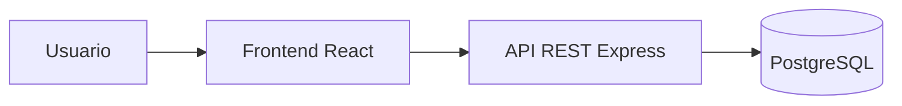

# Guía y Laboratorio: Patrones de Diseño, Arquitectura y Despliegue para tu Proyecto

## Datos generales

**Asignatura:** TPY1101 – Taller Aplicado de Programación
**Duración estimada del laboratorio:** 1 hora 30 minutos
**Modalidad:** Individual o en equipos del proyecto de portafolio
**Tipo de material:** Guía de referencia + actividad práctica
**Prerequisitos:** Haber definido la problemática, el alcance y el tipo de aplicación (web, móvil, API, dashboard) del proyecto de portafolio.

---

## 0. Cómo usar este documento

Este material tiene dos partes claramente separadas:

1. **Parte A – Guía de referencia:** contenido teórico aplicado. Explica los patrones de diseño de frontend, de backend, las arquitecturas más comunes, los stacks tecnológicos y las plataformas cloud gratuitas más usadas hoy. Cada sección incluye ejemplos concretos.
2. **Parte B – Actividad de 90 minutos:** ejercicio práctico para que cada equipo seleccione, justifique y documente el patrón, la arquitectura y la plataforma de despliegue que usará en su proyecto de portafolio.

La idea es que primero leas la Parte A para entender las opciones y luego apliques lo aprendido en la Parte B sobre tu propio proyecto.

---

# PARTE A – GUÍA DE REFERENCIA

---

## 1. ¿Por qué importan los patrones y la arquitectura?

Cuando un proyecto crece, el mayor costo no es escribir el código, sino **mantenerlo, extenderlo y corregirlo**. Un patrón de diseño es una solución reutilizable a un problema conocido, y una arquitectura es la forma en que se organizan los componentes de una aplicación.

Elegir bien al inicio reduce el costo de:

- agregar nuevas funcionalidades sin romper las existentes;
- probar el sistema por partes;
- cambiar la base de datos o el framework sin reescribir todo;
- desplegar la aplicación en la nube;
- que otro desarrollador entienda el proyecto rápidamente.

En este curso, el proyecto de portafolio debe **justificar** por qué se eligió un patrón y una arquitectura. Esta guía te entrega los elementos para hacerlo.

---

## 2. Patrones de diseño de frontend

### 2.1. MVC / MVP / MVVM

Son tres variantes de una misma idea: separar la **vista** (lo que el usuario ve), el **modelo** (los datos) y un intermediario que coordina ambos.

| Patrón | Intermediario | Dónde se usa hoy |
|---|---|---|
| **MVC** (Model-View-Controller) | Controller | Django, Laravel, ASP.NET MVC, Ruby on Rails |
| **MVP** (Model-View-Presenter) | Presenter | Android clásico, aplicaciones de escritorio |
| **MVVM** (Model-View-ViewModel) | ViewModel | Angular, Vue, WPF, SwiftUI, Jetpack Compose |

**Ejemplo práctico (MVVM en Vue):**

```html
<template>
  <input v-model="nombre" />
  <p>Hola, {{ nombre }}</p>
</template>

<script setup>
import { ref } from 'vue';
const nombre = ref(''); // ViewModel: enlaza el estado con la vista automáticamente
</script>
```

**Cuándo elegirlo:** aplicaciones con mucha interacción de formularios, donde el binding bidireccional acelera el desarrollo.

---

### 2.2. Component-Based Architecture

La UI se construye como un árbol de **componentes reutilizables**. Cada componente tiene su propio estado, su propia vista y su propio comportamiento.

Es el patrón dominante en frontend moderno: **React, Vue, Svelte, Angular, SolidJS**.

**Ejemplo en React:**

```jsx
function Boton({ texto, onClick }) {
  return <button onClick={onClick}>{texto}</button>;
}

function App() {
  return (
    <div>
      <Boton texto="Guardar" onClick={() => alert('ok')} />
      <Boton texto="Cancelar" onClick={() => alert('cancelado')} />
    </div>
  );
}
```

**Cuándo elegirlo:** casi cualquier aplicación web moderna. Es prácticamente el estándar de la industria.

---

### 2.3. Container / Presentational (Smart / Dumb)

Consiste en dividir los componentes en dos tipos:

- **Container (Smart):** conoce la lógica, pide datos, mantiene estado.
- **Presentational (Dumb):** solo recibe props y renderiza.

**Ejemplo:**

```jsx
// Dumb: solo renderiza
function ListaDonantesView({ donantes }) {
  return <ul>{donantes.map(d => <li key={d.rut}>{d.nombre}</li>)}</ul>;
}

// Smart: consulta la API y pasa los datos al Dumb
function ListaDonantesContainer() {
  const [donantes, setDonantes] = useState([]);
  useEffect(() => {
    fetch('/api/donantes').then(r => r.json()).then(setDonantes);
  }, []);
  return <ListaDonantesView donantes={donantes} />;
}
```

**Cuándo elegirlo:** cuando quieres reutilizar los mismos componentes visuales en distintas pantallas y facilitar las pruebas unitarias.

---

### 2.4. Atomic Design

Metodología propuesta por Brad Frost que organiza los componentes como átomos de un sistema de diseño:

1. **Átomos:** botones, inputs, labels.
2. **Moléculas:** un campo de formulario (input + label + error).
3. **Organismos:** un formulario completo o una tarjeta.
4. **Plantillas:** estructura de página sin datos reales.
5. **Páginas:** plantillas con datos reales.

**Cuándo elegirlo:** proyectos con un sistema de diseño (Design System) o equipos que comparten una librería visual. Muy útil cuando existe Figma detrás.

---

### 2.5. Flux / Redux / Store centralizado

Patrón para manejar el **estado global** de la aplicación en un único lugar con flujo unidireccional:

1. La vista dispara una **acción**.
2. La acción entra al **reducer**.
3. El reducer actualiza el **store**.
4. El store notifica a las vistas.

Implementaciones actuales: **Redux Toolkit, Zustand, Pinia (Vue), NgRx (Angular), Jotai, Recoil**.

**Cuándo elegirlo:** aplicaciones medianas o grandes donde muchos componentes necesitan leer y modificar la misma información (sesión del usuario, carrito de compras, filtros globales).

---

### 2.6. CSR, SSR, SSG, ISR

Son estrategias de **renderizado**. No son patrones de código sino de ejecución:

| Estrategia | Dónde se renderiza | Ejemplo de uso |
|---|---|---|
| **CSR** (Client-Side Rendering) | En el navegador | SPA clásica con React/Vue |
| **SSR** (Server-Side Rendering) | En el servidor en cada petición | Noticias, redes sociales |
| **SSG** (Static Site Generation) | En el build, antes de desplegar | Documentación, blogs |
| **ISR** (Incremental Static Regeneration) | Mezcla SSG + revalidación | E-commerce, catálogos |

Frameworks que las soportan: **Next.js, Nuxt, Astro, SvelteKit, Remix**.

**Cuándo elegir SSR/SSG:** cuando el SEO importa (sitios públicos, marketing, e-commerce). **Cuándo elegir CSR:** aplicaciones internas tipo dashboard donde el SEO no importa.

---

### 2.7. BFF (Backend For Frontend)

Un pequeño backend intermedio, pensado exclusivamente para servir a un frontend específico. Agrupa llamadas, normaliza respuestas y oculta complejidad.

**Cuándo elegirlo:** cuando el frontend necesita combinar varias APIs (un endpoint de perfil, otro de pedidos, otro de notificaciones) y no quieres que el navegador haga 5 llamadas.

---

### 2.8. Microfrontends

Dividir la aplicación frontend en **varias aplicaciones independientes** que se componen en una sola. Suele lograrse con Module Federation (Webpack), single-spa o Qiankun.

**Cuándo elegirlo:** solo si el proyecto es muy grande, con múltiples equipos autónomos. Para un proyecto de título es **sobreingeniería**.

---

## 3. Patrones de diseño de backend

### 3.1. Arquitectura en Capas (Layered / N-Tier)

La más común y recomendable para empezar. Divide el backend en capas con responsabilidades claras:

1. **Routes / Controllers:** reciben la petición HTTP.
2. **Services:** reglas de negocio.
3. **Repositories / DAOs:** acceso a base de datos.
4. **Models / Entities:** representación de los datos.

```
Request → Controller → Service → Repository → DB
                                    ↓
Response ← Controller ← Service ← Repository
```

**Ejemplo en Node.js + Express (simplificado):**

```js
// controllers/donantes.controller.js
async function crearDonante(req, res) {
  const nuevo = await donantesService.crear(req.body);
  res.status(201).json(nuevo);
}

// services/donantes.service.js
async function crear(data) {
  if (data.monto < 0) throw new Error('Monto inválido');
  return donantesRepository.insert(data);
}

// repositories/donantes.repository.js
async function insert(data) {
  return db('donantes').insert(data).returning('*');
}
```

**Cuándo elegirlo:** el patrón por defecto para cualquier proyecto de portafolio. Es simple, probado y didáctico.

---

### 3.2. MVC en backend

Igual que en frontend, separa responsabilidades:

- **Model:** entidades y acceso a datos.
- **View:** plantilla HTML (en apps con render del lado del servidor) o respuesta JSON.
- **Controller:** orquesta el flujo.

Usado en Django, Laravel, Ruby on Rails, ASP.NET MVC y Spring MVC.

---

### 3.3. Repository Pattern

Abstrae el acceso a la base de datos detrás de una interfaz. El servicio no sabe si los datos vienen de PostgreSQL, de Mongo o de un archivo JSON.

**Ventaja:** puedes cambiar la base de datos sin tocar la lógica de negocio y es fácil hacer pruebas (el repositorio se reemplaza por un fake).

**Ejemplo (pseudocódigo):**

```ts
interface DonanteRepository {
  findByRut(rut: number): Promise<Donante | null>;
  save(d: Donante): Promise<void>;
}

class PostgresDonanteRepository implements DonanteRepository { /* ... */ }
class InMemoryDonanteRepository implements DonanteRepository { /* para tests */ }
```

---

### 3.4. Service Layer

Coloca todas las reglas de negocio en servicios independientes del framework web. Controllers y jobs de background usan el mismo servicio.

**Regla práctica:** si el código tiene `req` o `res`, no es un servicio, es un controller.

---

### 3.5. DTO (Data Transfer Object)

Objetos pensados para **viajar entre capas** o entre cliente y servidor. No son la entidad de la base de datos.

**Ventaja:** permite exponer solo los campos necesarios y validar la entrada con librerías como `zod`, `joi`, `class-validator`, `pydantic` o `marshmallow`.

```ts
const crearDonanteDTO = z.object({
  rut: z.number().int().positive(),
  nombre: z.string().min(2),
  monto: z.number().nonnegative(),
});
```

---

### 3.6. Middleware Pipeline

Patrón típico en Express, Koa, Fastify, ASP.NET Core y Django. La petición pasa por una cadena de funciones que pueden interceptar, transformar o cortar la ejecución.

```js
app.use(logger);          // registra la petición
app.use(authMiddleware);  // verifica token
app.use('/api', router);  // finalmente atiende
```

**Casos de uso:** autenticación, logging, CORS, validación, manejo de errores.

---

### 3.7. Patrones GoF útiles en backend

- **Singleton:** una sola instancia global. Útil para conexiones a base de datos. Cuidado: no abusar, complica las pruebas.
- **Factory:** crea objetos sin exponer la lógica de construcción. Útil para decidir en tiempo de ejecución qué proveedor usar (pagos, notificaciones).
- **Strategy:** intercambia algoritmos. Por ejemplo, `PagoStrategy` con implementaciones `WebpayStrategy`, `MercadoPagoStrategy`.
- **Observer / Event Emitter:** notificar a varios interesados cuando pasa algo. Base de los sistemas orientados a eventos.
- **Decorator:** agrega comportamiento a una función o clase sin modificarla. Se usa muchísimo en NestJS y Spring.

---

### 3.8. Hexagonal / Clean / Ports & Adapters

Lleva el Repository Pattern al extremo: **el núcleo de negocio no conoce el framework ni la base de datos**. Todo lo externo (HTTP, DB, colas, correo) son adaptadores que implementan puertos.

**Cuándo elegirla:** proyectos con reglas de negocio complejas y larga vida. Para un proyecto de título **bien enfocado** puede ser valioso, pero requiere disciplina.

---

### 3.9. CQRS y Event Sourcing

- **CQRS (Command Query Responsibility Segregation):** separa las operaciones de escritura (commands) de las de lectura (queries), incluso con modelos distintos.
- **Event Sourcing:** en lugar de guardar el estado actual, se guarda la secuencia de eventos que lo produjeron.

**Cuándo elegirlos:** dominio muy complejo, auditoría obligatoria, colaboración en tiempo real. Generalmente **sobreingeniería** para un proyecto de portafolio.

---

## 4. Patrones de arquitectura de sistema

### 4.1. Monolito clásico

Un solo proyecto desplegable con frontend, backend y (a veces) base de datos. Todo corre junto.

**Ventajas:** simple, rápido de desarrollar, fácil de debuggear.
**Desventajas:** si crece mucho, escalar partes independientes es complicado.

**Cuándo elegirlo:** casi siempre para un proyecto de portafolio. La industria está volviendo a valorar el monolito cuando es bien diseñado.

---

### 4.2. Monolito Modular

Un solo despliegue pero internamente dividido en **módulos** que podrían convertirse en microservicios en el futuro. Es el equilibrio ideal entre simplicidad y buen diseño.

```
/src
  /modules
    /donantes
    /usuarios
    /reportes
  /shared
  app.js
```

---

### 4.3. Microservicios

Varios servicios independientes, cada uno con su base de datos, su despliegue y su ciclo de vida, que se comunican por HTTP o mensajería.

**Ventajas:** escalabilidad independiente, equipos autónomos, tecnologías diversas.
**Desventajas:** complejidad operativa, observabilidad, red, consistencia eventual.

**Cuándo elegirlos:** empresas con múltiples equipos y tráfico alto. **Rara vez** apropiado para un proyecto de portafolio, salvo que el problema lo justifique.

---

### 4.4. Serverless (FaaS)

El código se ejecuta bajo demanda en funciones cortas. Tú no administras el servidor: la plataforma lo hace.

**Ejemplos:** AWS Lambda, Vercel Functions, Cloudflare Workers, Netlify Functions, Supabase Edge Functions.

**Ventajas:** costo cero cuando no hay tráfico, escala automática.
**Desventajas:** cold starts, límite de ejecución, vendor lock-in.

**Cuándo elegirlo:** endpoints pequeños, webhooks, tareas puntuales, APIs de bajo tráfico.

---

### 4.5. Arquitectura orientada a eventos (Event-Driven)

Los servicios se comunican publicando y consumiendo eventos a través de un bus o cola (RabbitMQ, Kafka, Redis Streams, SNS/SQS).

**Cuándo elegirla:** integración entre múltiples sistemas, procesos asincrónicos (envío de correos, generación de reportes pesados).

---

### 4.6. JAMstack

Frontend estático (HTML + CSS + JS compilado) que consume APIs vía JavaScript. Separa claramente build y runtime.

**Cuándo elegirla:** landings, blogs, documentación, e-commerce ligeros. Excelente performance y SEO, despliegue muy barato (o gratis).

---

### 4.7. Cliente-servidor clásico

Un frontend (web o móvil) que consume un backend vía REST o GraphQL. Es lo que el 90 % de los proyectos de portafolio termina construyendo.

```
[App móvil / Web] ⇄ [API REST] ⇄ [Base de datos]
```

---

### 4.8. Real-time / WebSockets

Cuando la comunicación necesita ser bidireccional e instantánea: chats, notificaciones en vivo, juegos, colaboración en tiempo real.

**Herramientas:** Socket.IO, WebSockets nativos, Pusher, Ably, Supabase Realtime, Firebase Realtime Database.

---

## 5. Stacks tecnológicos populares

| Stack | Frontend | Backend | DB | Ideal para |
|---|---|---|---|---|
| **MERN** | React | Node + Express | MongoDB | Prototipos, apps CRUD, tiempo real |
| **MEVN** | Vue | Node + Express | MongoDB | Igual que MERN, con Vue |
| **MEAN** | Angular | Node + Express | MongoDB | Proyectos grandes con tipado fuerte |
| **Next.js Full-Stack** | Next.js (React) | API Routes Next | PostgreSQL (Neon, Supabase) | Webs modernas con SEO |
| **T3 Stack** | Next.js + Tailwind | tRPC, Prisma | PostgreSQL | Apps tipadas end-to-end |
| **Django + React** | React | Django REST Framework | PostgreSQL | Proyectos con mucha lógica de negocio |
| **Flask/FastAPI + Vue** | Vue | Python | PostgreSQL / SQLite | APIs rápidas, ciencia de datos |
| **Spring Boot + Angular** | Angular | Java Spring Boot | MySQL / PostgreSQL | Proyectos empresariales |
| **.NET + React** | React | ASP.NET Core | SQL Server / PostgreSQL | Empresas con ecosistema Microsoft |
| **Laravel + Livewire** | Blade / Livewire | PHP | MySQL | CRUD administrativos rápidos |
| **React Native / Flutter + API** | Móvil nativa | Cualquier backend | Cualquiera | Aplicaciones móviles |

---

## 6. Plataformas cloud gratuitas (al 2025-2026)

> Los límites cambian. Siempre verifica los planes vigentes antes de desplegar.

### 6.1. Frontend / sitios estáticos / JAMstack

| Plataforma | Fuerte en | Capa gratuita (aprox.) | Observaciones |
|---|---|---|---|
| **Vercel** | Next.js, React, Vite | 100 GB/mes de ancho, builds ilimitados en proyectos hobby | Ideal para Next.js; incluye Serverless Functions y Edge Functions |
| **Netlify** | Sitios estáticos, JAMstack | 100 GB/mes, 300 min build | Incluye formularios y Netlify Functions |
| **Cloudflare Pages** | Sitios estáticos + Workers | 500 builds/mes, ancho ilimitado | Muy rápido, excelente CDN global |
| **GitHub Pages** | Sitios estáticos puros | Gratis con límites suaves | Perfecto para documentación y portfolios |
| **Render (Static Sites)** | Sitios estáticos | Gratis con SSL | Muy simple de configurar |
| **Firebase Hosting** | Sitios + integración Firebase | 10 GB almacenamiento, 360 MB/día | Bueno si ya usas Firebase |

---

### 6.2. Backend (APIs, servidores Node, Python, etc.)

| Plataforma | Tipo | Capa gratuita (aprox.) | Notas |
|---|---|---|---|
| **Render** | Web services | Servicio gratis que se duerme tras inactividad | Muy usado en proyectos de estudiantes |
| **Railway** | Contenedores | Crédito mensual gratuito limitado | Excelente DX, deploy desde GitHub |
| **Fly.io** | VMs / contenedores | Capa gratuita reducida | Potente, despliegue en múltiples regiones |
| **Vercel Functions** | Serverless | Incluido en plan hobby | Límite de ejecución por función |
| **Cloudflare Workers** | Edge serverless | 100 000 req/día gratis | Muy baja latencia global |
| **Netlify Functions** | Serverless | 125 000 invocaciones/mes | Pensado para sitios Netlify |
| **Deno Deploy** | Edge (TypeScript) | Capa gratuita generosa | Ideal si usas Deno |
| **Glitch** | Node simple | Proyecto educativo | Ideal para demos, no producción |
| **Replit** | Multi-lenguaje | Capa gratuita limitada | Bueno para prototipos y clases |

---

### 6.3. Bases de datos gestionadas

| Plataforma | Tipo | Capa gratuita (aprox.) | Notas |
|---|---|---|---|
| **Supabase** | PostgreSQL + Auth + Storage + Realtime | 500 MB DB, 1 GB storage | BaaS muy completo |
| **Neon** | PostgreSQL serverless | ~0.5 GB | Branching de DB tipo Git |
| **Aiven for PostgreSQL** | PostgreSQL | Plan gratuito de evaluación | Muy estable |
| **Turso** | SQLite distribuido (libSQL) | Capa gratuita generosa | Perfecto para apps edge |
| **MongoDB Atlas** | MongoDB | 512 MB cluster gratis | Clásico para stacks MERN |
| **Firebase Firestore** | NoSQL | 1 GB storage, 50 k lect/día | Excelente tiempo real |
| **PlanetScale** | MySQL | Plan gratuito limitado | Escalable, serverless |
| **Railway Postgres/MySQL** | SQL | Incluido en crédito Railway | Simple integración |
| **Render Postgres** | PostgreSQL | Capa gratuita con expiración | Fácil de conectar |
| **CockroachDB Serverless** | SQL distribuida | 5 GB storage | Escalable globalmente |

---

### 6.4. Autenticación y BaaS (Backend as a Service)

| Plataforma | Capacidad | Capa gratuita |
|---|---|---|
| **Supabase** | Auth + DB + Storage + Edge Functions | Gratis generoso |
| **Firebase** | Auth + Firestore + Functions + Hosting | Gratis generoso |
| **Clerk** | Autenticación lista para usar | Hasta N usuarios gratis |
| **Auth0** | Autenticación empresarial | 7 500 MAU gratis |
| **Appwrite** | Open-source BaaS | Self-hosted + plan cloud gratuito |
| **Pocketbase** | Backend en un solo binario | Gratis, se hostea donde quieras |

---

### 6.5. Almacenamiento de archivos e imágenes

| Plataforma | Uso | Capa gratuita |
|---|---|---|
| **Cloudinary** | Imágenes y video con transformaciones | 25 GB/mes |
| **Supabase Storage** | Archivos genéricos | 1 GB |
| **Firebase Storage** | Archivos genéricos | 5 GB |
| **Cloudflare R2** | Compatible S3 | 10 GB/mes |
| **Backblaze B2** | Almacenamiento barato | 10 GB |

---

### 6.6. Otras herramientas relevantes para el portafolio

- **GitHub Actions:** CI/CD gratis (2 000 min/mes en repos privados).
- **Sentry:** monitoreo de errores con plan gratuito.
- **Uptime Robot / BetterStack:** monitoreo de uptime gratuito.
- **LogTail / Axiom:** logging gratuito hasta cierto volumen.
- **n8n cloud / Make / Zapier:** automatizaciones con tier gratuito.

---

## 7. Matriz de decisión por tipo de proyecto

> Usa esta tabla como punto de partida. Siempre hay que ajustarla al caso real del equipo.

| Tipo de proyecto | Patrón frontend | Patrón backend | Arquitectura | Stack sugerido | Despliegue gratuito |
|---|---|---|---|---|---|
| **CRUD administrativo interno** (inventario, donantes, usuarios) | Component-based + Container/Presentational | MVC / Layered | Monolito | React + Express + PostgreSQL | Vercel (front) + Render (API) + Supabase (DB) |
| **Landing / sitio institucional** | SSG | — | JAMstack | Astro o Next.js | Vercel / Netlify / Cloudflare Pages |
| **E-commerce pequeño** | SSR/ISR | Layered + Repository + Service | Monolito modular | Next.js + Prisma + PostgreSQL | Vercel + Neon/Supabase |
| **Dashboard de indicadores** | Component-based + Store (Redux/Zustand) | Layered + Repository | Cliente-servidor clásico | React + FastAPI + PostgreSQL | Render + Neon + Vercel |
| **App móvil con sincronización** | Component-based (RN/Flutter) | BaaS o Layered | Cliente-servidor o BaaS | React Native + Firebase o Supabase | Firebase / Supabase |
| **Chat o app en tiempo real** | Component-based + WebSockets | Event-driven | Monolito + WebSockets | Node + Socket.IO + Redis o Supabase Realtime | Railway + Upstash Redis |
| **Plataforma educativa** | SSR + Component-based | Layered + Service | Monolito modular | Next.js + PostgreSQL + Clerk/Supabase Auth | Vercel + Neon |
| **API pública para terceros** | — | Layered + DTO + Middleware | Monolito o Serverless | FastAPI o NestJS | Render / Fly.io / Railway |
| **Marketplace de servicios** | SSR/ISR + Store | Layered + Repository + Event-driven para notificaciones | Monolito modular | Next.js + Prisma + PostgreSQL + Redis | Vercel + Supabase + Upstash |
| **Proyecto con integración IoT** | Component-based | Event-driven + MQTT | Microservicios simples | Node + MQTT broker + InfluxDB | Railway + HiveMQ Cloud |
| **Blog / documentación técnica** | SSG | — | JAMstack | Astro o Docusaurus | GitHub Pages / Netlify / Cloudflare |
| **Sistema de reservas / citas** | Component-based + SSR para SEO | Layered + Service | Monolito modular | Next.js + PostgreSQL + Auth | Vercel + Supabase |

---

## 8. Cómo justificar la elección en el proyecto de portafolio

En la documentación del proyecto debes responder:

1. **¿Qué problema resuelve el sistema?** (una frase clara).
2. **¿Qué tipo de usuarios lo usarán y cuántos se esperan en el primer año?** (afecta la arquitectura).
3. **¿Qué patrón frontend y por qué?** (componentes, store, SSR, etc.).
4. **¿Qué patrón backend y por qué?** (capas, repositorio, service layer).
5. **¿Qué arquitectura general?** (monolito, modular, serverless).
6. **¿Qué stack tecnológico?** (lenguaje, framework, DB).
7. **¿Dónde se desplegará?** (plataforma cloud, costos estimados, alternativas gratuitas).
8. **¿Qué riesgos tiene la elección?** (limitaciones del free tier, vendor lock-in, aprendizaje).
9. **¿Cómo se probará y mantendrá?** (tests, logs, monitoreo).

Esta justificación es parte de la rúbrica de evaluación.

---

# PARTE B – ACTIVIDAD DE LABORATORIO (90 minutos)

---

## 9. Propósito de la actividad

Al finalizar, cada equipo deberá haber **analizado, elegido, justificado y prototipado mínimamente** la arquitectura y el stack de su proyecto de portafolio, incluyendo la plataforma cloud gratuita donde se desplegará.

El entregable es un archivo `ARQUITECTURA.md` dentro del repositorio del proyecto del equipo, acompañado de una pequeña prueba funcional (un "hola mundo" desplegado o una API mínima corriendo en local).

---

## 10. Organización del tiempo

| Bloque | Tiempo | Actividad |
|---|---|---|
| 1 | 10 min | Lectura dirigida de la guía y chequeo de proyecto |
| 2 | 15 min | Análisis del tipo de proyecto y necesidades |
| 3 | 20 min | Selección y justificación de patrones y arquitectura |
| 4 | 20 min | Elección de stack y plataforma de despliegue |
| 5 | 15 min | Prototipo mínimo (local o desplegado) |
| 6 | 10 min | Documentación final y conclusión |

**Total: 90 minutos.**

---

## 11. Bloque 1 – Lectura dirigida (10 min)

Cada equipo debe leer las secciones 2, 3, 4 y 7 de esta guía con el caso de su proyecto en mente.

### Checkpoint 1

El equipo debe poder responder, en voz alta:

- ¿qué tipo de aplicación es (web, móvil, API, dashboard)?;
- ¿cuál es el usuario principal?;
- ¿qué datos se van a manejar?

---

## 12. Bloque 2 – Análisis del proyecto (15 min)

Responde en un archivo nuevo llamado `ARQUITECTURA.md` dentro del repositorio del equipo:

### Plantilla inicial

```markdown
# Arquitectura del Proyecto

## 1. Contexto
- **Nombre del proyecto:**
- **Problema que resuelve:**
- **Usuarios objetivo:**
- **Volumen estimado de usuarios en el primer año:**
- **Tipo de aplicación:** (web / móvil / API / dashboard / otro)

## 2. Requisitos funcionales clave
- (3 a 5 bullets)

## 3. Requisitos no funcionales clave
- Seguridad:
- Rendimiento:
- Escalabilidad esperada:
- Disponibilidad necesaria:
- Presupuesto (idealmente $0 en etapa inicial):
```

### Checkpoint 2

El archivo `ARQUITECTURA.md` existe en el repositorio y tiene las secciones 1, 2 y 3 completas.

---

## 13. Bloque 3 – Elección y justificación de patrones (20 min)

Agrega al archivo `ARQUITECTURA.md` lo siguiente, eligiendo **una opción justificada** en cada punto usando la sección 2, 3 y 4 de esta guía.

```markdown
## 4. Patrón de frontend elegido
- **Patrón:** (p. ej. Component-based + Container/Presentational)
- **Por qué:** (2–3 líneas)
- **Alternativa descartada:** (y por qué se descartó)

## 5. Patrón de backend elegido
- **Patrón:** (p. ej. Layered + Repository + Service)
- **Por qué:**
- **Alternativa descartada:**

## 6. Arquitectura general
- **Estilo:** (monolito / monolito modular / serverless / otro)
- **Por qué:**
- **Diagrama:** (ver bloque siguiente)
```

### Diagrama obligatorio

Dibuja un diagrama simple usando ASCII, Mermaid o una imagen. Ejemplo con Mermaid:



### Checkpoint 3

El equipo tiene en `ARQUITECTURA.md`:

- el patrón frontend justificado;
- el patrón backend justificado;
- la arquitectura general justificada;
- un diagrama entendible.

---

## 14. Bloque 4 – Stack y plataforma cloud gratuita (20 min)

Usando la sección 5 y 6 de esta guía, agrega:

```markdown
## 7. Stack tecnológico
- **Lenguaje frontend:** (JS/TS, Dart, Swift, etc.)
- **Framework frontend:**
- **Lenguaje backend:**
- **Framework backend:**
- **Base de datos:**
- **Auth:**
- **Almacenamiento de archivos (si aplica):**

## 8. Plataforma de despliegue
| Componente | Plataforma | Por qué | Límites del plan gratuito |
|---|---|---|---|
| Frontend | | | |
| Backend | | | |
| Base de datos | | | |
| Auth | | | |
| Archivos/Imágenes | | | |

## 9. Riesgos de la elección
- (3 bullets con riesgos reales: ej. “Render gratuito se duerme tras 15 min sin tráfico”)
```

### Ejemplo completo (referencia)

> **Proyecto:** Sistema de gestión de donantes para una fundación.
>
> - Frontend: **Vercel** (Next.js). Gratis y muy simple.
> - Backend: **Render** (Node + Express). Cuidado: el servicio gratuito se duerme, se compensará con un ping cada 10 minutos.
> - DB: **Supabase** (PostgreSQL). 500 MB gratis, suficiente para 50 000 donantes.
> - Auth: **Supabase Auth**.
> - Archivos: no aplica (solo texto).

### Checkpoint 4

El `ARQUITECTURA.md` tiene stack, plataformas y riesgos explícitos.

---

## 15. Bloque 5 – Prototipo mínimo (15 min)

El equipo debe entregar **una prueba concreta**, de modo que la arquitectura no sea solo teórica. Basta con **una** de estas opciones:

### Opción A – "Hola mundo" desplegado

1. Crear un repositorio con un `index.html` simple o un proyecto mínimo del framework elegido.
2. Desplegarlo gratis en la plataforma frontend seleccionada (Vercel, Netlify, Cloudflare Pages o GitHub Pages).
3. Probar la URL pública desde el navegador.

### Opción B – API mínima corriendo en local

1. Levantar una API con dos endpoints: `/health` y `/items` (lista dummy).
2. Probarla desde Postman, Thunder Client o `Invoke-RestMethod` en PowerShell.
3. Dejar el código en el repo y capturar la respuesta.

### Opción C – BaaS conectado

1. Crear una tabla en Supabase o Firebase.
2. Insertar un registro manualmente.
3. Desde un pequeño script frontend (o Thunder Client) leer el registro usando las credenciales públicas.

### Checkpoint 5

Existe una evidencia visible (URL pública o captura de pantalla) que demuestra que la elección tecnológica es factible.

---

## 16. Bloque 6 – Documentación final y conclusión (10 min)

Agrega al `ARQUITECTURA.md`:

```markdown
## 10. Prototipo realizado
- **Opción elegida:** (A, B o C)
- **Evidencia:** (URL pública o ruta a la captura)

## 11. Próximos pasos
- (3 bullets concretos: ej. “agregar autenticación en la siguiente sprint”)

## 12. Reflexión del equipo
- ¿Qué patrón entendimos mejor durante la actividad?
- ¿Qué riesgo nos preocupa más y cómo lo vamos a mitigar?
- ¿Qué necesitamos investigar más antes de avanzar?
```

Finalmente haz `git add`, `commit` y `push` del archivo `ARQUITECTURA.md`.

---

## 17. Entregables

Cada equipo debe entregar:

1. El archivo `ARQUITECTURA.md` completo en el repositorio del proyecto.
2. El diagrama de arquitectura (embebido o como imagen en el mismo archivo).
3. La evidencia del prototipo mínimo (URL pública o captura).
4. Commit firmado por los integrantes del equipo.

---

## 18. Criterios de logro

El equipo aprueba la actividad si:

- eligió y justificó un patrón frontend y uno backend;
- seleccionó una arquitectura coherente con el proyecto;
- identificó plataformas cloud gratuitas viables para cada componente;
- reconoció al menos 3 riesgos reales de su elección;
- presentó un prototipo funcional, aunque sea mínimo.

---

## 19. Desafío opcional

Si el equipo termina antes del tiempo, puede sumar cualquiera de estas extensiones:

- **A:** conectar el prototipo local con una base de datos gratuita (Supabase, Neon o Firebase).
- **B:** agregar un pipeline de CI simple con GitHub Actions que corra `npm test` o `pytest` en cada push.
- **C:** investigar y agregar una sección sobre **seguridad** (CORS, variables de entorno, manejo de secretos).
- **D:** preparar un diagrama de secuencia en Mermaid para el caso de uso principal del sistema.

---

## 20. Errores comunes a evitar

- **Elegir microservicios “porque suena profesional”.** Un monolito modular bien diseñado es casi siempre mejor para el portafolio.
- **Usar bases de datos distintas por capricho.** Si no sabes NoSQL, empieza con PostgreSQL.
- **Depender de un único free tier sin plan B.** Anota siempre una alternativa por si la plataforma cambia sus límites.
- **Confundir patrón con framework.** React no es un patrón; el patrón es "component-based". Django no es un patrón; el patrón es MVC.
- **No documentar la decisión.** Una arquitectura sin justificación no se puede defender en la presentación final.

---

## 21. Glosario rápido

- **API REST:** interfaz web basada en HTTP que permite a un cliente consumir recursos.
- **BaaS:** Backend as a Service. Servicio que entrega base de datos, auth, storage y funciones listas.
- **CDN:** Content Delivery Network. Distribuye archivos estáticos cerca del usuario.
- **CI/CD:** Integración y Despliegue Continuos.
- **Cold start:** retraso al despertar una función serverless que estaba apagada.
- **DTO:** Data Transfer Object. Estructura de datos que viaja entre capas o servicios.
- **Free tier:** plan gratuito de una plataforma cloud con límites definidos.
- **JAMstack:** arquitectura basada en JavaScript, APIs y Markup precompilado.
- **SPA:** Single Page Application.
- **SSR/SSG/CSR/ISR:** estrategias de renderizado (ver sección 2.6).
- **Vendor lock-in:** dependencia excesiva de un proveedor cloud específico.

---

## 22. Referencias y lecturas recomendadas

- *Patterns of Enterprise Application Architecture* – Martin Fowler.
- *Clean Architecture* – Robert C. Martin.
- *Domain-Driven Design Distilled* – Vaughn Vernon.
- Documentación oficial de: React, Vue, Angular, Next.js, Express, NestJS, Django, FastAPI, Spring Boot.
- Documentación oficial de Vercel, Netlify, Render, Railway, Supabase, Firebase, Cloudflare.

---

## 23. Cierre

Esta guía no pretende que memorices patrones, sino que aprendas a **elegirlos con criterio**. En la presentación final del proyecto de portafolio, tu equipo deberá **defender** estas decisiones. Si puedes explicar por qué escogiste un monolito modular con Next.js y Supabase en lugar de microservicios con AWS Lambda, habrás cumplido el objetivo de la asignatura.
