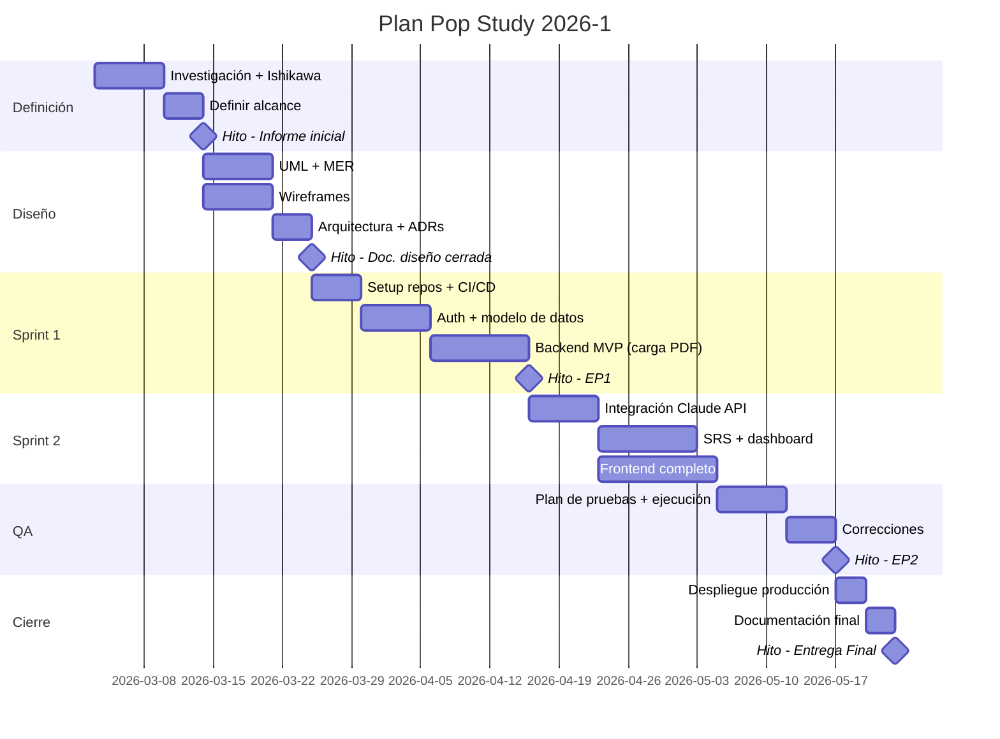
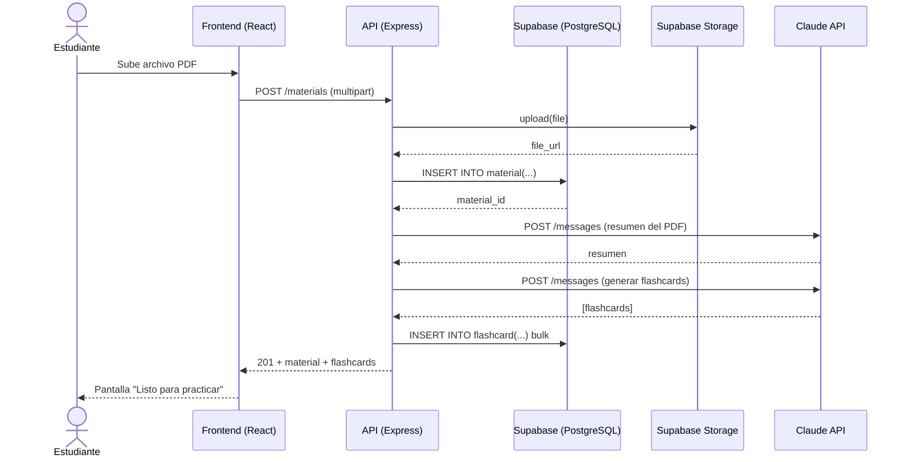

# Actividad de Laboratorio: Documentación Integral del Proyecto — Hub de Documentación, Diagramas y Cómo Alimentan el Informe EA2

## Datos generales

**Asignatura:** TPY1101 – Taller Aplicado de Programación
**Duración estimada:** 3 horas (puede dividirse en 2 sesiones de 90 minutos)
**Modalidad:** Equipo del proyecto (recomendado: equipo completo)
**Sistema operativo considerado:** Windows / macOS / Linux
**Stack de referencia del curso:** React (frontend) + Node.js/Express (backend) + Supabase/PostgreSQL
**Herramientas principales:** Navegador web, editor de texto / VS Code, herramientas online de diagramación, plantilla oficial DuocUC del informe EA2 (Word/Google Docs).
**Aplicabilidad:** este ejercicio se aplica directamente a tu proyecto del portafolio (MapacheSecure, Deckora, NoLimits, 40dB, Pop Study, Landing Pages IA, Agente X u otros). Es **agnóstico al stack** y considera explícitamente que tu proyecto **puede tener varios repositorios** (frontend, backend, móvil, admin), por lo que el almacenamiento de la documentación se diseña como un **hub centralizado independiente del código**.

---

## 1. Propósito de la actividad

Esta actividad tiene **dos objetivos enlazados**:

1. Construir el **paquete completo de documentación técnica y de gestión** que la asignatura exige en la Evaluación Parcial 2 (EA2): contexto del problema, mercado objetivo, objetivos, AS-IS, planificación, servicios cloud, conceptualización TO-BE, alcance, metodología, diagramas de diseño, arquitectura, patrones, stack, configuración del servidor de producción, evidencias de avance, integraciones y conclusión.
2. Diseñar **dónde y cómo se almacena esa documentación** cuando el proyecto tiene **más de un repositorio** (frontend, backend, móvil), y **cómo cada artefacto alimenta de forma trazable una sección específica del informe EA2** que entregas al docente.

En la industria, la documentación no vive dentro de un solo repo: vive en un **hub** (un workspace de Notion/Confluence, un repositorio dedicado de docs, una organización de GitHub con su Wiki) y los repos de código **apuntan al hub**. Tu proyecto del portafolio debe operar igual.

Al finalizar, deberías ser capaz de:

- elegir y montar una **estrategia de hub de documentación** apropiada para un proyecto multi-repo;
- producir los **artefactos exigidos por la plantilla EA2 oficial**: Ishikawa o árbol del problema, tabla de homologación, diagrama AS-IS, diagrama TO-BE, casos de uso o historias de usuario, user flow / BPMN, wireframes, MER/DER, diagrama de arquitectura, C4 nivel 1–2, manual de configuración de servidor, etc.;
- justificar técnicamente los **servicios cloud (IaaS/PaaS/SaaS)** elegidos;
- declarar con precisión los **patrones de diseño y arquitectura** del proyecto (MVC, Repository, Service Layer, Clean Architecture);
- mantener una **matriz de trazabilidad** entre cada sección del informe y los artefactos del hub que la sustentan;
- ensamblar y entregar el **informe EA2 completo** con la plantilla DuocUC.

---

## 2. Contexto del caso

Imagina la situación al final del semestre: tu proyecto tiene tres repositorios — `pop-study-web`, `pop-study-api` y `pop-study-mobile` — y la evaluadora pide el informe EA2. Tres cosas ocurren mal con frecuencia:

1. **La documentación está dispersa**: el MER lo dibujó un compañero en un PDF que está en su Drive personal, el wireframe vive en Figma sin link en ningún lado, la carta Gantt está en un Excel adjunto a un correo. Nadie tiene la "última versión".
2. **El informe se arma a última hora copiando capturas**: se desincroniza del producto real, no refleja decisiones tomadas hace dos meses y el evaluador detecta inconsistencias (la BD del informe no es la que se desplegó).
3. **Ningún repo es "el repo de la documentación"**: poner `docs/` solo en el del frontend deja al backend ciego; duplicar la carpeta en los tres lleva a versiones divergentes que se contradicen.

La solución profesional es **separar el almacenamiento de la documentación del almacenamiento del código**, exactamente como hacen Spotify, GitLab, Atlassian o Vercel: un **hub único** (repositorio dedicado, workspace Notion, o ambos en combinación) que es la **fuente de verdad**. El informe EA2 entregable se **ensambla desde el hub** — no se redacta paralelamente.

> **Idea clave:** el informe EA2 no es donde "se escribe" la documentación. Es donde se **publica** la documentación que ya vive, versionada, en el hub. Si actualizas un diagrama, lo actualizas una vez (en el hub) y el informe lo re-importa.

---

## 3. Producto esperado

Al finalizar la actividad, el equipo debe contar con dos entregables enlazados:

### A. Hub de documentación montado y poblado

Una de las tres opciones (la actividad explica cómo elegir):

- **Opción A:** repositorio dedicado `<proyecto>-docs` en GitHub/GitLab;
- **Opción B:** workspace de Notion (o Confluence) compartido con el equipo y el docente;
- **Opción C:** GitHub Organization con repos del proyecto + repo de docs + perfil README como portada.

El hub contiene, organizado por carpetas o páginas:

1. Ishikawa o árbol del problema.
2. Tabla de homologación de competidores.
3. Fichas de mercado objetivo (personas, dolores, escenarios).
4. Objetivos general y específicos con matriz de trazabilidad a las causas del problema.
5. Diagramas AS-IS y TO-BE.
6. Carta Gantt + backlog + descripción de metodología.
7. UML (mínimo: casos de uso, clases, secuencia, despliegue) o equivalentes (historias de usuario + user flow).
8. MER + esquema relacional + script DDL.
9. Wireframes lo-fi y hi-fi.
10. Diagrama de arquitectura (C4 nivel 1–2) + patrones de diseño justificados.
11. Stack definitivo y dependencias clave.
12. Servicios cloud clasificados (IaaS/PaaS/SaaS) y justificados.
13. Manual paso a paso de configuración del servidor de producción.
14. Evidencias de avance: lista de funcionalidades con estado + capturas + PRs.
15. Plan de pruebas y evidencias.
16. Integraciones externas y evidencias de prueba.

### B. Informe EA2 ensamblado

Documento Word/PDF según la **plantilla oficial DuocUC del informe EA2**, con sus 19 secciones rellenas (Introducción, Contexto, Problema, Mercado objetivo, Objetivos, AS-IS, Planificación, Servicios Cloud, Conceptualización TO-BE, Alcance/supuestos/restricciones, Metodología, Documentos y diagramas de diseño, Arquitectura y patrones, Tecnologías y stack, Configuración de servidor, Estado de avance, Integraciones, Conclusión, Anexos).

Cada sección del informe **debe enlazar al artefacto del hub que la sustenta** (URL al diagrama editable, a la página de Notion, al archivo en el repo de docs), y cada figura del informe **debe estar exportada desde un archivo editable** del hub (no capturas sueltas sin origen).

### C. Matriz de trazabilidad

Un archivo `MATRIZ_INFORME.md` (o página de Notion) que mapea **cada sección del informe EA2 → carpeta/página del hub → artefacto específico**. Esa matriz es la prueba de que el informe no se inventó: se construyó desde el hub.

---

## 4. Requisitos previos

### Cuentas y herramientas

| Herramienta | URL | Para qué la usarás |
|---|---|---|
| **GitHub / GitLab** | [github.com](https://github.com) | Repositorio del hub (Opción A o C) |
| **Notion** o **Confluence** | [notion.so](https://notion.so) | Hub colaborativo (Opción B) |
| **Excalidraw** | [excalidraw.com](https://excalidraw.com) | Bocetos, wireframes lo-fi, AS-IS rápidos |
| **draw.io / diagrams.net** | [app.diagrams.net](https://app.diagrams.net) | UML formal, MER, arquitectura, C4, Ishikawa, BPMN |
| **Miro** | [miro.com](https://miro.com) | Colaboración en vivo, user journey, mapas mentales, retros |
| **dbdiagram.io** | [dbdiagram.io](https://dbdiagram.io) | MER como código, export a SQL |
| **Figma** | [figma.com](https://figma.com) | Wireframes hi-fi y prototipos clicables |
| **Mermaid Live** | [mermaid.live](https://mermaid.live) | Diagramas como código, renderizables en GitHub |
| **GanttProject** o **TeamGantt** | [ganttproject.biz](https://www.ganttproject.biz) | Carta Gantt con dependencias e hitos |

### Material del curso

- **Plantilla oficial DuocUC del informe EA2** (Word o Google Docs). Si no la tienes a la mano, pídela al docente o descárgala desde el aula virtual.
- Al menos **un repositorio del proyecto** ya creado (idealmente todos los que tendrá el sistema).
- Nombre del proyecto y caso definido.

### Verificación inicial

1. Confirma que el equipo tiene acceso a la plantilla EA2 oficial (DuocUC, plantilla con portada y los 19 títulos de sección).
2. Confirma que **conocen cuántos repositorios** tendrá el proyecto. Lista los nombres (ej: `popstudy-web`, `popstudy-api`).
3. Reúne al equipo y discute en 5 minutos: ¿quieren versionado en Git de cada diagrama (Opción A) o colaboración en vivo tipo wiki (Opción B)? ¿O un híbrido (Opción C)?

**Checkpoint 0 aprobado** cuando: tienen la plantilla EA2 a mano, listaron los repos del proyecto, y eligieron preliminarmente la opción de hub.

---

## 5. Organización del tiempo

- **Bloque 1 – Panorama: la plantilla EA2 y el reto multi-repo (15 min)**
- **Bloque 2 – Elegir y montar el hub de documentación (15 min)**
- **Bloque 3 – Contexto y problema (Ishikawa/árbol, homologación, mercado objetivo) (30 min)**
- **Bloque 4 – Objetivos, AS-IS y TO-BE (25 min)**
- **Bloque 5 – Planificación (Gantt) y metodología (20 min)**
- **Bloque 6 – Servicios cloud, conceptualización y alcance (15 min)**
- **Bloque 7 – Documentos y diagramas de diseño (UML + MER + Wireframes) (40 min)**
- **Bloque 8 – Arquitectura, patrones y stack definitivo (20 min)**
- **Bloque 9 – Configuración de servidor, evidencias e integraciones (15 min)**
- **Bloque 10 – Matriz de trazabilidad y ensamblar el informe EA2 (15 min)**

**Tiempo total estimado:** 210 minutos. Si vas con prisa, prioriza Bloques 2, 3, 4, 7 y 10 (los que producen los artefactos no-derivables del código).

---

# 6. Desarrollo paso a paso

---

## Bloque 1 – Panorama: la plantilla EA2 y el reto multi-repo (15 minutos)

### 1.1. Las 19 secciones del informe EA2

La plantilla DuocUC del informe EA2 tiene 19 secciones obligatorias. Cada una pide artefactos y/o redacción específica:

| # | Sección | Artefactos clave que pide |
|---|---|---|
| 1 | Introducción | (redacción) |
| 2 | Contexto del proyecto | Tabla de homologación, estado del arte |
| 3 | Descripción del problema u oportunidad | **Ishikawa o Árbol de problema** (obligatorio para buen desempeño) |
| 4 | Descripción del mercado objetivo | Mini-fichas de usuarios (principal y secundario) |
| 5 | Objetivo general y específicos | Verbo en infinitivo, medibles, alineados al problema |
| 6 | Situación inicial del cliente (AS-IS) | **Diagrama de flujo o bloques del proceso actual** |
| 7 | Planificación | **Carta Gantt** + lista de tareas con responsables |
| 8 | Servicios Cloud (IaaS/PaaS/SaaS) | Tabla con qué/dónde/por qué |
| 9 | Conceptualización (TO-BE) | Diagrama Usuario↔Frontend↔Backend↔BD↔externos |
| 10 | Alcance, supuestos y restricciones | Listas explícitas |
| 11 | Metodología de desarrollo y gestión | Marco (Scrum/Kanban), DoD, captura tablero |
| 12 | Documentos y diagramas de diseño | **Mín. 3, recomendado 5**: casos de uso, user flow/BPMN, wireframes, MER/DER, arquitectura |
| 13 | Arquitectura de software y patrones | Arquitectura + patrón (MVC, Repository, etc.) + **C4 nivel 1–2** |
| 14 | Tecnologías, lenguaje y dependencias | Stack definitivo + estándares + estructura de carpetas |
| 15 | Configuración de servidor de producción | **Manual paso a paso** con runtimes, variables, despliegue |
| 16 | Estado de avance | Mín. 5 funcionalidades con estado + evidencias |
| 17 | Integraciones | APIs, datos, seguridad, evidencias |
| 18 | Conclusión | (redacción) |
| 19 | Anexos | Ishikawa, Gantt completo, homologación, mockups, pipeline CI/CD, referencias |

> **Lectura del docente:** el evaluador no busca "que tengas docs", busca **que cada decisión esté respaldada por un artefacto trazable** y que el informe sea **coherente con el producto desplegado**.

### 1.2. El reto del multi-repo

En un proyecto típico de Taller, tendrás al menos **dos repositorios**:

```
equipo-popstudy/
├── popstudy-web        ← frontend React
├── popstudy-api        ← backend Express
└── popstudy-mobile     ← opcional, React Native
```

Si pones `docs/` solo en `popstudy-web`, el del backend queda ciego. Si lo duplicas en los tres, divergen. La solución es **sacar la documentación del código**:

```
equipo-popstudy/
├── popstudy-web        ← solo código frontend
├── popstudy-api        ← solo código backend
├── popstudy-mobile     ← solo código mobile
└── popstudy-docs   ★   ← HUB de documentación (la "fuente de verdad")
```

O alternativamente, un **workspace de Notion** que cumple el mismo rol y al que apuntan los READMEs de cada repo.

### 1.3. Principio del hub

| Principio | Implica |
|---|---|
| **Una sola fuente de verdad** | Cada artefacto vive en exactamente un lugar |
| **Independiente del código** | Cambiar de stack no implica mover docs |
| **Apuntado por cada repo** | Cada `README.md` enlaza al hub |
| **Versionado o con historial** | Git, o el historial nativo de Notion/Confluence |
| **El informe se ensambla, no se redacta paralelamente** | El informe importa figuras y resume; no inventa contenido |

**Checkpoint 1 aprobado** cuando puedes explicar: (a) las 19 secciones del EA2 y qué artefacto pide cada una clave, (b) por qué `docs/` en un repo no sirve para multi-repo, (c) qué significa "el informe se ensambla desde el hub".

---

## Bloque 2 – Elegir y montar el hub de documentación (15 minutos)

### 2.1. Las tres opciones

| | **Opción A: Repo dedicado de docs** | **Opción B: Workspace Notion / Confluence** | **Opción C: GitHub Org + Wiki + perfil** |
|---|---|---|---|
| **Cómo se ve** | `<usuario>/<proyecto>-docs` con carpetas | Workspace con páginas y subpáginas | Organización GitHub agrupa todos los repos + un repo `.github` con perfil README |
| **Versionado** | Git nativo (`.drawio`, `.md` editable) | Historial automático de Notion (no Git) | Git + Wiki Git |
| **Colaboración en vivo** | PRs y revisiones asincrónicas | Edición simultánea, comentarios inline | PRs + Wiki simultánea |
| **Mejor para** | Equipos cómodos con Git que quieren rigor de PR sobre docs | Equipos mixtos (devs + no-devs), feedback rápido del docente | Equipos GitHub-first que quieren una "vitrina" pública |
| **Costo** | Gratis | Free hasta 5 personas | Gratis |
| **Acceso del docente** | Lo invitas al repo o lo haces público | Compartes link con permisos | Repo público o invitación |
| **Exportación a Word** | Manual (copiar/pegar o pandoc) | Nativa (Export → Word/PDF) | Manual |
| **Punto débil** | Notion-experience de no-devs | No versionable con Git, depende de la cuenta del equipo | Curva organizacional |

> **Recomendación pragmática para TPY1101:** si el equipo tiene 2+ personas no-devs o quieren feedback semanal del docente, **Notion (B)**. Si el equipo es 100% dev cómodo con Git, **repo dedicado (A)**. Si quieren mostrar profesionalmente el proyecto al final, **híbrido B+A**: Notion para vivir el proyecto, repo de docs para versión final exportada.

### Paso 1. Crear el hub

#### Si eliges Opción A — repo dedicado de docs

1. En GitHub: **New repository** → nombre `<proyecto>-docs` → público o privado (privado para EA2 está bien).
2. Inicializa con `README.md`.
3. Clónalo localmente.
4. Crea la estructura de carpetas:

```bash
mkdir -p 01-contexto-y-problema 02-objetivos-y-as-is 03-planificacion-y-metodologia \
         04-cloud-y-conceptualizacion 05-diseno-tecnico/{uml,mer,wireframes} \
         06-arquitectura-y-stack 07-servidor-y-despliegue \
         08-evidencias-de-avance 09-pruebas 10-integraciones informe-ea2 anexos
```

5. Commitea y sube:

```bash
git add . && git commit -m "docs: scaffold inicial del hub de documentación" && git push
```

#### Si eliges Opción B — workspace Notion

1. Crea un nuevo workspace o usa el del equipo.
2. Crea una página raíz: **`[Proyecto] — Hub de Documentación`**.
3. Dentro, crea estas subpáginas (cada una correspondiente a una sección del informe):

```
📘 [Proyecto] — Hub de Documentación
├── 📝 Informe EA2 (página viva)
├── 1️⃣ Contexto y problema
├── 2️⃣ Objetivos y AS-IS
├── 3️⃣ Planificación y metodología
├── 4️⃣ Servicios Cloud y conceptualización TO-BE
├── 5️⃣ Diseño técnico (UML, MER, Wireframes)
├── 6️⃣ Arquitectura, patrones y stack
├── 7️⃣ Servidor de producción
├── 8️⃣ Evidencias de avance
├── 9️⃣ Plan de pruebas
└── 🔟 Integraciones
```

4. Comparte el workspace con todos los integrantes (permisos *Edit*) y con el docente (permisos *Comment*).

#### Si eliges Opción C — GitHub Organization

1. Crea una **organización** en GitHub: `equipo-<proyecto>`.
2. Mueve todos los repos del proyecto a la organización.
3. Crea un repo especial llamado `.github` (sí, con punto), dentro: `profile/README.md`. Ese README aparece como **portada de la organización**.
4. Adicionalmente crea `<proyecto>-docs` para los artefactos.

```markdown
# Equipo Pop Study

Proyecto del Taller Aplicado de Programación (TPY1101), DuocUC.

## Repositorios
- 📘 [popstudy-docs](../popstudy-docs) — Documentación e informe EA2
- 💻 [popstudy-web](../popstudy-web) — Frontend (React)
- 🔌 [popstudy-api](../popstudy-api) — Backend (Express)
- 📱 [popstudy-mobile](../popstudy-mobile) — Mobile (React Native)

## Documentación
La fuente de verdad de la documentación está en [popstudy-docs](../popstudy-docs).
```

### Paso 2. Enlazar cada repo de código al hub

En el `README.md` de **cada repositorio de código**, agrega este bloque al inicio:

```markdown
# popstudy-web

Frontend del proyecto Pop Study (TPY1101 – Taller Aplicado de Programación).

> 📘 **Documentación del proyecto:** toda la documentación (informe EA2, diagramas
> UML, MER, wireframes, carta Gantt, manual de despliegue) vive en el hub central:
>
> → **[popstudy-docs](https://github.com/equipo-popstudy/popstudy-docs)**
>
> Específicamente para esta capa (frontend):
> - [Wireframes](https://github.com/equipo-popstudy/popstudy-docs/tree/main/05-diseno-tecnico/wireframes)
> - [Arquitectura y stack](https://github.com/equipo-popstudy/popstudy-docs/tree/main/06-arquitectura-y-stack)
> - [Plan de pruebas](https://github.com/equipo-popstudy/popstudy-docs/tree/main/09-pruebas)
```

### Paso 3. README del hub

Edita el `README.md` del hub (o la página raíz de Notion) con un **índice navegable** que mapee carpetas a secciones del informe (la matriz de trazabilidad se afina en el Bloque 10).

```markdown
# Pop Study — Hub de Documentación

Documentación oficial del proyecto. Fuente de verdad para el informe EA2.

## Estructura

| Carpeta | Sección del informe EA2 | Artefactos |
|---|---|---|
| [01-contexto-y-problema](./01-contexto-y-problema) | §2, §3, §4 | Homologación, Ishikawa, personas |
| [02-objetivos-y-as-is](./02-objetivos-y-as-is) | §5, §6, §10 | Objetivos, AS-IS, alcance |
| [03-planificacion-y-metodologia](./03-planificacion-y-metodologia) | §7, §11 | Gantt, backlog, DoD |
| [04-cloud-y-conceptualizacion](./04-cloud-y-conceptualizacion) | §8, §9 | IaaS/PaaS/SaaS, TO-BE |
| [05-diseno-tecnico](./05-diseno-tecnico) | §12 | UML, MER, wireframes |
| [06-arquitectura-y-stack](./06-arquitectura-y-stack) | §13, §14 | C4, patrones, stack |
| [07-servidor-y-despliegue](./07-servidor-y-despliegue) | §15 | Manual paso a paso |
| [08-evidencias-de-avance](./08-evidencias-de-avance) | §16 | Funcionalidades, capturas, PRs |
| [09-pruebas](./09-pruebas) | (transversal) | Plan, casos, evidencias |
| [10-integraciones](./10-integraciones) | §17 | APIs, evidencias |
| [informe-ea2](./informe-ea2) | (resultado) | Documento Word/PDF final |
| [anexos](./anexos) | §19 | Versiones HD de diagramas, pipelines |

## Repositorios de código
- [popstudy-web](https://github.com/equipo-popstudy/popstudy-web)
- [popstudy-api](https://github.com/equipo-popstudy/popstudy-api)
- [popstudy-mobile](https://github.com/equipo-popstudy/popstudy-mobile)
```

**Checkpoint 2 aprobado** cuando: tienes el hub creado (Opción A, B o C), el README/portada del hub publicado con la estructura, y cada repo de código apunta al hub desde su README.

---

## Bloque 3 – Contexto y problema (30 minutos)

Esta etapa produce los artefactos para las **secciones 2, 3 y 4** del informe (Contexto, Problema, Mercado objetivo).

### Paso 4. Tabla de homologación (sección 2 del informe)

Crea `01-contexto-y-problema/homologacion.md`:

```markdown
# Tabla de homologación — Pop Study

Comparación de soluciones existentes en el mercado.

| Solución / Competidor | Qué hace | Ventajas | Desventajas | Qué haré distinto |
|---|---|---|---|---|
| Quizlet | Flashcards y tests | Comunidad enorme, gratis básico | Generación manual de cards; no integra IA; no resume PDFs | Generación automática de cards desde el material; resúmenes con IA |
| Anki | Repetición espaciada (SRS) | Algoritmo probado | UX pobre; curva alta; sin contenido propio | UX simple + algoritmo SRS embebido + onboarding guiado |
| Notion AI | Toma de notas + IA | Integración con notas existentes | No es app de estudio; sin SRS; no estructura por temas | Foco específico en estudio + SRS + estructura por curso |
```

Mínimo: **3 competidores**, con la columna "Qué haré distinto" rellena (esa es la justificación de por qué tu producto existe).

### Paso 5. Ishikawa o Árbol del problema (sección 3 del informe)

La plantilla EA2 marca esto como **obligatorio para buen desempeño**. Elige una de las dos técnicas:

#### Ishikawa (espina de pescado)

Usa **draw.io** → busca "Ishikawa" o "Fishbone" en la búsqueda de formas. Las 6 espinas estándar son las **6M**: Método, Mano de obra, Maquinaria, Material, Medio ambiente, Medición. Para software, suelen renombrarse a: **Personas, Procesos, Tecnología, Datos, Entorno, Tiempo**.

Estructura:

```
         Personas              Procesos              Tecnología
            \                      |                    /
             \   causa A1          |   causa B1        /
              \  causa A2          |   causa B2       /
               \________________   |   _____________/
                                 \ |  /
                                  \|/
                              ┌──────────┐
                              │ PROBLEMA │
                              │ CENTRAL  │
                              └──────────┘
                                  /|\
                                 / | \
                ________________/  |  \_____________
               /                   |                \
            Datos                Entorno            Tiempo
```

Cada espina lista **2–4 causas concretas**. Ejemplo aplicado a Pop Study:

| Categoría | Causa |
|---|---|
| Personas | Estudiantes con baja constancia de estudio |
| Personas | Profesores no entregan material estructurado |
| Procesos | No hay método único de estudio en la cohorte |
| Procesos | Las clases no incluyen práctica intercalada |
| Tecnología | Apps existentes requieren crear cards manualmente |
| Tecnología | El material en PDF no es buscable ni resumible |
| Datos | Falta data de qué partes cuesta más recordar |
| Entorno | Distractores digitales constantes |
| Tiempo | Carga académica de 7 ramos limita estudio |

Exporta el diagrama: `01-contexto-y-problema/ishikawa.drawio` + `ishikawa.png`.

#### Árbol del problema (alternativa)

```
                    EFECTOS (consecuencias)
              ┌──────────┬──────────┬──────────┐
            efecto 1   efecto 2   efecto 3   efecto 4
              └──────────┴──────────┴──────────┘
                              ▲
                              │
                    ┌───────────────────┐
                    │  PROBLEMA CENTRAL │
                    └───────────────────┘
                              ▲
                              │
              ┌──────────┬──────────┬──────────┐
             causa 1   causa 2   causa 3   causa 4
              └──────────┴──────────┴──────────┘
                    CAUSAS (raíces)
```

Mínimo: **3–5 causas** abajo, **3–5 efectos** arriba.

### Paso 6. Descripción del problema con frase ancla

En `01-contexto-y-problema/problema.md`:

```markdown
# Descripción del problema

## Frase ancla
Actualmente los estudiantes de educación superior dedican en promedio 4–6 horas
semanales a estudiar material extenso (PDFs, slides, apuntes) sin herramientas
que les permitan resumir, transformar a flashcards y reforzar con repetición
espaciada, lo que provoca baja retención, ansiedad antes de evaluaciones y
abandono parcial de la asignatura.

## Impacto cuantificable
- 70% de los estudiantes encuestados (n=42) declara olvidar >50% del contenido
  una semana después de la prueba.
- Tiempo promedio de preparación de material propio: 2 h por evaluación.

## Análisis de causas (ver Ishikawa)
[Embed: ishikawa.png]

## Conclusión
La solución atacará principalmente las causas de **Tecnología** (automatizando
la generación de flashcards y resúmenes desde el material original) y **Procesos**
(introduciendo SRS).
```

### Paso 7. Mercado objetivo (sección 4 del informe)

En `01-contexto-y-problema/mercado-objetivo.md`:

```markdown
# Mercado objetivo

## Usuario principal (Persona 1) — "Estudiante DUOC tecnológico"
- **Edad:** 18–26 años
- **Contexto:** cursa 6–7 ramos por semestre, vive en Santiago, usa smartphone
  Android e iPhone, laptop de gama media.
- **Conocimiento técnico:** medio-alto (estudia carreras de TI).
- **Necesidad principal:** estudiar más en menos tiempo, recordar a largo plazo.
- **Dolores:**
  - tiempo perdido preparando material;
  - olvido rápido después de las evaluaciones;
  - apps existentes son lentas o requieren mucha configuración inicial.
- **Escenario de uso:** transporte público en la mañana (10 min) y antes
  de dormir (20 min). Móvil predominantemente.

## Usuario secundario (Persona 2) — "Docente que evalúa material"
- **Edad:** 30–55 años
- **Necesidad:** ver el avance de sus estudiantes en el material que ellos publican.
- **Escenario:** revisión semanal en escritorio.
```

Mínimo: **dos personas** (principal + secundaria), con dolores y escenarios concretos.

**Checkpoint 3 aprobado** cuando tienes `homologacion.md` con ≥3 competidores, `ishikawa.png` (o `arbol-problema.png`) con causas y efectos concretos, `problema.md` con frase ancla y `mercado-objetivo.md` con 2 personas.

---

## Bloque 4 – Objetivos, AS-IS y TO-BE (25 minutos)

Esta etapa produce los artefactos para las **secciones 5, 6, 9 y 10** del informe.

### Paso 8. Objetivos general y específicos (sección 5)

En `02-objetivos-y-as-is/objetivos.md`:

```markdown
# Objetivos

## Objetivo general
Desarrollar una aplicación web progresiva (PWA) que permita a estudiantes de
educación superior generar automáticamente resúmenes y flashcards desde su
propio material, con un sistema de repetición espaciada, para mejorar la
retención y reducir el tiempo de preparación de evaluaciones, durante el
semestre 2026-1.

## Objetivos específicos
1. **Diseñar e implementar** el módulo de carga e indexación de material
   (PDF, texto plano) con extracción automática de contenido, validado con
   ≥10 archivos reales de prueba antes del 2026-04-15.
2. **Integrar** un servicio de IA (Claude API u OpenAI) para generación de
   resúmenes y flashcards, con tasa de éxito ≥85% en una muestra de 50 cards
   evaluadas por usuarios reales.
3. **Implementar** el motor de repetición espaciada SM-2 con persistencia
   en PostgreSQL y endpoint `/api/review` validado con pruebas unitarias
   (cobertura ≥70%).
4. **Validar** la solución con 5 usuarios reales durante un sprint de uso
   continuo (mín. 7 días), recogiendo NPS y tiempo promedio de estudio.

## Matriz objetivos vs causas del problema

| Objetivo específico | Causa del Ishikawa que ataca |
|---|---|
| 1. Carga e indexación | Tecnología: material no buscable |
| 2. IA de resumen/cards | Tecnología: generación manual de cards |
| 3. SRS | Procesos: no hay método único |
| 4. Validación con usuarios | (validación general, no causa) |
```

> **Checklist:** ¿si cumples los específicos, automáticamente logras el general? Si no, falta alinear.

### Paso 9. Diagrama AS-IS (sección 6)

Modela **el proceso actual sin tu producto**. Usa Excalidraw (rápido) o draw.io (formal). BPMN es opcional pero suma puntos.

Ejemplo Pop Study en bloques:

```
┌──────────────────────────────────────────────────────────────────────┐
│                        PROCESO ACTUAL (AS-IS)                        │
│                                                                      │
│  ┌─────────┐    ┌──────────┐    ┌──────────┐    ┌──────────┐         │
│  │Estudiante├──►│Recibe PDF├──►│Lee/marca ├──►│Hace       │         │
│  │         │    │del docente│    │con resalt│    │resúmenes  │       │
│  └─────────┘    └──────────┘    └──────────┘    │a mano     │       │
│                                                  └─────┬─────┘       │
│                                                        │             │
│                                  ❌ DOLOR: 2h/eval    ▼             │
│                                  ┌─────────────────────────┐         │
│                                  │ Estudia repasando texto │         │
│                                  └───────────┬─────────────┘         │
│                                              │                       │
│                                  ❌ DOLOR: olvido >50%               │
│                                              ▼                       │
│                                  ┌─────────────────────────┐         │
│                                  │  Rinde evaluación       │         │
│                                  └─────────────────────────┘         │
└──────────────────────────────────────────────────────────────────────┘
```

Guarda como `02-objetivos-y-as-is/as-is.drawio` + `as-is.png`. Acompáñalo con texto:

```markdown
# Situación actual (AS-IS)

## Proceso paso a paso
1. El docente entrega material PDF o slides en el aula virtual.
2. El estudiante descarga y abre el material.
3. Lee y aplica subrayado manual.
4. Construye resúmenes propios (a mano o en Word) — **2 h promedio por evaluación**.
5. Estudia releyendo sus resúmenes.
6. Rinde la evaluación.

## Puntos de dolor identificados
- **Paso 4**: tiempo invertido en generar material propio.
- **Paso 5**: sin reforzamiento espaciado, retención cae sobre 50% en una semana.
```

### Paso 10. Conceptualización TO-BE (sección 9)

Modela **el proceso futuro con tu producto**. Es el diagrama "Usuario ↔ Frontend ↔ Backend ↔ BD ↔ servicios externos" que pide la plantilla.

```
┌────────────────────────────────────────────────────────────────────────┐
│                        PROCESO FUTURO (TO-BE)                          │
│                                                                        │
│  ┌─────────┐  HTTPS  ┌──────────┐  REST  ┌──────────┐                  │
│  │Estudiante├────────►│Frontend  ├────────►│Backend   │                 │
│  │         │         │React PWA │        │Express   │                  │
│  └─────────┘         └──────────┘        └────┬─────┘                  │
│                                               │                        │
│                                  SQL         ▼                         │
│                          ┌────────────────────────────┐                │
│                          │ PostgreSQL (Supabase)      │                │
│                          │  - Materiales              │                │
│                          │  - Flashcards              │                │
│                          │  - Resultados SRS          │                │
│                          └────────────────────────────┘                │
│                                                                        │
│                          ┌────────────────────────────┐                │
│                          │ Claude API (servicios IA) │                 │
│                          │  - resumen de PDF          │                │
│                          │  - generación de cards     │                │
│                          └────────────────────────────┘                │
└────────────────────────────────────────────────────────────────────────┘
```

Guarda como `04-cloud-y-conceptualizacion/to-be.drawio` + `to-be.png`. Acompáñalo con la lista de funcionalidades principales (mínimo 4–6) y consideraciones de calidad/seguridad.

### Paso 11. Alcance, supuestos y restricciones (sección 10)

En `02-objetivos-y-as-is/alcance.md`:

```markdown
# Alcance, supuestos y restricciones

## Alcance (incluye)
- Carga de PDF y texto plano (no DOCX, no imágenes).
- Generación de resumen vía Claude API.
- Generación de flashcards.
- SRS básico (algoritmo SM-2).
- Auth con email y password (Supabase Auth).
- Dashboard de progreso individual.

## No alcance (out of scope para EA2)
- App móvil nativa (queda PWA).
- Modo offline.
- Soporte multi-idioma (solo español).
- Modo "estudio grupal" / compartir mazos.
- Sistema de pagos.

## Entregables
- Informe EA2 según plantilla.
- Repos web y api desplegados (Vercel + Render).
- Hub de documentación versionado.

## Supuestos
- Los usuarios cuentan con conexión a internet estable.
- El docente entrega material en PDF estándar (no escaneado).
- La cuota gratuita de Claude API cubre el periodo del semestre.

## Restricciones
- Tiempo: 14 semanas del semestre.
- Equipo: 3 personas, 6 h/semana cada una.
- Tecnología: stack del curso (React + Node + PostgreSQL).
- Costo: $0 (free tiers únicamente).
```

**Checkpoint 4 aprobado** cuando tienes `objetivos.md` (con matriz contra causas), `as-is.png`, `to-be.png` y `alcance.md` completos.

---

## Bloque 5 – Planificación (Gantt) y metodología (20 minutos)

Esta etapa produce los artefactos para las **secciones 7 y 11** del informe.

### Paso 12. Carta Gantt (sección 7)

Usa **GanttProject** (escritorio, gratis) o **TeamGantt** (online), o **Mermaid Gantt** si quieres versionarla en Git como código.

Mínimo: **8–12 tareas principales**, cada una con responsable + semana. Estructura sugerida en 6 fases (definición, diseño, sprint 1, sprint 2, QA, cierre) con hitos EP1/EP2/EF.

Ejemplo en Mermaid (`03-planificacion-y-metodologia/gantt.mmd`):

````markdown

````

Exporta como PNG: `03-planificacion-y-metodologia/gantt.png`. Adicionalmente guarda el `.gan` o `.mmd` (editable).

### Paso 13. Lista de tareas con responsables

La plantilla EA2 pide explícitamente "responsable por actividad". En `03-planificacion-y-metodologia/tareas.md`:

```markdown
# Lista de tareas y responsables

| # | Tarea | Responsable | Semana | Estado |
|---|---|---|---|---|
| 1 | Investigación y Ishikawa | María | S1 | ✅ |
| 2 | Definición de alcance | Equipo | S2 | ✅ |
| 3 | UML completo | José | S3 | 🟡 |
| 4 | MER + script SQL | Camila | S3 | 🟡 |
| 5 | Wireframes hi-fi | María | S4 | 🟡 |
| 6 | Setup repos + CI | José | S5 | ⬜ |
| 7 | Auth + Supabase | Camila | S6 | ⬜ |
| 8 | Carga PDF backend | José | S7 | ⬜ |
| 9 | Integración Claude API | María | S8 | ⬜ |
| 10 | SRS engine | Camila | S9 | ⬜ |
| 11 | Frontend completo | María + José | S9-S10 | ⬜ |
| 12 | Plan de pruebas y QA | Camila | S11 | ⬜ |
```

### Paso 14. Metodología (sección 11)

En `03-planificacion-y-metodologia/metodologia.md`:

```markdown
# Metodología

## Marco elegido: Scrum-lite
Hemos elegido un Scrum adaptado a 14 semanas:
- Sprints de **2 semanas**.
- Ceremonias: planning lunes 18 h, daily async en Discord, review viernes
  alternos, retro al cierre de sprint.

## Roles
- **Product Owner:** María (alinea con el cliente/docente).
- **Scrum Master:** José (modera ceremonias, desbloquea).
- **Dev team:** los 3 integrantes.

## Definition of Done (DoD)
Una historia de usuario se considera "hecha" cuando:
- [ ] Implementada según el criterio de aceptación.
- [ ] Pasada por code review (≥1 aprobación en PR).
- [ ] Pruebas unitarias del módulo pasando.
- [ ] Documentación del endpoint o componente actualizada en el hub.
- [ ] Desplegada en staging.
- [ ] Probada manualmente por al menos otro integrante.

## Herramientas
- Tablero: GitHub Projects.
- Comunicación: Discord.
- Repo de docs: este hub.

## Evidencia
[Captura del tablero — se actualiza cada sprint en `evidencias/tablero/`]
```

**Checkpoint 5 aprobado** cuando tienes `gantt.png`, `tareas.md` y `metodologia.md`.

---

## Bloque 6 – Servicios cloud y stack preliminar (15 minutos)

Esta etapa produce los artefactos para la **sección 8** del informe. (La sección 14, stack definitivo, se cierra en el Bloque 8.)

### Paso 15. Clasificación IaaS / PaaS / SaaS

La plantilla pide indicar **qué nivel de servicio** estás usando y por qué.

| Modelo | Qué administras tú | Qué administra el proveedor | Ejemplos |
|---|---|---|---|
| **IaaS** (Infrastructure) | OS, runtime, app, datos | Hardware, red | AWS EC2, Azure VM, GCP Compute |
| **PaaS** (Platform) | App, datos | OS, runtime, red, HW | Vercel, Render, Heroku, App Engine |
| **SaaS** (Software) | Solo datos/config | Todo | Supabase, Auth0, SendGrid |

En `04-cloud-y-conceptualizacion/servicios-cloud.md`:

```markdown
# Servicios Cloud — Pop Study

| Capa | Servicio | Modelo | Por qué este modelo |
|---|---|---|---|
| Frontend hosting | **Vercel** | PaaS | CDN global, despliegue desde Git, gratis, SSL automático. No necesitamos administrar OS. |
| Backend API | **Render** | PaaS | Free tier para Node.js; logs y métricas integrados; auto-deploy desde GitHub. |
| Base de datos | **Supabase (PostgreSQL gestionado)** | SaaS / PaaS | DB como servicio + auth + storage en uno; reduce código de infraestructura. |
| Autenticación | **Supabase Auth** | SaaS | Email/password + recuperación + JWT listo; no reinventamos auth. |
| Storage (PDFs) | **Supabase Storage** | SaaS | Buckets con RLS por usuario; sin operar S3. |
| IA generativa | **Claude API (Anthropic)** | SaaS | Resúmenes y flashcards vía API; sin entrenar modelos. |

## Justificación general
- **Disponibilidad:** todos los proveedores ofrecen SLA ≥99.9%.
- **Escalabilidad:** plan free cubre demanda académica; escalado vertical disponible.
- **Costo:** $0 durante el semestre con free tiers.
- **Velocidad de desarrollo:** evitamos administrar VMs, lo que nos permite enfocarnos en el producto.
```

**Checkpoint 6 aprobado** cuando tienes `servicios-cloud.md` con tabla por capa y justificación general.

---

## Bloque 7 – Documentos y diagramas de diseño (40 minutos)

Esta etapa produce los artefactos para la **sección 12** del informe (la más cargada de la EA2: mínimo 3, recomendado 5 diagramas). Cubre **UML + MER + Wireframes**.

> **Importante:** la plantilla pide que **por cada diagrama** declares su **propósito**, **qué representa** y **cómo se relaciona con el problema y los objetivos**. Pegar la imagen sin explicar no suma.

### Paso 16. Diagramas UML — los 4 esenciales

#### 16.1 Casos de uso (o historias de usuario)

Pega los actores **fuera** del recuadro del sistema y los casos de uso **dentro**.

- Actores típicos: Estudiante, Docente, Administrador, Servicio IA (actor sistema).
- Casos de uso: Registrarse, Iniciar sesión, Subir material, Generar resumen, Generar flashcards, Practicar, Ver progreso, Gestionar usuarios.

Guarda en `05-diseno-tecnico/uml/01-casos-de-uso.drawio` + `.png`.

Como alternativa o complemento: **historias de usuario** en formato Connextra:

```markdown
US-01  Como estudiante, quiero subir un PDF de mi material para que el sistema lo procese.
US-02  Como estudiante, quiero recibir un resumen automático del PDF para ahorrar tiempo.
US-03  Como estudiante, quiero generar flashcards desde el PDF para practicar.
US-04  Como estudiante, quiero practicar las flashcards con SRS para retener mejor.
US-05  Como estudiante, quiero ver mi progreso semanal para saber si estoy avanzando.
US-06  Como docente, quiero ver el avance agregado de mi curso para detectar atrasos.
```

#### 16.2 User Flow o BPMN del proceso principal

Diagrama de **flujo del usuario** desde que entra a la app hasta que cumple su objetivo principal. Usa draw.io con la librería "Flowchart" o BPMN.

```
[Inicio] → [¿Logged in?]
              │ No → [Login/Register] → [Dashboard]
              │ Sí ───────────────────► [Dashboard]
                                            │
                                            ▼
                                    [Subir PDF]
                                            │
                                            ▼
                                    [Generar resumen (IA)]
                                            │
                                            ▼
                                    [Generar flashcards]
                                            │
                                            ▼
                                    [Practicar SRS]
                                            │
                                            ▼
                                    [Ver progreso]
                                            │
                                            ▼
                                          [Fin]
```

Guarda en `05-diseno-tecnico/uml/02-user-flow.drawio` + `.png`.

#### 16.3 Diagrama de clases

Modela las **entidades del dominio** con sus atributos clave, métodos de negocio y relaciones (asociación, agregación, composición, herencia). Multiplicidades en los extremos.

Guarda en `05-diseno-tecnico/uml/03-clases.drawio` + `.png`.

#### 16.4 Diagrama de secuencia (flujo crítico)

Modela un flujo crítico con líneas de vida horizontales (Usuario, Frontend, Backend, BD, Servicio IA) y mensajes en orden vertical.

Recomendado: flujo **"Generar flashcards desde un PDF"** o **"Login con MFA"**.

En Mermaid (versionable):

````markdown

````

Guarda en `05-diseno-tecnico/uml/04-secuencia-flashcards.mmd` + `.png`.

### Paso 17. MER / Modelo de datos

Usa **dbdiagram.io** (rápido) o draw.io. Diseña con Crow's Foot, normalizado a ≥3FN.

Mínimo: 5 tablas, 3 relaciones, PK + FKs + restricciones explícitas.

En `05-diseno-tecnico/mer/mer.dbml`:

```dbml
Table usuario {
  id uuid [pk]
  email varchar [unique, not null]
  password_hash varchar [not null]
  rol varchar [note: 'admin | estudiante | docente']
  fecha_registro timestamp [default: `now()`]
}

Table material {
  id uuid [pk]
  titulo varchar [not null]
  tipo varchar [note: 'pdf | texto']
  storage_url text
  usuario_id uuid [ref: > usuario.id]
  fecha_subida timestamp [default: `now()`]
}

Table flashcard {
  id uuid [pk]
  frente text [not null]
  reverso text [not null]
  material_id uuid [ref: > material.id]
}

Table revision {
  id uuid [pk]
  flashcard_id uuid [ref: > flashcard.id]
  usuario_id uuid [ref: > usuario.id]
  calidad int [note: '0-5 según SM-2']
  proxima_revision timestamp
  fecha timestamp [default: `now()`]
}

Table resumen {
  id uuid [pk]
  material_id uuid [ref: > material.id]
  contenido text
  modelo varchar [note: 'claude-sonnet-4-6 | etc.']
}
```

Exporta:
- imagen → `05-diseno-tecnico/mer/mer.png`
- SQL → `05-diseno-tecnico/mer/script.sql`
- documento → `05-diseno-tecnico/mer/esquema-relacional.md` (con tipos, restricciones, decisiones de cascada).

### Paso 18. Wireframes

#### Lo-fi en Excalidraw

Dibuja **3 pantallas mínimo** con cajas grises, sin colores: login, dashboard, pantalla principal del flujo crítico.

Exporta: `05-diseno-tecnico/wireframes/lofi-01-login.png`, etc.

#### Hi-fi en Figma

Replica las mismas 3 pantallas con tu paleta y tipografía oficial (Ejercicio 8), componentes reales y datos plausibles.

Exporta: `05-diseno-tecnico/wireframes/hifi-01-login.png`, etc.

Acompaña con `05-diseno-tecnico/wireframes/README.md` con decisiones de diseño y link al prototipo de Figma.

**Checkpoint 7 aprobado** cuando tienes los 4 diagramas UML (o equivalentes), MER + esquema + script SQL, y 3 wireframes lo-fi + 3 hi-fi.

---

## Bloque 8 – Arquitectura, patrones de diseño y stack definitivo (20 minutos)

Esta etapa produce los artefactos para las **secciones 13 y 14** del informe.

### Paso 19. Arquitectura de software (sección 13)

La plantilla pide explícitamente **C4 nivel 1–2** o un diagrama de componentes. C4 (Context, Containers, Components, Code) es el estándar moderno de Simon Brown.

#### C4 Nivel 1 — Contexto del sistema

```
                  ┌─────────────┐
                  │ Estudiante  │
                  └──────┬──────┘
                         │ usa
                         ▼
            ┌──────────────────────────┐
            │      POP STUDY           │
            │  (sistema de software)   │
            └──┬────────────────────┬──┘
               │                    │
       envía PDF y                  │ pide
       recibe cards                 │ resúmenes
               │                    ▼
               │            ┌──────────────┐
               │            │  Claude API  │
               │            │  (externo)   │
               │            └──────────────┘
               ▼
       ┌──────────────┐
       │ Email SMTP   │
       │  (externo)   │
       └──────────────┘
```

#### C4 Nivel 2 — Contenedores

```
                      ┌─────────────┐
                      │ Estudiante  │
                      └──────┬──────┘
                             │ HTTPS
                             ▼
                   ┌──────────────────┐
                   │  Web App (PWA)   │
                   │  React + Vite    │  ← contenedor
                   └────────┬─────────┘
                            │ REST/JSON + JWT
                            ▼
                   ┌──────────────────┐
                   │  API             │
                   │  Node + Express  │  ← contenedor
                   └─┬──────┬──────┬──┘
                     │      │      │
                     │      │      └───────►  Claude API
                     │      │
                     │      ▼
                     │  ┌──────────────┐
                     │  │ Supabase     │
                     │  │ Storage      │  ← contenedor
                     │  └──────────────┘
                     ▼
                ┌──────────────┐
                │ PostgreSQL   │
                │ (Supabase)   │  ← contenedor
                └──────────────┘
```

Guarda en `06-arquitectura-y-stack/c4-nivel1.drawio` + `.png` y `c4-nivel2.drawio` + `.png`.

### Paso 20. Patrones de diseño aplicados

La plantilla pide patrones (MVC, Repository, Service Layer, Clean Architecture, u otros).

En `06-arquitectura-y-stack/patrones.md`:

```markdown
# Patrones de diseño aplicados

## Arquitectura macro: Cliente-servidor con SPA + API REST
- **Frontend (React):** SPA con enrutamiento client-side.
- **Backend (Express):** API REST stateless con JWT.

## Patrones en el backend
### 1. Service Layer
La lógica de negocio se separa en `services/` y los controladores (Express
routes) solo orquestan. Razón: testeable independiente del framework HTTP.

### 2. Repository Pattern
Acceso a datos centralizado en `repositories/`, abstrae la fuente
(Supabase JS client) del resto del código. Razón: si migramos a otro ORM
mañana, solo tocamos esa capa.

### 3. DTO + validación con Zod
Las requests pasan por schemas Zod antes de llegar a los services.
Razón: validación temprana, mensajes de error consistentes.

## Patrones en el frontend
### 4. Composición de componentes + custom hooks
Componentes presentacionales + hooks para lógica (`useAuth`, `useMaterial`).

### 5. Atomic Design (parcial)
`atoms/`, `molecules/`, `organisms/`, `pages/`.

## Estructura de carpetas (backend)
```
src/
├── routes/         ← controladores HTTP
├── services/       ← lógica de negocio
├── repositories/   ← acceso a datos
├── schemas/        ← validaciones Zod
├── middlewares/    ← auth, error handler
└── utils/
```

## Justificación
Estos patrones encajan con un stack JS y un equipo pequeño: ofrecen
estructura sin sobreingeniería (no usamos Clean Architecture completa
porque el alcance no lo amerita).
```

### Paso 21. Stack definitivo (sección 14)

En `06-arquitectura-y-stack/stack.md`:

```markdown
# Stack tecnológico definitivo

## Frontend
- React 18 + Vite
- React Router v6
- TanStack Query (data fetching)
- Tailwind CSS
- shadcn/ui (componentes base)
- Zod (validación de formularios)

## Backend
- Node.js 20 LTS
- Express 4
- @supabase/supabase-js
- @anthropic-ai/sdk
- Zod (validación de inputs)
- Pino (logger)

## Pruebas
- Vitest (unit)
- Supertest (integración API)
- Playwright (E2E)

## Estándares
- ESLint + Prettier (config compartida).
- Conventional Commits.
- Branch model: GitHub Flow (main + feature/*).
- Code review obligatorio en PR a main.
```

**Checkpoint 8 aprobado** cuando tienes C4 nivel 1 y 2, `patrones.md` y `stack.md`.

---

## Bloque 9 – Configuración de servidor, evidencias e integraciones (15 minutos)

Esta etapa produce los artefactos para las **secciones 15, 16 y 17** del informe.

### Paso 22. Manual de configuración del servidor de producción (sección 15)

La plantilla lo pide **paso a paso**. En `07-servidor-y-despliegue/manual-despliegue.md`:

```markdown
# Manual de configuración del servidor de producción

## Plataformas
- **Frontend:** Vercel (PaaS).
- **Backend:** Render (PaaS, plan free).
- **BD + storage + auth:** Supabase (SaaS).

## Requisitos del runtime backend (Render)
- Node.js 20.x.
- Memoria mínima: 512 MB (suficiente para free tier).
- Puerto: el que provea Render vía `process.env.PORT`.
- Health-check: `GET /healthz`.

## Variables de entorno (no commitear; configurar en panel Render)
| Variable | Para qué |
|---|---|
| `SUPABASE_URL` | URL de proyecto Supabase |
| `SUPABASE_SERVICE_KEY` | Service role (server-side) |
| `ANTHROPIC_API_KEY` | Clave Claude API |
| `JWT_SECRET` | Firma de tokens propios |
| `ALLOWED_ORIGINS` | CORS allowlist |

## Pasos de despliegue (backend en Render)
1. En Render Dashboard → **New Web Service** → conectar repo `popstudy-api`.
2. **Branch:** `main`.
3. **Build command:** `npm ci && npm run build`.
4. **Start command:** `npm start`.
5. Cargar variables de entorno listadas arriba.
6. Habilitar **Auto-Deploy** desde main.
7. Validar `https://popstudy-api.onrender.com/healthz` → 200.

## Pasos de despliegue (frontend en Vercel)
1. Vercel → **Import Project** → repo `popstudy-web`.
2. **Framework preset:** Vite.
3. **Environment variables:**
   - `VITE_API_URL=https://popstudy-api.onrender.com`
   - `VITE_SUPABASE_URL=...`
   - `VITE_SUPABASE_ANON_KEY=...`
4. Deploy → URL pública.

## Logs y monitoreo
- Backend: Render Logs (panel) + Pino → stdout.
- Frontend: Vercel Analytics + Sentry (opcional).
- BD: Supabase Logs.

## Evidencias
- [captura-render.png] — Web service activo.
- [captura-vercel.png] — Despliegue exitoso.
- [captura-healthz.png] — endpoint responde 200.
```

Guarda capturas en `07-servidor-y-despliegue/capturas/`.

### Paso 23. Estado de avance (sección 16)

En `08-evidencias-de-avance/funcionalidades.md`:

```markdown
# Estado de avance del desarrollo

| # | Funcionalidad | Estado | Evidencia | PR / Commit |
|---|---|---|---|---|
| F01 | Auth con email | ✅ Implementada | [captura-login.png] | [PR #12](...) |
| F02 | Subida de PDF | ✅ Implementada | [captura-upload.png] | [PR #18](...) |
| F03 | Generación de resumen | 🟡 En progreso | [captura-resumen.png] | [PR #24](...) |
| F04 | Generación de flashcards | 🟡 En progreso | (pendiente) | [branch feature/cards](...) |
| F05 | SRS | ⬜ Pendiente | — | — |
| F06 | Dashboard de progreso | ⬜ Pendiente | — | — |

## Calidad y seguridad aplicadas
- Validación de inputs con Zod en todos los endpoints.
- Manejo de errores centralizado (middleware).
- CORS allowlist.
- Rate limiting básico (express-rate-limit) en `/auth/*`.
- Row Level Security en Supabase para tablas con dato de usuario.
```

### Paso 24. Integraciones (sección 17)

En `10-integraciones/integraciones.md`:

```markdown
# Integraciones externas

## Claude API (Anthropic)
- **Qué entra:** texto extraído del PDF.
- **Qué sale:** resumen (Markdown) o array de flashcards (JSON).
- **Seguridad:** API key en variable de entorno; nunca expuesta al frontend.
- **Rate limit:** plan gratuito 50 req/min — suficiente.
- **Evidencia:** [captura-request-claude.png], [captura-respuesta.png].

## Supabase Auth + Storage + DB
- **Qué entra:** credenciales, archivos PDF.
- **Qué sale:** sesiones JWT, URLs firmadas de archivos.
- **Seguridad:** RLS por usuario en tablas `material`, `flashcard`, `revision`.
- **Evidencia:** [captura-rls.png], [captura-bucket.png].
```

**Checkpoint 9 aprobado** cuando tienes `manual-despliegue.md`, `funcionalidades.md` (≥5 funcionalidades con estado) y `integraciones.md`.

---

## Bloque 10 – Matriz de trazabilidad y ensamblar el informe EA2 (15 minutos)

Aquí ata todo: cómo cada sección del informe se construye desde el hub.

### Paso 25. Construir la matriz de trazabilidad

En la raíz del hub, crea `MATRIZ_INFORME.md`:

```markdown
# Matriz de trazabilidad — Informe EA2 ↔ Hub

| # | Sección del informe | Carpeta del hub | Artefactos a referenciar | Estado |
|---|---|---|---|---|
| 1 | Introducción | (redacción directa) | — | ⬜ |
| 2 | Contexto del proyecto | 01-contexto-y-problema | homologacion.md | 🟡 |
| 3 | Descripción del problema | 01-contexto-y-problema | ishikawa.png + problema.md | 🟡 |
| 4 | Mercado objetivo | 01-contexto-y-problema | mercado-objetivo.md | ✅ |
| 5 | Objetivos | 02-objetivos-y-as-is | objetivos.md (incl. matriz) | ✅ |
| 6 | Situación AS-IS | 02-objetivos-y-as-is | as-is.png + texto | ✅ |
| 7 | Planificación | 03-planificacion-y-metodologia | gantt.png + tareas.md | ✅ |
| 8 | Servicios Cloud | 04-cloud-y-conceptualizacion | servicios-cloud.md | ✅ |
| 9 | Conceptualización TO-BE | 04-cloud-y-conceptualizacion | to-be.png + funcionalidades | ✅ |
| 10 | Alcance / supuestos / restricciones | 02-objetivos-y-as-is | alcance.md | ✅ |
| 11 | Metodología | 03-planificacion-y-metodologia | metodologia.md + captura tablero | ✅ |
| 12 | Documentos y diagramas de diseño | 05-diseno-tecnico | UML (4) + MER + Wireframes | 🟡 |
| 13 | Arquitectura y patrones | 06-arquitectura-y-stack | C4-N1.png + C4-N2.png + patrones.md | ✅ |
| 14 | Tecnologías / stack | 06-arquitectura-y-stack | stack.md | ✅ |
| 15 | Configuración de servidor | 07-servidor-y-despliegue | manual-despliegue.md + capturas | 🟡 |
| 16 | Estado de avance | 08-evidencias-de-avance | funcionalidades.md + capturas + PRs | 🟡 |
| 17 | Integraciones | 10-integraciones | integraciones.md + evidencias | 🟡 |
| 18 | Conclusión | (redacción directa) | — | ⬜ |
| 19 | Anexos | anexos | Versiones HD, pipelines, referencias | ⬜ |
```

Esta matriz es **el contrato** entre el hub y el informe. Cuando el evaluador pregunte "¿de dónde sacaron este Ishikawa?", apuntas al hub. Cuando actualicen el diagrama, actualizan en el hub y re-importan al informe.

### Paso 26. Ensamblar el informe EA2

Abre la **plantilla oficial DuocUC del informe EA2** (Word o Google Docs):

1. **Portada:** rellena nombre del proyecto, nombre del caso, integrantes.
2. **Para cada sección 1 a 19:**
   - lee la matriz para saber qué artefactos del hub la sustentan;
   - **exporta** los diagramas/tablas desde el hub como PNG de buena resolución;
   - **inserta** la imagen en la sección correspondiente con caption (ej: *"Figura 3. Ishikawa del problema. Fuente: hub/01-contexto-y-problema/ishikawa.drawio"*);
   - **redacta** el texto que acompaña (el evaluador quiere prosa que **explique**, no imágenes sueltas);
   - cumple la **extensión mínima** indicada por la plantilla (p. ej. §3 Problema requiere 1 página; §12 Diagramas, 2 páginas + diagramas; §15 Servidor, 1,5 páginas).
3. **Para Anexos (sección 19):**
   - Carta Gantt completa (alta resolución).
   - Ishikawa o Árbol del problema.
   - Tabla de homologación completa.
   - Mockups en alta resolución.
   - Capturas de pipeline CI/CD.
   - Manual corto de despliegue (versión PDF).
   - **Lista de enlaces al hub** (¡el hub es referencia, no anexo en sí!).
4. **Numera todas las figuras y tablas** (figura 1, figura 2, ...).
5. **Exporta a PDF** y **guarda una copia en `informe-ea2/EA2-vN.pdf`** dentro del hub (versionado).

### Paso 27. Política de actualización

Documenta en `informe-ea2/README.md` la política para que el equipo no se desvíe:

```markdown
# Cómo actualizar el informe EA2

1. **Nunca edites el informe sin actualizar el hub primero.** El hub es la
   fuente de verdad.
2. Si necesitas cambiar un diagrama, edita el `.drawio` o `.dbml` en el hub,
   re-exporta el PNG, commitea, y solo entonces actualiza el Word.
3. Al cerrar una entrega (EP1, EP2, EF), exporta el Word a PDF y guarda en
   `informe-ea2/EA2-v1.pdf`, `EA2-v2.pdf`, etc. para tener histórico.
4. Toda figura del informe lleva un caption con su origen en el hub
   (ej: "*Fuente: hub/05-diseno-tecnico/uml/03-clases.drawio*").
```

### Paso 28. Reflexión final (`REFLEXION_DOCS.md` en el hub)

Responde:

1. ¿Por qué elegieron la opción de hub que eligieron (A, B o C)? ¿Qué los hizo descartar las otras dos?
2. Si el proyecto tiene varios repos, ¿en qué lugar quedó la documentación del backend vs. la del frontend? ¿Hay duplicación?
3. ¿Qué artefacto del hub fue el más difícil de producir y por qué?
4. ¿Coincide el diagrama TO-BE con el producto que están construyendo realmente? Si no, ¿qué cambió?
5. ¿Coincide la carta Gantt con el estado real del proyecto hoy? ¿Qué tareas subestimaron?
6. ¿En qué se diferencia un Ishikawa "real" (con causas técnicas concretas) de uno "de relleno" (causas genéricas)?
7. ¿Cómo va a actualizarse el hub durante el resto del semestre? ¿Quién es responsable de qué carpeta?
8. ¿Qué fricción se les redujo al separar el hub del código?
9. Si entra un nuevo integrante mañana, ¿qué 3 páginas/carpetas le harían leer primero?
10. Si tuvieran que repetir esta actividad en otro proyecto, ¿qué harían distinto?

**Checkpoint 10 aprobado** cuando: tienes `MATRIZ_INFORME.md`, el informe EA2 ensamblado con la plantilla DuocUC, el PDF guardado en `informe-ea2/`, y `REFLEXION_DOCS.md` con las 10 preguntas.

---

## 7. Entregables

### A. Hub de documentación (Opción A, B o C) con:

- `MATRIZ_INFORME.md` (raíz del hub).
- `01-contexto-y-problema/`: `homologacion.md` (≥3 competidores), `ishikawa.png` o `arbol-problema.png`, `problema.md`, `mercado-objetivo.md` (≥2 personas).
- `02-objetivos-y-as-is/`: `objetivos.md` (con matriz contra causas), `as-is.png`, `alcance.md`.
- `03-planificacion-y-metodologia/`: `gantt.png` + editable (`.gan`/`.mmd`), `tareas.md` (≥8 tareas con responsable y semana), `metodologia.md` (con DoD).
- `04-cloud-y-conceptualizacion/`: `servicios-cloud.md` (clasificación IaaS/PaaS/SaaS), `to-be.png`.
- `05-diseno-tecnico/`:
  - `uml/`: ≥4 diagramas (casos de uso o historias, user flow, clases, secuencia) — PNG + editable.
  - `mer/`: `mer.png`, `script.sql`, `esquema-relacional.md`.
  - `wireframes/`: ≥3 lo-fi + ≥3 hi-fi.
- `06-arquitectura-y-stack/`: `c4-nivel1.png`, `c4-nivel2.png`, `patrones.md`, `stack.md`.
- `07-servidor-y-despliegue/`: `manual-despliegue.md` + capturas.
- `08-evidencias-de-avance/`: `funcionalidades.md` (≥5 con estado).
- `09-pruebas/`: `plan-pruebas.md` con ≥10 casos críticos.
- `10-integraciones/`: `integraciones.md`.
- `informe-ea2/`: PDF de la versión entregada del informe + `README.md` con política de actualización.
- `REFLEXION_DOCS.md`.

### B. Informe EA2

Documento Word/PDF con la **plantilla DuocUC**, secciones 1 a 19 rellenas, figuras con caption referenciando el hub, anexos completos.

### C. Repos de código actualizados

Cada repo (`<proyecto>-web`, `<proyecto>-api`, …) con `README.md` que apunta al hub.

---

## 8. Criterios de logro

Se espera que el equipo:

- monte un **hub centralizado de documentación** independiente de cualquier repo de código;
- enlace **todos los repos de código** al hub desde su README;
- mantenga una **matriz de trazabilidad** explícita entre artefactos del hub y secciones del informe EA2;
- produzca **todos los artefactos exigidos por la plantilla EA2**, incluyendo los obligatorios para buen desempeño (Ishikawa/Árbol, AS-IS, TO-BE, Gantt, mínimo 3 diagramas de diseño, C4, manual de despliegue);
- justifique cada elección técnica (servicios cloud por modelo IaaS/PaaS/SaaS; patrones de diseño; stack);
- entregue el **informe EA2** ensamblado desde el hub, no redactado paralelamente;
- versione la documentación (Git en Opción A/C, o historial Notion en Opción B) y guarde la versión PDF del informe en el hub al cierre de cada entrega.

---

## 9. Desafío opcional para quienes terminen antes

### Opción A — ADR (Architecture Decision Records)
Crea `06-arquitectura-y-stack/decisiones/ADR-001-supabase-vs-firebase.md` siguiendo el formato Michael Nygard (Context, Decision, Status, Consequences). Documenta al menos 3 decisiones arquitectónicas relevantes.

### Opción B — Diagrama BPMN del flujo principal
Reemplaza el user flow simple por un BPMN 2.0 estándar (draw.io tiene la librería). Modela actores como swim lanes.

### Opción C — Documentar la API con OpenAPI/Swagger
Crea `06-arquitectura-y-stack/openapi.yaml` con todos los endpoints, schemas y respuestas. Valida en [editor.swagger.io](https://editor.swagger.io). Publícalo con [Redoc](https://github.com/Redocly/redoc) en GitHub Pages.

### Opción D — Pipeline de CI que valide la documentación
Crea un workflow de GitHub Actions en el hub que verifique enlaces rotos en Markdown y que todo `.drawio` tenga su `.png` exportado.

### Opción E — Página pública del proyecto
Si elegiste Opción C (GitHub Org), construye una landing en `<organizacion>.github.io` que sirva como portada pública del proyecto, enlazando al hub y a la demo.

### Opción F — Versionar el informe Word con pandoc
Escribe el informe en Markdown dentro del hub y configura un script `make pdf` que use **pandoc + plantilla DuocUC** para generar el Word/PDF. Así el informe queda **versionado en Git** y se regenera con un comando.

---

## 10. Reglas mínimas de la actividad

### Reglas del hub

- El hub está **fuera** de los repos de código (repo dedicado, Notion, o ambos).
- Cada repo de código apunta al hub desde su `README.md`.
- Toda figura del informe declara su **origen en el hub** en el caption.

### Reglas de los diagramas

- **Editable + PNG**: nunca solo PNG (perderías la capacidad de iterar).
- Coherencia entre artefactos: el MER refleja las clases; el TO-BE refleja la arquitectura; el AS-IS refleja el problema; el Ishikawa explica el problema.
- Cada diagrama acompañado por **prosa** que explique propósito y relación con objetivos.

### Reglas del informe EA2

- Plantilla **oficial DuocUC** (no inventar layouts).
- Las 19 secciones presentes, con la extensión mínima que pide la plantilla.
- Figuras numeradas y con caption.
- Anexos completos.

### Reglas de versionamiento

- En Opción A/C: commits con prefijo `docs:` y PR a `main`.
- En Opción B: cada cierre de entrega exporta a Word/PDF y se guarda en el hub.

---

## 11. Cierre de la actividad

Al terminar, redacta una conclusión breve respondiendo:

1. ¿Qué parte de montar el hub resultó más natural y cuál más forzada?
2. ¿Qué artefacto del informe EA2 te hizo cambiar una decisión técnica al producirlo?
3. ¿Qué van a actualizar semanalmente y qué se va a quedar fijo?

> **Recordatorio final:** la documentación no es lo que añades al final del semestre. Es la **infraestructura paralela** al código. Un proyecto que opera con hub + informe trazable se siente, ante el evaluador y ante cualquier nuevo integrante, **exactamente como un proyecto profesional** — porque lo es.

---

## Anexo A — Plantilla mínima de cada sección del informe EA2

Pega esto en tu plantilla DuocUC como guía rápida (no sustituye lo que pide la plantilla original):

| § | Sección | Qué contiene mínimamente | Ext. mínima |
|---|---|---|---|
| 1 | Introducción | 3 párrafos: contexto, problema, qué contiene el informe | ½ p |
| 2 | Contexto | Antecedentes, origen del problema, estado del arte, tabla homologación | 1 p |
| 3 | Problema | Frase ancla + impacto + Ishikawa/Árbol + conclusión | 1 p |
| 4 | Mercado objetivo | 2 personas + escenarios + dolores | 1 p |
| 5 | Objetivos | General + 3–4 específicos SMART | ½ p |
| 6 | AS-IS | Proceso paso a paso + diagrama + puntos de dolor | 1 p |
| 7 | Planificación | Tabla de tareas + Gantt + responsables | 1 p |
| 8 | Servicios Cloud | Tabla por capa con IaaS/PaaS/SaaS + justificación | ½ p |
| 9 | TO-BE | Funcionalidades + diagrama Usuario↔Front↔Back↔BD↔externos + calidad/seguridad | 1,5 p |
| 10 | Alcance | Lista incluye / no incluye / supuestos / restricciones | ¾ p |
| 11 | Metodología | Marco + ceremonias + roles + DoD + captura tablero | 1 p |
| 12 | Diagramas de diseño | ≥3 (recomendado 5): casos de uso, user flow, wireframes, MER, arquitectura | 2 p + diag |
| 13 | Arquitectura y patrones | Arquitectura + patrón + C4 N1–2 + justificación | 1 p + diag |
| 14 | Stack | Lenguaje, librerías, estándares, repos, ramas | 1 p |
| 15 | Servidor de producción | Plataforma + runtimes + variables + pasos de despliegue + logs | 1,5 p |
| 16 | Avance | ≥5 funcionalidades con estado + evidencias + calidad/seguridad | 2 p |
| 17 | Integraciones | Qué integra, qué entra/sale, seguridad, evidencias | 1 p |
| 18 | Conclusión | Resumen + beneficios + próximos pasos | ½ p |
| 19 | Anexos | Ishikawa, Gantt HD, homologación, mockups HD, pipelines, referencias | libre |

---

## Anexo B — Comparativa profunda: Excalidraw vs draw.io vs Miro (rápida)

| Característica | Excalidraw | draw.io | Miro |
|---|---|---|---|
| Estilo | Boceto a mano | Formal | Pizarra colaborativa |
| Mejor para | AS-IS rápido, wireframes lo-fi | UML, MER, C4, Ishikawa, arquitectura | User journey, mapas mentales, retros |
| Versionable en Git | Sí (.excalidraw JSON) | Sí (.drawio XML) | No |
| Colaboración en vivo | Sí | Sí | Sí (su fuerte) |
| Librerías | AWS, varios kits | AWS / Azure / GCP / UML / BPMN / Ishikawa | Muchas plantillas |
| Cuándo NO usar | Entregables formales | Bocetos espontáneos | Diagramas técnicos formales |

---

## Anexo C — Estructura recomendada del hub (resumen)

```
<proyecto>-docs/
├── README.md                 ← portada + índice
├── MATRIZ_INFORME.md         ← trazabilidad informe ↔ hub
├── informe-ea2/
│   ├── README.md             ← política de actualización
│   ├── EA2-v1.pdf
│   └── EA2-v2.pdf
├── 01-contexto-y-problema/
│   ├── homologacion.md
│   ├── ishikawa.drawio + .png
│   ├── problema.md
│   └── mercado-objetivo.md
├── 02-objetivos-y-as-is/
│   ├── objetivos.md
│   ├── as-is.drawio + .png
│   └── alcance.md
├── 03-planificacion-y-metodologia/
│   ├── gantt.mmd + .png
│   ├── tareas.md
│   └── metodologia.md
├── 04-cloud-y-conceptualizacion/
│   ├── servicios-cloud.md
│   └── to-be.drawio + .png
├── 05-diseno-tecnico/
│   ├── uml/
│   ├── mer/
│   └── wireframes/
├── 06-arquitectura-y-stack/
│   ├── c4-nivel1.drawio + .png
│   ├── c4-nivel2.drawio + .png
│   ├── patrones.md
│   ├── stack.md
│   └── decisiones/           ← ADRs opcionales
├── 07-servidor-y-despliegue/
│   ├── manual-despliegue.md
│   └── capturas/
├── 08-evidencias-de-avance/
│   ├── funcionalidades.md
│   ├── capturas/
│   └── tablero/
├── 09-pruebas/
│   ├── plan-pruebas.md
│   └── evidencias/
├── 10-integraciones/
│   ├── integraciones.md
│   └── evidencias/
└── anexos/
    ├── diagramas-HD/
    ├── pipelines/
    └── referencias.md
```

---

## Anexo D — Cuándo elegir cada opción de hub

| Situación | Opción recomendada |
|---|---|
| Equipo 100% dev cómodo con Git y PRs | **A: repo dedicado** |
| Equipo con miembros no-dev o que requiere feedback semanal del docente con comentarios | **B: Notion** |
| Equipo que quiere mostrar profesionalmente el proyecto al final + GitHub-first | **C: GitHub Org + perfil** |
| Equipo grande, proyecto largo, quiere lo mejor de ambos | **Híbrido A+B**: Notion para vivir + repo de docs como snapshot oficial al cierre de cada entrega |

---

## Anexo E — Rúbrica de autoevaluación

Marca cada ítem. Si tienes ≥ 22/26, estás listo:

- [ ] Hub creado (Opción A, B o C) y poblado
- [ ] Cada repo de código apunta al hub desde su README
- [ ] `MATRIZ_INFORME.md` con las 19 secciones mapeadas a artefactos
- [ ] Tabla de homologación con ≥3 competidores y columna "qué haré distinto"
- [ ] Ishikawa o Árbol del problema con causas y efectos concretos
- [ ] Mercado objetivo con ≥2 personas (principal + secundaria)
- [ ] Objetivo general SMART + 3–4 específicos
- [ ] Matriz objetivos ↔ causas del problema
- [ ] Diagrama AS-IS con puntos de dolor marcados
- [ ] Diagrama TO-BE con Usuario↔Front↔Back↔BD↔externos
- [ ] Alcance con incluye / no incluye / supuestos / restricciones
- [ ] Carta Gantt con ≥8 tareas, responsables, semanas e hitos
- [ ] Metodología con marco, ceremonias, DoD y captura tablero
- [ ] Servicios cloud clasificados IaaS/PaaS/SaaS con justificación
- [ ] ≥3 (ideal 5) diagramas de diseño: casos de uso/historias, user flow, wireframes, MER, arquitectura
- [ ] C4 nivel 1 y 2
- [ ] Patrones de diseño documentados (MVC/Repository/Service Layer/etc.)
- [ ] Stack definitivo con librerías, estándares, ramas
- [ ] Manual de configuración de servidor paso a paso + capturas
- [ ] ≥5 funcionalidades implementadas con estado, evidencias y PRs
- [ ] Plan de pruebas con ≥10 casos críticos
- [ ] Integraciones documentadas con seguridad y evidencias
- [ ] Informe EA2 ensamblado con plantilla DuocUC, secciones 1–19
- [ ] Figuras con caption referenciando el hub
- [ ] PDF del informe guardado en `informe-ea2/EA2-v1.pdf`
- [ ] `REFLEXION_DOCS.md` con las 10 preguntas

---

**Fin de la actividad.** Tu proyecto pasó de "tenemos código repartido en repos" a "tenemos un hub central, multi-repo, conectado a un informe oficial trazable". Ese es el estándar profesional de operación, y es lo que el evaluador EA2 reconoce como un proyecto serio.
