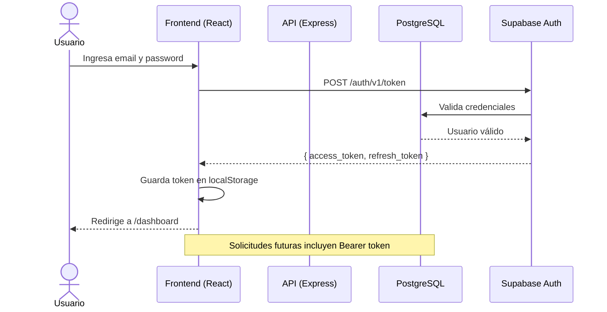
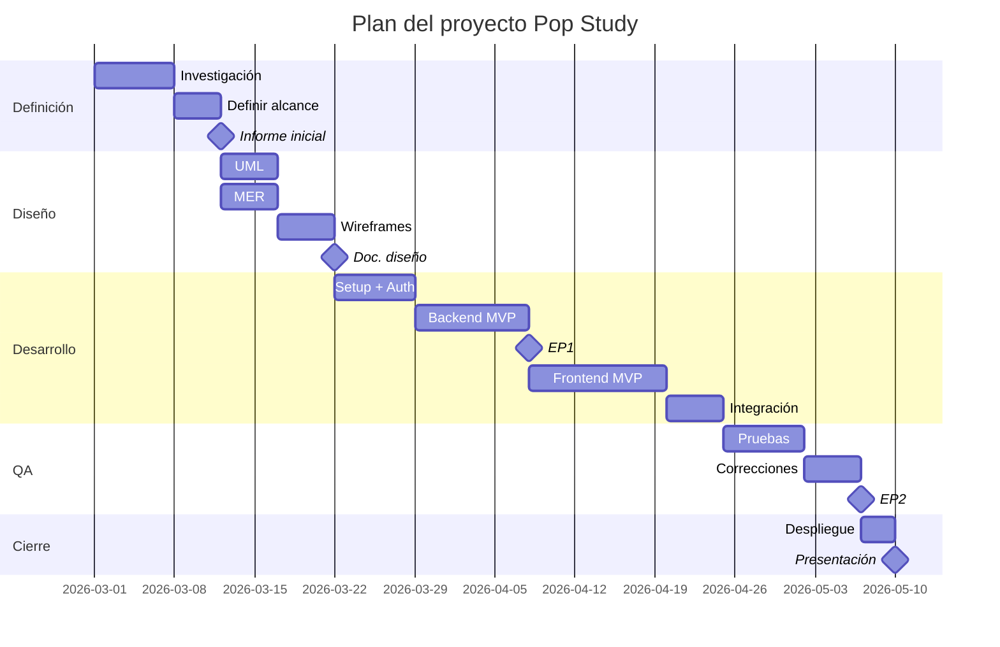
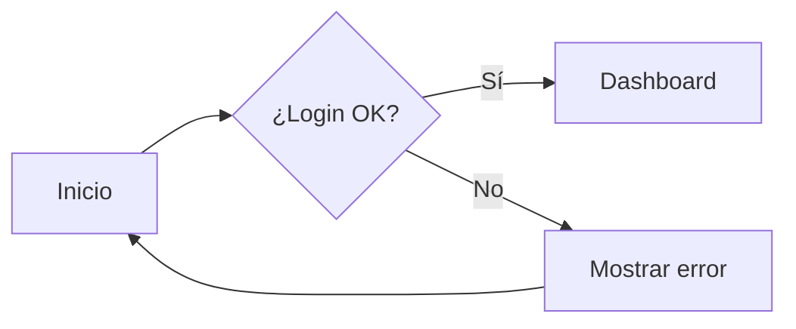
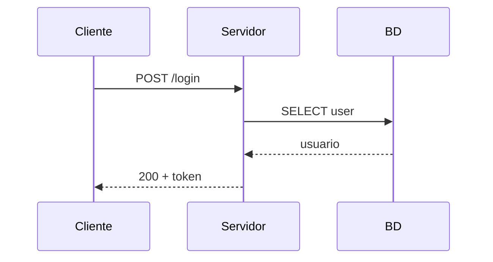
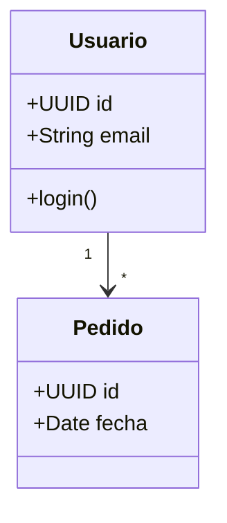
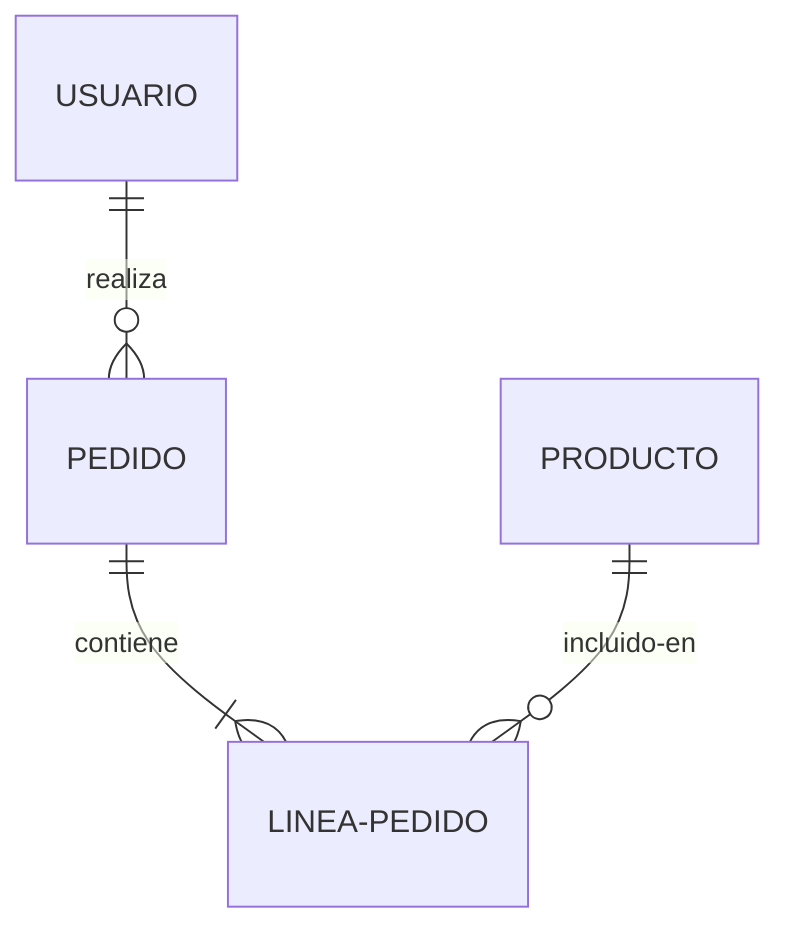
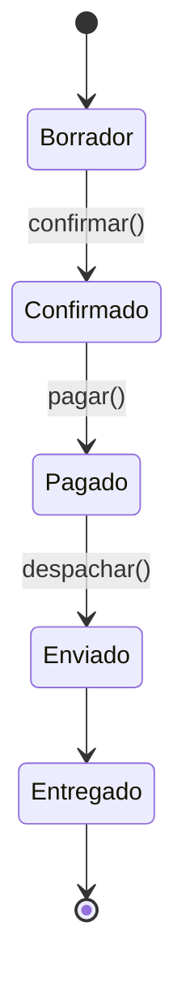

# Actividad de Laboratorio: Documentación Integral del Proyecto — UML, Wireframes, MER, Gantt y Herramientas de Diseño

## Datos generales

**Asignatura:** TPY1101 – Taller Aplicado de Programación
**Duración estimada:** 3 horas (puede dividirse en 2 sesiones de 90 minutos)
**Modalidad:** Individual o en equipos del proyecto (recomendado: equipo completo)
**Sistema operativo considerado:** Windows / macOS / Linux
**Stack de referencia del curso:** React (frontend) + Node.js/Express (backend) + Supabase/PostgreSQL
**Herramientas principales:** Navegador web, editor de texto / VS Code, herramientas online de diagramación.
**Aplicabilidad:** este ejercicio es **agnóstico al stack** y se aplica directamente a tu proyecto del portafolio (MapacheSecure, Deckora, NoLimits, 40dB, Pop Study, Landing Pages IA, Agente X u otros). Todo se hace en el navegador, sin instalaciones pesadas.

---

## 1. Propósito de la actividad

En esta actividad construirás el **paquete completo de documentación técnica y de gestión** que acompaña a cualquier proyecto profesional de software. Vas a pasar de "tengo código que funciona" a "tengo un proyecto que puedo defender, justificar, mantener y entregar".

La documentación no es un trámite académico: en la industria, **el código sin documentación es deuda técnica**. Un proyecto sin diagramas UML, sin modelo de datos, sin wireframes y sin carta Gantt es un proyecto **imposible de escalar, traspasar o auditar**. Empresas como Atlassian, Spotify, Google y AWS publican sus *engineering docs* públicamente porque la documentación es una **decisión técnica de primer nivel**, no decoración.

Al finalizar, deberías ser capaz de:

- distinguir y producir los **principales tipos de documentación** (informe, UML, wireframes, MER, Gantt, plan de pruebas);
- elegir la **herramienta adecuada** para cada artefacto (Excalidraw para bocetos rápidos, Miro para colaboración, draw.io para diagramas formales, Mermaid para diagramas como código);
- modelar tu sistema con al menos **4 tipos de diagramas UML** (casos de uso, clases, secuencia y despliegue);
- diseñar el **Modelo Entidad-Relación (MER)** y traducirlo a un esquema relacional;
- construir **wireframes de baja y alta fidelidad** para tus pantallas principales;
- planificar el proyecto con una **carta Gantt** realista, con dependencias e hitos;
- consolidar todo en una **carpeta `docs/` versionada en Git** que cualquier persona pueda leer y entender;
- justificar técnicamente **por qué** documentaste así y no de otra forma.

---

## 2. Contexto del caso

Imagina que mañana tu equipo recibe un nuevo desarrollador que entra al proyecto. Le entregas el repositorio. **¿Cuánto tiempo tarda en entender qué hace el sistema, cómo se conecta, qué falta y por qué se tomaron ciertas decisiones?** Si la respuesta es "varios días", tu documentación es insuficiente. Si es "media hora con el `docs/`", felicitaciones: tienes un proyecto profesional.

Ese es el estándar de la industria. El proyecto del portafolio se evalúa no solo por **que funcione**, sino por **cómo se planificó, diseñó, modeló y validó**. Los evaluadores quieren ver:

1. **Informe técnico:** ¿qué problema resuelve, para quién, con qué alcance y qué decisiones técnicas se tomaron?
2. **UML:** ¿cómo está estructurado el sistema a nivel de actores, clases y flujos?
3. **MER:** ¿cómo se modelaron los datos y por qué esa normalización?
4. **Wireframes:** ¿cómo se diseñaron las pantallas antes de programar?
5. **Carta Gantt:** ¿cómo se planificó el tiempo, las dependencias y los hitos?
6. **Plan de pruebas:** ¿cómo se validó la calidad?

En este laboratorio vas a producir cada uno de estos artefactos para tu propio proyecto, con herramientas que se usan en empresas reales.

> **Idea clave:** documentar **antes y durante** el desarrollo cuesta horas; documentar **después** o **no documentar** cuesta semanas y mantenimiento eterno.

---

## 3. Producto esperado

Al finalizar la actividad, cada estudiante o equipo debe contar con una carpeta `docs/` en su repositorio con los siguientes artefactos:

1. **`INFORME.md`** — Informe técnico del proyecto (problema, objetivos, alcance, stack, justificación).
2. **`uml/`** — Mínimo 4 diagramas UML:
   - `01_casos_de_uso.png` (o `.drawio` / `.excalidraw`)
   - `02_clases.png`
   - `03_secuencia.png` (del flujo principal)
   - `04_despliegue.png` (arquitectura cloud)
3. **`mer/`** — Modelo Entidad-Relación:
   - `mer.png` (diagrama)
   - `esquema_relacional.md` (con tablas, claves, tipos)
   - `script.sql` (DDL de creación de tablas)
4. **`wireframes/`** — Mínimo 3 pantallas en baja fidelidad + 3 en alta fidelidad.
5. **`gantt/`** — Carta Gantt del proyecto (imagen + archivo editable).
6. **`plan_pruebas.md`** — Estrategia de QA y casos de prueba clave.
7. **`README_DOCS.md`** — Índice navegable que enlaza a todos los documentos.
8. **`REFLEXION_DOCS.md`** — Reflexión final con las preguntas de cierre.

---

## 4. Requisitos previos

Solo necesitas un navegador moderno. Todas las herramientas son gratuitas o tienen plan free suficiente para esta actividad.

### Herramientas a usar (abre cada una y verifica que carga)

| Herramienta | URL | Para qué la usarás |
|---|---|---|
| **Excalidraw** | [excalidraw.com](https://excalidraw.com) | Bocetos rápidos, wireframes de baja fidelidad, esquemas conceptuales |
| **draw.io / diagrams.net** | [app.diagrams.net](https://app.diagrams.net) | Diagramas UML formales, MER, arquitectura, flujos |
| **Miro** | [miro.com](https://miro.com) | Colaboración en tiempo real, user journey maps, lluvia de ideas, mapas mentales |
| **dbdiagram.io** | [dbdiagram.io](https://dbdiagram.io) | MER como código, exportación a SQL |
| **Figma** | [figma.com](https://figma.com) | Wireframes de alta fidelidad y prototipos interactivos |
| **Mermaid Live** | [mermaid.live](https://mermaid.live) | Diagramas como código (versionables en Git) |
| **GanttProject** o **TeamGantt** | [ganttproject.biz](https://www.ganttproject.biz) / [teamgantt.com](https://www.teamgantt.com) | Carta Gantt con dependencias e hitos |
| **PlantUML** (opcional) | [plantuml.com/plantuml](https://www.plantuml.com/plantuml) | UML como código, integrable en Markdown |

> **Recomendación pragmática:** no abras todas a la vez. Usa **Excalidraw** para todo lo conceptual rápido, **draw.io** para los diagramas formales que vas a entregar, **dbdiagram.io** para el MER y **TeamGantt o GanttProject** para la planificación. El resto son opcionales o de apoyo.

### Verificación inicial

1. Crea (si no existe) la carpeta `docs/` dentro de tu repositorio del portafolio.
2. Dentro de `docs/` crea las subcarpetas: `uml/`, `mer/`, `wireframes/`, `gantt/`.
3. Abre Excalidraw y draw.io en pestañas separadas. Verifica que cargan.
4. Ten a la vista el **enlace al repositorio** y un **resumen de una frase** sobre qué hace tu producto.

**Checkpoint 0 aprobado** cuando tienes la estructura de carpetas creada, las herramientas abiertas y un resumen claro de tu producto en una frase.

---

## 5. Organización del tiempo

Distribuye el trabajo de la siguiente forma:

- **Bloque 1 – Panorama de la documentación profesional (15 min)**
- **Bloque 2 – Informe técnico del proyecto (20 min)**
- **Bloque 3 – Diagramas UML (45 min)**
- **Bloque 4 – MER y esquema relacional (25 min)**
- **Bloque 5 – Wireframes (baja y alta fidelidad) (25 min)**
- **Bloque 6 – Carta Gantt y planificación (20 min)**
- **Bloque 7 – Plan de pruebas y QA (15 min)**
- **Bloque 8 – Consolidación, índice y reflexión (15 min)**

**Tiempo total estimado:** 180 minutos (3 horas)

> Si vas con prisa, prioriza Bloques 2, 3, 4 y 5. Bloques 6, 7 y 8 son indispensables para entrega final pero se pueden hacer en sesión asíncrona.

---

# 6. Desarrollo paso a paso

---

## Bloque 1 – Panorama de la documentación profesional (15 minutos)

### 1.1. ¿Por qué documentamos?

En la industria, la documentación cumple **cinco funciones críticas** que el código por sí solo no puede cubrir:

| Función | A quién sirve | Qué pasa si falta |
|---|---|---|
| **Comunicar la intención** | Cliente, stakeholders, nuevos miembros | El equipo construye lo que cree, no lo que se pidió |
| **Justificar decisiones técnicas** | Tribunal, auditores, líder técnico | "¿Por qué usaron Postgres y no Mongo?" → silencio |
| **Reducir el bus factor** | Equipo | Si la persona que sabe se va, el proyecto muere |
| **Servir como contrato** | Frontend ↔ Backend, equipo ↔ cliente | Cada quien implementa una versión distinta |
| **Soportar auditoría y QA** | Testers, oncall, compliance | Bugs imposibles de reproducir, decisiones perdidas |

### 1.2. Tipos de documentación y dónde encajan en el ciclo del proyecto

```
INICIO ──────────► DISEÑO ──────────► DESARROLLO ──────────► QA ──────────► CIERRE
   │                  │                    │                    │              │
INFORME            UML                  CÓDIGO              PLAN DE         REFLEXIÓN
ALCANCE            MER                  COMMITS             PRUEBAS         INFORME
BACKLOG            WIREFRAMES           README              EVIDENCIAS      FINAL
GANTT              ARQUITECTURA         API DOCS            BUG REPORTS     POSTMORTEM
```

| Etapa | Documentación clave |
|---|---|
| **Inicio / Planificación** | Informe inicial, alcance, riesgos, **carta Gantt**, backlog |
| **Diseño** | **UML** (casos de uso, clases, secuencia), **MER**, **wireframes**, arquitectura |
| **Desarrollo** | README, comentarios, commits semánticos, API docs (Swagger/OpenAPI) |
| **QA** | **Plan de pruebas**, casos de prueba, evidencias, bug reports |
| **Cierre** | Informe final, manual de usuario, postmortem, documentación de despliegue |

### 1.3. Las herramientas y su nicho

No hay una "herramienta única buena". Cada una tiene un **caso de uso ideal**:

| Herramienta | Tipo | Fuerte para | Débil para |
|---|---|---|---|
| **Excalidraw** | Boceto a mano alzada | Ideas rápidas, wireframes lo-fi, esquemas mentales, presentaciones | Diagramas muy formales, gran escala |
| **draw.io / diagrams.net** | Diagramación formal | UML, MER, arquitectura, flujos, **incluye librerías AWS/Azure/GCP** | Bocetos rápidos (es más rígido) |
| **Miro** | Pizarra colaborativa | Workshops, user journey, mapas mentales, retros, **multiusuario en vivo** | Diagramas técnicos formales (no es su fuerte) |
| **Figma** | Diseño UI/UX | Wireframes hi-fi, prototipos clicables, componentes | UML, arquitectura, MER |
| **dbdiagram.io** | MER como código | Esquemas de BD rápidos, exporta SQL | Cualquier diagrama que no sea MER |
| **Mermaid** | Diagramas como código | UML simple, diagramas que vivan en Markdown / Git | Diagramas muy elaborados o visuales |
| **PlantUML** | UML como código | UML formal versionable | Curva de aprendizaje |
| **GanttProject / TeamGantt** | Gantt | Planificación con dependencias e hitos | Diagramas técnicos |

> **Regla de oro:** elige la herramienta por el **artefacto**, no por la moda. Un boceto a mano en Excalidraw vale más que un diagrama de draw.io vacío.

**Checkpoint 1 aprobado** cuando puedes explicar con tus palabras: (a) qué documenta cada etapa del ciclo, (b) cuándo usar Excalidraw vs draw.io vs Miro, (c) por qué la documentación reduce el bus factor.

---

## Bloque 2 – Informe técnico del proyecto (20 minutos)

El **informe técnico** es el documento que abre el portafolio. Es lo primero que lee un evaluador (o un cliente). Si no entiende tu proyecto en 3 minutos leyéndolo, perdiste la batalla antes de mostrar código.

### Paso 1. Estructura mínima de un informe profesional

Crea el archivo `docs/INFORME.md` con esta estructura. Cada sección debe estar **completa**, no con texto de relleno.

```markdown
# Informe Técnico — [Nombre del proyecto]

**Equipo:** [nombres]
**Asignatura:** TPY1101 – Taller Aplicado de Programación
**Versión:** 1.0
**Fecha:** [yyyy-mm-dd]
**Repositorio:** [URL]

## 1. Resumen ejecutivo (máx. 200 palabras)
[En un párrafo: qué problema resuelve, para quién, qué se entregó.]

## 2. Problema u oportunidad
- ¿Qué problema concreto se resuelve?
- ¿A quién afecta y con qué frecuencia?
- ¿Cómo se resuelve hoy (sin tu producto)?
- Evidencia: estudios, entrevistas, datos de mercado.

## 3. Solución propuesta
- Descripción del producto en una frase.
- Funcionalidades principales (lista numerada, máximo 8).
- Diferenciadores frente a alternativas existentes.

## 4. Objetivos
### 4.1. Objetivo general
[Una frase con verbo en infinitivo, medible.]

### 4.2. Objetivos específicos
1. ...
2. ...
3. ...
(Cada uno SMART: Específico, Medible, Alcanzable, Relevante, Temporal)

## 5. Alcance
### 5.1. Incluye
- ...

### 5.2. NO incluye (out of scope)
- ...

## 6. Usuarios y stakeholders
| Tipo | Descripción | Necesidad principal |
|---|---|---|
| Usuario final | ... | ... |
| Administrador | ... | ... |
| Stakeholder | ... | ... |

## 7. Stack tecnológico y justificación
| Capa | Tecnología | Por qué se eligió |
|---|---|---|
| Frontend | React + Vite | ... |
| Backend | Node.js + Express | ... |
| Base de datos | PostgreSQL (Supabase) | ... |
| Despliegue | Vercel + Render | ... |
| Auth | Supabase Auth / JWT | ... |

## 8. Arquitectura general (alto nivel)
[Diagrama de bloques + descripción breve de cada componente]

## 9. Metodología de trabajo
- Marco: SCRUM / Kanban / híbrido
- Roles del equipo
- Duración de sprints, ceremonias
- Herramientas de gestión (Jira / Trello / GitHub Projects)

## 10. Cronograma resumido
[Tabla con fases e hitos clave. La carta Gantt completa va en docs/gantt/]

## 11. Riesgos identificados y mitigaciones
| # | Riesgo | Probabilidad | Impacto | Mitigación |
|---|---|---|---|---|
| R1 | ... | Alta/Media/Baja | Alto/Medio/Bajo | ... |

## 12. Conclusión y próximos pasos
- Qué se logró.
- Qué quedó pendiente.
- Plan para versiones futuras.

## 13. Referencias
[Estudios, frameworks, librerías, fuentes consultadas]
```

### Paso 2. Cómo escribirlo bien (consejos rápidos)

- **Resumen ejecutivo último:** escríbelo al final, cuando ya tienes el resto.
- **Una idea por párrafo:** no mezcles "problema + solución" en el mismo bloque.
- **Datos antes que opiniones:** "el 80% de los estudiantes pierde más de 2 h buscando material" pega más que "muchos estudiantes pierden tiempo".
- **Sin marketing:** no escribas "la mejor solución del mercado". Escribe "resuelve X mejor que Y porque Z".
- **Verbo en infinitivo en objetivos:** "Desarrollar...", "Implementar...", "Validar..." (nunca "Que el sistema haga...").

### Paso 3. Anti-patrones a evitar

| Anti-patrón | Por qué falla | Alternativa |
|---|---|---|
| Objetivo "Hacer una app para X" | No es medible, no es SMART | "Desarrollar un MVP web con 5 funcionalidades core, validado con 10 usuarios reales, antes del [fecha]" |
| Alcance "Lo que da el tiempo" | Imposible auditar | Lista cerrada de features + lista explícita de **out of scope** |
| Stack "Usamos React porque es lo que sabemos" | No justifica técnicamente | "Usamos React por el ecosistema de componentes reutilizables (recharts, lucide-react) y para alinear con [otro stack del cliente]" |
| Riesgos genéricos ("falta de tiempo") | Todo proyecto los tiene | Riesgos específicos: "Supabase free-tier limita a 500 MB; si superamos, debemos migrar o pagar; mitigación: monitor en panel" |

**Checkpoint 2 aprobado** cuando tienes `INFORME.md` con todas las secciones completas, objetivos SMART, stack justificado y al menos 3 riesgos específicos con mitigación.

---

## Bloque 3 – Diagramas UML (45 minutos)

UML (*Unified Modeling Language*) es el lenguaje estándar para modelar software desde los años 90. Aunque algunos lo consideren "viejo", **sigue siendo el idioma común** entre desarrolladores, arquitectos y stakeholders técnicos. Saber leer y producir UML es una habilidad **no negociable** en cualquier portafolio profesional.

### 3.1. Los 14 diagramas UML (y cuáles te interesan ahora)

UML tiene 14 tipos de diagramas, agrupados en **estructurales** (lo que el sistema *es*) y **de comportamiento** (lo que el sistema *hace*):

| Categoría | Diagrama | ¿Lo usaremos hoy? | Para qué sirve |
|---|---|---|---|
| **Estructural** | Clases | ✅ Sí | Entidades del dominio, atributos, métodos, relaciones |
| | Componentes | Opcional | Módulos del sistema y sus interfaces |
| | Despliegue | ✅ Sí | Dónde corre cada cosa (servidores, contenedores, cloud) |
| | Paquetes | No | Organización en módulos lógicos |
| | Objetos | No | Instancias en un momento dado |
| | Estructura compuesta | No | Detalle interno de una clase |
| | Perfil | No | Extensiones del lenguaje |
| **Comportamiento** | Casos de uso | ✅ Sí | Qué hace el sistema desde la mirada del usuario |
| | Secuencia | ✅ Sí | Orden de interacciones en un flujo |
| | Actividad | Opcional | Flujo de control tipo "diagrama de proceso" |
| | Estados | Opcional | Estados de un objeto (ej: orden: pendiente → pagada → enviada) |
| | Comunicación | No | Variante del de secuencia |
| | Tiempo | No | Cambios en el tiempo |
| | Visión general de interacción | No | Combina actividad + secuencia |

**Tu objetivo hoy:** los 4 marcados con ✅. Si terminas antes, suma actividad y estados.

---

### Paso 4. Diagrama de Casos de Uso

#### ¿Qué es?

Representa **quién** (actores) hace **qué** (casos de uso) en el sistema. Es el primer diagrama que cualquier evaluador o cliente quiere ver porque responde la pregunta más básica: **"¿para qué sirve esto?"**

#### Elementos

| Elemento | Símbolo | Significado |
|---|---|---|
| **Actor** | Monito de palitos | Persona o sistema externo que interactúa con tu producto |
| **Caso de uso** | Óvalo | Acción que el sistema ofrece |
| **Sistema (boundary)** | Rectángulo | Frontera de tu producto |
| **Asociación** | Línea simple | Actor "x" puede ejecutar caso "y" |
| **<<include>>** | Flecha discontinua | El caso A **siempre** incluye al caso B (ej: "Crear pedido" incluye "Validar stock") |
| **<<extend>>** | Flecha discontinua | El caso B **a veces** extiende al caso A (ej: "Hacer login" extiende a "Recuperar contraseña") |
| **Generalización** | Flecha triángulo blanco | Un actor hereda de otro (ej: "Admin" es-un "Usuario") |

#### Cómo hacerlo en draw.io

1. Abre [app.diagrams.net](https://app.diagrams.net) → Create New Diagram → Blank.
2. En el panel izquierdo, busca **"UML"** y arrastra los símbolos: Actor, Use Case, System Boundary.
3. Coloca los actores **fuera** del rectángulo del sistema; los casos de uso **dentro**.
4. Conecta con líneas. Usa flechas discontinuas con `<<include>>` o `<<extend>>` cuando corresponda.
5. **Exporta** como PNG con fondo blanco: File → Export As → PNG, marca "Transparent Background: No".
6. Guarda como `docs/uml/01_casos_de_uso.png` y también el archivo editable `.drawio`.

#### Ejemplo aplicado (Pop Study)

```
            ┌──────────────────────────────────────────┐
            │              Pop Study                   │
            │                                          │
  Estudiante──── Registrarse                            │
  (actor)       Iniciar sesión                         │
                Subir material                         │
                Generar resumen con IA                 │
                Crear flashcards                       │
                Practicar test                         │
                Ver progreso                           │
                                                       │
  Administrador ── Gestionar usuarios                  │
                   Ver métricas globales               │
            └──────────────────────────────────────────┘
```

> **Regla de buen diseño:** entre **5 y 12 casos de uso** por diagrama. Más es señal de que debes dividir en subdiagramas o que estás bajando demasiado al detalle.

---

### Paso 5. Diagrama de Clases

#### ¿Qué es?

Representa las **entidades del dominio**, sus **atributos**, **métodos** y las **relaciones** entre ellas. Es la "fotografía estructural" de tu modelo de objetos. Es la base sobre la que después se construye el MER (modelo de datos) y el código de las clases reales.

#### Elementos de una clase

```
┌────────────────────────┐
│      NombreClase       │  ← Nombre (centrado, negrita)
├────────────────────────┤
│ - atributo1: Tipo      │  ← Atributos (privados con -, públicos con +, protegidos con #)
│ - atributo2: Tipo      │
├────────────────────────┤
│ + metodo1(): Retorno   │  ← Métodos
│ + metodo2(p: T): R     │
└────────────────────────┘
```

#### Relaciones entre clases

| Relación | Símbolo | Cuándo se usa | Ejemplo |
|---|---|---|---|
| **Asociación** | Línea simple | "A usa/conoce a B" | `Usuario --- Comentario` |
| **Multiplicidad** | Números en extremos | Cuántos a cuántos | `Usuario 1 --- 0..* Pedido` |
| **Agregación** | Línea con rombo blanco | "A tiene B, pero B puede vivir sin A" | `Curso ◇── Estudiante` |
| **Composición** | Línea con rombo negro | "A tiene B, B no existe sin A" | `Factura ◆── LineaFactura` |
| **Herencia** | Flecha con triángulo blanco | "B es-un A" | `Admin ──▷ Usuario` |
| **Realización** | Flecha discontinua con triángulo | "B implementa interfaz A" | `Pago ──┤> IMetodoPago` |
| **Dependencia** | Flecha discontinua | "A usa temporalmente a B" | `Servicio --→ Logger` |

#### Cómo hacerlo en draw.io

1. Nuevo diagrama → busca en el panel izquierdo **"UML"** o usa la plantilla "UML Class Diagram".
2. Arrastra las cajas de clase. Edita doble click para cambiar nombre, atributos y métodos.
3. Para las relaciones, dibuja la línea y haz click derecho → "Edit Style" para cambiar el extremo (rombo, flecha triángulo, etc.) o usa el menú de la línea.
4. **Indica multiplicidad** en los extremos: `1`, `0..1`, `1..*`, `*` (muchos).
5. Exporta a PNG. Guarda en `docs/uml/02_clases.png`.

#### Ejemplo aplicado (Deckora — tienda de decks de cartas)

```
┌────────────────┐         ┌────────────────┐
│   Usuario      │         │     Carta      │
├────────────────┤         ├────────────────┤
│ - id: UUID     │         │ - id: UUID     │
│ - email: str   │         │ - nombre: str  │
│ - password: str│         │ - costo: int   │
│ + login()      │         │ - tipo: str    │
└────────┬───────┘         └────────────────┘
         │ 1                       *  ▲
         │                            │
         │ posee                      │ contiene
         │                            │
         │ *                          │ 1
┌────────▼───────┐         ┌──────────┴─────┐
│     Deck       │ ◆──────│  CartaEnDeck   │
├────────────────┤  1  *   ├────────────────┤
│ - id: UUID     │         │ - cantidad: int│
│ - nombre: str  │         └────────────────┘
│ - publico: bool│
│ + exportar()   │
└────────────────┘
```

> **Tip:** no incluyas getters/setters ni constructores en el diagrama. Solo los métodos **de negocio**. El diagrama no es el código.

---

### Paso 6. Diagrama de Secuencia

#### ¿Qué es?

Modela **el orden temporal** de mensajes entre objetos durante un flujo específico. Responde la pregunta: **"¿cómo cumple el sistema este caso de uso paso a paso?"**

Es el diagrama más útil para documentar la **interacción entre frontend, backend y base de datos** en un flujo crítico (login, pago, generación de reporte).

#### Elementos

| Elemento | Símbolo | Significado |
|---|---|---|
| **Participante** | Rectángulo con nombre arriba | Objeto, actor o sistema |
| **Línea de vida** | Línea punteada vertical | Existencia del participante en el tiempo |
| **Activación** | Rectángulo delgado sobre la línea de vida | Periodo en que el objeto está procesando |
| **Mensaje síncrono** | Flecha sólida con punta cerrada | Llamada que espera respuesta |
| **Mensaje asíncrono** | Flecha sólida con punta abierta | Llamada sin esperar (eventos, queues) |
| **Mensaje de retorno** | Flecha discontinua | Respuesta de un mensaje previo |
| **Fragmento combinado** | Caja con "alt", "loop", "opt" | Condicionales, loops, opcionales |

#### Cómo hacerlo en draw.io

1. Nuevo diagrama → **UML Sequence Diagram**.
2. Arrastra los lifelines (participantes) en horizontal arriba.
3. Dibuja las flechas de mensaje **descendentes en el tiempo** (de arriba hacia abajo).
4. Etiqueta cada flecha con el nombre del método o la acción.
5. Usa fragmentos `alt` para "si pasa esto / si no" y `loop` para iteraciones.
6. Exporta. Guarda como `docs/uml/03_secuencia.png`.

#### Alternativa rápida con Mermaid

Si prefieres **versionarlo en Markdown** (recomendado para Git), usa Mermaid:

````markdown

````

Esto se renderiza directamente en GitHub, GitLab y la mayoría de wikis. **Es la forma moderna de versionar UML.**

#### Ejemplo aplicado (MapacheSecure — login con MFA)

Modela el flujo "Usuario inicia sesión con doble factor":

1. Usuario ingresa credenciales.
2. Frontend llama a backend `POST /login`.
3. Backend valida contra DB y, si OK, genera código y lo envía por email.
4. Usuario ingresa código.
5. Backend valida código y emite JWT.
6. Frontend guarda JWT y redirige.

**Entregable:** este flujo dibujado en draw.io o Mermaid, exportado como `03_secuencia.png`.

---

### Paso 7. Diagrama de Despliegue

#### ¿Qué es?

Muestra **dónde corre físicamente cada cosa** del sistema: qué servidores, qué contenedores, qué servicios cloud, qué protocolos conectan los nodos. Es el puente entre **arquitectura lógica** y **arquitectura física**.

#### Elementos

| Elemento | Símbolo | Significado |
|---|---|---|
| **Nodo** | Cubo 3D | Hardware o entorno de ejecución (servidor, contenedor, navegador) |
| **Artefacto** | Rectángulo con `<<artifact>>` | Lo que se despliega ahí (ej: `app.jar`, `index.html`, container image) |
| **Conexión** | Línea con etiqueta | Protocolo o canal (HTTP, TCP, AMQP) |
| **<<device>>** | Estereotipo | Hardware físico |
| **<<execution environment>>** | Estereotipo | Entorno virtual (JVM, Node.js runtime, container) |

#### Cómo hacerlo en draw.io

1. Nuevo diagrama → **UML Deployment Diagram** o búsqueda "deployment".
2. Para arquitecturas cloud, draw.io trae **librerías oficiales de AWS, Azure, GCP**. Actívalas en el menú izquierdo → "More Shapes" → marca AWS / Azure / GCP.
3. Dibuja los nodos: navegador del usuario, CDN, app server, base de datos, servicios externos.
4. Conecta con líneas etiquetadas con el protocolo y puerto.
5. Exporta y guarda como `docs/uml/04_despliegue.png`.

#### Alternativa: Excalidraw con librería AWS

Si tu arquitectura es 100% AWS, prueba el **skill `aws-excalidraw-diagram`** o la librería oficial de [excalidraw-libraries](https://libraries.excalidraw.com). Es más estilizada y rápida para presentaciones, aunque menos formal que draw.io.

#### Ejemplo aplicado (NoLimits — app fitness)

```
[ Navegador ] ──HTTPS──▶ [ Vercel CDN ]
                            │
                            │ static files (React build)
                            ▼
                    [ Cliente JS en el navegador ]
                            │
                            │ HTTPS/REST + JWT
                            ▼
                  [ Render — Node.js + Express ]
                            │
                            │ TCP/5432
                            ▼
                  [ Supabase — PostgreSQL ]
                            │
                            │ Storage API
                            ▼
                  [ Supabase Storage — Buckets ]
```

> **Tip:** el diagrama de despliegue debe **coincidir exactamente** con cómo lo tienes hoy en cloud. Si está desactualizado, vale menos que no tenerlo.

**Checkpoint 3 aprobado** cuando tienes los 4 PNG en `docs/uml/`: casos de uso, clases, secuencia y despliegue, **junto con sus archivos editables** (`.drawio` o `.mmd`). Cada diagrama debe tener al menos un caso de uso real de tu proyecto.

---

## Bloque 4 – MER y esquema relacional (25 minutos)

El **Modelo Entidad-Relación (MER)** es la base de datos antes de ser SQL. Si no diseñas el MER, terminas con tablas inconsistentes, datos duplicados y queries imposibles.

### 4.1. Concepto rápido

| Elemento | En el MER | En SQL |
|---|---|---|
| **Entidad** | Rectángulo | Tabla |
| **Atributo** | Óvalo o línea dentro de la entidad | Columna |
| **Clave primaria** | Subrayado en el atributo | `PRIMARY KEY` |
| **Relación** | Rombo entre entidades | `FOREIGN KEY` |
| **Cardinalidad** | Notación (1:1, 1:N, N:M) | Diseño de tablas + tabla puente |

### 4.2. Notaciones más usadas

| Notación | Descripción | Cuándo usarla |
|---|---|---|
| **Chen** | La clásica de los años 70: óvalos para atributos, rombos para relaciones | Académica, didáctica |
| **Crow's Foot (Pata de gallo)** | Las relaciones se notan con símbolos en los extremos | Industria, herramientas modernas |
| **UML class diagram** | Usar diagrama de clases para modelar datos | Cuando ya hiciste clases |

Para esta actividad usaremos **Crow's Foot**, que es el estándar en herramientas como dbdiagram.io y draw.io.

### Paso 8. Diseñar el MER paso a paso

#### Paso 8.1. Identificar entidades

Lista los **sustantivos importantes** del dominio. Para Pop Study, podrían ser:

`Usuario`, `Curso`, `Material`, `Resumen`, `Flashcard`, `Test`, `Resultado`.

> Si un "sustantivo" en realidad es un atributo de otro (ej: "Dirección" puede ser atributo de `Usuario` si solo guardas una, o entidad si guardas varias), decide ahora.

#### Paso 8.2. Para cada entidad, listar atributos

```
Usuario: id, email, password_hash, nombre, fecha_registro, rol
Material: id, titulo, tipo (pdf, video, link), url, fecha_subida, usuario_id
Flashcard: id, frente, reverso, dificultad, material_id, usuario_id
```

> **Regla:** todo atributo debe ser **atómico** (no listas, no JSON con estructura). Si necesitas listas, eso ya es otra entidad con relación.

#### Paso 8.3. Definir claves

- **Clave primaria (PK):** identifica únicamente cada fila. Recomendado `UUID` o `BIGSERIAL`.
- **Claves foráneas (FK):** referencias a otras tablas (ej: `material.usuario_id → usuario.id`).
- **Claves únicas (UNIQUE):** atributos que no se repiten (ej: `usuario.email`).

#### Paso 8.4. Modelar relaciones

| Cardinalidad | Cómo se implementa |
|---|---|
| **1:1** | FK en una de las dos tablas, marcada `UNIQUE` |
| **1:N** | FK en el lado "N" |
| **N:M** | Tabla puente con dos FK (ej: `usuario_curso(usuario_id, curso_id)`) |

#### Paso 8.5. Normalización (al menos 3FN)

Verifica que cumples:

- **1FN:** valores atómicos (nada de "tags: 'js, html, css'", eso va en otra tabla).
- **2FN:** todo atributo depende de la **clave completa**, no solo de parte.
- **3FN:** no hay dependencias transitivas (ej: si `pedido.cliente_id` ya está, no guardes `pedido.cliente_nombre`).

> **Cuándo desnormalizar:** solo si pruebas que un join es prohibitivamente lento. La regla del oficio es: **normaliza primero, optimiza con datos en mano**.

### Paso 9. Construir el MER en dbdiagram.io

[dbdiagram.io](https://dbdiagram.io) es la forma más rápida hoy. Modelas en código DBML y exportas a SQL y a imagen.

```dbml
Table usuario {
  id uuid [pk]
  email varchar [unique, not null]
  password_hash varchar [not null]
  nombre varchar
  fecha_registro timestamp [default: `now()`]
  rol varchar [note: 'admin | estudiante']
}

Table material {
  id uuid [pk]
  titulo varchar [not null]
  tipo varchar [note: 'pdf | video | link']
  url varchar
  fecha_subida timestamp [default: `now()`]
  usuario_id uuid [ref: > usuario.id]
}

Table flashcard {
  id uuid [pk]
  frente text [not null]
  reverso text [not null]
  dificultad int [default: 1]
  material_id uuid [ref: > material.id]
}

Table test {
  id uuid [pk]
  titulo varchar
  material_id uuid [ref: > material.id]
  fecha_creacion timestamp [default: `now()`]
}

Table resultado {
  id uuid [pk]
  usuario_id uuid [ref: > usuario.id]
  test_id uuid [ref: > test.id]
  puntaje int
  fecha timestamp [default: `now()`]
}
```

1. Pega esto en dbdiagram.io adaptado a tu dominio.
2. Exporta como PNG → guarda en `docs/mer/mer.png`.
3. Exporta como SQL → guarda en `docs/mer/script.sql`.

### Paso 10. Alternativa: MER en draw.io

Si prefieres modelar visualmente:

1. draw.io → busca "Entity Relation" en el panel.
2. Arrastra entidades, conecta con líneas Crow's Foot.
3. En cada línea, configura los extremos: `1` o `N` o `0..1` etc.

### Paso 11. Documentar el esquema relacional

Crea `docs/mer/esquema_relacional.md`:

```markdown
# Esquema Relacional — [Proyecto]

## Tabla: usuario
| Columna | Tipo | Restricciones | Descripción |
|---|---|---|---|
| id | UUID | PK | Identificador único |
| email | VARCHAR(255) | UNIQUE, NOT NULL | Correo de login |
| password_hash | VARCHAR | NOT NULL | Hash bcrypt |
| nombre | VARCHAR(120) | | Nombre visible |
| fecha_registro | TIMESTAMP | DEFAULT NOW() | |
| rol | VARCHAR(20) | NOT NULL | "admin" o "estudiante" |

## Tabla: material
| Columna | Tipo | Restricciones | Descripción |
|---|---|---|---|
| id | UUID | PK | |
| titulo | VARCHAR(200) | NOT NULL | |
| tipo | VARCHAR(20) | CHECK IN ('pdf','video','link') | |
| url | TEXT | | |
| fecha_subida | TIMESTAMP | DEFAULT NOW() | |
| usuario_id | UUID | FK → usuario(id) | |

[Repetir para cada tabla]

## Diagrama


## Decisiones tomadas
- Uso UUID y no SERIAL por: ...
- Normalización hasta 3FN porque: ...
- Tabla intermedia `usuario_curso` para relación N:M.
- Cascadas: ON DELETE CASCADE en flashcard porque si se borra material, las flashcards no tienen sentido.
```

**Checkpoint 4 aprobado** cuando tienes `mer.png`, `esquema_relacional.md` y `script.sql` con al menos 5 tablas y 3 relaciones. Cada tabla debe tener PK definida y FKs documentadas.

---

## Bloque 5 – Wireframes (baja y alta fidelidad) (25 minutos)

Un **wireframe** es el esqueleto visual de una pantalla, sin colores ni decoración. Sirve para **definir layout y jerarquía** antes de programar. Programar sin wireframes es como construir una casa sin planos.

### 5.1. Baja vs alta fidelidad

| | **Baja fidelidad (lo-fi)** | **Alta fidelidad (hi-fi)** |
|---|---|---|
| Aspecto | Cajas grises, líneas, etiquetas | Cercano al producto final |
| Color | Solo gris/blanco/negro | Paleta real del proyecto |
| Tipografía | Genérica (Sans-Serif default) | Tipografía oficial del producto |
| Imágenes | Placeholders (X dentro de un rectángulo) | Imágenes reales |
| Herramientas típicas | **Excalidraw**, papel, Balsamiq | **Figma**, Adobe XD, Sketch |
| Cuándo | Diseño temprano, validación de flujo | Antes de implementar, demo a cliente |

### Paso 12. Wireframes lo-fi en Excalidraw

#### Por qué Excalidraw

Excalidraw tiene un estilo "a mano alzada" que **comunica que es un boceto, no algo final**. Esto es psicológicamente importante: nadie discute el color del botón cuando el wireframe se ve hecho a mano; en cambio, sí discuten el flujo y la jerarquía, que es lo que te interesa.

#### Cómo hacerlo

1. Abre [excalidraw.com](https://excalidraw.com).
2. Para cada pantalla:
   - dibuja un **rectángulo grande** que represente la viewport (puedes usar 1440×900 para desktop o 375×812 para móvil);
   - dentro, dibuja rectángulos para representar header, sidebar, contenido, footer;
   - usa el icono de texto para etiquetar "Logo", "Nav", "CTA", "Lista de productos", etc.;
   - usa líneas onduladas para representar texto largo, sin escribir párrafos.
3. Cubre **al menos 3 pantallas**: landing/login, pantalla principal (dashboard) y un flujo crítico (formulario, detalle, etc.).
4. Exporta cada pantalla como PNG: File → Export image → PNG.
5. Guarda en `docs/wireframes/lofi-01-login.png`, `lofi-02-dashboard.png`, `lofi-03-detalle.png`.

#### Heurísticas de un buen wireframe lo-fi

- **No uses colores.** Si los usas, el lector se distrae.
- **Etiqueta los CTAs primarios.** "Btn primario" o "[Guardar]" es suficiente.
- **Marca jerarquía con tamaño.** El título del bloque es más grande, no más colorido.
- **No dibujes ícono específico.** Pon `[icon]` o un cuadradito.
- **Una pantalla por archivo.** Es más fácil iterar y reemplazar.

### Paso 13. Wireframes hi-fi en Figma

#### Por qué Figma

Figma es **el estándar de la industria** para diseño de producto. Es gratis para uso personal/educativo, corre en navegador, tiene componentes reutilizables, prototipado clicable y se conecta directo con desarrolladores (export a CSS, tokens, etc.).

#### Cómo hacerlo

1. Crea cuenta en [figma.com](https://figma.com).
2. **New design file** → activa el frame de tu dispositivo (Desktop 1440 o iPhone 14).
3. Replica las pantallas lo-fi con:
   - tus **colores oficiales** (de `tokens.css` si hiciste el Ejercicio 8);
   - tu **tipografía oficial**;
   - **componentes reales** (botones, inputs, cards) en lugar de cajas grises;
   - **datos plausibles** (no "Lorem ipsum"; pon contenido real).
4. Para componentes reutilizables: crea un Frame, click derecho → "Create component". Luego cualquier instancia hereda los cambios.
5. **Exporta** cada pantalla: selecciona el frame → Export → PNG @2x.
6. Guarda como `docs/wireframes/hifi-01-login.png`, etc.

#### Plantillas y atajos

- **Wireframe kit gratis:** busca en Figma Community "wireframe kit" → duplica cualquiera al tuyo.
- **Component libraries:** Material UI, Ant Design, shadcn/ui — todos tienen versión en Figma.
- **Tip de productividad:** diseña primero **móvil** y luego adapta a desktop. Es más fácil agrandar que reducir.

### Paso 14. Prototipo clicable (opcional pero recomendado)

En Figma, ve a la pestaña **Prototype**, conecta las pantallas con flechas (al hacer click en "Login" → ir a "Dashboard"). Esto te permite **demostrar el flujo** en vivo durante la presentación, sin haber escrito una sola línea de código.

Comparte el link con permisos `View` y pégalo en `README_DOCS.md`.

### Paso 15. Documentar las decisiones

En `docs/wireframes/README.md`:

```markdown
# Wireframes — [Proyecto]

## Lo-fi (Excalidraw)
- [Pantalla 01 - Login](lofi-01-login.png)
- [Pantalla 02 - Dashboard](lofi-02-dashboard.png)
- [Pantalla 03 - Detalle](lofi-03-detalle.png)

## Hi-fi (Figma)
- [Pantalla 01 - Login](hifi-01-login.png)
- [Pantalla 02 - Dashboard](hifi-02-dashboard.png)
- [Pantalla 03 - Detalle](hifi-03-detalle.png)

## Prototipo interactivo
[Ver en Figma](https://www.figma.com/...)

## Decisiones de diseño
1. **Login centrado y sin distracciones:** seguimos el patrón de Notion/Linear porque...
2. **Dashboard tipo "Inbox":** en lugar de cards, lista densa porque el usuario consulta muchas veces al día...
3. **Sin sidebar en móvil:** menú hamburguesa porque el ancho es insuficiente...
```

**Checkpoint 5 aprobado** cuando tienes 3 wireframes lo-fi en Excalidraw + 3 hi-fi en Figma + un `README.md` explicando las decisiones.

---

## Bloque 6 – Carta Gantt y planificación (20 minutos)

La **carta Gantt** muestra qué se hace cuándo, quién lo hace, cuánto dura y qué depende de qué. Es la columna vertebral de la gestión de proyectos desde 1910. Sigue siendo indispensable porque responde la pregunta "¿llegamos a tiempo?".

### 6.1. Anatomía de una carta Gantt

| Elemento | Descripción |
|---|---|
| **Tarea** | Una unidad de trabajo con inicio y fin |
| **Duración** | Días/horas de la tarea |
| **Dependencia** | "B no puede empezar hasta que A termine" (FS), "B empieza cuando A empieza" (SS), etc. |
| **Hito (milestone)** | Punto sin duración pero crítico (ej: "Entrega EP1", "Despliegue producción") |
| **Responsable** | Quién es accountable de la tarea |
| **Recurso** | Tiempo/persona asignada |
| **Ruta crítica** | Cadena de tareas dependientes que define la duración mínima del proyecto |

### 6.2. Estructura de fases sugerida para tu proyecto

Adapta a tu calendario académico:

```
Fase 1 – Definición y planificación (semanas 1-2)
   - Investigación del problema
   - Definición de alcance
   - Stack tecnológico
   - Hito: Informe inicial entregado

Fase 2 – Diseño (semanas 3-4)
   - UML completo
   - MER
   - Wireframes
   - Hito: Documentación de diseño entregada

Fase 3 – Desarrollo Sprint 1 (semanas 5-7)
   - Setup repos, CI/CD
   - Auth y modelo de datos
   - Backend MVP
   - Hito: Entrega Parcial 1 (EP1)

Fase 4 – Desarrollo Sprint 2 (semanas 8-10)
   - Frontend MVP
   - Integración
   - Hito: Demo interna

Fase 5 – QA y refinamiento (semanas 11-12)
   - Pruebas funcionales
   - Pruebas de seguridad
   - Correcciones
   - Hito: Entrega Parcial 2 (EP2)

Fase 6 – Cierre (semanas 13-14)
   - Despliegue producción
   - Documentación final
   - Presentación
   - Hito: Entrega Final (EF)
```

### Paso 16. Construir la Gantt en GanttProject (desktop)

1. Descarga [GanttProject](https://www.ganttproject.biz) (gratis, multiplataforma).
2. New Project → completa nombre, fechas.
3. Para cada fase: New Task → ingresa nombre, fecha inicio, duración.
4. **Anida** subtareas con TAB.
5. **Conecta dependencias:** click derecho sobre una tarea → Properties → Predecessors.
6. Marca hitos: en propiedades, marca "Milestone".
7. Asigna responsables: tab "Resources" → New Resource → asigna en las tareas.
8. **Exporta:** Project → Export → PNG image (para `docs/gantt/gantt.png`) y guarda también el archivo `.gan` (editable).

### Paso 17. Alternativa: TeamGantt o ProjectLibre (online)

- [TeamGantt](https://www.teamgantt.com) (free hasta 3 personas, online).
- [ProjectLibre](https://www.projectlibre.com) (open source, similar a MS Project).
- [Tom's Planner](https://www.tomsplanner.com) (online, drag & drop).

### Paso 18. Alternativa rápida: Mermaid Gantt

Si quieres versionarla en Markdown:

````markdown

````

Pégalo en `docs/gantt/gantt.md` y se renderiza directo en GitHub.

### Paso 19. Validar la planificación

| Pregunta | Cómo validar |
|---|---|
| ¿La ruta crítica cabe en el calendario? | Suma duraciones de la cadena más larga de tareas dependientes |
| ¿Hay holguras suficientes? | Tareas no críticas deben tener buffer del 10-20% |
| ¿Los hitos coinciden con entregas reales del curso? | EP1, EP2, EF marcadas con fecha real |
| ¿Cada tarea tiene responsable? | Sin responsable, no se ejecuta |
| ¿Las dependencias están bien? | "Desplegar producción" no puede ir antes de "Pasar pruebas" |

**Checkpoint 6 aprobado** cuando tienes `gantt.png`, archivo editable (`.gan`, `.mpp`, `.mmd` o link a TeamGantt) y un párrafo en `docs/gantt/README.md` explicando la ruta crítica.

---

## Bloque 7 – Plan de pruebas y QA (15 minutos)

### 7.1. Por qué documentar QA antes de testear

Sin plan de pruebas no sabes qué probaste, qué quedó sin probar y qué hacer cuando algo falle. Es la diferencia entre "lo probé un poco" (no se acepta en industria) y "ejecuté el 95% de los casos prioritarios con 0 críticos abiertos" (se acepta).

### Paso 20. Estructura del `plan_pruebas.md`

```markdown
# Plan de Pruebas — [Proyecto]

## 1. Alcance
[Qué se prueba y qué NO se prueba en esta versión]

## 2. Tipos de prueba a ejecutar
- [ ] Pruebas unitarias (responsable: dev backend)
- [ ] Pruebas de integración (responsable: dev backend)
- [ ] Pruebas funcionales (responsable: QA)
- [ ] Pruebas de UI / E2E (responsable: QA con Playwright/Cypress)
- [ ] Pruebas de seguridad básicas (OWASP Top 10 — responsable: equipo)
- [ ] Pruebas de carga (opcional — JMeter o k6)
- [ ] Pruebas de accesibilidad (axe DevTools / Lighthouse)

## 3. Ambientes
| Ambiente | URL | Datos | Cuándo se prueba |
|---|---|---|---|
| Local | localhost | mock | dev diaria |
| Staging | staging.app.com | seed reset diario | antes de cada PR a main |
| Producción | app.com | real | smoke test post-deploy |

## 4. Criterios de aceptación
- 0 bugs críticos abiertos
- ≤ 3 bugs mayores abiertos
- Cobertura unitaria ≥ 60%
- Todas las pantallas pasan Lighthouse Accessibility ≥ 80
- Los 5 flujos críticos del usuario funcionan end-to-end

## 5. Casos de prueba críticos
| ID | Caso | Pasos | Resultado esperado | Severidad |
|---|---|---|---|---|
| CP01 | Login válido | 1. Ir a /login 2. Ingresar email correcto 3. Ingresar pwd correcto 4. Click "Entrar" | Redirección a /dashboard con sesión activa | Crítico |
| CP02 | Login inválido | 1. /login 2. Email correcto 3. Pwd incorrecta 4. Click "Entrar" | Mensaje "Credenciales inválidas" sin exponer cuál falló | Alto |
| CP03 | Crear recurso | ... | ... | Alto |
| CP04 | Subir archivo > tamaño máx | ... | Error claro "Archivo excede 5MB" | Medio |

## 6. Registro de defectos
[Plantilla o link a Jira/GitHub Issues con tag `bug`]

## 7. Métricas
- Tasa de éxito (pass rate)
- Densidad de defectos
- Tiempo medio de resolución

## 8. Herramientas
- Jest / Vitest para unit
- Supertest para API
- Playwright para E2E
- ZAP / Burp Suite para seguridad básica
- Lighthouse para performance y accesibilidad
```

### Paso 21. Mínimo viable para entregar

Para esta actividad documenta al menos:

- 10 casos de prueba críticos (formato tabla);
- los 5 flujos críticos del usuario que **deben funcionar siempre**;
- criterios de aceptación numéricos (no "cuando funcione bien").

**Checkpoint 7 aprobado** cuando tienes `plan_pruebas.md` con alcance, ambientes, criterios y mínimo 10 casos de prueba.

---

## Bloque 8 – Consolidación, índice y reflexión (15 minutos)

### Paso 22. Crear el índice `README_DOCS.md`

Crea `docs/README_DOCS.md` como **mapa navegable** de toda la documentación:

```markdown
# Documentación del Proyecto — [Nombre]

> Carpeta `docs/` · Versión 1.0 · [fecha]

Esta carpeta contiene **toda la documentación técnica y de gestión** del proyecto.
Si entras nuevo al equipo, **empieza aquí**.

## 1. Informe técnico
- [INFORME.md](./INFORME.md) — Problema, objetivos, alcance, stack, riesgos.

## 2. Modelado del sistema (UML)
- [Casos de uso](./uml/01_casos_de_uso.png)
- [Diagrama de clases](./uml/02_clases.png)
- [Diagrama de secuencia](./uml/03_secuencia.png) — Flujo de login con MFA
- [Diagrama de despliegue](./uml/04_despliegue.png)

## 3. Modelo de datos
- [Diagrama MER](./mer/mer.png)
- [Esquema relacional](./mer/esquema_relacional.md)
- [Script SQL de creación](./mer/script.sql)

## 4. Diseño visual
- [Wireframes lo-fi](./wireframes/) (Excalidraw)
- [Wireframes hi-fi](./wireframes/) (Figma)
- [Prototipo interactivo](https://www.figma.com/...)

## 5. Planificación
- [Carta Gantt](./gantt/gantt.png)
- [Archivo editable](./gantt/gantt.gan)

## 6. Calidad
- [Plan de pruebas](./plan_pruebas.md)

## 7. Reflexión
- [Reflexión del proceso](./REFLEXION_DOCS.md)

## 8. Cómo contribuir a la documentación
- Los diagramas se editan en draw.io o Excalidraw.
- Los archivos `.drawio` y `.excalidraw` están versionados en Git.
- Para Mermaid, edita los `.md` directamente; se renderizan en GitHub.
- Las actualizaciones de diagramas requieren commit con prefijo `docs:`.
```

### Paso 23. Versionar todo en Git

```bash
git checkout -b feature/documentacion-completa
git add docs/
git commit -m "docs: agregar documentación integral del proyecto

- Informe técnico con objetivos SMART y stack justificado
- Diagramas UML: casos de uso, clases, secuencia, despliegue
- MER + esquema relacional + script SQL
- Wireframes lo-fi (Excalidraw) y hi-fi (Figma)
- Carta Gantt con ruta crítica y hitos
- Plan de pruebas con 10 casos críticos
- Índice navegable en docs/README_DOCS.md"
git push origin feature/documentacion-completa
```

Luego abre un Pull Request hacia `main` y pide revisión a tu equipo.

### Paso 24. Reflexión final (responder en `REFLEXION_DOCS.md`)

1. **Diagrama más útil:** ¿cuál de los 4 UML te sirvió más para entender tu propio sistema y por qué?
2. **Diagrama más difícil:** ¿cuál fue el más complicado de hacer? ¿Qué te bloqueaba: la herramienta, el modelado, la decisión?
3. **MER:** ¿qué problemas encontraste al normalizar? ¿Alguna tabla que tuviste que dividir o unir?
4. **Wireframes lo-fi vs hi-fi:** ¿qué decisión cambió de la versión lo-fi a la hi-fi? Da un ejemplo concreto.
5. **Herramientas:** ¿en qué casos elegiste Excalidraw y en cuáles draw.io? Justifica con un ejemplo.
6. **Gantt y realidad:** mira tu carta Gantt y compara con el estado real del proyecto hoy. ¿Estás atrasado, a tiempo o adelantado? ¿Qué tareas subestimaste?
7. **Plan de pruebas:** ¿qué caso crítico se te había pasado antes de hacer este ejercicio?
8. **Documentación viva:** ¿cuál de estos documentos vas a actualizar mensualmente y cuál se va a quedar "congelado"? ¿Por qué?
9. **Si un dev entra mañana** y solo tiene 30 minutos para leer tu `docs/`, ¿qué tres documentos le harías leer primero?
10. **Costo-beneficio:** ¿valió la pena el tiempo invertido en documentar? ¿Qué documentación te ahorrará horas más adelante?

### Paso 25. Cierre

Escribe un párrafo final en `REFLEXION_DOCS.md`:

- ¿Qué documento te dio más sorpresas al escribirlo (descubriste algo que no sabías)?
- ¿Qué cambio en el código vas a hacer **mañana** producto de haber documentado?
- Si tuvieras que repetir esta actividad en otro proyecto, ¿qué harías diferente?

**Checkpoint 8 aprobado** cuando tienes `README_DOCS.md` navegable, todo commiteado en Git y `REFLEXION_DOCS.md` con las 10 preguntas respondidas.

---

## 7. Entregables

Carpeta `docs/` dentro del repositorio del proyecto, con la siguiente estructura:

```
docs/
├── README_DOCS.md
├── INFORME.md
├── REFLEXION_DOCS.md
├── plan_pruebas.md
├── uml/
│   ├── 01_casos_de_uso.png
│   ├── 01_casos_de_uso.drawio
│   ├── 02_clases.png
│   ├── 02_clases.drawio
│   ├── 03_secuencia.png
│   ├── 03_secuencia.mmd     (o .drawio)
│   ├── 04_despliegue.png
│   └── 04_despliegue.drawio
├── mer/
│   ├── mer.png
│   ├── esquema_relacional.md
│   └── script.sql
├── wireframes/
│   ├── README.md
│   ├── lofi-01-login.png
│   ├── lofi-02-dashboard.png
│   ├── lofi-03-detalle.png
│   ├── hifi-01-login.png
│   ├── hifi-02-dashboard.png
│   └── hifi-03-detalle.png
└── gantt/
    ├── gantt.png
    ├── gantt.gan          (o gantt.mmd)
    └── README.md
```

### Mínimos por tipo

- **Informe:** las 13 secciones completas, objetivos SMART, stack justificado, ≥3 riesgos.
- **UML:** 4 diagramas (casos de uso, clases, secuencia, despliegue), con archivo editable.
- **MER:** ≥5 tablas, ≥3 relaciones, normalización ≥ 3FN, script SQL ejecutable.
- **Wireframes:** 3 lo-fi + 3 hi-fi de pantallas distintas.
- **Gantt:** ≥6 fases, hitos marcados, dependencias visibles, ruta crítica identificada.
- **Plan de pruebas:** ≥10 casos críticos, criterios de aceptación cuantitativos.
- **Reflexión:** 10 preguntas respondidas + párrafo de cierre.

---

## 8. Criterios de logro

Se espera que el estudiante:

- documente su proyecto con el **conjunto completo** de artefactos profesionales (informe, UML, MER, wireframes, Gantt, plan de pruebas);
- **elija la herramienta adecuada** para cada artefacto (Excalidraw para bocetos, draw.io para diagramas formales, Figma para hi-fi, dbdiagram.io para MER, GanttProject para planificación);
- modele su sistema con **al menos 4 tipos de UML** correctamente notados;
- diseñe un **MER normalizado** (≥3FN) y lo traduzca a SQL ejecutable;
- planifique con una **Gantt realista** que identifique ruta crítica e hitos;
- consolide todo en una carpeta `docs/` con un **índice navegable**;
- **justifique** cada decisión de modelado/diseño con razones técnicas, no estéticas;
- versione la documentación en Git con mensajes de commit semánticos (`docs:`).

---

## 9. Desafío opcional para quienes terminen antes

### Opción A: Diagrama de actividad para un flujo complejo

Modela el flujo "Generar resumen con IA" (o el equivalente en tu proyecto) con un **diagrama de actividad UML**, incluyendo decisiones, paralelismos y excepciones.

### Opción B: Diagrama de estados para una entidad clave

Para una entidad con ciclo de vida (ej: `Pedido`: borrador → confirmado → pagado → enviado → entregado), modela todos los estados y transiciones, con eventos y condiciones de guardia.

### Opción C: User Journey Map en Miro

Usa Miro para construir un **user journey map** con: pasos del usuario, emociones (😊😐😞), touchpoints y oportunidades de mejora. Es un artefacto de UX que complementa los wireframes.

### Opción D: Mapa de empatía y persona

En Miro, crea un **mapa de empatía** y al menos **2 personas** representativas. Documenta sus metas, frustraciones y contexto.

### Opción E: Arquitectura AWS con Excalidraw

Si tu despliegue usa AWS, recrea el diagrama de despliegue usando la **librería oficial de iconos AWS para Excalidraw**, siguiendo las convenciones de color del Well-Architected Framework.

### Opción F: PlantUML versionado

Reescribe los 4 diagramas UML en **PlantUML** y versiona los `.puml` en `docs/uml/src/`. Genera los PNG automáticamente con un workflow de GitHub Actions.

### Opción G: API documentada con OpenAPI/Swagger

Si tu proyecto tiene API REST, crea un archivo `openapi.yaml` describiendo todos los endpoints (paths, request/response, schemas). Usa [Swagger Editor](https://editor.swagger.io) para validarlo. Esta es la **API documentation profesional** que se entrega a integradores.

---

## 10. Reglas mínimas de la actividad

### Reglas de los diagramas

- **Todo diagrama debe tener título** (qué es) y **leyenda** si la simbología no es obvia.
- **Editables versionados:** entrega siempre el `.drawio`, `.excalidraw`, `.gan` o `.mmd`, no solo el PNG.
- **Coherencia:** las clases del UML deben corresponderse con las tablas del MER (puede haber alguna diferencia, pero documentada).
- **Datos plausibles:** ni en wireframes ni en ejemplos uses Lorem ipsum. Pon contenido del dominio real.

### Reglas del informe

- **Objetivos SMART:** específicos, medibles, alcanzables, relevantes, temporales.
- **Stack justificado:** una razón técnica por tecnología, no "porque lo conocemos".
- **Riesgos concretos:** "Supabase free-tier limita 500 MB", no "puede haber problemas".

### Reglas del MER

- **Normalización ≥3FN.** Documentar cualquier desnormalización intencional.
- **PK obligatoria** en cada tabla.
- **FKs explícitas** con su política de cascada (ON DELETE/UPDATE).
- **Restricciones** (CHECK, UNIQUE, NOT NULL) declaradas donde apliquen.

### Reglas de los wireframes

- **Lo-fi sin colores** (gris/blanco/negro).
- **Hi-fi con paleta y tipografía oficial** del proyecto.
- **Una pantalla por archivo.**
- **3 pantallas mínimo** en cada fidelidad.

### Reglas de la Gantt

- **Mínimo 6 fases.**
- **Hitos marcados** (EP1, EP2, EF u otros).
- **Dependencias visibles** entre tareas.
- **Responsables asignados** a cada tarea.

### Reglas de versionamiento

- **Carpeta `docs/`** en la raíz del repo.
- **Commits con prefijo `docs:`** para cambios de documentación.
- **PR hacia main** con revisión del equipo.

---

## 11. Cierre de la actividad

Al terminar, redacta una conclusión breve respondiendo:

1. ¿Qué parte de la documentación te resultó más natural y cuál más forzada?
2. ¿Qué documento de los que escribiste hoy va a evolucionar con cada sprint y cuál se va a quedar estático?
3. ¿Qué decisión técnica tuviste que **revisar** porque al documentarla te diste cuenta de que no se sostenía?

> **Recordatorio final:** la documentación no es lo que haces "cuando el código está listo". Es lo que **te obliga a pensar antes de programar**. Un proyecto bien documentado no es un proyecto con muchos archivos `.md`: es un proyecto cuyas decisiones se pueden **explicar, defender y reconstruir**. Ese es el estándar profesional.

---

## Anexo A — Resumen de cada tipo de documento

| Documento | Para qué sirve | Cuándo se hace | Herramienta recomendada |
|---|---|---|---|
| **Informe técnico** | Comunicar problema, solución y decisiones | Inicio del proyecto y actualización en cada entrega | Markdown en Git |
| **Casos de uso (UML)** | Mostrar qué hace el sistema desde el usuario | Diseño temprano | draw.io |
| **Diagrama de clases (UML)** | Estructura del dominio en objetos | Diseño previo al código | draw.io |
| **Diagrama de secuencia (UML)** | Flujo de mensajes en un escenario | Diseño previo a implementar el flujo | draw.io o Mermaid |
| **Diagrama de despliegue (UML)** | Dónde corre cada cosa | Después de definir cloud | draw.io o Excalidraw + AWS lib |
| **Diagrama de actividad (UML)** | Flujo de proceso con decisiones | Cuando hay lógica de negocio compleja | draw.io |
| **Diagrama de estados (UML)** | Ciclo de vida de una entidad | Cuando una entidad cambia de estado | draw.io |
| **MER** | Modelo de datos antes del SQL | Diseño temprano | dbdiagram.io |
| **Esquema relacional** | Detalle de tablas, tipos, claves | Después del MER | Markdown |
| **Wireframes lo-fi** | Layout y jerarquía sin distracciones | Diseño temprano de UI | Excalidraw |
| **Wireframes hi-fi** | Diseño final antes de programar UI | Después del UI-KIT | Figma |
| **Carta Gantt** | Planificación temporal | Inicio del proyecto y revisión semanal | GanttProject / TeamGantt / Mermaid |
| **Plan de pruebas** | Estrategia de QA | Antes de empezar a testear | Markdown |
| **Mapa de empatía / persona** | Conocer al usuario | Investigación previa | Miro |
| **User journey** | Recorrido emocional del usuario | Después de personas | Miro |
| **API docs (OpenAPI)** | Contrato de la API | Junto con el desarrollo del backend | Swagger Editor |
| **Manual de usuario** | Cómo usar el producto | Antes de la entrega final | Markdown / PDF / Notion |

---

## Anexo B — Comparativa profunda: Excalidraw vs draw.io vs Miro

| Característica | **Excalidraw** | **draw.io** | **Miro** |
|---|---|---|---|
| **Estilo visual** | A mano alzada, informal | Limpio, profesional, geométrico | Pizarra digital colaborativa |
| **Mejor para** | Bocetos rápidos, wireframes lo-fi, presentaciones donde el "borrador" es deseable | UML formal, MER, arquitectura cloud, diagramas técnicos para entregables | Workshops, brainstorming, retros, user journey, mapas mentales |
| **Curva de aprendizaje** | 5 minutos | 30 minutos | 15 minutos |
| **Versionamiento en Git** | Sí (.excalidraw es JSON) | Sí (.drawio es XML) | No nativo (es web) |
| **Colaboración en tiempo real** | Sí (link) | Sí (con cuenta) | Sí (estrella, su fuerte) |
| **Librerías oficiales** | Muchas comunitarias (incl. AWS) | AWS, Azure, GCP, UML, BPMN, Mockups | Muchas (Lucidchart embebido, plantillas) |
| **Costo** | Gratis | Gratis (versión nube y desktop) | Free hasta 3 boards |
| **Exportación** | PNG, SVG, JSON | PNG, SVG, PDF, XML | PDF, PNG, CSV |
| **Cuándo NO usarlo** | Para entregables muy formales o auditados | Para bocetos espontáneos donde la rigidez estorba | Para diagramas técnicos formales (no es lo suyo) |

### Regla de bolsillo

- **¿Es un boceto que voy a iterar 5 veces hoy?** → Excalidraw.
- **¿Es un diagrama que va al informe final, al cliente o a auditoría?** → draw.io.
- **¿Es una sesión colaborativa con varias personas pegando post-its?** → Miro.

---

## Anexo C — Cheatsheet de Mermaid (diagramas como código)

Mermaid se renderiza nativo en GitHub, GitLab, Notion y la mayoría de wikis. Es **la forma más moderna de versionar diagramas**.

### Flowchart
````markdown

````

### Sequence
````markdown

````

### Class
````markdown

````

### ER
````markdown

````

### Gantt
Ya mostrado en el Bloque 6.

### State
````markdown

````

> **Ventaja clave:** un cambio en el diagrama es un commit normal en Git, **revisable en PR**. No más versiones perdidas en Drive.

---

## Anexo D — Plantilla rápida de prompt para generar diagramas con IA

Si quieres acelerar la primera versión de un diagrama, puedes pedirle a una IA conversacional (Claude, ChatGPT, Gemini) que genere el código Mermaid o PlantUML directamente.

### Plantilla genérica

```
Genera un diagrama de [casos de uso | clases | secuencia | despliegue]
en formato Mermaid para el siguiente sistema:

Sistema: [nombre y descripción en 2 líneas]
Actores principales: [lista]
Funcionalidades principales: [lista]
[O para clases: entidades del dominio: lista]
[O para secuencia: flujo a modelar paso a paso]
[O para despliegue: componentes y dónde corren]

Restricciones:
- No inventes entidades que no estén en mi lista.
- Usa solo notación Mermaid estándar.
- Comenta brevemente cada relación no obvia.
- Salida lista para pegar en GitHub.
```

### Ejemplo para clases

```
Genera un diagrama de clases Mermaid para el sistema "Pop Study":

Entidades del dominio:
- Usuario (id, email, rol)
- Material (id, titulo, tipo, url)
- Flashcard (id, frente, reverso, dificultad)
- Test (id, titulo)
- Resultado (id, puntaje, fecha)

Relaciones que sé:
- Un usuario sube varios materiales.
- Un material tiene varias flashcards.
- Un usuario hace muchos tests; cada test produce un resultado.

Devuelve el código Mermaid.
```

> **Aviso:** la IA puede inventar relaciones. **Siempre revisa el resultado** y compáralo con tu modelo mental. Es un acelerador, no un sustituto del modelado.

---

## Anexo E — Rúbrica de autoevaluación

Antes de entregar, marca cada ítem. Si tienes ≥ 18/22, estás listo:

- [ ] `INFORME.md` con las 13 secciones completas
- [ ] Objetivos SMART (≥3 específicos)
- [ ] Stack tecnológico con justificación por capa
- [ ] ≥3 riesgos identificados con mitigación
- [ ] Diagrama de casos de uso (PNG + editable)
- [ ] Diagrama de clases (PNG + editable)
- [ ] Diagrama de secuencia (PNG + editable o Mermaid)
- [ ] Diagrama de despliegue (PNG + editable)
- [ ] MER con ≥5 tablas y ≥3 relaciones
- [ ] `esquema_relacional.md` con tipos, claves y restricciones
- [ ] `script.sql` ejecutable
- [ ] 3 wireframes lo-fi en Excalidraw
- [ ] 3 wireframes hi-fi en Figma
- [ ] `wireframes/README.md` con justificación de decisiones
- [ ] Carta Gantt (PNG + editable) con ≥6 fases e hitos
- [ ] Ruta crítica identificada y documentada
- [ ] `plan_pruebas.md` con ≥10 casos críticos
- [ ] Criterios de aceptación cuantitativos
- [ ] `README_DOCS.md` como índice navegable
- [ ] `REFLEXION_DOCS.md` con 10 preguntas respondidas
- [ ] Todo commiteado en `docs/` con commits `docs:`
- [ ] Pull Request creado y revisado por el equipo

---

## Anexo F — Recursos para profundizar

### UML
- [PlantUML](https://plantuml.com) — UML como código
- [Lucidchart UML Tutorials](https://www.lucidchart.com/pages/uml-diagram) — guía visual completa
- [Visual Paradigm UML Guide](https://www.visual-paradigm.com/guide/uml-unified-modeling-language/) — referencia profunda
- Libro: *UML Distilled* — Martin Fowler (3ra edición), clásico y muy breve

### Bases de datos y MER
- [dbdiagram.io](https://dbdiagram.io) — MER como código
- [drawSQL](https://drawsql.app) — alternativa visual
- [SQLBolt](https://sqlbolt.com) — práctica de SQL desde cero
- Libro: *Designing Data-Intensive Applications* — Martin Kleppmann

### Wireframes y diseño
- [Figma Community](https://www.figma.com/community) — plantillas gratis
- [Mobbin](https://mobbin.com) — referencias de UI de apps reales
- [Whimsical](https://whimsical.com) — alternativa a Excalidraw + Miro

### Gestión y Gantt
- [GanttProject](https://www.ganttproject.biz) — desktop, gratis
- [TeamGantt](https://www.teamgantt.com) — online
- [ProjectLibre](https://www.projectlibre.com) — alternativa open source a MS Project
- [PMBOK Guide](https://www.pmi.org/standards) — estándar de gestión de proyectos

### Diagramas como código
- [Mermaid Live Editor](https://mermaid.live) — prueba código Mermaid
- [Structurizr](https://structurizr.com) — diagramas C4 (arquitectura)
- [Diagrams.net offline](https://github.com/jgraph/drawio-desktop) — draw.io de escritorio

### Plantillas de Miro
- [User Journey Map](https://miro.com/templates/customer-journey-map/)
- [Empathy Map](https://miro.com/templates/empathy-map/)
- [SWOT Analysis](https://miro.com/templates/swot-analysis/)

---

**Fin de la actividad.** Si llegaste hasta aquí, tu proyecto del portafolio pasó de "código que funciona" a "proyecto completamente documentado, planificado y auditable". Ese paquete `docs/` es **uno de los entregables que más valor agrega** en la presentación final: muestra al evaluador que sabes pensar como ingeniero, no solo como desarrollador.
