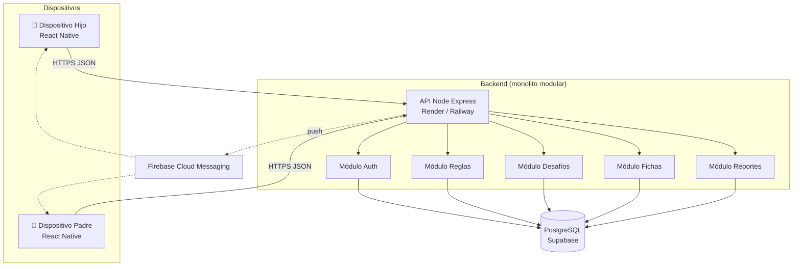
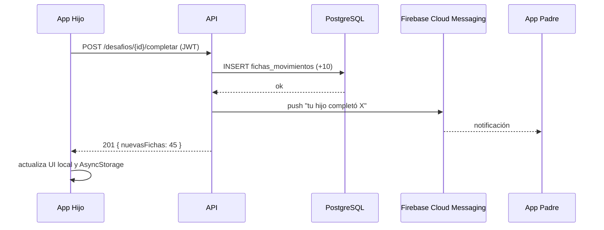

# Guía Personalizada – Grupo 1: MapacheSecure
## Sistema móvil gamificado para la autorregulación digital

**Asignatura:** TPY1101 – Taller Aplicado de Programación
**Integrantes:** Fernanda Arraño · Javier Vieytes · Benjamín Castillo
**Duración de la actividad asociada:** 1 hora 30 minutos

> **Cómo usar este documento:** léelo completo antes de la actividad. La primera parte (secciones 1-10) es la **teoría y recomendación técnica** para tu proyecto específico. La sección 11 es la **actividad de 90 minutos** que deben completar en clase. Lo que produzcan en esa actividad se entrega como `ARQUITECTURA.md` dentro del repo del equipo.

---

## 1. Contexto del proyecto (según tu EP1)

Tu proyecto es una **aplicación móvil de autorregulación digital**, orientada a apoyar el control parental y la gestión del tiempo frente a pantallas mediante gamificación. De acuerdo con la EP1, las piezas principales son:

1. **Módulo de intercepción y bloqueo inteligente** de aplicaciones.
2. **Motor de desafíos multimodal** (el niño/adolescente debe completar tareas para desbloquear tiempo).
3. **Sistema de economía de fichas** (puntos, recompensas, canjes).
4. **Panel de control parental** (reglas, horarios, whitelists).
5. **Sistema de notificaciones y reportes** al padre/madre.
6. **Arquitectura de sincronización cloud** multi-dispositivo.

Esto implica que necesitas:

- una **app móvil** (no web) con capacidad de interceptar uso de otras apps en Android/iOS;
- un **backend cloud** que sincronice reglas y progreso entre dispositivos;
- **dos perfiles de usuario** con permisos distintos (hijo y padre/madre);
- **notificaciones push** cuando hay eventos relevantes.

---

## 2. Tu tarjeta técnica (resumen ejecutivo)

| Elemento | Recomendación |
|---|---|
| **Tipo de app** | Móvil nativa multiplataforma |
| **Framework móvil** | React Native (con Expo) — alternativa: Flutter |
| **Backend** | Node.js + Express |
| **Base de datos** | PostgreSQL (Supabase) |
| **Auth** | Supabase Auth o JWT propio + bcrypt |
| **Push notifications** | Firebase Cloud Messaging (FCM) |
| **Arquitectura general** | Cliente móvil ↔ API REST (monolito modular) |
| **Patrones frontend críticos** | Component-Based, Custom Hooks, Zustand, Provider |
| **Patrones backend críticos** | Layered, DTO + Zod, Repository, Middleware |
| **Plataforma de despliegue API** | Render o Railway |
| **Plataforma de distribución app** | Expo EAS Build → Play Store / TestFlight |

---

## 3. Análisis específico de tu problema

### 3.1. ¿Por qué móvil y no web?

Porque el bloqueo efectivo de aplicaciones requiere **permisos a nivel de sistema operativo** que el navegador no entrega. Android ofrece `UsageStatsManager` y `AccessibilityService`; iOS ofrece `Screen Time API` (muy limitada). Esto te condiciona a:

- publicar una app que pida permisos especiales al instalarse;
- gestionar el almacenamiento local cuando no hay red (sincronización diferida);
- pensar la UX para **dos perfiles** en un mismo dispositivo (el hijo no debería poder desinstalar la app sin autorización del padre).

### 3.2. Volumen esperado y consecuencia técnica

Si proyectan 100-500 familias en el primer año, con ~2-4 dispositivos por familia, hablan de 200-2.000 dispositivos activos. **No necesitan microservicios**. Un monolito modular en Node + PostgreSQL sirve para 10.000+ dispositivos sin problemas.

### 3.3. Retos técnicos particulares de tu proyecto

1. **Offline-first:** la app debe seguir funcionando sin red (un niño podría desconectar el Wi-Fi).
2. **Sincronización eventual:** cuando vuelve la red, la app envía eventos acumulados.
3. **Dos perfiles en el mismo dispositivo:** los datos de "hijo" y "padre" deben estar claramente separados.
4. **Seguridad física:** el niño no debe poder eludir el bloqueo desinstalando o limpiando caché.
5. **Notificaciones push:** cuando el niño completa un desafío, el padre debe enterarse sin abrir la app.

---

## 4. Patrones recomendados para tu frontend móvil

> Los ejemplos de esta sección asumen **React Native con Expo**. Si eligen Flutter, los conceptos son idénticos pero con widgets en Dart.

### 4.1. Component-Based Architecture

**Por qué para ustedes:** React Native obliga a trabajar con componentes. Les recomiendo tener claramente separados:

- **Componentes visuales reutilizables** (`Boton`, `TarjetaLogro`, `BarraProgreso`).
- **Componentes específicos del dominio** (`DesafioCard`, `FichasCounter`, `ReglaItem`).
- **Pantallas** (`HomeHijoScreen`, `PanelPadreScreen`, `DesafioActivoScreen`).

#### Ejemplo adaptado a su proyecto

```jsx
// components/FichasCounter.jsx
import { View, Text, StyleSheet } from 'react-native';

export default function FichasCounter({ cantidad, etiqueta = 'Fichas' }) {
  return (
    <View style={styles.container}>
      <Text style={styles.numero}>{cantidad}</Text>
      <Text style={styles.etiqueta}>{etiqueta}</Text>
    </View>
  );
}

const styles = StyleSheet.create({
  container: { alignItems: 'center', padding: 16, backgroundColor: '#FFF2CC', borderRadius: 12 },
  numero: { fontSize: 48, fontWeight: 'bold', color: '#B8860B' },
  etiqueta: { fontSize: 14, color: '#6B4E00' }
});

// components/DesafioCard.jsx
export default function DesafioCard({ desafio, onAceptar }) {
  return (
    <View style={cardStyles.card}>
      <Text style={cardStyles.titulo}>{desafio.titulo}</Text>
      <Text style={cardStyles.desc}>{desafio.descripcion}</Text>
      <Text style={cardStyles.recompensa}>🪙 {desafio.fichas} fichas</Text>
      <Boton texto="Aceptar reto" onPress={() => onAceptar(desafio.id)} />
    </View>
  );
}
```

### 4.2. Custom Hooks para separar lógica de UI

**Por qué para ustedes:** tienen mucha lógica asíncrona (sincronización con backend, fichas, reglas). Si la dejan dentro de las pantallas, van a terminar con archivos de 600 líneas inmantenibles.

#### Ejemplo: hook de fichas

```jsx
// hooks/useFichas.js
import { useState, useEffect } from 'react';
import AsyncStorage from '@react-native-async-storage/async-storage';
import { api } from '../lib/api';

export function useFichas(usuarioId) {
  const [fichas, setFichas] = useState(0);
  const [cargando, setCargando] = useState(true);
  const [sincronizando, setSincronizando] = useState(false);

  // 1. Al montar: leer del caché local (offline-first)
  useEffect(() => {
    (async () => {
      const cached = await AsyncStorage.getItem(`fichas:${usuarioId}`);
      if (cached) setFichas(parseInt(cached, 10));
      setCargando(false);
      sincronizar();
    })();
  }, [usuarioId]);

  // 2. Sincronizar con backend cuando haya red
  const sincronizar = async () => {
    setSincronizando(true);
    try {
      const r = await api.get(`/usuarios/${usuarioId}/fichas`);
      setFichas(r.data.cantidad);
      await AsyncStorage.setItem(`fichas:${usuarioId}`, String(r.data.cantidad));
    } catch (e) {
      // sin red: usamos el caché
    } finally {
      setSincronizando(false);
    }
  };

  const sumar = async (monto) => {
    const nuevas = fichas + monto;
    setFichas(nuevas);
    await AsyncStorage.setItem(`fichas:${usuarioId}`, String(nuevas));
    try {
      await api.post(`/usuarios/${usuarioId}/fichas/sumar`, { monto });
    } catch {
      // queda pendiente de sincronizar
      await encolarPendiente({ tipo: 'sumar', monto, ts: Date.now() });
    }
  };

  return { fichas, cargando, sincronizando, sincronizar, sumar };
}
```

#### Ejemplo: hook de reglas parentales

```jsx
// hooks/useReglas.js
export function useReglas(hijoId) {
  const [reglas, setReglas] = useState([]);
  const cargar = async () => {
    const r = await api.get(`/hijos/${hijoId}/reglas`);
    setReglas(r.data);
  };
  useEffect(() => { cargar(); }, [hijoId]);
  return { reglas, recargar: cargar };
}
```

### 4.3. State management con Zustand (estado global compartido)

**Por qué para ustedes:** el perfil activo (hijo o padre), el modo de bloqueo y las fichas acumuladas deben leerse desde muchas pantallas. Pasar props a través de 5 navegaciones es un dolor.

```jsx
// stores/sessionStore.js
import { create } from 'zustand';
import AsyncStorage from '@react-native-async-storage/async-storage';

export const useSession = create((set) => ({
  perfil: null,          // 'hijo' | 'padre'
  usuario: null,
  token: null,

  iniciarSesion: async (usuario, token, perfil) => {
    await AsyncStorage.setItem('token', token);
    await AsyncStorage.setItem('perfil', perfil);
    set({ usuario, token, perfil });
  },

  cerrarSesion: async () => {
    await AsyncStorage.multiRemove(['token', 'perfil']);
    set({ usuario: null, token: null, perfil: null });
  },

  cargarDesdeCache: async () => {
    const token = await AsyncStorage.getItem('token');
    const perfil = await AsyncStorage.getItem('perfil');
    if (token) set({ token, perfil });
  }
}));
```

### 4.4. Provider Pattern para navegación protegida

Cada pantalla debe decidir si el usuario tiene permiso para acceder. Envuelve toda la app en un `AuthProvider` que controle esa lógica:

```jsx
// providers/AuthGate.jsx
import { useSession } from '../stores/sessionStore';
import LoginScreen from '../screens/LoginScreen';

export function AuthGate({ children }) {
  const { usuario, perfil } = useSession();
  if (!usuario) return <LoginScreen />;
  return children;
}

// App.jsx
<NavigationContainer>
  <AuthGate>
    <MainStack />
  </AuthGate>
</NavigationContainer>
```

---

## 5. Patrones recomendados para tu backend

### 5.1. Layered Architecture

**Por qué para ustedes:** tienen múltiples áreas de negocio (auth, reglas, desafíos, fichas, reportes). Cada una debe vivir en su módulo, con la misma forma interna.

```
api/
├── src/
│   ├── modules/
│   │   ├── auth/
│   │   │   ├── auth.routes.js
│   │   │   ├── auth.controller.js
│   │   │   ├── auth.service.js
│   │   │   └── auth.repository.js
│   │   ├── reglas/
│   │   ├── desafios/
│   │   ├── fichas/
│   │   └── reportes/
│   ├── middleware/
│   │   ├── auth.js
│   │   ├── errorHandler.js
│   │   └── validate.js
│   ├── config/
│   │   └── db.js
│   ├── app.js
│   └── server.js
```

### 5.2. Repository Pattern

**Por qué para ustedes:** van a consultar mucho la base de datos (lista de reglas del hijo, fichas acumuladas del mes, logros obtenidos). Centralizar esas queries evita duplicarlas y permite testearlas.

```js
// modules/fichas/fichas.repository.js
const pool = require('../../config/db');

async function saldoPorUsuario(usuarioId) {
  const { rows } = await pool.query(
    `SELECT COALESCE(SUM(monto), 0) AS saldo
     FROM fichas_movimientos
     WHERE usuario_id = $1`,
    [usuarioId]
  );
  return parseInt(rows[0].saldo, 10);
}

async function registrarMovimiento({ usuarioId, monto, motivo, desafioId = null }) {
  const { rows } = await pool.query(
    `INSERT INTO fichas_movimientos (usuario_id, monto, motivo, desafio_id)
     VALUES ($1, $2, $3, $4)
     RETURNING *`,
    [usuarioId, monto, motivo, desafioId]
  );
  return rows[0];
}

async function historial(usuarioId, limite = 50) {
  const { rows } = await pool.query(
    `SELECT * FROM fichas_movimientos
     WHERE usuario_id = $1
     ORDER BY creado_en DESC
     LIMIT $2`,
    [usuarioId, limite]
  );
  return rows;
}

module.exports = { saldoPorUsuario, registrarMovimiento, historial };
```

### 5.3. Service Layer con lógica gamificada

**Por qué para ustedes:** las reglas de "cuántas fichas vale cada desafío" o "a cuánto equivale 1 ficha en minutos de pantalla" son reglas de negocio puras y deben estar en services, no en el controller ni en el repository.

```js
// modules/fichas/fichas.service.js
const repo = require('./fichas.repository');
const bus = require('../../lib/eventBus');

const FICHAS_POR_DESAFIO = { FACIL: 10, MEDIO: 25, DIFICIL: 50 };
const MINUTOS_POR_FICHA = 2;

async function completarDesafio({ usuarioId, desafioId, dificultad }) {
  const monto = FICHAS_POR_DESAFIO[dificultad];
  if (!monto) throw Object.assign(new Error('Dificultad desconocida'), { status: 400 });

  const mov = await repo.registrarMovimiento({
    usuarioId, monto, motivo: 'DESAFIO_COMPLETADO', desafioId
  });

  bus.emit('desafio.completado', { usuarioId, desafioId, monto }); // notifica al padre
  return mov;
}

async function canjearFichas({ usuarioId, fichas }) {
  const saldo = await repo.saldoPorUsuario(usuarioId);
  if (saldo < fichas) throw Object.assign(new Error('Saldo insuficiente'), { status: 400 });

  await repo.registrarMovimiento({
    usuarioId, monto: -fichas, motivo: 'CANJE_TIEMPO_PANTALLA'
  });

  return { minutosOtorgados: fichas * MINUTOS_POR_FICHA };
}

module.exports = { completarDesafio, canjearFichas };
```

### 5.4. DTO + Validación con Zod

**Por qué para ustedes:** las reglas parentales son críticas (horarios, apps bloqueadas). Un valor malformado podría dejar el dispositivo sin acceso a una app legítima, o peor, darle acceso irrestricto. La validación rigurosa es **obligatoria**.

```js
// modules/reglas/reglas.dto.js
const { z } = require('zod');

const crearReglaDTO = z.object({
  hijoId: z.string().uuid(),
  tipo: z.enum(['BLOQUEO_APP', 'HORARIO', 'LIMITE_DIARIO']),
  appPaquete: z.string().optional(),     // p.ej. 'com.instagram.android'
  horarioInicio: z.string().regex(/^\d{2}:\d{2}$/).optional(),
  horarioFin: z.string().regex(/^\d{2}:\d{2}$/).optional(),
  minutosMaxDia: z.number().int().min(0).max(1440).optional(),
  diasSemana: z.array(z.number().int().min(0).max(6)).optional()
}).refine(d => {
  if (d.tipo === 'BLOQUEO_APP') return !!d.appPaquete;
  if (d.tipo === 'HORARIO') return !!(d.horarioInicio && d.horarioFin);
  if (d.tipo === 'LIMITE_DIARIO') return typeof d.minutosMaxDia === 'number';
  return false;
}, { message: 'Campos inconsistentes para el tipo de regla' });

module.exports = { crearReglaDTO };
```

### 5.5. Middleware Pipeline con auth diferenciada

**Por qué para ustedes:** tienen dos tipos de usuarios con permisos muy distintos. Un middleware de rol evita código duplicado.

```js
// middleware/requirePerfil.js
module.exports = (...perfilesPermitidos) => (req, res, next) => {
  if (!req.user) return res.status(401).json({ error: 'No autenticado' });
  if (!perfilesPermitidos.includes(req.user.perfil)) {
    return res.status(403).json({ error: 'Sin permisos' });
  }
  next();
};

// Uso:
const requirePerfil = require('../../middleware/requirePerfil');
router.post('/reglas', authMiddleware, requirePerfil('padre'), controller.crearRegla);
router.post('/desafios/completar', authMiddleware, requirePerfil('hijo'), controller.completarDesafio);
```

---

## 6. Arquitectura recomendada

**Tipo:** Cliente-servidor con **monolito modular** en el backend.



### 6.1. Diagrama de secuencia: "el hijo completa un desafío"



---

## 7. Estructura de carpetas recomendada

### Frontend móvil (React Native + Expo)

```
mapachesecure-app/
├── app.json
├── App.jsx
├── package.json
├── assets/
│   └── imagenes/
├── src/
│   ├── screens/
│   │   ├── LoginScreen.jsx
│   │   ├── hijo/
│   │   │   ├── HomeHijoScreen.jsx
│   │   │   ├── DesafiosScreen.jsx
│   │   │   └── CanjeFichasScreen.jsx
│   │   └── padre/
│   │       ├── PanelPadreScreen.jsx
│   │       ├── ReglasScreen.jsx
│   │       └── ReportesScreen.jsx
│   ├── components/
│   │   ├── Boton.jsx
│   │   ├── FichasCounter.jsx
│   │   ├── DesafioCard.jsx
│   │   └── ReglaItem.jsx
│   ├── hooks/
│   │   ├── useFichas.js
│   │   ├── useReglas.js
│   │   └── useDesafios.js
│   ├── stores/
│   │   └── sessionStore.js
│   ├── providers/
│   │   └── AuthGate.jsx
│   ├── lib/
│   │   ├── api.js
│   │   └── offlineQueue.js
│   ├── navigation/
│   │   ├── HijoNavigator.jsx
│   │   └── PadreNavigator.jsx
│   └── utils/
│       └── formatters.js
└── .env.example
```

### Backend (Node + Express)

```
mapachesecure-api/
├── src/
│   ├── config/
│   │   ├── env.js
│   │   └── db.js
│   ├── middleware/
│   │   ├── auth.js
│   │   ├── requirePerfil.js
│   │   ├── errorHandler.js
│   │   └── validate.js
│   ├── lib/
│   │   ├── eventBus.js
│   │   └── fcm.js
│   ├── modules/
│   │   ├── auth/
│   │   ├── reglas/
│   │   ├── desafios/
│   │   ├── fichas/
│   │   └── reportes/
│   ├── app.js
│   └── server.js
├── migrations/
│   └── 001_init.sql
├── tests/
├── .env.example
└── package.json
```

---

## 8. Stack tecnológico y cómo desplegar

| Componente | Tecnología | Plataforma gratuita | Cómo desplegar |
|---|---|---|---|
| App móvil | React Native + Expo | Expo EAS (builds) | `eas build --platform android` |
| API Node | Express | **Render** (free tier) | Conectas GitHub, Render detecta `package.json` |
| Base de datos | PostgreSQL | **Supabase** (free 500 MB) | Crear proyecto en supabase.com; copias el `DATABASE_URL` al `.env` de Render |
| Auth | Supabase Auth | Incluida | Activas email/password en Supabase; usas `@supabase/supabase-js` |
| Push | FCM | Gratis | Crear proyecto Firebase, bajas `google-services.json` al proyecto Expo |

### Pasos concretos para su primer deploy

1. **Supabase:** crear proyecto → obtener `DATABASE_URL` → ejecutar migración inicial.
2. **GitHub:** subir el repo `mapachesecure-api`.
3. **Render:** New Web Service → conectar repo → agregar variables `DATABASE_URL`, `JWT_SECRET`, `FCM_SERVER_KEY`.
4. **Expo:** configurar `expo-notifications` y `firebase-messaging` en `app.json`.
5. **Deploy app móvil:** usar Expo EAS para generar APK de prueba.

---

## 9. Riesgos identificados y mitigaciones

| Riesgo | Probabilidad | Impacto | Mitigación |
|---|---|---|---|
| Render duerme el servicio tras 15 min | Alta | Medio | Ping con cron-job.org cada 10 min, o pasarse a Railway |
| Supabase free tier solo 500 MB | Baja | Bajo | Planificar crecimiento, no almacenar logs grandes |
| iOS limita el bloqueo de apps | Alta | Alto | Dejar claro en el alcance: MVP solo Android; iOS queda como futuro |
| El niño desinstala la app | Media | Alto | Guía para que el padre active "administrador de dispositivo" en Android |
| Conflictos de sincronización offline | Media | Medio | Último-escrito-gana al principio; CRDT si se complica |
| Privacidad de datos de menores | Baja | Muy alto | Política de privacidad explícita, cumplimiento con Ley 19.628 (Chile) |

---

## 10. Checklist de buenas prácticas

Antes de la primera demo, verifica que:

- [ ] Cada archivo tiene una responsabilidad clara (si supera 200 líneas, probablemente hay que partir).
- [ ] No hay secretos en el código (todo en `.env` y nunca en git).
- [ ] Las rutas sensibles tienen `authMiddleware` + `requirePerfil(...)`.
- [ ] Todos los DTOs son validados con Zod antes de llegar al service.
- [ ] Hay un `errorHandler` global.
- [ ] Las queries SQL usan parámetros `$1, $2` (jamás concatenación de strings).
- [ ] Las contraseñas se guardan hasheadas con bcrypt.
- [ ] Hay un README que explica cómo levantar el proyecto en local.
- [ ] El repo tiene `.gitignore` con `node_modules`, `.env`, `*.apk`.
- [ ] La app móvil pide permisos uno a uno, con mensaje claro.

---

# 11. Actividad de Laboratorio (90 minutos)

## 11.1. Propósito

Al terminar, tu equipo tendrá un `ARQUITECTURA.md` en el repo del proyecto con:

1. Contexto y requisitos técnicos de MapacheSecure.
2. Patrones elegidos con justificación.
3. Diagrama de arquitectura y diagrama de secuencia.
4. Stack con plataformas y límites.
5. Estructura de carpetas creada.
6. Prototipo mínimo funcional.

## 11.2. Distribución del tiempo

| Bloque | Tiempo | Actividad |
|---|---|---|
| 1 | 10 min | Lectura dirigida de esta guía |
| 2 | 15 min | Análisis y contexto |
| 3 | 20 min | Patrones y diagramas |
| 4 | 20 min | Stack, plataforma y creación de carpetas |
| 5 | 15 min | Prototipo mínimo |
| 6 | 10 min | Cierre, commit y push |

## 11.3. Bloque 1 – Lectura dirigida (10 min)

Lean juntos las secciones 1-5 de esta guía. Identifiquen los patrones que ya entienden y los que necesitan investigar.

**Checkpoint 1:** el equipo menciona en voz alta los 4 patrones frontend y los 5 patrones backend recomendados.

## 11.4. Bloque 2 – Análisis de contexto (15 min)

Crear en el repo del proyecto un archivo `ARQUITECTURA.md` con:

```markdown
# Arquitectura – MapacheSecure

## 1. Contexto
- **Problema:** (una frase)
- **Usuarios objetivo:** (hijos y padres)
- **Volumen esperado primer año:**
- **Tipo de aplicación:** App móvil multiplataforma

## 2. Requisitos funcionales clave
- (4-6 bullets basados en la EP1)

## 3. Requisitos no funcionales
- Seguridad:
- Rendimiento:
- Escalabilidad:
- Disponibilidad:
- Privacidad (Ley 19.628):
```

**Checkpoint 2:** las secciones 1-3 están escritas con detalle propio.

## 11.5. Bloque 3 – Patrones, arquitectura y diagramas (20 min)

Añadan al `ARQUITECTURA.md`:

```markdown
## 4. Patrones frontend
- Component-Based: por qué nos sirve
- Custom Hooks: qué extraeremos (useFichas, useReglas, useDesafios)
- Zustand: qué estado global manejaremos (sesión, perfil activo)
- Provider Pattern: AuthGate

## 5. Patrones backend
- Layered (Controller/Service/Repository)
- Repository: qué repositorios tendremos (auth, reglas, desafios, fichas)
- DTO + Zod: qué endpoints validaremos
- Middleware: auth + requirePerfil para separar hijo/padre

## 6. Arquitectura general
- Tipo: Cliente-servidor con monolito modular
- Justificación: equipos pequeños, MVP, crecimiento proyectado 200-2000 dispositivos

## 7. Diagramas

### 7.1. Arquitectura
[Pegar diagrama Mermaid adaptado de la sección 6 de esta guía]

### 7.2. Secuencia: "hijo completa desafío"
[Pegar diagrama Mermaid adaptado de la sección 6.1]
```

**Checkpoint 3:** los dos diagramas están en el archivo y se ven correctamente en GitHub.

## 11.6. Bloque 4 – Stack, plataforma y carpetas (20 min)

Añadan:

```markdown
## 8. Stack tecnológico
- Frontend: React Native + Expo
- Backend: Node.js + Express
- DB: PostgreSQL (Supabase)
- Auth: Supabase Auth o JWT propio
- Push: Firebase Cloud Messaging

## 9. Plataformas de despliegue
| Componente | Plataforma | Límite free | Plan B |
|---|---|---|---|
| API | Render | Duerme tras 15 min | Railway |
| DB | Supabase | 500 MB | Neon |
| Push | FCM | Ilimitado | OneSignal |
| Builds app | Expo EAS | 30 builds/mes | EAS pagado |

## 10. Estructura de carpetas
[Pegar ambas estructuras (app y api) de la sección 7]

## 11. Riesgos y mitigaciones
[Copiar de la sección 9, adaptando si hace falta]
```

**Obligatorio:** crear las carpetas reales. Ejemplo de comandos:

```powershell
# Frontend
mkdir mapachesecure-app, mapachesecure-app\src, mapachesecure-app\src\screens
mkdir mapachesecure-app\src\screens\hijo, mapachesecure-app\src\screens\padre
mkdir mapachesecure-app\src\components, mapachesecure-app\src\hooks
mkdir mapachesecure-app\src\stores, mapachesecure-app\src\providers
mkdir mapachesecure-app\src\lib, mapachesecure-app\src\navigation

# Backend
mkdir mapachesecure-api, mapachesecure-api\src, mapachesecure-api\src\config
mkdir mapachesecure-api\src\middleware, mapachesecure-api\src\lib
mkdir mapachesecure-api\src\modules\auth, mapachesecure-api\src\modules\reglas
mkdir mapachesecure-api\src\modules\desafios, mapachesecure-api\src\modules\fichas
mkdir mapachesecure-api\src\modules\reportes
```

**Checkpoint 4:** las carpetas reales existen en el repo.

## 11.7. Bloque 5 – Prototipo mínimo (15 min)

Elijan **una** opción y demuestren que funciona:

### Opción A – API "Hola mundo"

```js
// mapachesecure-api/src/server.js
const express = require('express');
const app = express();
app.get('/health', (_, res) => res.json({ status: 'ok', proyecto: 'MapacheSecure' }));
app.get('/', (_, res) => res.send('MapacheSecure API viva 🦝'));
app.listen(3000, () => console.log('API en :3000'));
```

Corran `node src/server.js` y prueben `Invoke-RestMethod http://localhost:3000/health`.

### Opción B – Expo "Hola mundo"

```bash
npx create-expo-app@latest mapachesecure-app --template blank
cd mapachesecure-app
npx expo start
```

Abran el QR con Expo Go en el celular y modifiquen `App.js` para mostrar "MapacheSecure – Hijo" o "Padre".

### Opción C – Supabase conectado

Crean un proyecto en Supabase, una tabla `usuarios` con columnas `id`, `nombre`, `perfil` ('hijo'|'padre'), insertan 2 registros manualmente, y desde un script Node lo leen con `@supabase/supabase-js`.

**Checkpoint 5:** hay evidencia visible (captura o URL).

## 11.8. Bloque 6 – Cierre, commit y push (10 min)

Añadan:

```markdown
## 12. Prototipo realizado
- Opción: (A / B / C)
- Evidencia: (ruta a captura o URL)

## 13. Próximos pasos
- (3 bullets concretos para la siguiente semana)

## 14. Reflexión del equipo
- ¿Qué patrón entendimos mejor?
- ¿Qué riesgo nos preocupa más?
- ¿Qué necesitamos investigar?
```

Y hagan:

```bash
git add .
git commit -m "docs(arquitectura): documento inicial y estructura de carpetas"
git push
```

## 11.9. Entregables

1. `ARQUITECTURA.md` con las secciones 1-14.
2. 2 diagramas Mermaid funcionales.
3. Estructura de carpetas creada.
4. Evidencia del prototipo.
5. Commit y push.

## 11.10. Criterios de evaluación

| Criterio | Peso |
|---|---|
| Patrones elegidos con justificación propia | 20 % |
| Arquitectura coherente y dos diagramas | 20 % |
| Stack con plataformas y límites documentados | 15 % |
| Estructura de carpetas creada | 10 % |
| Prototipo funcionando | 15 % |
| Riesgos y mitigaciones (mínimo 3) | 10 % |
| Calidad de la redacción | 10 % |

---

## 12. Desafíos opcionales (si terminan antes)

- **A:** configurar ESLint + Prettier en ambos repos.
- **B:** crear una rama `develop` y configurar GitHub Actions para que al hacer push se corra `npm test`.
- **C:** investigar e incluir en el documento cómo implementarían la **cola offline** de la app (patrón Outbox).
- **D:** dibujar el **diagrama de entidades** (ER) para la base de datos: usuarios, reglas, desafios, movimientos de fichas.
- **E:** decidir y documentar qué librería usarán para mapas o gráficos (si necesitan mostrar estadísticas al padre).

## 13. Próximos pasos (después de la actividad)

1. **Semana siguiente:** implementar el módulo `auth` completo (registro, login, JWT).
2. **Dos semanas:** módulo `fichas` con sumar, canjear e historial.
3. **Tres semanas:** primera versión del panel parental con reglas CRUD.
4. **Cuatro semanas:** integración con FCM para notificaciones push.
5. **Cinco semanas:** prototipo de intercepción de apps en Android (usar `expo-application` y tests con Accessibility Service si avanzan a dev nativo).

---

## 14. Recursos recomendados específicos para tu proyecto

- **React Native docs:** https://reactnative.dev
- **Expo docs:** https://docs.expo.dev
- **Supabase React Native guide:** https://supabase.com/docs/guides/getting-started/tutorials/with-expo-react-native
- **Firebase Cloud Messaging con Expo:** https://docs.expo.dev/push-notifications/overview/
- **Android UsageStatsManager** (para bloqueo): documentación oficial de Android.
- **Diseño de apps para niños:** lee "Design for Kids" (material de la industria).

---

## 15. Cierre

MapacheSecure es un proyecto con un componente técnico exigente (intercepción de apps, sincronización offline) pero con patrones muy estándar en la base. **No elijan tecnologías nuevas por moda**: React Native + Express + PostgreSQL les dará el 90 % del camino. Documenten cada decisión y cada riesgo; eso es lo que se evalúa al final.

Éxito, equipo. 🦝
