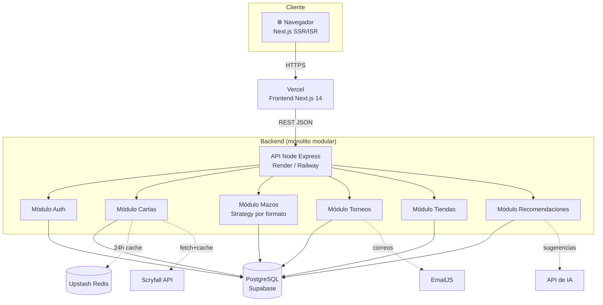
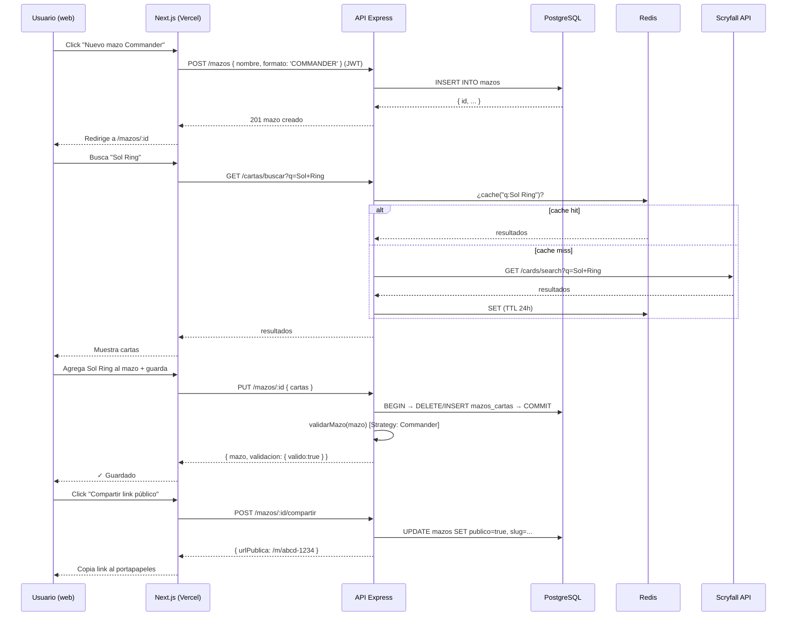

# Guía Personalizada – Grupo 2: Deckora
## Plataforma web para la optimización de la experiencia en entornos TCG

**Asignatura:** TPY1101 – Taller Aplicado de Programación
**Integrantes:** Anaís Carolina Palma Sánchez · Vicente Joaquín Verdaguer Gaete
**Duración de la actividad asociada:** 1 hora 30 minutos

> **Cómo usar este documento:** léanlo completo antes de la actividad. La primera parte (secciones 1-10) es la **teoría y recomendación técnica** para su proyecto específico. La sección 11 es la **actividad de 90 minutos** que deben completar en clase. Lo que produzcan en esa actividad se entrega como `ARQUITECTURA.md` dentro del repo del equipo.

---

## 1. Contexto del proyecto (según su EP1)

Su proyecto es una **aplicación web para coleccionistas y jugadores de juegos de cartas coleccionables (TCG)**, orientada a centralizar la gestión de colecciones, mazos, torneos y tiendas dentro de un mismo ecosistema. De acuerdo con la EP1, las piezas principales son:

1. **Sistema de autenticación y personalización** (registro, login, geolocalización para recomendar eventos cercanos).
2. **Módulo de colecciones y construcción de mazos** integrado con APIs externas como Scryfall.
3. **Módulo de recomendaciones con IA** que sugiere cartas según desempeño previo y tendencias del meta.
4. **Gestor de torneos y eventos** (publicación, inscripción, enfrentamientos, tablas de posiciones).
5. **Historial de desempeño** para seguimiento competitivo del jugador.
6. **Visualización de tiendas y eventos cercanos** con cartelera personalizada.

Esto implica que necesitan:

- una **aplicación web** (no móvil) con SEO optimizado para que las páginas de cartas y torneos sean indexables;
- un **backend en la nube** que sirva datos consistentes a múltiples perfiles (jugador, organizador, tienda);
- **tres perfiles de usuario** con permisos distintos (jugador, organizador independiente, tienda);
- **integración con servicios externos** (Scryfall API para datos de cartas, EmailJS para notificaciones, API de IA para recomendaciones).

---

## 2. Su tarjeta técnica (resumen ejecutivo)

| Elemento | Recomendación |
|---|---|
| **Tipo de app** | Aplicación web moderna (SSR + ISR) |
| **Framework frontend** | Next.js 14 (App Router) — React 18 |
| **Backend** | Node.js + Express (API REST) |
| **Base de datos** | PostgreSQL (Supabase) |
| **Auth** | Supabase Auth (JWT gestionado) |
| **Cache / búsqueda** | Upstash Redis (ISR + cache de búsqueda) — opcional Meilisearch para búsqueda full-text de cartas |
| **Datos de cartas** | Scryfall API (gratuita) con cache local 24h |
| **Notificaciones** | EmailJS (correo transaccional) |
| **Arquitectura general** | Cliente web ↔ API REST (monolito modular) |
| **Patrones frontend críticos** | Component-Based, Custom Hooks, Zustand, Provider |
| **Patrones backend críticos** | Layered, Repository, Service Layer (Strategy), DTO + Zod, Middleware, Factory |
| **Plataforma de despliegue frontend** | Vercel |
| **Plataforma de despliegue API** | Render o Railway |

---

## 3. Análisis específico de su problema

### 3.1. ¿Por qué web y no móvil?

Porque el perfil del usuario TCG combina dos escenarios: el jugador arma su mazo desde el computador (escritorio grande, mejor UX para drag-and-drop y listados largos) y el organizador gestiona torneos en tiempo real desde tablets o notebooks durante los eventos. Una PWA en Next.js cubre ambos casos:

- **SEO y descubribilidad:** las páginas de cartas deben aparecer en Google ("Sol Ring EDH deckora") — el SSR/ISR de Next.js es clave.
- **Cero instalación:** cualquier jugador nuevo puede probar la plataforma en 3 segundos con un link.
- **Responsive-first:** sirve en celular cuando el organizador está en el piso del evento, pero sin la fricción de una tienda de apps.

Su restricción declarada ("No incluye desarrollo de aplicación móvil") refuerza esta decisión.

### 3.2. Volumen esperado y consecuencia técnica

Si proyectan entre 500 y 5.000 jugadores activos en el primer año, con picos el fin de semana durante torneos, hablan de **decenas de miles de consultas por día**, no millones. **No necesitan microservicios**. Un monolito modular Next.js + Node/Express + PostgreSQL sirve holgadamente para esta escala.

Adicionalmente, la información de cartas (Scryfall) es **mayormente inmutable** — un texto de carta no cambia — por lo que puede cachearse agresivamente con ISR cada 24 horas, reduciendo carga sobre su API y sobre Scryfall.

### 3.3. Retos técnicos particulares de su proyecto

1. **Búsqueda de cartas de alto volumen:** Magic tiene ~30.000 cartas únicas. Buscar por nombre, tipo, color, costo, formato legal requiere índices bien pensados — o un motor de búsqueda dedicado (Meilisearch/Algolia).
2. **Validación de mazos por formato:** cada formato (Commander, Standard, Modern, Pioneer, Legacy) tiene reglas diferentes (tamaño mínimo, lista de baneos, restricciones de copias, comandante único). Es el escenario **ideal** para el patrón **Strategy**.
3. **Soporte multi-TCG (a futuro):** aunque el alcance actual es solo Magic, la arquitectura debe permitir agregar Pokémon TCG o Yu-Gi-Oh! sin reescribir el dominio. El patrón **Factory** les ayudará.
4. **Derechos de imágenes de cartas:** Scryfall permite uso no comercial con atribución. No deben almacenar las imágenes en su base de datos — solo las URLs. Esto además ahorra storage.
5. **Torneos en tiempo real:** durante un torneo los enfrentamientos se actualizan constantemente. Deben decidir si usar polling simple (cada 10s) o WebSockets. Para el MVP, **polling es suficiente**.
6. **Recomendaciones con IA:** deben evitar llamar a la API de IA en cada request. Cachear resultados por (mazoId, versionMazo) y regenerar solo cuando el mazo cambia.

### 3.4. Anti-patrones que deben evitar

- **NO microservicios.** Son dos estudiantes con 8 semanas. Un monolito modular bien organizado es infinitamente mejor que 5 microservicios mal coordinados.
- **NO NoSQL como base principal.** Sus datos son profundamente relacionales: un `Mazo` tiene `Cartas`, pertenece a un `Usuario`, se usa en `Torneos`, genera `Resultados`. PostgreSQL modela esto en 10 minutos; MongoDB los obligaría a duplicar datos y a sufrir con consultas cruzadas.
- **NO guardar imágenes de cartas en su DB/storage.** Usen siempre la URL de Scryfall.
- **NO llamar a Scryfall desde el frontend en cada render.** Cacheen en el backend con ISR o con Redis.

---

## 4. Patrones recomendados para su frontend

> Los ejemplos asumen **Next.js 14 con App Router y TypeScript opcional**. Si usan JavaScript puro, solo omitan los tipos.

### 4.1. Component-Based Architecture

**Por qué para ustedes:** React/Next.js obliga a trabajar con componentes. Deben distinguir claramente:

- **Componentes visuales reutilizables** (`Boton`, `Input`, `Tag`, `ModalBase`).
- **Componentes específicos del dominio** (`CartaCard`, `MazoEditor`, `TorneoItem`, `TiendaMarker`).
- **Páginas / rutas** (`app/mazos/[id]/page.jsx`, `app/torneos/page.jsx`, `app/tiendas/page.jsx`).

#### Ejemplo adaptado a su proyecto

```jsx
// components/cartas/CartaCard.jsx
'use client';
import Image from 'next/image';

export default function CartaCard({ carta, cantidad = 1, onAgregar, onQuitar }) {
  return (
    <article className="carta-card">
      <Image
        src={carta.imagenUrl}           // URL de Scryfall, nunca descargada
        alt={carta.nombre}
        width={223}
        height={310}
        priority={false}
      />
      <header>
        <h3>{carta.nombre}</h3>
        <span className="mana">{carta.costoMana}</span>
      </header>
      <p className="tipo">{carta.tipo}</p>
      <footer className="controles">
        <button onClick={() => onQuitar(carta.id)}>-</button>
        <span>{cantidad}</span>
        <button onClick={() => onAgregar(carta.id)}>+</button>
      </footer>
    </article>
  );
}

// components/mazos/MazoEditor.jsx
'use client';
import CartaCard from '../cartas/CartaCard';
import BuscadorCartas from '../cartas/BuscadorCartas';
import { useMazoActivo } from '../../hooks/useMazoActivo';

export default function MazoEditor({ mazoId }) {
  const { mazo, agregarCarta, quitarCarta, guardar, validacion } = useMazoActivo(mazoId);

  if (!mazo) return <p>Cargando mazo...</p>;

  return (
    <section className="mazo-editor">
      <header>
        <h1>{mazo.nombre}</h1>
        <span className={`formato ${mazo.formato.toLowerCase()}`}>{mazo.formato}</span>
      </header>

      <BuscadorCartas onSeleccionar={agregarCarta} formato={mazo.formato} />

      <div className="lista-cartas">
        {mazo.cartas.map(c => (
          <CartaCard
            key={c.id}
            carta={c}
            cantidad={c.cantidad}
            onAgregar={() => agregarCarta(c.id)}
            onQuitar={() => quitarCarta(c.id)}
          />
        ))}
      </div>

      {!validacion.valido && (
        <aside className="alertas">
          {validacion.errores.map((e, i) => <p key={i}>⚠ {e}</p>)}
        </aside>
      )}

      <button onClick={guardar} disabled={!validacion.valido}>Guardar mazo</button>
    </section>
  );
}
```

### 4.2. Custom Hooks para separar lógica de UI

**Por qué para ustedes:** la lógica de búsqueda de cartas, gestión del mazo activo, inscripción a torneos y carga de recomendaciones es asíncrona y compleja. Si la dejan dentro de las páginas van a terminar con archivos de 800 líneas inmantenibles.

#### Ejemplo: hook de búsqueda de cartas

```jsx
// hooks/useBusquedaCartas.js
'use client';
import { useState, useEffect, useMemo } from 'react';
import { api } from '../lib/api';

export function useBusquedaCartas({ formato, debounceMs = 300 } = {}) {
  const [termino, setTermino] = useState('');
  const [resultados, setResultados] = useState([]);
  const [cargando, setCargando] = useState(false);
  const [error, setError] = useState(null);

  // Debounce manual: no pegamos al backend en cada tecla
  useEffect(() => {
    if (termino.trim().length < 2) {
      setResultados([]);
      return;
    }
    const t = setTimeout(async () => {
      setCargando(true);
      setError(null);
      try {
        const r = await api.get('/cartas/buscar', {
          params: { q: termino, formato }
        });
        setResultados(r.data);
      } catch (e) {
        setError('No se pudo buscar. Inténtalo de nuevo.');
      } finally {
        setCargando(false);
      }
    }, debounceMs);

    return () => clearTimeout(t);
  }, [termino, formato, debounceMs]);

  return { termino, setTermino, resultados, cargando, error };
}
```

#### Ejemplo: hook del mazo activo con validación local

```jsx
// hooks/useMazoActivo.js
'use client';
import { useState, useEffect, useMemo } from 'react';
import { api } from '../lib/api';
import { validarMazoCliente } from '../lib/validarMazoCliente';

export function useMazoActivo(mazoId) {
  const [mazo, setMazo] = useState(null);

  useEffect(() => {
    (async () => {
      const r = await api.get(`/mazos/${mazoId}`);
      setMazo(r.data);
    })();
  }, [mazoId]);

  const validacion = useMemo(
    () => mazo ? validarMazoCliente(mazo) : { valido: false, errores: ['Sin mazo'] },
    [mazo]
  );

  const agregarCarta = (cartaId) => {
    setMazo(prev => {
      const existe = prev.cartas.find(c => c.id === cartaId);
      if (existe) {
        return {
          ...prev,
          cartas: prev.cartas.map(c =>
            c.id === cartaId ? { ...c, cantidad: c.cantidad + 1 } : c
          )
        };
      }
      return { ...prev, cartas: [...prev.cartas, { id: cartaId, cantidad: 1 }] };
    });
  };

  const quitarCarta = (cartaId) => {
    setMazo(prev => ({
      ...prev,
      cartas: prev.cartas
        .map(c => c.id === cartaId ? { ...c, cantidad: c.cantidad - 1 } : c)
        .filter(c => c.cantidad > 0)
    }));
  };

  const guardar = async () => {
    if (!validacion.valido) return;
    await api.put(`/mazos/${mazoId}`, mazo);
  };

  return { mazo, validacion, agregarCarta, quitarCarta, guardar };
}
```

#### Ejemplo: hook de torneos cercanos

```jsx
// hooks/useTorneosCercanos.js
'use client';
import { useState, useEffect } from 'react';
import { api } from '../lib/api';

export function useTorneosCercanos(coordenadas, radioKm = 25) {
  const [torneos, setTorneos] = useState([]);
  const [cargando, setCargando] = useState(true);

  useEffect(() => {
    if (!coordenadas) return;
    (async () => {
      setCargando(true);
      const r = await api.get('/torneos/cercanos', {
        params: { lat: coordenadas.lat, lng: coordenadas.lng, radioKm }
      });
      setTorneos(r.data);
      setCargando(false);
    })();
  }, [coordenadas, radioKm]);

  return { torneos, cargando };
}
```

### 4.3. State management con Zustand (estado global compartido)

**Por qué para ustedes:** el usuario autenticado, el mazo que está editando y el filtro global de formato (Commander / Standard / Modern) deben leerse desde varias páginas. Pasar props a través de 4 niveles de componentes es un dolor — y Redux es demasiada ceremonia para dos estudiantes.

```jsx
// stores/sessionStore.js
import { create } from 'zustand';
import { persist } from 'zustand/middleware';

export const useSession = create(
  persist(
    (set) => ({
      usuario: null,
      token: null,
      perfil: null,            // 'jugador' | 'organizador' | 'tienda'
      ubicacion: null,         // { lat, lng }

      iniciarSesion: (usuario, token) => set({
        usuario,
        token,
        perfil: usuario.perfil
      }),

      cerrarSesion: () => set({ usuario: null, token: null, perfil: null }),

      setUbicacion: (ubicacion) => set({ ubicacion })
    }),
    { name: 'deckora-session' } // persiste en localStorage
  )
);

// stores/mazoEditorStore.js
import { create } from 'zustand';

export const useMazoEditor = create((set, get) => ({
  formatoActivo: 'COMMANDER',
  borrador: null,

  setFormato: (formato) => set({ formatoActivo: formato }),

  nuevoBorrador: () => set({
    borrador: { nombre: 'Mazo sin título', formato: get().formatoActivo, cartas: [] }
  }),

  descartarBorrador: () => set({ borrador: null })
}));
```

### 4.4. Provider Pattern para rutas protegidas y tema global

Cada página debe decidir si el usuario tiene permiso de entrar (por ejemplo, solo organizadores pueden crear torneos). Un `AuthGate` centraliza esa lógica:

```jsx
// providers/AuthGate.jsx
'use client';
import { useSession } from '../stores/sessionStore';
import { useRouter } from 'next/navigation';
import { useEffect } from 'react';

export function AuthGate({ children, perfilesPermitidos }) {
  const { usuario, perfil } = useSession();
  const router = useRouter();

  useEffect(() => {
    if (!usuario) {
      router.replace('/login');
      return;
    }
    if (perfilesPermitidos && !perfilesPermitidos.includes(perfil)) {
      router.replace('/403');
    }
  }, [usuario, perfil]);

  if (!usuario) return <p>Redirigiendo...</p>;
  return children;
}

// app/organizador/layout.jsx
import { AuthGate } from '../../providers/AuthGate';

export default function OrganizadorLayout({ children }) {
  return (
    <AuthGate perfilesPermitidos={['organizador', 'tienda']}>
      {children}
    </AuthGate>
  );
}
```

---

## 5. Patrones recomendados para su backend

### 5.1. Layered Architecture

**Por qué para ustedes:** tienen varias áreas de negocio (auth, cartas, mazos, torneos, tiendas, recomendaciones). Cada una debe vivir en su módulo, con la misma estructura interna (routes → controller → service → repository).

```
api/
├── src/
│   ├── modules/
│   │   ├── auth/
│   │   │   ├── auth.routes.js
│   │   │   ├── auth.controller.js
│   │   │   ├── auth.service.js
│   │   │   └── auth.repository.js
│   │   ├── cartas/
│   │   ├── mazos/
│   │   ├── torneos/
│   │   ├── tiendas/
│   │   └── recomendaciones/
│   ├── middleware/
│   │   ├── auth.js
│   │   ├── errorHandler.js
│   │   └── validate.js
│   ├── config/
│   │   ├── db.js
│   │   └── redis.js
│   ├── lib/
│   │   ├── scryfall.js
│   │   └── emailjs.js
│   ├── app.js
│   └── server.js
```

Cada request fluye de **arriba abajo**:

1. La ruta recibe el request.
2. El middleware valida token y DTO.
3. El controller traduce HTTP → dominio y llama al service.
4. El service aplica reglas de negocio y usa uno o varios repositories.
5. El repository habla con PostgreSQL.

### 5.2. Repository Pattern

**Por qué para ustedes:** van a consultar mucho la base de datos (cartas por formato, mazos de un usuario, torneos cercanos, resultados de un jugador). Centralizar esas queries evita duplicarlas y permite testearlas.

```js
// modules/mazos/mazos.repository.js
const pool = require('../../config/db');

async function porId(id) {
  const { rows } = await pool.query(
    `SELECT m.*,
            COALESCE(json_agg(
              json_build_object(
                'id', c.id,
                'nombre', c.nombre,
                'cantidad', mc.cantidad
              )
            ) FILTER (WHERE c.id IS NOT NULL), '[]') AS cartas
     FROM mazos m
     LEFT JOIN mazos_cartas mc ON mc.mazo_id = m.id
     LEFT JOIN cartas c ON c.id = mc.carta_id
     WHERE m.id = $1
     GROUP BY m.id`,
    [id]
  );
  return rows[0] ?? null;
}

async function porUsuario(usuarioId) {
  const { rows } = await pool.query(
    `SELECT id, nombre, formato, actualizado_en
     FROM mazos
     WHERE usuario_id = $1
     ORDER BY actualizado_en DESC`,
    [usuarioId]
  );
  return rows;
}

async function crear({ usuarioId, nombre, formato }) {
  const { rows } = await pool.query(
    `INSERT INTO mazos (usuario_id, nombre, formato)
     VALUES ($1, $2, $3)
     RETURNING *`,
    [usuarioId, nombre, formato]
  );
  return rows[0];
}

async function actualizarCartas(mazoId, cartas) {
  const client = await pool.connect();
  try {
    await client.query('BEGIN');
    await client.query('DELETE FROM mazos_cartas WHERE mazo_id = $1', [mazoId]);
    for (const c of cartas) {
      await client.query(
        `INSERT INTO mazos_cartas (mazo_id, carta_id, cantidad) VALUES ($1, $2, $3)`,
        [mazoId, c.id, c.cantidad]
      );
    }
    await client.query(
      `UPDATE mazos SET actualizado_en = NOW() WHERE id = $1`,
      [mazoId]
    );
    await client.query('COMMIT');
  } catch (e) {
    await client.query('ROLLBACK');
    throw e;
  } finally {
    client.release();
  }
}

module.exports = { porId, porUsuario, crear, actualizarCartas };
```

Mismo esqueleto vale para `CartaRepository`, `UsuarioRepository`, `TorneoRepository`, `TiendaRepository`.

### 5.3. Service Layer con Strategy por formato de juego

**Por qué para ustedes:** cada formato tiene reglas distintas de validación. Un `if/else if/else if` de 100 líneas es un olor a código clásico. El patrón **Strategy** resuelve esto elegantemente: cada formato implementa la misma interfaz (`validar(mazo) → { valido, errores }`) y el service selecciona la estrategia correcta.

```js
// modules/mazos/estrategias/EstrategiaCommander.js
const CARTAS_BANEADAS_EDH = new Set([
  'Black Lotus', 'Channel', 'Fastbond' // etc
]);

function validarMazoCommander(mazo) {
  const errores = [];

  if (mazo.cartas.length === 0) errores.push('El mazo está vacío.');
  const total = mazo.cartas.reduce((acc, c) => acc + c.cantidad, 0);

  if (total !== 100) errores.push(`Commander requiere exactamente 100 cartas (tiene ${total}).`);

  // Singleton: máximo 1 copia salvo tierras básicas
  for (const c of mazo.cartas) {
    if (c.cantidad > 1 && !c.esTierraBasica) {
      errores.push(`"${c.nombre}" no puede tener más de 1 copia en Commander.`);
    }
    if (CARTAS_BANEADAS_EDH.has(c.nombre)) {
      errores.push(`"${c.nombre}" está baneada en Commander.`);
    }
  }

  if (!mazo.comandanteId) errores.push('Falta designar comandante.');

  return { valido: errores.length === 0, errores };
}

module.exports = validarMazoCommander;
```

```js
// modules/mazos/estrategias/EstrategiaStandard.js
const SETS_LEGALES_STANDARD = new Set(['DSK', 'BLB', 'OTJ', 'MKM' /* ejemplo */]);

function validarMazoStandard(mazo) {
  const errores = [];
  const total = mazo.cartas.reduce((acc, c) => acc + c.cantidad, 0);

  if (total < 60) errores.push(`Standard requiere mínimo 60 cartas (tiene ${total}).`);

  for (const c of mazo.cartas) {
    if (c.cantidad > 4 && !c.esTierraBasica) {
      errores.push(`"${c.nombre}" supera el máximo de 4 copias.`);
    }
    if (!c.sets.some(s => SETS_LEGALES_STANDARD.has(s))) {
      errores.push(`"${c.nombre}" no es legal en Standard.`);
    }
  }

  return { valido: errores.length === 0, errores };
}

module.exports = validarMazoStandard;
```

```js
// modules/mazos/estrategias/EstrategiaModern.js
function validarMazoModern(mazo) {
  const errores = [];
  const total = mazo.cartas.reduce((acc, c) => acc + c.cantidad, 0);
  if (total < 60) errores.push(`Modern requiere mínimo 60 cartas (tiene ${total}).`);
  // ... lista de baneos propia de Modern
  return { valido: errores.length === 0, errores };
}
module.exports = validarMazoModern;
```

```js
// modules/mazos/mazoValidator.service.js
const validarMazoCommander = require('./estrategias/EstrategiaCommander');
const validarMazoStandard = require('./estrategias/EstrategiaStandard');
const validarMazoModern = require('./estrategias/EstrategiaModern');

const ESTRATEGIAS = {
  COMMANDER: validarMazoCommander,
  STANDARD: validarMazoStandard,
  MODERN: validarMazoModern
};

function validarMazo(mazo) {
  const estrategia = ESTRATEGIAS[mazo.formato];
  if (!estrategia) {
    throw Object.assign(new Error(`Formato desconocido: ${mazo.formato}`), { status: 400 });
  }
  return estrategia(mazo);
}

module.exports = { validarMazo };
```

**Lo elegante:** cuando quieran agregar "Pioneer" o "Legacy", solo crean un archivo nuevo en `estrategias/` y lo registran en `ESTRATEGIAS`. El resto del código no se toca.

### 5.4. Factory Pattern para creación de cartas multi-TCG

**Por qué para ustedes:** aunque el alcance actual es solo Magic, la decisión de "ser multi-TCG" aparece explícitamente en la comparación con competidores ("Ser multi-TCG y más flexible"). Una `CartaFactory` les prepara el terreno para Pokémon TCG o Yu-Gi-Oh! sin refactorizar después.

```js
// modules/cartas/factories/CartaFactory.js
class CartaMagic {
  constructor(data) {
    this.juego = 'MAGIC';
    this.id = data.id;
    this.nombre = data.name;
    this.costoMana = data.mana_cost;
    this.tipo = data.type_line;
    this.colores = data.colors ?? [];
    this.texto = data.oracle_text;
    this.imagenUrl = data.image_uris?.normal;
  }
}

class CartaPokemon {
  constructor(data) {
    this.juego = 'POKEMON';
    this.id = data.id;
    this.nombre = data.name;
    this.energiaTipo = data.types?.[0];
    this.hp = data.hp;
    this.etapa = data.subtypes?.join(' / ');
    this.imagenUrl = data.images?.large;
  }
}

function crearCarta(juego, dataExterna) {
  switch (juego) {
    case 'MAGIC':   return new CartaMagic(dataExterna);
    case 'POKEMON': return new CartaPokemon(dataExterna);
    default:
      throw new Error(`Juego no soportado: ${juego}`);
  }
}

module.exports = { crearCarta };
```

Cuando el service ingiere datos de Scryfall u otra API, llama `crearCarta('MAGIC', data)` y obtiene un objeto uniforme. El día que agreguen Pokémon, solo añaden el `case 'POKEMON'`.

### 5.5. DTO + Validación con Zod

**Por qué para ustedes:** las reglas de negocio son frágiles. Un mazo con `formato = "COMMANDR"` (mal escrito) rompería la validación entera. Un torneo con `fecha = "mañana"` es imposible de procesar. Validen **todo** en la frontera del sistema.

```js
// modules/mazos/mazos.dto.js
const { z } = require('zod');

const FORMATOS = ['COMMANDER', 'STANDARD', 'MODERN', 'PIONEER', 'LEGACY'];

const crearMazoDTO = z.object({
  nombre: z.string().min(3).max(80),
  formato: z.enum(FORMATOS),
  descripcion: z.string().max(500).optional()
});

const actualizarMazoDTO = z.object({
  nombre: z.string().min(3).max(80).optional(),
  descripcion: z.string().max(500).optional(),
  cartas: z.array(z.object({
    id: z.string().uuid(),
    cantidad: z.number().int().min(1).max(99)
  })).optional()
});

module.exports = { crearMazoDTO, actualizarMazoDTO, FORMATOS };
```

```js
// modules/torneos/torneos.dto.js
const { z } = require('zod');

const crearTorneoDTO = z.object({
  nombre: z.string().min(5).max(120),
  formato: z.enum(['COMMANDER', 'STANDARD', 'MODERN']),
  fecha: z.string().datetime(),          // ISO 8601
  cupoMaximo: z.number().int().min(4).max(256),
  tiendaId: z.string().uuid().optional(),
  direccion: z.string().min(5).max(200),
  latitud: z.number().min(-90).max(90),
  longitud: z.number().min(-180).max(180),
  precio: z.number().min(0).default(0)
}).refine(d => new Date(d.fecha) > new Date(), {
  message: 'La fecha del torneo debe ser futura',
  path: ['fecha']
});

module.exports = { crearTorneoDTO };
```

```js
// middleware/validate.js
module.exports = (schema) => (req, res, next) => {
  const parseo = schema.safeParse(req.body);
  if (!parseo.success) {
    return res.status(400).json({
      error: 'Datos inválidos',
      detalles: parseo.error.flatten().fieldErrors
    });
  }
  req.body = parseo.data;
  next();
};
```

### 5.6. Middleware Pipeline con auth diferenciada

**Por qué para ustedes:** tienen tres perfiles (jugador, organizador, tienda). Un middleware de rol evita código repetido en cada controller.

```js
// middleware/auth.js
const jwt = require('jsonwebtoken');

module.exports = async (req, res, next) => {
  const auth = req.headers.authorization;
  if (!auth?.startsWith('Bearer ')) {
    return res.status(401).json({ error: 'Falta token' });
  }
  try {
    const payload = jwt.verify(auth.slice(7), process.env.JWT_SECRET);
    req.user = payload;   // { id, perfil, email }
    next();
  } catch {
    return res.status(401).json({ error: 'Token inválido' });
  }
};

// middleware/requirePerfil.js
module.exports = (...perfilesPermitidos) => (req, res, next) => {
  if (!req.user) return res.status(401).json({ error: 'No autenticado' });
  if (!perfilesPermitidos.includes(req.user.perfil)) {
    return res.status(403).json({ error: 'Sin permisos para este recurso' });
  }
  next();
};
```

```js
// modules/torneos/torneos.routes.js
const express = require('express');
const controller = require('./torneos.controller');
const auth = require('../../middleware/auth');
const requirePerfil = require('../../middleware/requirePerfil');
const validate = require('../../middleware/validate');
const { crearTorneoDTO } = require('./torneos.dto');

const torneosRouter = express.Router();

torneosRouter.get('/', controller.listar);                              // público
torneosRouter.get('/cercanos', controller.cercanos);                    // público
torneosRouter.get('/:id', controller.detalle);                          // público
torneosRouter.post(
  '/',
  auth,
  requirePerfil('organizador', 'tienda'),
  validate(crearTorneoDTO),
  controller.crear
);
torneosRouter.post('/:id/inscribirse', auth, requirePerfil('jugador'), controller.inscribirse);

module.exports = torneosRouter;
```

### 5.7. Ejemplo completo del Service con Strategy integrado

```js
// modules/mazos/mazos.service.js
const repo = require('./mazos.repository');
const { validarMazo } = require('./mazoValidator.service');

async function obtenerConValidacion(id) {
  const mazo = await repo.porId(id);
  if (!mazo) throw Object.assign(new Error('Mazo no encontrado'), { status: 404 });
  const validacion = validarMazo(mazo);
  return { ...mazo, validacion };
}

async function crearMazo({ usuarioId, nombre, formato }) {
  return repo.crear({ usuarioId, nombre, formato });
}

async function actualizarCartasDeMazo(mazoId, cartas, usuarioId) {
  const mazo = await repo.porId(mazoId);
  if (!mazo) throw Object.assign(new Error('Mazo no encontrado'), { status: 404 });
  if (mazo.usuario_id !== usuarioId) {
    throw Object.assign(new Error('No es tu mazo'), { status: 403 });
  }
  await repo.actualizarCartas(mazoId, cartas);
  const actualizado = await repo.porId(mazoId);
  const validacion = validarMazo(actualizado);
  return { ...actualizado, validacion };
}

module.exports = { obtenerConValidacion, crearMazo, actualizarCartasDeMazo };
```

---

## 6. Arquitectura recomendada

**Tipo:** Cliente-servidor con **monolito modular** en el backend, frontend SSR/ISR en Next.js, cache y base de datos separadas.

### 6.1. Diagrama general



### 6.2. Diagrama de secuencia: "usuario crea un mazo y lo comparte"



---

## 7. Estructura de carpetas recomendada

### Frontend web (Next.js 14 – App Router)

```
deckora-web/
├── next.config.js
├── package.json
├── .env.local.example
├── public/
│   └── logo.svg
├── app/
│   ├── layout.jsx
│   ├── page.jsx                        # landing
│   ├── (auth)/
│   │   ├── login/page.jsx
│   │   └── registro/page.jsx
│   ├── mazos/
│   │   ├── page.jsx                    # lista de mazos del usuario
│   │   ├── nuevo/page.jsx
│   │   └── [id]/page.jsx
│   ├── torneos/
│   │   ├── page.jsx
│   │   └── [id]/page.jsx
│   ├── tiendas/
│   │   └── page.jsx
│   ├── organizador/
│   │   ├── layout.jsx                  # envuelto en AuthGate
│   │   ├── page.jsx
│   │   └── torneos/nuevo/page.jsx
│   └── api/                            # Next API routes si las usan
│       └── revalidate/route.js
├── components/
│   ├── cartas/
│   │   ├── CartaCard.jsx
│   │   └── BuscadorCartas.jsx
│   ├── mazos/
│   │   ├── MazoEditor.jsx
│   │   └── ListaMazos.jsx
│   ├── torneos/
│   │   ├── TorneoItem.jsx
│   │   └── TorneoForm.jsx
│   ├── tiendas/
│   │   └── TiendaMarker.jsx
│   └── ui/
│       ├── Boton.jsx
│       ├── Input.jsx
│       └── ModalBase.jsx
├── hooks/
│   ├── useBusquedaCartas.js
│   ├── useMazoActivo.js
│   ├── useTorneosCercanos.js
│   └── useGeolocalizacion.js
├── stores/
│   ├── sessionStore.js
│   └── mazoEditorStore.js
├── providers/
│   └── AuthGate.jsx
├── lib/
│   ├── api.js                          # axios con interceptor JWT
│   └── validarMazoCliente.js           # Strategy espejo del backend
└── styles/
    └── globals.css
```

### Backend (Node + Express)

```
deckora-api/
├── src/
│   ├── config/
│   │   ├── env.js
│   │   ├── db.js
│   │   └── redis.js
│   ├── middleware/
│   │   ├── auth.js
│   │   ├── requirePerfil.js
│   │   ├── errorHandler.js
│   │   └── validate.js
│   ├── lib/
│   │   ├── scryfall.js                 # cliente con cache Redis
│   │   ├── emailjs.js
│   │   └── iaClient.js
│   ├── modules/
│   │   ├── auth/
│   │   │   ├── auth.routes.js
│   │   │   ├── auth.controller.js
│   │   │   ├── auth.service.js
│   │   │   ├── auth.repository.js
│   │   │   └── auth.dto.js
│   │   ├── cartas/
│   │   │   ├── cartas.routes.js
│   │   │   ├── cartas.controller.js
│   │   │   ├── cartas.service.js
│   │   │   ├── cartas.repository.js
│   │   │   └── factories/
│   │   │       └── CartaFactory.js
│   │   ├── mazos/
│   │   │   ├── mazos.routes.js
│   │   │   ├── mazos.controller.js
│   │   │   ├── mazos.service.js
│   │   │   ├── mazos.repository.js
│   │   │   ├── mazos.dto.js
│   │   │   ├── mazoValidator.service.js
│   │   │   └── estrategias/
│   │   │       ├── EstrategiaCommander.js
│   │   │       ├── EstrategiaStandard.js
│   │   │       └── EstrategiaModern.js
│   │   ├── torneos/
│   │   │   ├── torneos.routes.js
│   │   │   ├── torneos.controller.js
│   │   │   ├── torneos.service.js
│   │   │   ├── torneos.repository.js
│   │   │   └── torneos.dto.js
│   │   ├── tiendas/
│   │   └── recomendaciones/
│   ├── app.js
│   └── server.js
├── migrations/
│   ├── 001_init.sql
│   ├── 002_mazos.sql
│   └── 003_torneos.sql
├── tests/
│   ├── mazos.validator.test.js
│   └── torneos.service.test.js
├── .env.example
└── package.json
```

---

## 8. Stack tecnológico y cómo desplegar

| Componente | Tecnología | Plataforma gratuita | Cómo desplegar |
|---|---|---|---|
| Frontend | Next.js 14 (App Router) | **Vercel** (hobby) | `vercel --prod` o conectar GitHub |
| API Node | Express | **Render** (free tier) o **Railway** | Conectan GitHub → Render detecta `package.json` |
| Base de datos | PostgreSQL | **Supabase** (free 500 MB) | Crear proyecto → copiar `DATABASE_URL` |
| Auth | Supabase Auth | Incluido | Activan email/password; el frontend usa `@supabase/supabase-js` |
| Cache / search ligero | Upstash Redis | Free 10.000 cmd/día | `UPSTASH_REDIS_REST_URL` en `.env` |
| Búsqueda avanzada (opcional) | **Meilisearch** o **Algolia** | Algolia free 10k records | Sincronización nocturna desde PostgreSQL |
| Datos de cartas | Scryfall API | Gratuita con atribución | `https://api.scryfall.com/cards/search?q=...` |
| Correo transaccional | EmailJS | Free 200 emails/mes | Conectar servicio (Gmail/SendGrid) desde el panel |
| IA | OpenAI, Groq u otra | Free tier | `OPENAI_API_KEY` en backend — nunca en frontend |

### 8.1. Pasos concretos para su primer deploy

1. **Supabase:**
   - Crear proyecto en supabase.com.
   - Ir a SQL editor → ejecutar `migrations/001_init.sql`.
   - Activar extensión `pgvector` (necesaria para embeddings de recomendaciones).
   - Copiar `DATABASE_URL` y `SUPABASE_URL` + `SUPABASE_ANON_KEY`.

2. **GitHub:**
   - Subir el repo `deckora-web` y `deckora-api` (puede ser monorepo o dos repos).
   - Usar `.gitignore` con `node_modules`, `.env`, `.next`, `dist`.

3. **Render (API):**
   - New Web Service → conectar `deckora-api`.
   - Build command: `npm install`
   - Start command: `node src/server.js`
   - Variables: `DATABASE_URL`, `JWT_SECRET`, `SUPABASE_URL`, `SUPABASE_SERVICE_KEY`, `UPSTASH_REDIS_REST_URL`, `OPENAI_API_KEY`.

4. **Vercel (frontend):**
   - Import project desde GitHub.
   - Framework preset: Next.js (detectado automáticamente).
   - Variables: `NEXT_PUBLIC_API_URL`, `NEXT_PUBLIC_SUPABASE_URL`, `NEXT_PUBLIC_SUPABASE_ANON_KEY`.
   - Configurar **ISR** en páginas de cartas con `export const revalidate = 86400;` (24 h).

5. **Upstash Redis:**
   - Crear base gratuita → copiar URL REST.
   - Integrar con `@upstash/redis` en el backend.

6. **Scryfall:**
   - No requiere API key.
   - **Respetar rate limit (10 req/s):** usar cola simple o `p-limit`.

7. **EmailJS:**
   - Crear template de "confirmación de inscripción a torneo".
   - Desde el backend invocar vía fetch.

### 8.2. Ejemplo de cliente Scryfall con cache

```js
// lib/scryfall.js
const fetch = require('node-fetch');
const { redis } = require('../config/redis');

const BASE = 'https://api.scryfall.com';
const TTL_SEGUNDOS = 60 * 60 * 24; // 24h

async function buscarCartas(query) {
  const key = `scryfall:search:${query.toLowerCase()}`;
  const cached = await redis.get(key);
  if (cached) return JSON.parse(cached);

  const r = await fetch(`${BASE}/cards/search?q=${encodeURIComponent(query)}`);
  if (!r.ok) throw new Error('Scryfall falló');
  const data = await r.json();

  await redis.set(key, JSON.stringify(data.data), { ex: TTL_SEGUNDOS });
  return data.data;
}

module.exports = { buscarCartas };
```

---

## 9. Riesgos identificados y mitigaciones

| Riesgo | Probabilidad | Impacto | Mitigación |
|---|---|---|---|
| Render duerme la API tras 15 min sin tráfico | Alta | Medio | Ping con cron-job.org cada 10 min, o mudarse a Railway |
| Supabase free tier solo 500 MB | Media | Bajo | No almacenar imágenes de cartas (usar URL de Scryfall), planificar upgrade |
| Rate limit de Scryfall (10 req/s) | Media | Medio | Cache Redis 24h + debounce en buscador + cola `p-limit` |
| Derechos de imágenes de cartas | Baja | Alto | No descargar imágenes, mostrar siempre desde Scryfall con atribución visible |
| Rendimiento de búsqueda con 30k cartas | Alta | Medio | Índices GIN en PostgreSQL (`pg_trgm`) o Meilisearch si crece |
| Costos de API de IA se disparan | Media | Medio | Cachear recomendaciones por (mazoId, hashCartas), rate-limit por usuario |
| Validación de mazos inconsistente entre frontend/backend | Media | Alto | Reglas de negocio viven **solo** en backend; frontend valida lookahead pero backend es la única verdad |
| Geolocalización del navegador rechazada por el usuario | Alta | Bajo | Permitir búsqueda manual por ciudad/comuna como fallback |
| Picos de tráfico durante torneos (muchos users consultando a la vez) | Media | Medio | ISR con revalidate:60 en página de torneo, cache en Redis |
| Torneos con datos inconsistentes (resultados duplicados) | Media | Alto | Transacciones PostgreSQL + constraints únicos (mazo_id, torneo_id) |
| Privacidad de datos de usuarios (Ley 19.628 Chile) | Baja | Muy alto | Política de privacidad explícita, opción de eliminar cuenta, no exponer emails |
| Soporte multi-TCG fuera de Magic (solicitado a futuro) | Baja | Bajo | Factory pattern ya preparado; crear nueva tabla de juegos desde el inicio |

---

## 10. Checklist de buenas prácticas

Antes de la primera demo, verifiquen que:

- [ ] Cada archivo tiene una responsabilidad clara (si supera 200 líneas, probablemente hay que partirlo).
- [ ] No hay secretos en el código (todo en `.env.local` y `.env` — **nunca en git**).
- [ ] Las rutas sensibles tienen `auth` + `requirePerfil(...)`.
- [ ] Todos los DTOs son validados con Zod antes de llegar al service.
- [ ] Hay un `errorHandler` global que responde JSON estructurado.
- [ ] Las queries SQL usan parámetros `$1, $2` (jamás concatenación de strings).
- [ ] Las contraseñas se guardan hasheadas con bcrypt (o delegadas a Supabase Auth).
- [ ] Las imágenes de cartas se cargan con `next/image` y URL de Scryfall.
- [ ] Scryfall tiene cache Redis con TTL mínimo 24h.
- [ ] La validación de mazos vive en `estrategias/` y se invoca desde el service con `validarMazo(mazo)`.
- [ ] Hay al menos un test unitario por estrategia de formato.
- [ ] El README explica cómo levantar el proyecto en local en menos de 5 pasos.
- [ ] El repo tiene `.gitignore` con `node_modules`, `.env`, `.next`, `dist`.
- [ ] El frontend muestra atribución a Scryfall en el footer.
- [ ] Las rutas públicas están en ISR (`revalidate`), no SSR ciego.

---

# 11. Actividad de Laboratorio (90 minutos)

## 11.1. Propósito

Al terminar, su equipo tendrá un `ARQUITECTURA.md` en el repo del proyecto con:

1. Contexto y requisitos técnicos de Deckora.
2. Patrones elegidos con justificación.
3. Diagrama de arquitectura y diagrama de secuencia.
4. Stack con plataformas y límites.
5. Estructura de carpetas creada.
6. Prototipo mínimo funcional.

## 11.2. Distribución del tiempo

| Bloque | Tiempo | Actividad |
|---|---|---|
| 1 | 10 min | Lectura dirigida de esta guía |
| 2 | 15 min | Análisis y contexto |
| 3 | 20 min | Patrones y diagramas |
| 4 | 20 min | Stack, plataforma y creación de carpetas |
| 5 | 15 min | Prototipo mínimo |
| 6 | 10 min | Cierre, commit y push |

## 11.3. Bloque 1 – Lectura dirigida (10 min)

Lean juntos las secciones 1-5 de esta guía. Identifiquen los patrones que ya entienden y los que necesitan investigar más (especialmente **Strategy** y **Factory**, que son nuevos para la mayoría).

**Checkpoint 1:** el equipo menciona en voz alta los 4 patrones frontend y los 6 patrones backend recomendados (Layered, Repository, Service Layer con Strategy, Factory, DTO + Zod, Middleware).

## 11.4. Bloque 2 – Análisis de contexto (15 min)

Creen en el repo del proyecto un archivo `ARQUITECTURA.md` con:

```markdown
# Arquitectura – Deckora

## 1. Contexto
- **Problema:** (una frase que resuma la fragmentación del ecosistema TCG)
- **Usuarios objetivo:** jugadores, organizadores independientes, tiendas
- **Volumen esperado primer año:**
- **Tipo de aplicación:** aplicación web (SSR + ISR)

## 2. Requisitos funcionales clave
- (5-7 bullets basados en la EP1)

## 3. Requisitos no funcionales
- Seguridad:
- Rendimiento:
- Escalabilidad:
- Disponibilidad:
- SEO:
- Privacidad (Ley 19.628):
```

**Checkpoint 2:** las secciones 1-3 están escritas con detalle propio (no copiadas de la EP1 textualmente).

## 11.5. Bloque 3 – Patrones, arquitectura y diagramas (20 min)

Añadan al `ARQUITECTURA.md`:

```markdown
## 4. Patrones frontend
- Component-Based: por qué nos sirve (CartaCard, MazoEditor, TorneoItem...)
- Custom Hooks: qué extraeremos (useBusquedaCartas, useMazoActivo, useTorneosCercanos)
- Zustand: qué estado global manejaremos (sesión, ubicación, borrador de mazo)
- Provider Pattern: AuthGate por perfil

## 5. Patrones backend
- Layered (Routes → Controller → Service → Repository)
- Repository: CartaRepository, MazoRepository, TorneoRepository, TiendaRepository
- Service Layer con Strategy: validación por formato (Commander/Standard/Modern)
- Factory: creación uniforme de Cartas según juego (Magic hoy, multi-TCG mañana)
- DTO + Zod: validación de crearMazo, actualizarCartas, crearTorneo, etc.
- Middleware: auth + requirePerfil(jugador|organizador|tienda)

## 6. Arquitectura general
- Tipo: Cliente-servidor con monolito modular
- Justificación: equipo de 2, MVP 8 semanas, tráfico esperado bajo-medio

## 7. Diagramas

### 7.1. Arquitectura
[Pegar diagrama Mermaid adaptado de la sección 6.1 de esta guía]

### 7.2. Secuencia: "usuario crea un mazo y lo comparte"
[Pegar diagrama Mermaid adaptado de la sección 6.2]
```

**Checkpoint 3:** los dos diagramas están en el archivo y se ven correctamente en GitHub.

## 11.6. Bloque 4 – Stack, plataforma y carpetas (20 min)

Añadan:

```markdown
## 8. Stack tecnológico
- Frontend: Next.js 14 (App Router)
- Backend: Node.js + Express
- DB: PostgreSQL (Supabase) con pgvector
- Auth: Supabase Auth
- Cache: Upstash Redis
- Datos de cartas: Scryfall API
- Correo: EmailJS
- IA: (elegir proveedor)

## 9. Plataformas de despliegue
| Componente | Plataforma | Límite free | Plan B |
|---|---|---|---|
| Web | Vercel | Ilimitado para hobby | Netlify |
| API | Render | Duerme tras 15 min | Railway |
| DB | Supabase | 500 MB | Neon |
| Cache | Upstash | 10k cmd/día | Redis en Railway |
| Correo | EmailJS | 200 emails/mes | Resend |

## 10. Estructura de carpetas
[Pegar ambas estructuras (web y api) de la sección 7]

## 11. Riesgos y mitigaciones
[Copiar y adaptar la tabla de la sección 9]
```

**Obligatorio:** creen las carpetas reales. Ejemplo de comandos (PowerShell Windows):

```powershell
# Frontend
mkdir deckora-web, deckora-web\app, deckora-web\app\mazos
mkdir deckora-web\app\torneos, deckora-web\app\tiendas, deckora-web\app\organizador
mkdir deckora-web\components, deckora-web\components\cartas, deckora-web\components\mazos
mkdir deckora-web\components\torneos, deckora-web\components\tiendas, deckora-web\components\ui
mkdir deckora-web\hooks, deckora-web\stores, deckora-web\providers, deckora-web\lib

# Backend
mkdir deckora-api, deckora-api\src, deckora-api\src\config
mkdir deckora-api\src\middleware, deckora-api\src\lib
mkdir deckora-api\src\modules\auth, deckora-api\src\modules\cartas
mkdir deckora-api\src\modules\mazos, deckora-api\src\modules\mazos\estrategias
mkdir deckora-api\src\modules\torneos, deckora-api\src\modules\tiendas
mkdir deckora-api\src\modules\recomendaciones, deckora-api\migrations
```

Equivalente en bash (Linux/Mac):

```bash
mkdir -p deckora-web/app/{mazos,torneos,tiendas,organizador} \
         deckora-web/components/{cartas,mazos,torneos,tiendas,ui} \
         deckora-web/{hooks,stores,providers,lib}

mkdir -p deckora-api/src/{config,middleware,lib} \
         deckora-api/src/modules/{auth,cartas,mazos/estrategias,torneos,tiendas,recomendaciones} \
         deckora-api/migrations
```

**Checkpoint 4:** las carpetas reales existen en el repo.

## 11.7. Bloque 5 – Prototipo mínimo (15 min)

Elijan **una** opción y demuestren que funciona:

### Opción A – API "Hola mundo" con health y cartas mock

```js
// deckora-api/src/server.js
const express = require('express');
const app = express();
app.use(express.json());

app.get('/health', (_, res) => res.json({ status: 'ok', proyecto: 'Deckora' }));
app.get('/', (_, res) => res.send('Deckora API viva 🃏'));

app.get('/cartas/buscar', (req, res) => {
  const q = (req.query.q || '').toLowerCase();
  const mock = [
    { id: '1', nombre: 'Sol Ring', tipo: 'Artifact', costoMana: '{1}' },
    { id: '2', nombre: 'Lightning Bolt', tipo: 'Instant', costoMana: '{R}' }
  ];
  res.json(mock.filter(c => c.nombre.toLowerCase().includes(q)));
});

app.listen(3000, () => console.log('Deckora API en :3000'));
```

Corran `node src/server.js` y prueben en el navegador `http://localhost:3000/cartas/buscar?q=sol`.

### Opción B – Next.js "Hola mundo"

```bash
npx create-next-app@latest deckora-web --app --js --tailwind
cd deckora-web
npm run dev
```

Abran `http://localhost:3000` y editen `app/page.jsx` para mostrar "Deckora – TCG Hub" con una tarjeta de prueba.

### Opción C – Supabase conectado

Creen un proyecto en Supabase, una tabla `usuarios` con columnas `id` (uuid), `email` (text), `perfil` (text con check), y con el cliente `@supabase/supabase-js` hagan un insert + select desde un script Node.

### Opción D (desafío) – Estrategia de formato funcionando

Implementen `EstrategiaCommander.js` y `EstrategiaStandard.js` del capítulo 5.3 con un test unitario simple usando Node `assert`:

```js
// tests/mazos.validator.test.js
const assert = require('node:assert');
const { validarMazo } = require('../src/modules/mazos/mazoValidator.service');

const mazoMalo = { formato: 'COMMANDER', cartas: [{ id: 'x', nombre: 'Sol Ring', cantidad: 2, esTierraBasica: false }], comandanteId: null };
const res = validarMazo(mazoMalo);
assert.strictEqual(res.valido, false);
console.log('OK:', res.errores);
```

**Checkpoint 5:** hay evidencia visible (captura, URL, o salida de terminal).

## 11.8. Bloque 6 – Cierre, commit y push (10 min)

Añadan:

```markdown
## 12. Prototipo realizado
- Opción: (A / B / C / D)
- Evidencia: (ruta a captura o URL)

## 13. Próximos pasos
- (3 bullets concretos para la siguiente semana)

## 14. Reflexión del equipo
- ¿Qué patrón entendimos mejor?
- ¿Qué riesgo nos preocupa más?
- ¿Qué necesitamos investigar antes del próximo sprint?
```

Y hagan:

```bash
git add .
git commit -m "docs(arquitectura): documento inicial y estructura de carpetas"
git push
```

## 11.9. Entregables

1. `ARQUITECTURA.md` con las secciones 1-14.
2. 2 diagramas Mermaid funcionales.
3. Estructura de carpetas creada (deckora-web + deckora-api).
4. Evidencia del prototipo.
5. Commit y push en el repo del grupo.

## 11.10. Criterios de evaluación

| Criterio | Peso |
|---|---|
| Patrones elegidos con justificación propia (Strategy y Factory bien entendidos) | 20 % |
| Arquitectura coherente y dos diagramas | 20 % |
| Stack con plataformas y límites documentados | 15 % |
| Estructura de carpetas creada | 10 % |
| Prototipo funcionando | 15 % |
| Riesgos y mitigaciones (mínimo 4) | 10 % |
| Calidad de la redacción | 10 % |

---

## 12. Desafíos opcionales (si terminan antes)

- **A:** configurar ESLint + Prettier en ambos repos, con reglas comunes.
- **B:** crear rama `develop` y configurar GitHub Actions para que al hacer push se corra `npm test`.
- **C:** escribir el `schema.sql` completo con las tablas `usuarios`, `cartas`, `mazos`, `mazos_cartas`, `torneos`, `inscripciones`, `resultados`, `tiendas`, con sus llaves foráneas.
- **D:** dibujar el **diagrama entidad-relación (ER)** con mermaid `erDiagram`.
- **E:** implementar `EstrategiaModern.js` y `EstrategiaLegacy.js` con al menos 3 reglas distintas a Commander/Standard.
- **F:** integrar realmente `Scryfall API` en un endpoint `/cartas/buscar?q=...` y cachear con `Map` en memoria (Redis queda para después).
- **G:** crear un mockup del panel del organizador con 3 pantallas en Figma y enlazarlo desde el README.
- **H:** documentar cómo se haría la generación automática de **enfrentamientos Swiss** para torneos (sin implementarla todavía).

## 13. Próximos pasos (después de la actividad)

1. **Semana siguiente:** implementar el módulo `auth` completo (registro, login, JWT, integración con Supabase Auth).
2. **Dos semanas:** módulo `cartas` con integración real a Scryfall + cache Redis + `CartaFactory`.
3. **Tres semanas:** módulo `mazos` con CRUD completo y las 3 estrategias de validación funcionando.
4. **Cuatro semanas:** módulo `torneos` con inscripción, generación de enfrentamientos y tabla de posiciones.
5. **Cinco semanas:** módulo `tiendas` con geolocalización y mapa interactivo.
6. **Seis semanas:** integración con API de IA para recomendaciones de mazo (usando pgvector para similitudes).
7. **Siete semanas:** tests de usuario, ajustes de UX y deploy de producción.
8. **Ocho semanas:** presentación final y demo.

---

## 14. Recursos recomendados específicos para su proyecto

- **Next.js 14 App Router:** https://nextjs.org/docs/app
- **Supabase + Next.js:** https://supabase.com/docs/guides/auth/server-side/nextjs
- **Scryfall API:** https://scryfall.com/docs/api (lean el apartado de rate limits y atribución)
- **Zod:** https://zod.dev
- **Zustand:** https://github.com/pmndrs/zustand
- **Upstash Redis:** https://upstash.com/docs/redis
- **pgvector para recomendaciones:** https://github.com/pgvector/pgvector
- **Patrón Strategy (Refactoring Guru):** https://refactoring.guru/design-patterns/strategy
- **Patrón Factory (Refactoring Guru):** https://refactoring.guru/design-patterns/factory-method
- **EDH / Commander rules (para validar su estrategia):** https://mtgcommander.net/index.php/rules
- **Mermaid live editor** (para probar diagramas antes de pegarlos): https://mermaid.live

---

## 15. Cierre

Deckora es un proyecto con un dominio **rico y bien acotado**: TCG es un universo que ustedes ya conocen, y eso les da una ventaja enorme — pueden modelar reglas con precisión porque saben cómo funcionan los formatos. Aprovechen esa ventaja.

El desafío técnico principal no está en la infraestructura (Next.js + Express + PostgreSQL es un combo maduro y resuelto) sino en **modelar bien las reglas de negocio** con patrones como Strategy (formatos) y Factory (multi-TCG). Si el día 1 separan correctamente las validaciones por formato en archivos distintos, el día 40 podrán agregar "Pioneer" en una hora. Si las meten todas en un `if/else`, en la semana 6 van a estar refactorizando en vez de implementando el panel de torneos.

**No elijan tecnologías nuevas por moda**: Next.js 14 + Express + Supabase les dará el 90 % del camino. Documenten cada decisión, cada riesgo y cada límite del free tier en el que se basan; eso es lo que se evalúa al final y lo que les permitirá defender su arquitectura en la presentación.

Éxito, equipo. 🃏
