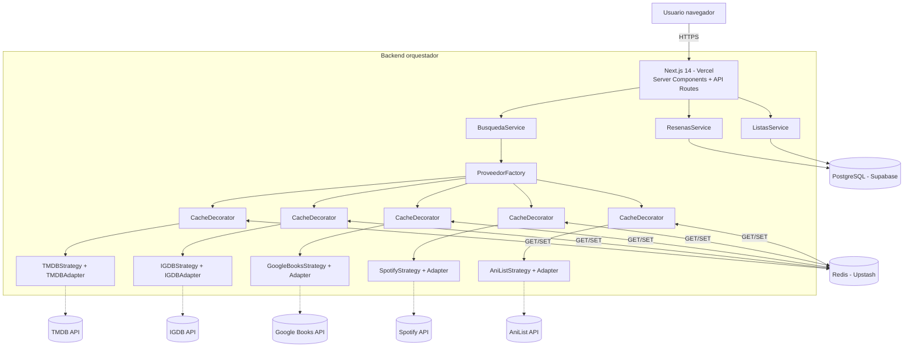
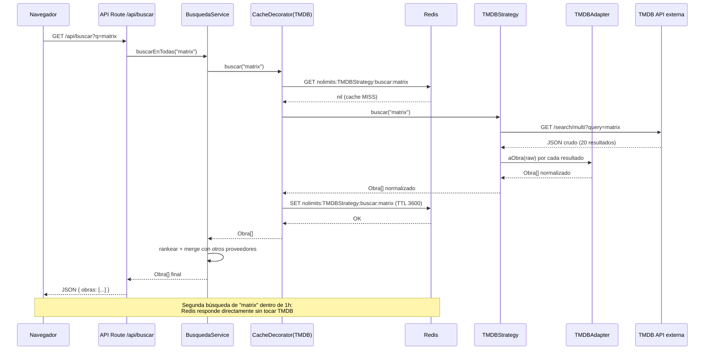

# Guía Personalizada – Grupo 3: NoLimits
## Plataforma web agregadora de contenido multimedia (películas, series, libros, música, videojuegos, anime)

**Asignatura:** TPY1101 – Taller Aplicado de Programación
**Integrantes:** Christian Troncoso · James Videla · Marta Sanhueza
**Duración de la actividad asociada:** 1 hora 30 minutos

> **Cómo usar este documento:** léanlo completo antes de la actividad. Las secciones 1-10 son la **teoría y recomendación técnica** para su proyecto específico. La sección 11 es la **actividad de 90 minutos** que deben completar en clase. Lo que produzcan en esa actividad se entrega como `ARQUITECTURA.md` dentro del repo del equipo. El documento es **autodidáctico**: no necesitan material externo para seguirlo.

---

## 1. Contexto del proyecto (según su EA1/Ev1)

Su proyecto es una **plataforma web agregadora de contenido multimedia** llamada **NoLimits**, orientada a resolver la **fragmentación de la información** sobre películas, series, libros, música, videojuegos y anime. Hoy los usuarios deben abrir IMDB, Metacritic, MobyGames, Steam, Google Books, Flickmetrix, Spotify y un marketplace sólo para decidir qué ver/leer/escuchar. De acuerdo con el informe EA1/Ev1, las piezas principales son:

1. **Módulo de búsqueda unificada** sobre múltiples fuentes externas (TMDB, OMDB, IGDB, Google Books, Spotify, AniList, etc.).
2. **Módulo de detalle de obra** con información combinada de varias fuentes (ficha, sinopsis, calificaciones agregadas, dónde verla/comprarla).
3. **Módulo de listas personales** (ver más tarde, favoritos, completadas, abandonadas).
4. **Módulo social de reseñas y calificaciones** propias de NoLimits.
5. **Módulo de recomendaciones personalizadas** basadas en las listas e historial del usuario.
6. **Módulo de organización por sagas/franquicias** (diferenciador clave respecto a IMDB/Steam).

Esto implica que necesitan:

- una **aplicación web** (no móvil nativa), con una SPA moderna que haga SSR/ISR para SEO;
- un **backend orquestador** que consulte **muchas APIs externas** y combine sus resultados;
- **cache agresivo** (Redis), porque cada API externa tiene rate limits y cuotas gratuitas pequeñas;
- **adaptadores por cada API** para normalizar respuestas heterogéneas (no todas hablan JSON igual);
- **autenticación** para listas y reseñas propias;
- un modelo de datos interno unificado `Obra` que pueda representar películas, libros, juegos, música, anime y sagas.

---

## 2. Su tarjeta técnica (resumen ejecutivo)

| Elemento | Recomendación |
|---|---|
| **Tipo de app** | Web SPA + SSR/ISR |
| **Framework frontend** | Next.js 14 (App Router) + React Server Components |
| **Backend** | Next API Routes (ó Node.js + Express separado) |
| **Base de datos** | PostgreSQL (Supabase) |
| **Cache** | **Redis (Upstash) — OBLIGATORIO** |
| **Auth** | Supabase Auth (OAuth Google + email/password) |
| **APIs externas** | TMDB, OMDB, IGDB, Google Books, Spotify, AniList, RAWG |
| **Arquitectura general** | SPA ↔ API orquestadora ↔ (Strategy → APIs externas + Repository → PostgreSQL) |
| **Patrones frontend críticos** | Component-Based, Custom Hooks, Server Components, TanStack Query |
| **Patrones backend críticos** | **Strategy (estrella)**, **Adapter**, **Decorator (cache)**, **Factory**, Repository, Chain of Responsibility |
| **Plataforma de despliegue** | Vercel (frontend+API) · Supabase (DB) · Upstash (Redis) |

---

## 3. Análisis específico de su problema

### 3.1. ¿Por qué web y no móvil?

Porque su diferenciador no requiere permisos del sistema operativo (como sí requería Grupo 1 para bloquear apps), sino **buena experiencia de búsqueda, navegación y SEO**. Una plataforma pública agregadora de contenido debe ser:

- **Indexable por Google** (alguien que busca "precio The Witcher 3 Steam" debería encontrarles). Esto obliga a **SSR o ISR**, no SPA pura.
- **Compartible** (pegar un link en WhatsApp debe mostrar preview OpenGraph).
- **Rápida en el primer load** (Core Web Vitals afectan ranking).

Next.js 14 con App Router les da todo lo anterior "gratis": Server Components para SEO, ISR para páginas de obra, streaming para percepción de velocidad.

### 3.2. Volumen esperado y consecuencia técnica

Si proyectan 1.000-10.000 usuarios activos mensuales el primer año, con ~20 búsquedas promedio por sesión, hablan de **200.000-2.000.000 búsquedas al mes**. **Sin cache**, cada búsqueda equivaldría a 5-7 llamadas a APIs externas, todas con cuota mensual:

| API | Cuota gratuita aproximada | Cuota si hacen 2 M búsquedas sin cache |
|---|---|---|
| TMDB | 40 req/s, ilimitado/día | OK (con rate limit propio) |
| OMDB | 1.000/día | **Se agota en 1 día** |
| IGDB | 4 req/s | **Se agota en horas** |
| Spotify | ~180 req/min | Se agota en horas |
| Google Books | 1.000/día | **Se agota en 1 día** |
| AniList | 90 req/min | Se agota |

**Conclusión dura:** **sin Redis y cache con TTL, NoLimits es inviable económicamente**. Esta es la razón por la que el patrón **Decorator de cache** es obligatorio en su proyecto.

### 3.3. Retos técnicos particulares de su proyecto

1. **Heterogeneidad de APIs externas:** cada una devuelve un JSON distinto. Necesitan **Adapters**.
2. **Rate limiting y cuotas:** necesitan **cache TTL** (Decorator) y, si se complica, **colas**.
3. **Fallos parciales:** si IGDB cae, la búsqueda debe seguir funcionando con TMDB/OMDB.
4. **Modelo unificado `Obra`:** una película, un libro y un videojuego son cosas muy distintas. Necesitan un modelo que los represente sin perder sus particularidades.
5. **SEO y performance:** ISR en páginas de obra (`/obra/matrix`) y cache-control correcto.
6. **Legal/TOS:** no pueden **espejar** catálogos completos de APIs externas; sólo cachear con TTL razonable.

---

## 4. Patrones recomendados para su frontend

> Los ejemplos asumen **Next.js 14 con App Router y React Server Components**.

### 4.1. Component-Based Architecture

**Por qué para ustedes:** una plataforma de contenido vive de listas y tarjetas. Si cada pantalla re-implementa la tarjeta de obra, terminarán con 10 variantes inconsistentes.

- **Componentes visuales reutilizables** (`Boton`, `Badge`, `EstrellasRating`).
- **Componentes específicos del dominio** (`ObraCard`, `ObraHeader`, `ListaPersonalItem`, `ResenaCard`).
- **Páginas / layouts** (`app/buscar/page.jsx`, `app/obra/[slug]/page.jsx`, `app/mi-lista/page.jsx`).

#### Ejemplo adaptado a su proyecto

```jsx
// components/ObraCard.jsx
import Image from 'next/image';
import Link from 'next/link';

export default function ObraCard({ obra }) {
  return (
    <Link href={`/obra/${obra.slug}`} className="obra-card">
      <Image src={obra.portadaUrl} alt={obra.titulo} width={240} height={360} />
      <div className="obra-info">
        <h3>{obra.titulo}</h3>
        <span className="tipo">{obra.tipo}</span> {/* 'pelicula'|'libro'|'juego'... */}
        <EstrellasRating valor={obra.calificacionAgregada} />
        <p className="fuente">Fuente principal: {obra.fuentePrincipal}</p>
      </div>
    </Link>
  );
}
```

### 4.2. Custom Hooks para llamadas a la API orquestadora

**Por qué para ustedes:** van a tener muchas búsquedas, filtros y paginaciones. Dejar ese código dentro de los componentes lo hace inmantenible. Además, **TanStack Query (React Query)** les dará cache en cliente gratis.

```jsx
// hooks/useBuscarObra.js
'use client';
import { useQuery } from '@tanstack/react-query';

export function useBuscarObra({ termino, tipo, pagina = 1 }) {
  return useQuery({
    queryKey: ['buscar', termino, tipo, pagina],
    queryFn: async () => {
      const params = new URLSearchParams({ q: termino, tipo, page: pagina });
      const r = await fetch(`/api/buscar?${params}`);
      if (!r.ok) throw new Error('Fallo la búsqueda');
      return r.json();
    },
    enabled: termino.length >= 2,
    staleTime: 5 * 60 * 1000, // 5 minutos de cache en cliente
  });
}

// hooks/useMiLista.js
export function useMiLista(usuarioId, nombreLista) {
  return useQuery({
    queryKey: ['mi-lista', usuarioId, nombreLista],
    queryFn: async () => {
      const r = await fetch(`/api/usuarios/${usuarioId}/listas/${nombreLista}`);
      return r.json();
    },
  });
}
```

### 4.3. Server Components para SEO y performance

**Por qué para ustedes:** la página `/obra/matrix` debe ser crawleada por Google. Con Server Components más ISR, el HTML llega con todo el contenido listo.

```jsx
// app/obra/[slug]/page.jsx  (Server Component, por defecto)
import { obtenerObra } from '@/lib/obras';
import ObraHeader from '@/components/ObraHeader';
import ListaResenas from '@/components/ListaResenas';

// ISR: revalida cada hora
export const revalidate = 3600;

export async function generateMetadata({ params }) {
  const obra = await obtenerObra(params.slug);
  return {
    title: `${obra.titulo} — NoLimits`,
    description: obra.sinopsis.slice(0, 160),
    openGraph: { images: [obra.portadaUrl] },
  };
}

export default async function PaginaObra({ params }) {
  const obra = await obtenerObra(params.slug);
  return (
    <main>
      <ObraHeader obra={obra} />
      <section>
        <h2>Sinopsis</h2>
        <p>{obra.sinopsis}</p>
      </section>
      <ListaResenas obraId={obra.id} /> {/* este sí puede ser Client si necesita interactividad */}
    </main>
  );
}
```

### 4.4. Estado global ligero con Zustand (sesión y preferencias)

```jsx
// stores/sessionStore.js
import { create } from 'zustand';
import { persist } from 'zustand/middleware';

export const useSession = create(persist((set) => ({
  usuario: null,
  token: null,
  tiposPreferidos: ['pelicula', 'serie'], // filtro global

  iniciarSesion: (usuario, token) => set({ usuario, token }),
  cerrarSesion: () => set({ usuario: null, token: null }),
  setTiposPreferidos: (tipos) => set({ tiposPreferidos: tipos }),
}), { name: 'nolimits-session' }));
```

---

## 5. Patrones recomendados para su backend

> **Esta es la sección más importante del documento.** NoLimits se define por cómo integra muchas APIs externas heterogéneas. Tres patrones son el corazón del proyecto: **Strategy**, **Adapter** y **Decorator**, orquestados por una **Factory**.

### 5.1. Patrón Strategy — el patrón ESTRELLA de NoLimits

**Idea general.** Cuando tienes varias formas de hacer algo y quieres poder **intercambiarlas** según el contexto, defines una **interfaz común** y cada forma concreta es una **Strategy**. El cliente del código sólo conoce la interfaz.

**Aplicado a NoLimits.** Cada proveedor externo (TMDB, IGDB, Google Books, etc.) es una Strategy distinta que implementa la misma interfaz `IProveedorContenido`. El `BusquedaService` no sabe si está hablando con TMDB o IGDB; sólo sabe que tiene "un proveedor que responde `buscar(termino)` y `obtenerDetalle(id)`".

#### 5.1.1. Interfaz común

Como JavaScript no tiene interfaces nativas, usamos una **clase abstracta** o, mejor, **TypeScript** (muy recomendable en su proyecto). Aquí va la versión JS didáctica con clase abstracta:

```js
// backend/proveedores/IProveedorContenido.js
class IProveedorContenido {
  /**
   * @param {string} termino
   * @returns {Promise<Obra[]>}
   */
  async buscar(termino) { throw new Error('No implementado'); }

  /**
   * @param {string} idExterno
   * @returns {Promise<Obra>}
   */
  async obtenerDetalle(idExterno) { throw new Error('No implementado'); }

  /**
   * Tipos de obra que este proveedor maneja.
   * @returns {('pelicula'|'serie'|'libro'|'juego'|'musica'|'anime')[]}
   */
  get tiposSoportados() { throw new Error('No implementado'); }
}

module.exports = IProveedorContenido;
```

Y el modelo unificado `Obra` (DTO interno de la aplicación):

```js
// backend/dominio/Obra.js
class Obra {
  constructor({
    idExterno, fuente, tipo, titulo, sinopsis, anio,
    portadaUrl, calificacion, generos = [], extras = {}
  }) {
    this.idExterno = idExterno;      // id en la API externa
    this.fuente = fuente;            // 'TMDB' | 'IGDB' | ...
    this.tipo = tipo;                // 'pelicula' | 'libro' | ...
    this.titulo = titulo;
    this.sinopsis = sinopsis;
    this.anio = anio;
    this.portadaUrl = portadaUrl;
    this.calificacion = calificacion;// 0..10 normalizado
    this.generos = generos;
    this.extras = extras;            // campos específicos no normalizables
  }

  get slug() {
    return `${this.fuente.toLowerCase()}-${this.idExterno}`;
  }
}

module.exports = Obra;
```

#### 5.1.2. Strategies concretas

Cada API externa tiene su propia Strategy. Noten cómo **la transformación JSON → `Obra`** se delega a un Adapter (sección 5.2).

```js
// backend/proveedores/TMDBStrategy.js
const IProveedorContenido = require('./IProveedorContenido');
const TMDBAdapter = require('../adapters/TMDBAdapter');

class TMDBStrategy extends IProveedorContenido {
  constructor({ apiKey, http }) {
    super();
    this.apiKey = apiKey;
    this.http = http;                // cliente HTTP (axios o fetch envuelto)
    this.adapter = new TMDBAdapter();
    this.baseUrl = 'https://api.themoviedb.org/3';
  }

  get tiposSoportados() { return ['pelicula', 'serie']; }

  async buscar(termino) {
    const { data } = await this.http.get(`${this.baseUrl}/search/multi`, {
      params: { api_key: this.apiKey, query: termino, language: 'es-ES' },
    });
    return data.results
      .filter(r => ['movie', 'tv'].includes(r.media_type))
      .map(r => this.adapter.aObra(r));
  }

  async obtenerDetalle(idExterno) {
    const [tipo, id] = idExterno.split(':'); // 'movie:550' o 'tv:1399'
    const { data } = await this.http.get(`${this.baseUrl}/${tipo}/${id}`, {
      params: { api_key: this.apiKey, language: 'es-ES' },
    });
    return this.adapter.aObraDetalle(data, tipo);
  }
}

module.exports = TMDBStrategy;
```

```js
// backend/proveedores/IGDBStrategy.js
const IProveedorContenido = require('./IProveedorContenido');
const IGDBAdapter = require('../adapters/IGDBAdapter');

class IGDBStrategy extends IProveedorContenido {
  constructor({ clientId, accessToken, http }) {
    super();
    this.clientId = clientId;
    this.accessToken = accessToken;
    this.http = http;
    this.adapter = new IGDBAdapter();
    this.baseUrl = 'https://api.igdb.com/v4';
  }

  get tiposSoportados() { return ['juego']; }

  async buscar(termino) {
    // IGDB usa un query-language propio (no JSON). Aquí asumimos helper.
    const body = `search "${termino}"; fields name, cover.url, summary, rating, first_release_date; limit 20;`;
    const { data } = await this.http.post(`${this.baseUrl}/games`, body, {
      headers: {
        'Client-ID': this.clientId,
        'Authorization': `Bearer ${this.accessToken}`,
        'Content-Type': 'text/plain',
      },
    });
    return data.map(j => this.adapter.aObra(j));
  }

  async obtenerDetalle(idExterno) {
    const body = `fields *; where id = ${idExterno};`;
    const { data } = await this.http.post(`${this.baseUrl}/games`, body, { /* headers */ });
    return this.adapter.aObraDetalle(data[0]);
  }
}

module.exports = IGDBStrategy;
```

```js
// backend/proveedores/GoogleBooksStrategy.js
const IProveedorContenido = require('./IProveedorContenido');
const GoogleBooksAdapter = require('../adapters/GoogleBooksAdapter');

class GoogleBooksStrategy extends IProveedorContenido {
  constructor({ apiKey, http }) {
    super();
    this.apiKey = apiKey;
    this.http = http;
    this.adapter = new GoogleBooksAdapter();
    this.baseUrl = 'https://www.googleapis.com/books/v1';
  }

  get tiposSoportados() { return ['libro']; }

  async buscar(termino) {
    const { data } = await this.http.get(`${this.baseUrl}/volumes`, {
      params: { q: termino, maxResults: 20, key: this.apiKey, langRestrict: 'es' },
    });
    return (data.items || []).map(v => this.adapter.aObra(v));
  }

  async obtenerDetalle(idExterno) {
    const { data } = await this.http.get(`${this.baseUrl}/volumes/${idExterno}`, {
      params: { key: this.apiKey },
    });
    return this.adapter.aObraDetalle(data);
  }
}

module.exports = GoogleBooksStrategy;
```

Análogamente tendrán `OMDBStrategy`, `SpotifyStrategy`, `AniListStrategy`, `RAWGStrategy`. **Todas responden al mismo contrato**: `buscar()` y `obtenerDetalle()`.

#### 5.1.3. Uso de las Strategies desde el servicio

```js
// backend/servicios/busqueda.service.js
class BusquedaService {
  constructor(proveedores) {
    this.proveedores = proveedores; // Array<IProveedorContenido>
  }

  async buscarEnTodas(termino) {
    // Ejecuta todas en paralelo, tolera errores individuales
    const resultados = await Promise.allSettled(
      this.proveedores.map(p => p.buscar(termino))
    );
    const obras = [];
    for (const r of resultados) {
      if (r.status === 'fulfilled') obras.push(...r.value);
      else console.warn('Proveedor falló:', r.reason?.message);
    }
    return this.rankear(obras, termino);
  }

  rankear(obras, termino) {
    // Prioriza coincidencia exacta de título, luego calificación
    const t = termino.toLowerCase();
    return obras.sort((a, b) => {
      const aExacto = a.titulo.toLowerCase() === t ? 1 : 0;
      const bExacto = b.titulo.toLowerCase() === t ? 1 : 0;
      if (aExacto !== bExacto) return bExacto - aExacto;
      return (b.calificacion ?? 0) - (a.calificacion ?? 0);
    });
  }
}

module.exports = BusquedaService;
```

**Noten lo poderoso:** agregar una nueva fuente (por ejemplo MangaUpdates) es crear un archivo nuevo `MangaUpdatesStrategy.js` que extienda `IProveedorContenido`. **Ningún otro código cambia.** Eso es Strategy bien aplicado.

### 5.2. Patrón Adapter — normalizar respuestas heterogéneas

**Idea general.** Un Adapter convierte la interfaz (o forma) que expone un objeto en otra que el cliente espera. Como cada API devuelve campos distintos (`title` vs `name`, `release_date` vs `first_release_date` en timestamp UNIX, etc.), necesitan una capa que los normalice al DTO interno `Obra`.

**Aplicado a NoLimits.** Cada Strategy tiene su Adapter interno. Los Adapters hacen el trabajo sucio de parsear fechas, construir URLs de imágenes, mapear géneros, etc.

```js
// backend/adapters/TMDBAdapter.js
const Obra = require('../dominio/Obra');

class TMDBAdapter {
  aObra(raw) {
    const esPelicula = raw.media_type === 'movie' || raw.title;
    return new Obra({
      idExterno: `${esPelicula ? 'movie' : 'tv'}:${raw.id}`,
      fuente: 'TMDB',
      tipo: esPelicula ? 'pelicula' : 'serie',
      titulo: raw.title ?? raw.name,
      sinopsis: raw.overview ?? '',
      anio: this.extraerAnio(raw.release_date ?? raw.first_air_date),
      portadaUrl: raw.poster_path
        ? `https://image.tmdb.org/t/p/w500${raw.poster_path}`
        : null,
      calificacion: raw.vote_average ?? null, // ya viene 0..10
      generos: raw.genre_ids ?? [],
    });
  }

  aObraDetalle(raw, tipo) {
    return new Obra({
      idExterno: `${tipo}:${raw.id}`,
      fuente: 'TMDB',
      tipo: tipo === 'movie' ? 'pelicula' : 'serie',
      titulo: raw.title ?? raw.name,
      sinopsis: raw.overview ?? '',
      anio: this.extraerAnio(raw.release_date ?? raw.first_air_date),
      portadaUrl: raw.poster_path ? `https://image.tmdb.org/t/p/w500${raw.poster_path}` : null,
      calificacion: raw.vote_average,
      generos: (raw.genres ?? []).map(g => g.name),
      extras: {
        duracion: raw.runtime ?? null,
        idiomaOriginal: raw.original_language,
        companias: (raw.production_companies ?? []).map(c => c.name),
      },
    });
  }

  extraerAnio(fecha) {
    return fecha ? parseInt(fecha.slice(0, 4), 10) : null;
  }
}

module.exports = TMDBAdapter;
```

```js
// backend/adapters/IGDBAdapter.js
const Obra = require('../dominio/Obra');

class IGDBAdapter {
  aObra(raw) {
    return new Obra({
      idExterno: String(raw.id),
      fuente: 'IGDB',
      tipo: 'juego',
      titulo: raw.name,
      sinopsis: raw.summary ?? '',
      anio: raw.first_release_date
        ? new Date(raw.first_release_date * 1000).getFullYear()
        : null,
      portadaUrl: raw.cover?.url
        ? `https:${raw.cover.url.replace('t_thumb', 't_cover_big')}`
        : null,
      calificacion: raw.rating ? (raw.rating / 10) : null, // IGDB usa 0..100, normalizamos a 0..10
      generos: [],
    });
  }

  aObraDetalle(raw) {
    return this.aObra(raw); // podríamos enriquecer con más campos
  }
}

module.exports = IGDBAdapter;
```

```js
// backend/adapters/GoogleBooksAdapter.js
const Obra = require('../dominio/Obra');

class GoogleBooksAdapter {
  aObra(raw) {
    const v = raw.volumeInfo ?? {};
    return new Obra({
      idExterno: raw.id,
      fuente: 'GOOGLE_BOOKS',
      tipo: 'libro',
      titulo: v.title,
      sinopsis: v.description ?? '',
      anio: v.publishedDate ? parseInt(v.publishedDate.slice(0, 4), 10) : null,
      portadaUrl: v.imageLinks?.thumbnail ?? null,
      calificacion: v.averageRating ? v.averageRating * 2 : null, // 0..5 → 0..10
      generos: v.categories ?? [],
      extras: { autores: v.authors ?? [], paginas: v.pageCount ?? null },
    });
  }

  aObraDetalle(raw) { return this.aObra(raw); }
}

module.exports = GoogleBooksAdapter;
```

**Observación:** cada Adapter encapsula las rarezas de su fuente (escala de calificación 0..100 vs 0..5, imágenes con `https:` prefijo faltante, fechas UNIX vs ISO). El resto del sistema ve siempre el mismo DTO `Obra`.

### 5.3. Patrón Decorator — CacheDecorator (obligatorio en NoLimits)

**Idea general.** El Decorator **envuelve** un objeto y agrega comportamiento **sin modificar** la clase original ni a sus clientes. Es ideal para agregar cross-cutting concerns (logging, cache, métricas).

**Aplicado a NoLimits.** Cada Strategy queda envuelta por un `CacheDecorator` que, antes de llamar a la API externa, revisa Redis. Si hay hit, devuelve el resultado cacheado; si hay miss, llama a la Strategy real y guarda el resultado con TTL.

```js
// backend/proveedores/CacheDecorator.js
const IProveedorContenido = require('./IProveedorContenido');

class CacheDecorator extends IProveedorContenido {
  /**
   * @param {IProveedorContenido} proveedor  - Strategy real
   * @param {RedisClient} redis
   * @param {number} ttlSegundos
   */
  constructor(proveedor, redis, ttlSegundos = 3600) {
    super();
    this.proveedor = proveedor;
    this.redis = redis;
    this.ttl = ttlSegundos;
  }

  get tiposSoportados() { return this.proveedor.tiposSoportados; }

  _clave(fn, arg) {
    const fuente = this.proveedor.constructor.name;
    return `nolimits:${fuente}:${fn}:${arg.toLowerCase()}`;
  }

  async buscar(termino) {
    const k = this._clave('buscar', termino);
    const hit = await this.redis.get(k);
    if (hit) return JSON.parse(hit);

    const obras = await this.proveedor.buscar(termino);
    // Sólo cacheamos si hubo respuesta utilizable
    if (obras.length > 0) {
      await this.redis.set(k, JSON.stringify(obras), 'EX', this.ttl);
    }
    return obras;
  }

  async obtenerDetalle(idExterno) {
    const k = this._clave('detalle', idExterno);
    const hit = await this.redis.get(k);
    if (hit) return JSON.parse(hit);

    const obra = await this.proveedor.obtenerDetalle(idExterno);
    await this.redis.set(k, JSON.stringify(obra), 'EX', this.ttl * 6); // detalles cambian menos
    return obra;
  }
}

module.exports = CacheDecorator;
```

**Ventajas concretas:**

- Una Strategy no sabe que está cacheada. Su código queda **puro** y **testeable**.
- Pueden apilar decoradores: `new LoggingDecorator(new RateLimitDecorator(new CacheDecorator(new TMDBStrategy(...))))`.
- Cambiar de Redis a otro cache (Memcached, in-memory) sólo toca el Decorator.

**TTLs recomendados en NoLimits:**

| Recurso | TTL | Razón |
|---|---|---|
| Búsqueda (`buscar("matrix")`) | 1 h | Trends cambian, pero no minuto a minuto |
| Detalle de obra (`/obra/550`) | 6-24 h | Ficha estable |
| Trending de la semana | 15 min | Refresco frecuente |
| Catálogo pesado (géneros, plataformas) | 7 días | Casi inmutable |

### 5.4. Patrón Factory — elegir la Strategy correcta

**Idea general.** Una Factory centraliza la creación de objetos. Su código cliente dice "dame un proveedor que sepa buscar juegos" y la Factory devuelve la Strategy adecuada (o la lista de Strategies adecuadas).

**Aplicado a NoLimits.** La Factory construye las Strategies con sus API keys, las envuelve en CacheDecorator y expone un método `obtener(tipo)`.

```js
// backend/proveedores/ProveedorFactory.js
const TMDBStrategy = require('./TMDBStrategy');
const OMDBStrategy = require('./OMDBStrategy');
const IGDBStrategy = require('./IGDBStrategy');
const GoogleBooksStrategy = require('./GoogleBooksStrategy');
const SpotifyStrategy = require('./SpotifyStrategy');
const AniListStrategy = require('./AniListStrategy');
const CacheDecorator = require('./CacheDecorator');

class ProveedorFactory {
  constructor({ env, redis, http }) {
    this.env = env;
    this.redis = redis;
    this.http = http;
    this._cache = new Map(); // singleton por fuente
  }

  _build(claseProveedor, ttl = 3600) {
    if (this._cache.has(claseProveedor.name)) {
      return this._cache.get(claseProveedor.name);
    }
    const raw = new claseProveedor({ ...this.env, http: this.http });
    const decorado = new CacheDecorator(raw, this.redis, ttl);
    this._cache.set(claseProveedor.name, decorado);
    return decorado;
  }

  /** Devuelve una sola Strategy para un tipo. */
  obtener(tipo) {
    switch (tipo) {
      case 'pelicula':
      case 'serie':
        return this._build(TMDBStrategy);
      case 'libro':
        return this._build(GoogleBooksStrategy);
      case 'juego':
        return this._build(IGDBStrategy);
      case 'musica':
        return this._build(SpotifyStrategy);
      case 'anime':
        return this._build(AniListStrategy);
      default:
        throw new Error(`Tipo desconocido: ${tipo}`);
    }
  }

  /** Devuelve todas las Strategies activas (para búsqueda universal). */
  obtenerTodas() {
    return [
      this._build(TMDBStrategy),
      this._build(OMDBStrategy),
      this._build(IGDBStrategy),
      this._build(GoogleBooksStrategy),
      this._build(SpotifyStrategy),
      this._build(AniListStrategy),
    ];
  }
}

module.exports = ProveedorFactory;
```

Y en el endpoint:

```js
// app/api/buscar/route.js  (Next API Route)
import { NextResponse } from 'next/server';
import { getContainer } from '@/lib/container';

export async function GET(req) {
  const { searchParams } = new URL(req.url);
  const termino = searchParams.get('q') ?? '';
  const tipo = searchParams.get('tipo');

  if (termino.length < 2) return NextResponse.json({ obras: [] });

  const { factory, busquedaService } = getContainer();

  let obras;
  if (tipo) {
    const proveedor = factory.obtener(tipo);
    obras = await proveedor.buscar(termino);
  } else {
    obras = await busquedaService.buscarEnTodas(termino);
  }
  return NextResponse.json({ obras });
}
```

### 5.5. Patrón Repository — datos locales (usuarios, listas, reseñas)

**Por qué para ustedes:** las listas personales, reseñas y calificaciones propias **sí** viven en su PostgreSQL (no en las APIs externas). Centralizar sus queries evita duplicación.

```js
// backend/repositorios/resenas.repository.js
const pool = require('../config/db');

async function crearResena({ usuarioId, obraSlug, calificacion, texto }) {
  const { rows } = await pool.query(
    `INSERT INTO resenas (usuario_id, obra_slug, calificacion, texto)
     VALUES ($1, $2, $3, $4)
     RETURNING *`,
    [usuarioId, obraSlug, calificacion, texto]
  );
  return rows[0];
}

async function listarPorObra(obraSlug, { limite = 20, offset = 0 } = {}) {
  const { rows } = await pool.query(
    `SELECT r.*, u.nombre AS autor_nombre
       FROM resenas r
       JOIN usuarios u ON u.id = r.usuario_id
      WHERE r.obra_slug = $1
      ORDER BY r.creado_en DESC
      LIMIT $2 OFFSET $3`,
    [obraSlug, limite, offset]
  );
  return rows;
}

async function promedioCalificacion(obraSlug) {
  const { rows } = await pool.query(
    `SELECT AVG(calificacion)::numeric(3,2) AS prom, COUNT(*) AS cant
       FROM resenas WHERE obra_slug = $1`,
    [obraSlug]
  );
  return { promedio: rows[0].prom, cantidad: parseInt(rows[0].cant, 10) };
}

module.exports = { crearResena, listarPorObra, promedioCalificacion };
```

Repositorios análogos: `usuarios.repository.js`, `listas.repository.js`, `recomendaciones.repository.js`.

### 5.6. Chain of Responsibility (opcional, pero elegante)

**Idea general.** Una cadena de handlers que se pasan la solicitud hasta que alguno la responde.

**Aplicado a NoLimits.** Pipeline de búsqueda: primero miran la base de datos local (obras ya guardadas), luego Redis, luego APIs externas. Si alguna capa resuelve, se detiene.

```js
// backend/busqueda/cadenaBusqueda.js
class HandlerBase {
  setSiguiente(h) { this.siguiente = h; return h; }
  async manejar(termino, contexto = {}) {
    if (this.siguiente) return this.siguiente.manejar(termino, contexto);
    return { obras: [], origen: 'ninguno' };
  }
}

class HandlerDB extends HandlerBase {
  constructor(repoObras) { super(); this.repo = repoObras; }
  async manejar(termino, ctx) {
    const obras = await this.repo.buscarPorTitulo(termino);
    if (obras.length >= 5) return { obras, origen: 'db' };
    return super.manejar(termino, { ...ctx, obrasDB: obras });
  }
}

class HandlerAPIs extends HandlerBase {
  constructor(busquedaService) { super(); this.svc = busquedaService; }
  async manejar(termino, ctx) {
    const obras = await this.svc.buscarEnTodas(termino);
    return { obras: [...(ctx.obrasDB ?? []), ...obras], origen: 'apis' };
  }
}

// Composición
const cadena = new HandlerDB(repoObras);
cadena.setSiguiente(new HandlerAPIs(busquedaService));
const resultado = await cadena.manejar('matrix');
```

Es **opcional** porque agrega complejidad. Sólo úsenla si efectivamente tienen una BD local con obras persistidas.

---

## 6. Arquitectura recomendada

**Tipo:** SPA con SSR/ISR + **backend orquestador** con patrones Strategy + Adapter + Decorator + Factory.



### 6.1. Diagrama de secuencia: "el usuario busca 'Matrix'"

Muestra **cache miss → Strategy → Adapter → respuesta → cache set**.



---

## 7. Estructura de carpetas recomendada

### Frontend + Backend unificado en Next.js 14 (recomendado para equipos chicos)

```
nolimits/
├── package.json
├── next.config.mjs
├── .env.local.example
├── app/
│   ├── layout.jsx
│   ├── page.jsx                       # Home
│   ├── buscar/
│   │   └── page.jsx                   # Resultados de búsqueda
│   ├── obra/
│   │   └── [slug]/
│   │       └── page.jsx               # Detalle con ISR
│   ├── mi-lista/
│   │   └── page.jsx                   # Listas del usuario
│   └── api/
│       ├── buscar/route.js
│       ├── obra/[slug]/route.js
│       ├── resenas/route.js
│       └── listas/route.js
├── components/
│   ├── ObraCard.jsx
│   ├── ObraHeader.jsx
│   ├── ListaResenas.jsx
│   ├── EstrellasRating.jsx
│   └── BuscadorGlobal.jsx
├── hooks/
│   ├── useBuscarObra.js
│   ├── useMiLista.js
│   └── useResena.js
├── stores/
│   └── sessionStore.js
├── lib/
│   ├── container.js                   # DI simple: crea Factory + Services singleton
│   ├── redis.js
│   ├── db.js
│   └── http.js                        # cliente HTTP con timeout y retry
├── backend/                           # lógica backend (importada desde app/api)
│   ├── dominio/
│   │   └── Obra.js
│   ├── proveedores/
│   │   ├── IProveedorContenido.js
│   │   ├── TMDBStrategy.js
│   │   ├── OMDBStrategy.js
│   │   ├── IGDBStrategy.js
│   │   ├── GoogleBooksStrategy.js
│   │   ├── SpotifyStrategy.js
│   │   ├── AniListStrategy.js
│   │   ├── RAWGStrategy.js
│   │   ├── CacheDecorator.js
│   │   └── ProveedorFactory.js
│   ├── adapters/
│   │   ├── TMDBAdapter.js
│   │   ├── OMDBAdapter.js
│   │   ├── IGDBAdapter.js
│   │   ├── GoogleBooksAdapter.js
│   │   ├── SpotifyAdapter.js
│   │   └── AniListAdapter.js
│   ├── servicios/
│   │   ├── busqueda.service.js
│   │   ├── resenas.service.js
│   │   ├── listas.service.js
│   │   └── recomendaciones.service.js
│   └── repositorios/
│       ├── obras.repository.js
│       ├── resenas.repository.js
│       ├── listas.repository.js
│       └── usuarios.repository.js
└── migrations/
    └── 001_init.sql
```

### Si prefieren separar backend en Express

```
nolimits-api/
├── src/
│   ├── config/ (env, db, redis)
│   ├── middleware/ (auth, errorHandler, rateLimit)
│   ├── routes/ (buscar, obra, resenas, listas)
│   ├── proveedores/ (idéntico al de arriba)
│   ├── adapters/
│   ├── servicios/
│   ├── repositorios/
│   ├── app.js
│   └── server.js
└── migrations/
```

La **recomendación para este semestre** es mantener todo en Next.js 14 (menos overhead de despliegue).

---

## 8. Stack tecnológico y cómo desplegar

| Componente | Tecnología | Plataforma gratuita | Cómo desplegar |
|---|---|---|---|
| App web + API | Next.js 14 | **Vercel** (hobby plan) | Conectar GitHub → deploy automático en cada push |
| Base de datos | PostgreSQL | **Supabase** (500 MB) | Copiar `DATABASE_URL` a variables de entorno en Vercel |
| **Cache** | Redis | **Upstash** (10k req/día free) | Copiar `UPSTASH_REDIS_REST_URL` y `TOKEN` |
| Auth | Supabase Auth | Incluida | Activar email + Google OAuth en panel Supabase |
| APIs externas | Varias | Cada una con su tier gratuito | Registrar y guardar claves en `.env` |

### 8.1. Variables de entorno (ejemplo `.env.local.example`)

```env
# DB
DATABASE_URL=postgres://...
DIRECT_URL=postgres://...

# Auth
NEXT_PUBLIC_SUPABASE_URL=
NEXT_PUBLIC_SUPABASE_ANON_KEY=
SUPABASE_SERVICE_ROLE_KEY=

# Redis
UPSTASH_REDIS_REST_URL=
UPSTASH_REDIS_REST_TOKEN=

# APIs externas
TMDB_API_KEY=
OMDB_API_KEY=
IGDB_CLIENT_ID=
IGDB_ACCESS_TOKEN=
GOOGLE_BOOKS_API_KEY=
SPOTIFY_CLIENT_ID=
SPOTIFY_CLIENT_SECRET=
RAWG_API_KEY=
# AniList no requiere key para GraphQL público
```

### 8.2. Pasos concretos para su primer deploy

1. **Supabase:** crear proyecto → copiar `DATABASE_URL` → ejecutar `migrations/001_init.sql`.
2. **Upstash:** crear una base Redis región US-East (más cercana a Vercel).
3. **Registrar claves** de cada API externa (empiecen por TMDB, OMDB y Google Books: los 3 más simples).
4. **GitHub:** subir repo.
5. **Vercel:** New Project → importar repo → pegar variables de entorno → deploy.
6. Verificar en `/api/buscar?q=matrix` que responde con obras reales.

---

## 9. Riesgos identificados y mitigaciones

| Riesgo | Probabilidad | Impacto | Mitigación |
|---|---|---|---|
| **Agotar cuota gratuita de alguna API** | Alta | Alto | CacheDecorator con TTL adecuado; circuit breaker por proveedor; mostrar resultado parcial si cae una fuente |
| **Vercel hobby: 100 GB-h/mes** | Media | Medio | ISR y cache agresivo; evitar loops infinitos en API routes |
| **Supabase free: 500 MB** | Baja | Bajo | No espejar catálogos externos; almacenar sólo metadatos mínimos de obras reseñadas |
| **Upstash free: 10k req/día** | Media | Alto | Compactar claves; usar `MGET`/`pipeline` donde posible; priorizar cache de detalle sobre búsqueda |
| **Rate limit en plena demo** | Media | Muy alto | Pre-calentar cache con queries típicas antes de la presentación |
| **Respuestas heterogéneas que rompen el Adapter** | Media | Medio | Tests unitarios por Adapter con fixtures reales; fallback a `null` en campos opcionales |
| **TOS de APIs externas (prohibición de re-distribuir)** | Baja | Alto | Nunca servir "toda la BD cacheada" como endpoint propio; respetar TTL; citar fuentes en la UI |
| **SEO deficiente por falta de SSR** | Media | Alto | Usar Server Components en páginas de obra; `generateMetadata` correcto |
| **Falla parcial oculta al usuario** | Alta | Medio | Devolver `{ obras, fuentesFalladas: [...] }` y mostrarlo en la UI |

---

## 10. Anti-patrones y buenas prácticas específicas

### 10.1. Anti-patrones que deben evitar

- **Guardar catálogos completos de APIs externas** en su BD. Viola TOS de TMDB, IGDB y Spotify. Sólo guarden lo que el usuario reseñó o marcó.
- **Cache sin TTL** ("ya lo tenemos una vez, no pedirlo nunca más"): el dato se desincroniza y la UX se degrada.
- **TTL de 1 segundo** "por si acaso": inutiliza el cache, agota la cuota. Piensen con cabeza: un detalle de película no cambia en 1 h.
- **`Promise.all` sin `allSettled`** para búsquedas multi-fuente: si una falla, revientan todas.
- **Keys de Redis sin namespace** (`matrix` en vez de `nolimits:TMDBStrategy:buscar:matrix`): colisiones garantizadas.
- **Hardcodear API keys** en el repo. Usen `.env` y `.gitignore` desde el día 1.
- **Usar `fetch` sin timeout**. Si TMDB se cuelga 30 s, cuelgan a todos los usuarios. Pongan `AbortController` con 5-8 s.
- **Exponer IDs internos sin slug** en URLs: `/obra/12345` es peor para SEO que `/obra/the-matrix-1999`.
- **Mezclar lógica de transformación dentro del endpoint**: rompe el patrón Adapter. Siempre: endpoint → service → strategy → adapter.
- **Ignorar la paginación**: TMDB entrega 20 por página. Si piden 1000 resultados sin paginar, van a explotar.

### 10.2. Buenas prácticas

- [ ] Todas las Strategies heredan de `IProveedorContenido`.
- [ ] Cada Strategy tiene su Adapter, no transforma JSON en el endpoint.
- [ ] Todas las Strategies están envueltas en `CacheDecorator`.
- [ ] `ProveedorFactory` es la única que instancia Strategies (el resto recibe instancias).
- [ ] Claves de Redis incluyen `nolimits:<Fuente>:<op>:<arg>`.
- [ ] Los endpoints validan inputs con Zod.
- [ ] Los repositorios nunca reciben `req`/`res`, sólo datos.
- [ ] Hay tests de Adapter con fixtures guardadas (`tests/fixtures/tmdb-matrix.json`).
- [ ] La UI muestra **atribución a cada fuente** (obligatorio en varios TOS).
- [ ] El cache tiene métricas: % de hits por proveedor, observable en logs.

---

# 11. Actividad de Laboratorio (90 minutos)

## 11.1. Propósito

Al terminar, su equipo tendrá un `ARQUITECTURA.md` en el repo del proyecto con:

1. Contexto y requisitos técnicos de NoLimits.
2. Patrones elegidos con justificación (Strategy, Adapter, Decorator, Factory, Repository).
3. Diagrama de arquitectura y diagrama de secuencia.
4. Stack con plataformas y límites.
5. Estructura de carpetas creada en el repo.
6. Prototipo mínimo funcional.

## 11.2. Distribución del tiempo

| Bloque | Tiempo | Actividad |
|---|---|---|
| 1 | 10 min | Lectura dirigida de esta guía |
| 2 | 15 min | Análisis y contexto |
| 3 | 20 min | Patrones y diagramas |
| 4 | 20 min | Stack, plataformas y creación de carpetas |
| 5 | 15 min | Prototipo mínimo |
| 6 | 10 min | Cierre, commit y push |

## 11.3. Bloque 1 – Lectura dirigida (10 min)

Lean juntos las secciones 1-5 de esta guía, con énfasis en **5.1 (Strategy)**, **5.2 (Adapter)** y **5.3 (Decorator)**. Identifiquen qué patrones ya entienden y cuáles necesitan investigar.

**Checkpoint 1:** cada integrante explica con sus palabras, en voz alta, **qué problema resuelve Strategy en NoLimits**.

## 11.4. Bloque 2 – Análisis de contexto (15 min)

Creen en el repo del proyecto un archivo `ARQUITECTURA.md` con:

```markdown
# Arquitectura – NoLimits

## 1. Contexto
- **Problema:** información multimedia fragmentada en decenas de plataformas
- **Usuarios objetivo:** fanáticos de sagas + compradores ocasionales
- **Volumen esperado primer año:** 1k-10k MAU, ~20 búsquedas/sesión
- **Tipo de aplicación:** Web SSR/ISR agregadora

## 2. Requisitos funcionales clave
- Búsqueda unificada sobre múltiples APIs externas
- Detalle de obra con info combinada
- Listas personales (favoritos, ver más tarde, completadas)
- Reseñas y calificaciones propias
- Recomendaciones personalizadas
- Organización por saga/franquicia

## 3. Requisitos no funcionales
- Rendimiento: p95 de búsqueda < 1 s con cache caliente
- Escalabilidad: ISR + Redis para soportar 10x el tráfico sin tocar código
- Disponibilidad: fallo parcial de una API no debe derribar la búsqueda
- SEO: Core Web Vitals en verde; metadata OpenGraph por obra
- Legal: respeto de TOS de TMDB/IGDB/Spotify, atribución visible
```

**Checkpoint 2:** las secciones 1-3 están escritas con detalle propio, no copiadas de la guía.

## 11.5. Bloque 3 – Patrones, arquitectura y diagramas (20 min)

Añadan al `ARQUITECTURA.md`:

```markdown
## 4. Patrones frontend
- Component-Based: ObraCard, ObraHeader, EstrellasRating
- Custom Hooks: useBuscarObra, useMiLista, useResena
- Server Components: páginas de obra con ISR para SEO
- Zustand: sesión y tipos preferidos

## 5. Patrones backend (NoLimits hace uso intensivo de 4 patrones combinados)
- **Strategy**: IProveedorContenido implementado por TMDBStrategy, IGDBStrategy,
  GoogleBooksStrategy, SpotifyStrategy, AniListStrategy. Justificación: cada API
  externa tiene protocolo propio; intercambiar/agregar fuentes no debe tocar el
  servicio de búsqueda.
- **Adapter**: cada Strategy delega la transformación JSON→Obra a un Adapter.
  Justificación: respuestas heterogéneas (fechas UNIX vs ISO, escalas 0..100 vs 0..5).
- **Decorator (CacheDecorator)**: envuelve cada Strategy para cachear en Redis con TTL.
  Justificación: sin cache, agotamos cuotas gratuitas en horas.
- **Factory (ProveedorFactory)**: única clase que instancia Strategies decoradas.
- **Repository**: resenas.repository, listas.repository para datos propios en PostgreSQL.
- **(Opcional) Chain of Responsibility**: pipeline DB→Cache→APIs externas.

## 6. Arquitectura general
- Tipo: SPA + SSR/ISR en Next.js 14 con API Routes
- Justificación: equipo chico, necesidad de SEO, integración natural con Vercel

## 7. Diagramas

### 7.1. Arquitectura
[Pegar el diagrama Mermaid de la sección 6 adaptado]

### 7.2. Secuencia: "usuario busca Matrix" con cache miss
[Pegar el diagrama Mermaid de la sección 6.1 adaptado]
```

**Checkpoint 3:** los dos diagramas se ven correctamente renderizados en GitHub.

## 11.6. Bloque 4 – Stack, plataforma y carpetas (20 min)

Añadan:

```markdown
## 8. Stack tecnológico
- Frontend: Next.js 14 (App Router) + React Server Components
- Backend: Next API Routes (mismo repo)
- DB: PostgreSQL (Supabase)
- **Cache: Redis (Upstash) – OBLIGATORIO**
- Auth: Supabase Auth
- APIs externas: TMDB, OMDB, IGDB, Google Books, Spotify, AniList, RAWG

## 9. Plataformas de despliegue
| Componente | Plataforma | Límite free | Plan B |
|---|---|---|---|
| App + API | Vercel | 100 GB-h/mes | Railway |
| DB | Supabase | 500 MB | Neon |
| Cache | Upstash | 10k req/día | Redis Cloud free |
| Auth | Supabase Auth | 50k MAU | Clerk free |

## 10. Estructura de carpetas
[Pegar la estructura unificada Next.js de la sección 7]

## 11. Riesgos y mitigaciones
[Copiar tabla de la sección 9, adaptar al menos 2 riesgos]
```

**Obligatorio:** crear las carpetas reales. Ejemplo PowerShell:

```powershell
# Proyecto base
npx create-next-app@14 nolimits --app --no-tailwind --js
cd nolimits

# Capa backend
mkdir backend, backend\dominio, backend\proveedores, backend\adapters
mkdir backend\servicios, backend\repositorios
mkdir components, hooks, stores, lib, migrations

# Placeholders
New-Item backend\dominio\Obra.js
New-Item backend\proveedores\IProveedorContenido.js
New-Item backend\proveedores\TMDBStrategy.js
New-Item backend\adapters\TMDBAdapter.js
New-Item backend\proveedores\CacheDecorator.js
New-Item backend\proveedores\ProveedorFactory.js
New-Item lib\redis.js
New-Item lib\db.js
```

**Checkpoint 4:** las carpetas reales existen en el repo.

## 11.7. Bloque 5 – Prototipo mínimo (15 min)

Elijan **una** opción y demuestren que funciona.

### Opción A – API Route con una sola Strategy (sin cache aún)

Creen `TMDBStrategy` y `TMDBAdapter` siguiendo la sección 5.1-5.2 (versión mínima con `fetch`). Creen `app/api/buscar/route.js` que reciba `?q=matrix` y devuelva los primeros 20 títulos normalizados a `Obra`.

**Verificación:** `curl http://localhost:3000/api/buscar?q=matrix` devuelve JSON con campos `{ titulo, tipo, anio, portadaUrl, calificacion, fuente: 'TMDB' }`.

### Opción B – CacheDecorator demostrativo (in-memory)

Implementen `CacheDecorator` con un `Map` en memoria (sin Redis todavía) y envuelvan una Strategy trivial que simule una API lenta con `setTimeout`. Al llamar dos veces, la segunda debe ser instantánea.

**Verificación:** log en consola `MISS` la primera vez, `HIT` la segunda.

### Opción C – Factory + dos Strategies

Implementen `ProveedorFactory.obtener('pelicula')` y `.obtener('libro')`, cada una con su Strategy falsa que devuelva 1-2 `Obra` hardcodeadas. Demuestren que el endpoint decide cuál usar según `?tipo=`.

**Verificación:** `?tipo=pelicula` devuelve obra TMDB, `?tipo=libro` devuelve obra Google Books.

**Checkpoint 5:** hay evidencia visible (captura de terminal o navegador).

## 11.8. Bloque 6 – Cierre, commit y push (10 min)

Añadan:

```markdown
## 12. Prototipo realizado
- Opción: (A / B / C)
- Evidencia: (ruta a captura o URL)

## 13. Próximos pasos
- (3 bullets concretos para la siguiente semana)

## 14. Reflexión del equipo
- ¿Por qué Strategy es el patrón estrella de NoLimits?
- ¿Qué riesgo técnico les preocupa más (cuotas, TOS, performance)?
- ¿Qué API externa integrarán primero y por qué?
```

Y hagan:

```bash
git add .
git commit -m "docs(arquitectura): Strategy + Adapter + Decorator + Factory para NoLimits"
git push
```

## 11.9. Entregables

1. `ARQUITECTURA.md` con las secciones 1-14.
2. 2 diagramas Mermaid funcionales.
3. Estructura de carpetas creada.
4. Evidencia del prototipo (opción A, B o C).
5. Commit y push.

## 11.10. Criterios de evaluación

| Criterio | Peso |
|---|---|
| Strategy + Adapter + Decorator + Factory explicados con palabras propias | 25 % |
| Arquitectura coherente y dos diagramas | 20 % |
| Stack con plataformas y límites documentados | 15 % |
| Estructura de carpetas creada | 10 % |
| Prototipo funcionando | 15 % |
| Riesgos y mitigaciones (mínimo 3, incluyendo cuotas de APIs) | 10 % |
| Calidad de la redacción | 5 % |

---

## 12. Desafíos opcionales (si terminan antes)

- **A:** agregar un **segundo decorador** `LoggingDecorator` que loguee `hit`/`miss`/`error` y apilarlo con `CacheDecorator`.
- **B:** implementar `RateLimitDecorator` con `p-throttle` que limite IGDB a 4 req/s.
- **C:** escribir tests unitarios de `TMDBAdapter` con fixtures reales guardadas en `tests/fixtures/`.
- **D:** diseñar el **modelo de datos** (ER) para la BD: `usuarios`, `listas`, `listas_obras`, `resenas`, `obras_cache`. Entregar en `migrations/001_init.sql`.
- **E:** proponer una **política de TTL por recurso** en una tabla y justificarla.
- **F:** implementar un circuit breaker por proveedor: si falla 5 veces en 1 min, deshabilitar 5 min.

---

## 13. Próximos pasos (después de la actividad)

1. **Semana siguiente:** implementar `TMDBStrategy` + `TMDBAdapter` + `CacheDecorator` reales con Upstash. Demostrar p50 < 200 ms con cache caliente.
2. **Dos semanas:** sumar `IGDBStrategy` y `GoogleBooksStrategy`. Integrar `ProveedorFactory`. Endpoint `/api/buscar?q=` que consulta las 3 en paralelo.
3. **Tres semanas:** página `/obra/[slug]` con Server Components e ISR. `generateMetadata` con OpenGraph.
4. **Cuatro semanas:** módulo de autenticación Supabase + listas personales (CRUD).
5. **Cinco semanas:** módulo de reseñas + cálculo de calificación agregada NoLimits (combinando fuentes externas + reseñas internas).
6. **Seis-ocho semanas:** recomendaciones, organización por sagas, pulido y demo.

---

## 14. Recursos recomendados específicos para su proyecto

- **Next.js 14 App Router:** https://nextjs.org/docs/app
- **React Server Components (explicación visual):** https://nextjs.org/docs/app/building-your-application/rendering/server-components
- **TMDB API docs:** https://developer.themoviedb.org/docs
- **IGDB API docs:** https://api-docs.igdb.com/
- **Google Books API:** https://developers.google.com/books/docs/v1/using
- **Spotify Web API:** https://developer.spotify.com/documentation/web-api
- **AniList GraphQL API:** https://docs.anilist.co/
- **Upstash Redis (quickstart Next.js):** https://docs.upstash.com/redis/sdks/javascriptsdk/overview
- **Supabase con Next.js App Router:** https://supabase.com/docs/guides/auth/server-side/nextjs
- **Refactoring.Guru – Strategy pattern:** https://refactoring.guru/design-patterns/strategy
- **Refactoring.Guru – Adapter pattern:** https://refactoring.guru/design-patterns/adapter
- **Refactoring.Guru – Decorator pattern:** https://refactoring.guru/design-patterns/decorator

---

## 15. Cierre

NoLimits es un proyecto que **parece de CRUD** pero que, bien mirado, es un ejercicio magistral de patrones de integración: Strategy para múltiples proveedores, Adapter para heterogeneidad de respuestas, Decorator para cache obligatorio y Factory para amarrarlo todo. Si entienden esos cuatro patrones viviendo juntos, aprueban la asignatura con tranquilidad y además se llevan una herramienta de diseño que van a usar toda la carrera.

**Dos consejos finales muy concretos:**

1. **Empiecen por TMDB.** Es la API más amable y mejor documentada. Con una sola Strategy funcionando bien aprenden el 80% del patrón. Las otras 5 se agregan casi copiando.
2. **No se salten Redis.** Parece un detalle de infraestructura; en NoLimits es el corazón económico del proyecto. Sin cache, demos y evaluaciones se caen por agotar cuotas.

Éxito, equipo. Centralicen la información; el resto se resuelve solo.
