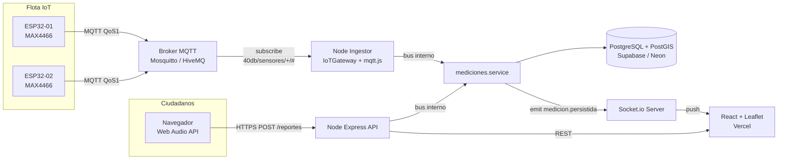
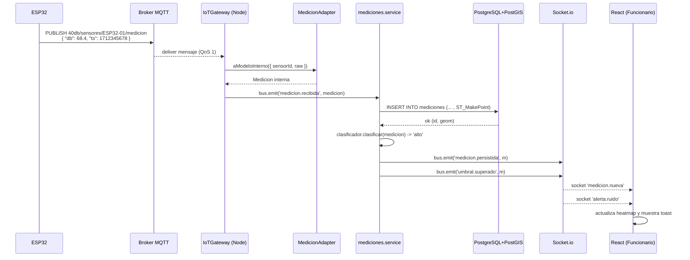

# Guía Personalizada – Grupo 4: 40dB
## Sistema de monitoreo colaborativo de ruido urbano en tiempo real

**Asignatura:** TPY1101 – Taller Aplicado de Programación
**Integrantes:** Joaquín Meléndez · Ignacio Saavedra
**Duración de la actividad asociada:** 1 hora 30 minutos

> **Cómo usar este documento:** léelo completo antes de la actividad. La primera parte (secciones 1-10) es la **teoría y recomendación técnica** para tu proyecto específico. La sección 11 es la **actividad de 90 minutos** que deben completar en clase. Lo que produzcan en esa actividad se entrega como `ARQUITECTURA.md` dentro del repo del equipo.

> **Nota especial para este grupo:** 40dB es, junto con muy pocos otros proyectos del curso, el más exigente técnicamente, porque es el único que combina **hardware real (IoT)**, **mensajería asíncrona (MQTT)**, **persistencia geoespacial (PostGIS)** y **actualización en vivo en el frontend (WebSockets)**. Esta guía se toma el tiempo de explicar MQTT desde cero, porque es probable que no lo hayan visto antes y es el corazón del sistema.

---

## 1. Contexto del proyecto (según tu EP1)

Tu proyecto es una **plataforma web de monitoreo colaborativo de ruido urbano**, orientada a municipalidades chilenas —inicialmente Maipú— como herramienta de gestión ambiental. De acuerdo con la EP1 y la presentación, las piezas principales son:

1. **Aplicación web de reporte ciudadano** que captura dB mediante el micrófono del navegador (Web Audio API) + geolocalización + categorización de la fuente.
2. **Prototipo de sensor IoT** basado en ESP32 + micrófono (MAX4466 u otro) que envía lecturas de nivel sonoro cada pocos minutos vía **MQTT**.
3. **Backend y API REST** que ingiere dos flujos heterogéneos (ciudadano y sensor), los persiste, los cruza y los expone.
4. **Heatmap (mapa de calor)** interactivo sobre un mapa real de la comuna, actualizado en tiempo real.
5. **Dashboard municipal** con filtros (zona, horario, tipo de fuente), estadísticas agregadas y exportación PDF/CSV.
6. **Motor de cruce y confiabilidad** que pondera cada reporte ciudadano contra la lectura del sensor fijo más cercano en el mismo rango horario.

Esto implica que necesitas:

- una **web app** responsiva (no móvil nativa) con acceso a micrófono y GPS;
- un **broker MQTT** que reciba las mediciones de los ESP32 de forma continua;
- un **backend event-driven** capaz de consumir MQTT, guardar en una base con índices geoespaciales y empujar datos al frontend en tiempo real;
- **dos perfiles de usuario** (vecino y funcionario municipal) con permisos diferentes;
- **datos geoespaciales** indexados (el heatmap no es lindo si la query tarda 4 segundos).

---

## 2. Tu tarjeta técnica (resumen ejecutivo)

| Elemento | Recomendación |
|---|---|
| **Tipo de app** | Web responsiva (desktop + móvil vía navegador) |
| **Frontend** | React + Vite + `react-leaflet` + `leaflet.heat` + `socket.io-client` |
| **Firmware sensor** | ESP32 en C/Arduino con `PubSubClient` (cliente MQTT) |
| **Broker MQTT** | Mosquitto (self-host gratis) o HiveMQ Cloud (free tier) |
| **Backend** | Node.js + Express + `mqtt.js` + `socket.io` |
| **Base de datos** | PostgreSQL + extensión **PostGIS** (Supabase o Neon) |
| **Auth** | Google OAuth 2.0 + JWT propio |
| **Arquitectura general** | **Event-Driven**: ESP32 → MQTT Broker → Ingestor Node → PostgreSQL+PostGIS → WebSocket → React |
| **Patrón estrella** | **Observer / Pub-Sub** (lo impone MQTT) |
| **Patrones backend críticos** | Repository (con queries PostGIS), Strategy (clasificadores de ruido), Adapter (formatos ESP32), Factory (procesadores), Gateway/Facade (`IoTGateway`) |
| **Patrones frontend críticos** | Component-Based, Custom Hooks, Provider, Observer (suscripción a socket) |
| **Despliegue API + Ingestor** | Render o Railway |
| **Despliegue Frontend** | Vercel |

---

## 3. Análisis específico de tu problema

### 3.1. ¿Por qué web y no móvil nativa?

Porque la EP1 lo definió así: la solución es **web responsive**. Esto tiene ventajas reales para ustedes:

- Cualquier vecino con navegador moderno puede reportar sin instalar nada.
- Los navegadores actuales exponen **Web Audio API** (para medir dB) y **Geolocation API** (para coordenadas) con permisos explícitos.
- Un único frontend sirve al vecino y al funcionario municipal; cambian solo las vistas según el rol.

Asumen correctamente que los micrófonos de smartphone no están calibrados profesionalmente: los datos son **indicativos**, no normativos.

### 3.2. Volumen esperado y consecuencia técnica

Supongamos el piloto en Maipú con 2 sensores ESP32 publicando cada 5 minutos y 200 reportes ciudadanos al día. Eso es **~600 inserts/día**. Es volumen mínimo. Pero la arquitectura tiene que estar preparada para que, si mañana se suman 50 sensores publicando cada 30 segundos (144.000 mensajes/día) y 5.000 reportes diarios, no se caiga. La clave está en:

- **Desacoplar ingesta de consulta** (un ingestor MQTT que solo escribe en la DB, y una API REST que solo lee).
- **Indexar con PostGIS** (`GIST` sobre la columna geográfica) para que un heatmap con bounding box responda en <50 ms.
- **No re-generar el heatmap cada vez** si no hay datos nuevos: cachear la última generación.

### 3.3. Retos técnicos particulares de tu proyecto

1. **Dos canales de ingesta muy distintos** (HTTP desde navegador y MQTT desde ESP32) que deben terminar en la misma tabla.
2. **Tiempo real:** el heatmap del funcionario debería actualizarse sin que tenga que recargar la página.
3. **Datos geoespaciales:** no basta con guardar lat/lng como `FLOAT`; hay que usar `GEOGRAPHY(Point, 4326)` y consultas con `ST_DWithin`, `ST_MakeEnvelope`, etc.
4. **Confiabilidad de reportes ciudadanos:** un reporte de 95 dB sin ningún sensor cercano es sospechoso; uno validado por un sensor a 20 metros que mide 92 dB es oro.
5. **Seguridad IoT:** un atacante podría publicar mediciones falsas al topic de MQTT si no hay autenticación por certificado o username/password fuerte.
6. **Privacidad:** nunca almacenar audio; solo el valor numérico dB, timestamp, tipo de fuente y coordenada.

---

## 4. MQTT desde cero (lectura obligatoria antes de la actividad)

Esta sección es fundacional: probablemente no han trabajado con MQTT, pero es literalmente el sistema nervioso de 40dB.

### 4.1. ¿Qué es MQTT?

**MQTT** (Message Queuing Telemetry Transport) es un protocolo de mensajería **publish-subscribe** diseñado para dispositivos con poca memoria, poco CPU y conexiones inestables. Es el estándar de facto del mundo IoT.

La idea central:

- Hay un **broker** (un servidor intermedio) al que todos se conectan.
- Los clientes que producen información **publican** mensajes en un **topic** (un string tipo ruta: `40db/sensores/ESP32-01/medicion`).
- Los clientes que necesitan esa información se **suscriben** a ese topic y el broker se los entrega automáticamente cuando llegan.

El productor **nunca sabe quién está escuchando**, y el consumidor **nunca sabe quién produjo**. El broker los desacopla.

### 4.2. ¿Por qué MQTT y no HTTP?

| Dimensión | HTTP | MQTT |
|---|---|---|
| Modelo | Request-Response | Pub-Sub |
| Overhead por mensaje | Headers pesados (cientos de bytes) | Binario, 2 bytes de overhead mínimo |
| Conexión | Abre y cierra (o keepalive corto) | Conexión persistente |
| Push del servidor | Difícil (long polling, SSE) | Nativo |
| Pensado para | Web | IoT / telemetría |

Para un ESP32 alimentado por USB/batería enviando medición cada 30 s, MQTT es 10× más eficiente.

### 4.3. Topics: la convención importa

Un **topic** es una jerarquía separada por `/`. Ejemplo para 40dB:

```
40db/sensores/ESP32-01/medicion
40db/sensores/ESP32-01/estado
40db/sensores/ESP32-02/medicion
40db/alertas/maipu/zona-centro
```

Un suscriptor puede usar **wildcards**:

- `+` = cualquier nivel único. Ej: `40db/sensores/+/medicion` escucha a todos los sensores.
- `#` = cualquier cantidad de niveles. Ej: `40db/#` escucha absolutamente todo.

**Convención recomendada para ustedes:**

```
40db/sensores/{sensor_id}/medicion     → publica el ESP32 periódicamente
40db/sensores/{sensor_id}/heartbeat    → publica el ESP32 cada N seg para decir "vivo"
40db/sensores/{sensor_id}/config       → publica el backend si quiere cambiar intervalo
40db/alertas/{comuna}/{zona}           → publica el backend cuando se supera umbral
```

### 4.4. QoS (Quality of Service)

MQTT tiene tres niveles de entrega:

- **QoS 0** – *at most once* – se envía y se olvida. Ideal para mediciones frecuentes donde perder una no duele.
- **QoS 1** – *at least once* – el broker reintenta hasta confirmar. Puede duplicar. Bueno para mediciones críticas.
- **QoS 2** – *exactly once* – garantizado único. Costoso en handshake. Para comandos críticos (p.ej. apagar un actuador).

Para 40dB: **QoS 1 para mediciones** (no duele mucho un duplicado y no quieren perder lecturas); QoS 0 para heartbeat.

### 4.5. Retained messages y Last Will

- **Retained:** un mensaje marcado como retained queda guardado en el broker; cualquiera que se suscriba después lo recibe inmediatamente. Útil para "estado actual del sensor".
- **Last Will and Testament (LWT):** un mensaje que el broker publicará automáticamente si el cliente se desconecta sin avisar. Perfecto para detectar sensores caídos.

```c
// En el ESP32, al conectar:
client.connect("ESP32-01",
               user, pass,
               "40db/sensores/ESP32-01/estado", // will topic
               1, true,                         // QoS 1, retained
               "offline");                      // will message
// Y apenas conecta, publica "online" como retained
client.publish("40db/sensores/ESP32-01/estado", "online", true);
```

Resultado: la plataforma sabe en todo momento qué sensores están vivos.

---

## 5. Patrones recomendados para tu backend

### 5.1. Observer / Pub-Sub (patrón estrella)

**Por qué para ustedes:** el sistema entero gira alrededor de un bus de eventos. MQTT **es** pub-sub; no hay que implementarlo, solo usarlo bien. Además, internamente en Node.js tienen que propagar los eventos ingeridos por MQTT hacia WebSockets y hacia lógica de alertas. Usen un `EventEmitter` interno para eso.

```js
// src/lib/eventBus.js
const { EventEmitter } = require('events');
const bus = new EventEmitter();
bus.setMaxListeners(50);
module.exports = bus;
```

Eventos recomendados:

- `medicion.recibida` → publicada por el ingestor MQTT y por el controller REST.
- `medicion.persistida` → publicada por el service tras insertar en DB.
- `umbral.superado` → publicada por el clasificador.
- `sensor.desconectado` → publicada al recibir LWT.

### 5.2. Gateway / Facade: `IoTGateway`

**Por qué para ustedes:** toda la lógica MQTT (conectar, suscribir, parsear, reconectar, autenticar) es ruido que no debe contaminar al resto del backend. Encapsulen todo en una clase `IoTGateway` que expone una API limpia al resto del sistema.

```js
// src/gateways/IoTGateway.js
const mqtt = require('mqtt');
const bus = require('../lib/eventBus');
const { MedicionAdapter } = require('../adapters/medicionAdapter');

class IoTGateway {
  constructor({ url, user, password }) {
    this.url = url;
    this.options = { username: user, password, reconnectPeriod: 2000 };
    this.adapter = new MedicionAdapter();
  }

  iniciar() {
    this.client = mqtt.connect(this.url, this.options);

    this.client.on('connect', () => {
      console.log('[IoTGateway] conectado al broker');
      this.client.subscribe('40db/sensores/+/medicion', { qos: 1 });
      this.client.subscribe('40db/sensores/+/estado',   { qos: 1 });
    });

    this.client.on('message', (topic, payload) => this._onMensaje(topic, payload));
    this.client.on('error',   (err)   => console.error('[IoTGateway] error', err));
    this.client.on('reconnect', () => console.log('[IoTGateway] reintentando...'));
  }

  _onMensaje(topic, payload) {
    try {
      const partes = topic.split('/');          // ['40db','sensores','ESP32-01','medicion']
      const sensorId = partes[2];
      const tipo = partes[3];

      if (tipo === 'medicion') {
        const raw = JSON.parse(payload.toString());
        const medicion = this.adapter.aModeloInterno({ sensorId, raw });
        bus.emit('medicion.recibida', medicion);
      }
      if (tipo === 'estado') {
        bus.emit('sensor.estado', { sensorId, estado: payload.toString() });
      }
    } catch (e) {
      console.warn('[IoTGateway] mensaje inválido', topic, e.message);
    }
  }
}

module.exports = { IoTGateway };
```

Desde `server.js` solo se hace:

```js
const { IoTGateway } = require('./gateways/IoTGateway');
new IoTGateway({
  url: process.env.MQTT_URL,
  user: process.env.MQTT_USER,
  password: process.env.MQTT_PASS
}).iniciar();
```

### 5.3. Adapter: distintos formatos de medición a un modelo interno

**Por qué para ustedes:** el ESP32-01 puede enviar `{"db": 68.4, "ts": 1712345678}`, el ESP32-02 de otro fabricante podría enviar `{"level_dba": 68.4, "time": "2026-04-20T14:00:00Z"}`, y el reporte ciudadano llega por HTTP con otro formato. Todos deben terminar como la misma `Medicion` internamente.

```js
// src/adapters/medicionAdapter.js
class MedicionAdapter {
  aModeloInterno({ sensorId, raw }) {
    const db = raw.db ?? raw.level_dba ?? raw.decibeles;
    if (db == null) throw new Error('Medición sin dB');

    const ts = raw.ts
      ? (typeof raw.ts === 'number' ? new Date(raw.ts * 1000) : new Date(raw.ts))
      : new Date(raw.time ?? Date.now());

    return {
      origen: 'sensor',
      sensorId,
      db: Number(db),
      lat: raw.lat ?? null,   // sensor fijo: puede venir null y se resuelve por sensorId
      lng: raw.lng ?? null,
      tipoFuente: raw.tipo ?? 'desconocida',
      medidoEn: ts
    };
  }

  desdeReporteCiudadano(body, user) {
    return {
      origen: 'ciudadano',
      usuarioId: user.id,
      db: Number(body.db),
      lat: Number(body.lat),
      lng: Number(body.lng),
      tipoFuente: body.tipoFuente ?? 'no_especificada',
      medidoEn: new Date()
    };
  }
}
module.exports = { MedicionAdapter };
```

### 5.4. Strategy: distintos algoritmos de clasificación de ruido

**Por qué para ustedes:** pueden tener varios algoritmos y quieren poder intercambiarlos sin tocar el resto del código. El Strategy encapsula cada uno detrás de la misma interfaz.

Ejemplos de estrategias:

- `UmbralSimpleStrategy`: si `db > 65`, es "alto".
- `PromedioMovilStrategy`: mira las últimas N mediciones del mismo sensor; clasifica contra su media.
- `MLSimpleStrategy`: aplica un clasificador entrenado offline (opcional, ambicioso).

```js
// src/strategies/ClasificadorRuidoStrategy.js
class ClasificadorRuidoStrategy {
  clasificar(medicion) { throw new Error('implementar'); }
}

class UmbralSimpleStrategy extends ClasificadorRuidoStrategy {
  constructor({ umbralAlto = 65, umbralMedio = 55 } = {}) {
    super();
    this.alto = umbralAlto;
    this.medio = umbralMedio;
  }
  clasificar({ db }) {
    if (db >= this.alto) return 'alto';
    if (db >= this.medio) return 'medio';
    return 'bajo';
  }
}

class PromedioMovilStrategy extends ClasificadorRuidoStrategy {
  constructor(repo, ventanaMin = 10) {
    super();
    this.repo = repo;
    this.ventana = ventanaMin;
  }
  async clasificar(medicion) {
    const media = await this.repo.mediaRecientePorSensor(medicion.sensorId, this.ventana);
    if (!media) return 'sin_referencia';
    if (medicion.db > media + 10) return 'pico';
    if (medicion.db > media + 3)  return 'elevado';
    return 'normal';
  }
}

module.exports = { ClasificadorRuidoStrategy, UmbralSimpleStrategy, PromedioMovilStrategy };
```

En el service:

```js
const clasificador = new UmbralSimpleStrategy({ umbralAlto: 70 });
// más adelante pueden cambiarlo por PromedioMovilStrategy sin tocar el service
const nivel = await clasificador.clasificar(medicion);
```

### 5.5. Factory: crear el procesador adecuado según tipo de evento

**Por qué para ustedes:** llegan eventos de distintos tipos (`medicion`, `heartbeat`, `alerta_ciudadana`) y cada uno exige un procesador distinto. Un Factory devuelve el procesador correcto.

```js
// src/factories/procesadorFactory.js
const { MedicionProcessor } = require('../processors/medicionProcessor');
const { HeartbeatProcessor } = require('../processors/heartbeatProcessor');
const { ReporteCiudadanoProcessor } = require('../processors/reporteCiudadanoProcessor');

function crearProcesador(tipoEvento, deps) {
  switch (tipoEvento) {
    case 'medicion':          return new MedicionProcessor(deps);
    case 'heartbeat':         return new HeartbeatProcessor(deps);
    case 'reporte_ciudadano': return new ReporteCiudadanoProcessor(deps);
    default: throw new Error(`Tipo de evento desconocido: ${tipoEvento}`);
  }
}

module.exports = { crearProcesador };
```

### 5.6. Repository: queries PostGIS encapsuladas

**Por qué para ustedes:** todas las consultas al mapa pasan por filtros geoespaciales (bounding box, radio en metros, etc.) que en SQL son largas y repetitivas. Centralícenlas.

```js
// src/modules/mediciones/mediciones.repository.js
const pool = require('../../config/db');

async function insertar(m) {
  const { rows } = await pool.query(
    `INSERT INTO mediciones
       (origen, sensor_id, usuario_id, db, tipo_fuente, medido_en, geom)
     VALUES ($1, $2, $3, $4, $5, $6, ST_SetSRID(ST_MakePoint($7, $8), 4326))
     RETURNING id, db, medido_en, ST_Y(geom::geometry) AS lat, ST_X(geom::geometry) AS lng`,
    [m.origen, m.sensorId ?? null, m.usuarioId ?? null, m.db,
     m.tipoFuente, m.medidoEn, m.lng, m.lat]
  );
  return rows[0];
}

async function enBoundingBox({ minLng, minLat, maxLng, maxLat, desde, hasta }) {
  const { rows } = await pool.query(
    `SELECT id, origen, db, tipo_fuente,
            ST_Y(geom::geometry) AS lat, ST_X(geom::geometry) AS lng,
            medido_en
       FROM mediciones
      WHERE ST_Within(
              geom::geometry,
              ST_MakeEnvelope($1, $2, $3, $4, 4326))
        AND medido_en BETWEEN $5 AND $6
      ORDER BY medido_en DESC
      LIMIT 5000`,
    [minLng, minLat, maxLng, maxLat, desde, hasta]
  );
  return rows;
}

async function mediaRecientePorSensor(sensorId, minutos) {
  const { rows } = await pool.query(
    `SELECT AVG(db)::float AS media
       FROM mediciones
      WHERE sensor_id = $1
        AND medido_en > NOW() - ($2 || ' minutes')::interval`,
    [sensorId, minutos]
  );
  return rows[0]?.media ?? null;
}

async function sensoresCercanos(lat, lng, radioMetros = 100) {
  const { rows } = await pool.query(
    `SELECT s.id,
            ST_Distance(s.geom, ST_SetSRID(ST_MakePoint($2, $1), 4326)::geography) AS distancia
       FROM sensores s
      WHERE ST_DWithin(
              s.geom,
              ST_SetSRID(ST_MakePoint($2, $1), 4326)::geography,
              $3)
      ORDER BY distancia ASC`,
    [lat, lng, radioMetros]
  );
  return rows;
}

module.exports = { insertar, enBoundingBox, mediaRecientePorSensor, sensoresCercanos };
```

> **Importante sobre PostGIS:** las coordenadas se almacenan como `GEOGRAPHY(Point, 4326)`. En SQL, `ST_MakePoint(lng, lat)` recibe **longitud primero**; ojo al orden. Siempre creen el índice `CREATE INDEX idx_mediciones_geom ON mediciones USING GIST (geom);`.

### 5.7. Service: el ingestor y la lógica de negocio

```js
// src/modules/mediciones/mediciones.service.js
const repo = require('./mediciones.repository');
const bus = require('../../lib/eventBus');
const { UmbralSimpleStrategy } = require('../../strategies/ClasificadorRuidoStrategy');

const clasificador = new UmbralSimpleStrategy({ umbralAlto: 70, umbralMedio: 55 });

async function ingestar(medicion) {
  // Si el sensor tiene coordenada fija registrada y el payload no trae lat/lng,
  // completamos aquí (no lo detallamos: una simple tabla `sensores`).
  if (medicion.origen === 'sensor' && medicion.lat == null) {
    const s = await require('../sensores/sensores.repository').porId(medicion.sensorId);
    medicion.lat = s.lat; medicion.lng = s.lng;
  }

  const guardada = await repo.insertar(medicion);
  const nivel = clasificador.clasificar(medicion);

  bus.emit('medicion.persistida', { ...guardada, nivel });

  if (nivel === 'alto') {
    bus.emit('umbral.superado', { ...guardada, nivel });
  }
  return guardada;
}

module.exports = { ingestar };
```

### 5.8. Conexión de todos los patrones: el `mqttIngestor`

```js
// src/workers/mqttIngestor.js
const bus = require('../lib/eventBus');
const medicionesService = require('../modules/mediciones/mediciones.service');

bus.on('medicion.recibida', async (medicion) => {
  try {
    await medicionesService.ingestar(medicion);
  } catch (e) {
    console.error('[mqttIngestor] fallo al ingerir', e.message, medicion);
  }
});
```

### 5.9. Broadcast por WebSocket: la otra mitad del Pub-Sub

```js
// src/realtime/socket.js
const { Server } = require('socket.io');
const bus = require('../lib/eventBus');

function iniciarSocket(httpServer) {
  const io = new Server(httpServer, {
    cors: { origin: process.env.FRONTEND_URL, credentials: true }
  });

  io.on('connection', (socket) => {
    console.log('[socket] cliente conectado', socket.id);
    socket.on('suscribir_zona', ({ bbox }) => {
      socket.join(`zona:${JSON.stringify(bbox)}`);
    });
  });

  bus.on('medicion.persistida', (m) => {
    io.emit('medicion.nueva', m);     // broadcast simple
  });

  bus.on('umbral.superado', (m) => {
    io.emit('alerta.ruido', m);
  });

  return io;
}

module.exports = { iniciarSocket };
```

---

## 6. Patrones recomendados para tu frontend

### 6.1. Component-Based Architecture

- **Componentes visuales reutilizables:** `Boton`, `Tag`, `StatCard`.
- **Componentes de dominio:** `MedicionCard`, `SensorBadge`, `ReporteForm`, `HeatmapLayer`, `FiltrosPanel`.
- **Pantallas:** `MapaPublicoScreen`, `DashboardMunicipalScreen`, `ReportarScreen`, `LoginScreen`.

```jsx
// src/components/MedicionCard.jsx
export default function MedicionCard({ medicion }) {
  const colorNivel = medicion.db >= 70 ? '#c62828'
                   : medicion.db >= 55 ? '#f9a825'
                   : '#2e7d32';
  return (
    <div className="medicion-card">
      <div className="medicion-card__db" style={{ color: colorNivel }}>
        {medicion.db.toFixed(1)} dB
      </div>
      <div className="medicion-card__meta">
        <span>{medicion.origen === 'sensor' ? 'Sensor' : 'Vecino'}</span>
        <span>{new Date(medicion.medido_en).toLocaleTimeString()}</span>
      </div>
      <div className="medicion-card__tipo">{medicion.tipo_fuente}</div>
    </div>
  );
}
```

### 6.2. Custom Hooks para separar lógica de UI

#### Hook para leer mediciones por bounding box

```jsx
// src/hooks/useMediciones.js
import { useEffect, useState } from 'react';
import { api } from '../lib/api';

export function useMediciones(bbox, ventanaHoras = 24) {
  const [mediciones, setMediciones] = useState([]);
  const [cargando, setCargando] = useState(true);

  useEffect(() => {
    if (!bbox) return;
    let cancelado = false;
    setCargando(true);
    api.get('/mediciones', { params: { ...bbox, horas: ventanaHoras } })
      .then(r => { if (!cancelado) setMediciones(r.data); })
      .finally(() => !cancelado && setCargando(false));
    return () => { cancelado = true; };
  }, [bbox, ventanaHoras]);

  return { mediciones, cargando };
}
```

#### Hook para capturar dB desde el navegador

```jsx
// src/hooks/useMedicionMicrofono.js
import { useState, useRef } from 'react';

export function useMedicionMicrofono() {
  const [db, setDb] = useState(null);
  const [midiendo, setMidiendo] = useState(false);
  const rafRef = useRef(null);
  const ctxRef = useRef(null);

  const iniciar = async () => {
    const stream = await navigator.mediaDevices.getUserMedia({ audio: true });
    const ctx = new (window.AudioContext || window.webkitAudioContext)();
    ctxRef.current = ctx;
    const analyser = ctx.createAnalyser();
    analyser.fftSize = 2048;
    ctx.createMediaStreamSource(stream).connect(analyser);

    const buffer = new Float32Array(analyser.fftSize);
    const loop = () => {
      analyser.getFloatTimeDomainData(buffer);
      let sum = 0;
      for (let i = 0; i < buffer.length; i++) sum += buffer[i] * buffer[i];
      const rms = Math.sqrt(sum / buffer.length);
      const dbSPL = 20 * Math.log10(rms) + 94; // aproximación, no calibrado
      setDb(Math.max(0, Math.min(120, dbSPL)));
      rafRef.current = requestAnimationFrame(loop);
    };
    setMidiendo(true);
    loop();
  };

  const detener = () => {
    cancelAnimationFrame(rafRef.current);
    ctxRef.current?.close();
    setMidiendo(false);
  };

  return { db, midiendo, iniciar, detener };
}
```

#### Hook que se suscribe al heatmap en tiempo real

```jsx
// src/hooks/useHeatmap.js
import { useEffect, useState } from 'react';
import { io } from 'socket.io-client';

const socket = io(import.meta.env.VITE_API_URL, { autoConnect: true });

export function useHeatmap(medicionesIniciales) {
  const [puntos, setPuntos] = useState(
    medicionesIniciales.map(m => [m.lat, m.lng, Math.min(1, m.db / 100)])
  );

  useEffect(() => {
    const onNueva = (m) => {
      setPuntos(prev => [...prev, [m.lat, m.lng, Math.min(1, m.db / 100)]]
                           .slice(-5000)); // no crecer indefinidamente
    };
    socket.on('medicion.nueva', onNueva);
    return () => socket.off('medicion.nueva', onNueva);
  }, []);

  return puntos;
}
```

### 6.3. Provider Pattern: autenticación y sesión

```jsx
// src/providers/AuthProvider.jsx
import { createContext, useContext, useEffect, useState } from 'react';

const AuthCtx = createContext(null);

export function AuthProvider({ children }) {
  const [usuario, setUsuario] = useState(null);

  useEffect(() => {
    const tok = localStorage.getItem('token');
    if (tok) {
      fetch('/api/me', { headers: { Authorization: `Bearer ${tok}` }})
        .then(r => r.ok ? r.json() : null)
        .then(setUsuario);
    }
  }, []);

  const value = {
    usuario,
    esMunicipal: usuario?.rol === 'municipal',
    iniciarSesion: (u, token) => { localStorage.setItem('token', token); setUsuario(u); },
    cerrarSesion: () => { localStorage.removeItem('token'); setUsuario(null); }
  };
  return <AuthCtx.Provider value={value}>{children}</AuthCtx.Provider>;
}

export const useAuth = () => useContext(AuthCtx);
```

### 6.4. Heatmap sobre Leaflet

```jsx
// src/components/HeatmapLayer.jsx
import { useEffect } from 'react';
import { useMap } from 'react-leaflet';
import L from 'leaflet';
import 'leaflet.heat';

export default function HeatmapLayer({ puntos }) {
  const map = useMap();
  useEffect(() => {
    const capa = L.heatLayer(puntos, {
      radius: 25, blur: 18, maxZoom: 17,
      gradient: { 0.2: 'green', 0.5: 'yellow', 0.75: 'orange', 1.0: 'red' }
    }).addTo(map);
    return () => map.removeLayer(capa);
  }, [map, puntos]);
  return null;
}

// src/screens/MapaPublicoScreen.jsx
import { MapContainer, TileLayer } from 'react-leaflet';
import HeatmapLayer from '../components/HeatmapLayer';
import { useMediciones } from '../hooks/useMediciones';
import { useHeatmap } from '../hooks/useHeatmap';

const MAIPU = { bbox: { minLat: -33.56, minLng: -70.82, maxLat: -33.45, maxLng: -70.70 } };

export default function MapaPublicoScreen() {
  const { mediciones } = useMediciones(MAIPU.bbox);
  const puntos = useHeatmap(mediciones);

  return (
    <MapContainer center={[-33.51, -70.76]} zoom={13} style={{ height: '100vh' }}>
      <TileLayer url="https://{s}.tile.openstreetmap.org/{z}/{x}/{y}.png" />
      <HeatmapLayer puntos={puntos} />
    </MapContainer>
  );
}
```

---

## 7. Arquitectura recomendada

**Tipo:** **Event-Driven** con ingesta pub-sub y lectura REST + push por WebSocket.

### 7.1. Diagrama general



### 7.2. Diagrama de secuencia: "el ESP32 publica una medición"



---

## 8. Estructura de carpetas recomendada

### Frontend (React + Vite)

```
40db-web/
├── index.html
├── package.json
├── vite.config.js
├── public/
├── src/
│   ├── main.jsx
│   ├── App.jsx
│   ├── screens/
│   │   ├── LoginScreen.jsx
│   │   ├── MapaPublicoScreen.jsx
│   │   ├── ReportarScreen.jsx
│   │   └── municipal/
│   │       ├── DashboardMunicipalScreen.jsx
│   │       └── ReportesScreen.jsx
│   ├── components/
│   │   ├── Boton.jsx
│   │   ├── MedicionCard.jsx
│   │   ├── SensorBadge.jsx
│   │   ├── HeatmapLayer.jsx
│   │   ├── FiltrosPanel.jsx
│   │   └── ReporteForm.jsx
│   ├── hooks/
│   │   ├── useMediciones.js
│   │   ├── useHeatmap.js
│   │   ├── useMedicionMicrofono.js
│   │   └── useGeolocalizacion.js
│   ├── providers/
│   │   └── AuthProvider.jsx
│   ├── lib/
│   │   ├── api.js
│   │   └── socket.js
│   └── utils/
│       └── formatters.js
└── .env.example
```

### Backend (Node + Express + mqtt.js + Socket.io)

```
40db-api/
├── src/
│   ├── config/
│   │   ├── env.js
│   │   └── db.js
│   ├── middleware/
│   │   ├── auth.js
│   │   ├── requireRol.js
│   │   ├── errorHandler.js
│   │   └── validate.js
│   ├── lib/
│   │   └── eventBus.js
│   ├── gateways/
│   │   └── IoTGateway.js
│   ├── adapters/
│   │   └── medicionAdapter.js
│   ├── strategies/
│   │   └── ClasificadorRuidoStrategy.js
│   ├── factories/
│   │   └── procesadorFactory.js
│   ├── processors/
│   │   ├── medicionProcessor.js
│   │   ├── heartbeatProcessor.js
│   │   └── reporteCiudadanoProcessor.js
│   ├── workers/
│   │   └── mqttIngestor.js
│   ├── realtime/
│   │   └── socket.js
│   ├── modules/
│   │   ├── auth/
│   │   ├── mediciones/
│   │   │   ├── mediciones.routes.js
│   │   │   ├── mediciones.controller.js
│   │   │   ├── mediciones.service.js
│   │   │   ├── mediciones.repository.js
│   │   │   └── mediciones.dto.js
│   │   ├── sensores/
│   │   ├── reportes/
│   │   └── dashboards/
│   ├── app.js
│   └── server.js
├── migrations/
│   ├── 001_enable_postgis.sql
│   ├── 002_init.sql
│   └── 003_indexes_gist.sql
├── tests/
└── .env.example
```

### Firmware ESP32 (Arduino)

```
40db-firmware/
├── platformio.ini        (o arduino ide sketches/)
├── src/
│   ├── main.cpp
│   ├── wifi_setup.h
│   ├── mqtt_client.h
│   └── mic_reader.h
└── README.md
```

---

## 9. Stack tecnológico y cómo desplegar

| Componente | Tecnología | Plataforma gratuita | Cómo desplegar |
|---|---|---|---|
| Frontend | React + Vite | **Vercel** | Conectas repo, Vercel detecta Vite |
| API + Ingestor | Node.js + Express + mqtt.js + Socket.io | **Render** (free) o **Railway** | Conectas repo; 1 proceso web + 1 worker, o todo junto en el primer MVP |
| Broker MQTT | Mosquitto | **HiveMQ Cloud Free** (hasta 100 conexiones) | Registras cuenta, obtienes `mqtts://...`, user y pass |
| Base de datos | PostgreSQL + PostGIS | **Supabase** (activa PostGIS desde SQL editor) o **Neon** | `CREATE EXTENSION postgis;` |
| Auth | Google OAuth 2.0 | Gratis | Proyecto en Google Cloud → OAuth consent screen → Client ID |

### Pasos concretos para su primer deploy

1. **HiveMQ Cloud:** crear cluster free → anotar `MQTT_URL`, `MQTT_USER`, `MQTT_PASS`.
2. **Supabase:** crear proyecto → SQL editor → `CREATE EXTENSION postgis;` → ejecutar migración inicial.
3. **Render:** New Web Service → conectar repo → variables `DATABASE_URL`, `MQTT_URL`, `MQTT_USER`, `MQTT_PASS`, `JWT_SECRET`, `GOOGLE_CLIENT_ID`, `FRONTEND_URL`.
4. **Vercel:** Import Project → variable `VITE_API_URL`.
5. **ESP32:** flashear firmware con credenciales WiFi + credenciales MQTT apuntando a HiveMQ.

### Esquema SQL mínimo

```sql
-- 001_enable_postgis.sql
CREATE EXTENSION IF NOT EXISTS postgis;

-- 002_init.sql
CREATE TABLE usuarios (
  id UUID PRIMARY KEY DEFAULT gen_random_uuid(),
  email TEXT UNIQUE NOT NULL,
  nombre TEXT,
  rol TEXT NOT NULL CHECK (rol IN ('vecino','municipal')),
  creado_en TIMESTAMPTZ DEFAULT NOW()
);

CREATE TABLE sensores (
  id TEXT PRIMARY KEY,            -- 'ESP32-01'
  alias TEXT,
  geom GEOGRAPHY(Point, 4326) NOT NULL,
  activo BOOLEAN DEFAULT TRUE,
  creado_en TIMESTAMPTZ DEFAULT NOW()
);

CREATE TABLE mediciones (
  id BIGSERIAL PRIMARY KEY,
  origen TEXT NOT NULL CHECK (origen IN ('sensor','ciudadano')),
  sensor_id TEXT REFERENCES sensores(id),
  usuario_id UUID REFERENCES usuarios(id),
  db NUMERIC(5,2) NOT NULL,
  tipo_fuente TEXT,
  medido_en TIMESTAMPTZ NOT NULL,
  geom GEOGRAPHY(Point, 4326) NOT NULL,
  creado_en TIMESTAMPTZ DEFAULT NOW()
);

-- 003_indexes_gist.sql
CREATE INDEX idx_mediciones_geom ON mediciones USING GIST (geom);
CREATE INDEX idx_mediciones_medido_en ON mediciones (medido_en DESC);
CREATE INDEX idx_mediciones_origen ON mediciones (origen);
```

### Firmware ESP32 (Arduino, resumido)

```cpp
#include <WiFi.h>
#include <PubSubClient.h>
#include <ArduinoJson.h>

const char* ssid = "MiWifi";
const char* password = "secreto";
const char* mqtt_server = "xxx.s1.eu.hivemq.cloud";
const int   mqtt_port   = 8883;
const char* mqtt_user   = "esp32_01";
const char* mqtt_pass   = "******";
const char* sensor_id   = "ESP32-01";

WiFiClientSecure espClient;
PubSubClient client(espClient);

void conectarWifi() {
  WiFi.begin(ssid, password);
  while (WiFi.status() != WL_CONNECTED) delay(500);
}

void conectarMQTT() {
  espClient.setInsecure(); // para el MVP; luego usar CA cert
  client.setServer(mqtt_server, mqtt_port);
  while (!client.connected()) {
    String clientId = String(sensor_id);
    String willTopic = String("40db/sensores/") + sensor_id + "/estado";
    if (client.connect(clientId.c_str(), mqtt_user, mqtt_pass,
                       willTopic.c_str(), 1, true, "offline")) {
      client.publish(willTopic.c_str(), "online", true);
    } else { delay(2000); }
  }
}

float leerDB() {
  // leer ADC del MAX4466, calcular RMS y convertir a dB (aproximado)
  // ... pseudocódigo ...
  return 60.0 + random(-500, 500) / 100.0;
}

void publicarMedicion() {
  StaticJsonDocument<128> doc;
  doc["db"] = leerDB();
  doc["ts"] = (uint32_t)(millis() / 1000);
  char buf[128]; size_t n = serializeJson(doc, buf);
  String topic = String("40db/sensores/") + sensor_id + "/medicion";
  client.publish(topic.c_str(), (const uint8_t*)buf, n, false); // no retained, QoS 0
}

void setup() {
  Serial.begin(115200);
  conectarWifi();
  conectarMQTT();
}

void loop() {
  if (!client.connected()) conectarMQTT();
  client.loop();
  static unsigned long last = 0;
  if (millis() - last > 30000) {  // cada 30 s
    publicarMedicion();
    last = millis();
  }
}
```

---

## 10. Riesgos identificados y mitigaciones

| Riesgo | Probabilidad | Impacto | Mitigación |
|---|---|---|---|
| Render duerme el servicio tras 15 min en free tier | Alta | Alto (pierden conexión MQTT y WS) | Pasar a Railway, o contratar plan mínimo; usar reconexión automática del cliente MQTT |
| Broker MQTT gratuito limita conexiones | Media | Medio | HiveMQ Cloud free permite ~100 clientes, suficiente para el MVP |
| Sensores falsos / spoofing de mediciones | Media | Alto | Autenticar cada ESP32 con usuario/password único; idealmente certificados cliente TLS |
| Micrófono del smartphone sin calibrar | Alta | Medio | Declarado como limitación en el alcance; usar sensor fijo como "ground truth" |
| Heatmap lento con muchos puntos | Media | Medio | Índice GIST en `geom`, limitar a N puntos o agregar por celdas (`ST_SnapToGrid`) |
| Pérdida de conexión WiFi del ESP32 | Alta | Bajo | LWT + reconexión automática + QoS 1 |
| Spam de reportes ciudadanos | Media | Medio | Rate limiting por usuario autenticado (Google OAuth) e IP |
| Privacidad de audio | Baja | Muy alto | Nunca almacenar audio; solo el valor numérico dB, timestamp, coordenada y tipo |
| PostGIS ausente en free tier | Baja | Alto | Confirmar antes del deploy; Supabase y Neon lo soportan |
| Cuelga del proceso ingestor sin avisar | Media | Alto | Healthcheck HTTP `/health/mqtt` que devuelva estado de conexión MQTT |

---

## 11. Checklist de buenas prácticas

Antes de la primera demo, verifica que:

- [ ] Cada sensor ESP32 tiene credenciales **únicas** hacia el broker (nada de user compartido).
- [ ] El broker MQTT **no permite publicar anónimamente** en ningún topic.
- [ ] La conexión del ESP32 al broker usa TLS (`mqtts://`, puerto 8883).
- [ ] El `IoTGateway` se reconecta solo si se cae la conexión con el broker.
- [ ] Hay Last Will Testament configurado para detectar sensores caídos.
- [ ] La columna `geom` es `GEOGRAPHY(Point, 4326)` y tiene índice `GIST`.
- [ ] Todas las queries PostGIS usan parámetros (`$1, $2`), jamás concatenación.
- [ ] Los DTOs de entrada están validados (Zod o `express-validator`).
- [ ] El frontend jamás guarda `audio`, solo `db` numérico.
- [ ] Los roles `vecino` y `municipal` se validan en el backend antes de servir endpoints sensibles.
- [ ] El WebSocket hace `emit` solo a la room geográfica relevante cuando haya muchos clientes.
- [ ] El `.env` **no está versionado**; existe `.env.example`.
- [ ] Hay un `README` con diagrama de arquitectura y pasos de deploy.
- [ ] El heatmap del frontend no crece indefinidamente en memoria (tope de N puntos).
- [ ] Hay un endpoint `/health` y otro `/health/mqtt` para monitoreo.

---

# 12. Actividad de Laboratorio (90 minutos)

## 12.1. Propósito

Al terminar, tu equipo tendrá un `ARQUITECTURA.md` en el repo del proyecto con:

1. Contexto y requisitos técnicos de 40dB.
2. Patrones elegidos con justificación (Observer/Pub-Sub + Repository + Strategy + Adapter + Factory + Gateway).
3. Diagrama de arquitectura event-driven y diagrama de secuencia del flujo MQTT.
4. Stack con plataformas, límites y plan B.
5. Estructura de carpetas creada (web + api + firmware).
6. Prototipo mínimo funcional.

## 12.2. Distribución del tiempo

| Bloque | Tiempo | Actividad |
|---|---|---|
| 1 | 10 min | Lectura dirigida (foco: sección 4 – MQTT desde cero) |
| 2 | 15 min | Análisis y contexto |
| 3 | 20 min | Patrones y diagramas |
| 4 | 20 min | Stack, plataforma y creación de carpetas |
| 5 | 15 min | Prototipo mínimo |
| 6 | 10 min | Cierre, commit y push |

## 12.3. Bloque 1 – Lectura dirigida (10 min)

Lean juntos las secciones 1-5 de esta guía, con especial énfasis en la **sección 4** (MQTT). Identifiquen qué patrón ya entienden y cuál necesita más investigación.

**Checkpoint 1:** el equipo puede explicar en voz alta, en 30 segundos, qué es un topic MQTT, qué es un broker y qué es QoS 1. También puede nombrar los 6 patrones backend propuestos.

## 12.4. Bloque 2 – Análisis de contexto (15 min)

Crear en el repo del proyecto un archivo `ARQUITECTURA.md` con:

```markdown
# Arquitectura – 40dB

## 1. Contexto
- **Problema:** (una frase)
- **Cliente:** Municipalidad de Maipú (modelo B2G)
- **Usuarios:** vecinos + funcionarios municipales
- **Volumen esperado primer año:** (estimar sensores y reportes/día)
- **Tipo de aplicación:** Web responsive + flota IoT

## 2. Requisitos funcionales clave
- (4-6 bullets basados en la EP1)

## 3. Requisitos no funcionales
- Tiempo real: latencia < X seg entre publicar en MQTT y ver en el mapa
- Seguridad IoT: autenticación obligatoria contra el broker
- Privacidad: no almacenar audio
- Escalabilidad: la arquitectura debe tolerar X sensores
- Disponibilidad: plan B si el broker gratuito falla
```

**Checkpoint 2:** las secciones 1-3 están escritas con detalle propio.

## 12.5. Bloque 3 – Patrones, arquitectura y diagramas (20 min)

Añadan al `ARQUITECTURA.md`:

```markdown
## 4. Patrones backend
- Observer / Pub-Sub (MQTT): por qué es el patrón estrella
- Gateway (IoTGateway): qué encapsula
- Adapter (MedicionAdapter): qué formatos soporta
- Strategy (ClasificadorRuidoStrategy): qué estrategias tendremos
- Factory (procesadorFactory): qué tipos de evento
- Repository (medicionesRepository): qué consultas PostGIS tendremos

## 5. Patrones frontend
- Component-Based: MedicionCard, HeatmapLayer, FiltrosPanel
- Custom Hooks: useMediciones, useHeatmap, useMedicionMicrofono
- Provider: AuthProvider
- Observer (socket): suscripción a medicion.nueva / alerta.ruido

## 6. Arquitectura general
- Tipo: Event-Driven (pub-sub en ingesta, REST en consulta, WS en push)
- Justificación: desacopla productores (ESP32) de consumidores (DB, WS, lógica de alerta)

## 7. Diagramas

### 7.1. Arquitectura general
[Pegar diagrama Mermaid adaptado de la sección 7.1]

### 7.2. Secuencia: "ESP32 publica medición"
[Pegar diagrama Mermaid adaptado de la sección 7.2]
```

**Checkpoint 3:** los dos diagramas están en el archivo y renderizan correctamente en GitHub.

## 12.6. Bloque 4 – Stack, plataforma y carpetas (20 min)

Añadan:

```markdown
## 8. Stack tecnológico
- Frontend: React + Vite + react-leaflet + leaflet.heat + socket.io-client
- Backend: Node.js + Express + mqtt.js + socket.io + pg
- Broker MQTT: HiveMQ Cloud (free)
- DB: PostgreSQL + PostGIS (Supabase)
- Auth: Google OAuth 2.0 + JWT propio
- Firmware: ESP32 + Arduino + PubSubClient

## 9. Plataformas de despliegue
| Componente | Plataforma | Límite free | Plan B |
|---|---|---|---|
| Frontend | Vercel | 100 GB bandwidth | Netlify |
| API + Ingestor | Render | Duerme tras 15 min | Railway |
| Broker MQTT | HiveMQ Cloud | ~100 conexiones | Mosquitto self-host |
| DB | Supabase | 500 MB + PostGIS | Neon + PostGIS |
| Auth | Google OAuth | Ilimitado | Auth propio + bcrypt |

## 10. Estructura de carpetas
[Pegar las tres estructuras (web, api, firmware) de la sección 8]

## 11. Riesgos y mitigaciones
[Copiar de la sección 10, adaptando si hace falta]
```

**Obligatorio:** crear las carpetas reales. Ejemplo de comandos:

```bash
# Frontend
mkdir -p 40db-web/src/{screens,components,hooks,providers,lib,utils}
mkdir -p 40db-web/src/screens/municipal

# Backend
mkdir -p 40db-api/src/{config,middleware,lib,gateways,adapters,strategies,factories,processors,workers,realtime}
mkdir -p 40db-api/src/modules/{auth,mediciones,sensores,reportes,dashboards}
mkdir -p 40db-api/migrations 40db-api/tests

# Firmware
mkdir -p 40db-firmware/src
```

**Checkpoint 4:** las carpetas reales existen en el repo.

## 12.7. Bloque 5 – Prototipo mínimo (15 min)

Elijan **una** opción y demuestren que funciona:

### Opción A – Publicar y suscribir en MQTT localmente

```bash
# Terminal 1: instalar un broker local
# macOS: brew install mosquitto
# Linux: sudo apt install mosquitto mosquitto-clients
mosquitto -v

# Terminal 2: suscribirse
mosquitto_sub -h localhost -t '40db/#' -v

# Terminal 3: publicar
mosquitto_pub -h localhost -t '40db/sensores/ESP32-01/medicion' \
  -m '{"db":68.4,"ts":1712345678}'
```

Capturen la pantalla donde ven el mensaje apareciendo en el suscriptor.

### Opción B – Ingestor Node conectado al broker

```js
// 40db-api/src/server.js
const mqtt = require('mqtt');
const client = mqtt.connect('mqtt://localhost:1883');
client.on('connect', () => {
  console.log('Conectado');
  client.subscribe('40db/#');
});
client.on('message', (topic, msg) => {
  console.log(`[${topic}]`, msg.toString());
});
```

Corran `node src/server.js` y prueben publicar con `mosquitto_pub`.

### Opción C – Endpoint REST con PostGIS

```sql
CREATE EXTENSION IF NOT EXISTS postgis;
CREATE TABLE mediciones_demo (
  id SERIAL PRIMARY KEY,
  db NUMERIC,
  geom GEOGRAPHY(Point, 4326)
);
INSERT INTO mediciones_demo (db, geom)
VALUES (68.4, ST_SetSRID(ST_MakePoint(-70.76, -33.51), 4326));

SELECT id, db, ST_Y(geom::geometry) AS lat, ST_X(geom::geometry) AS lng
FROM mediciones_demo;
```

Levanten un Express que exponga `GET /mediciones` que devuelva el resultado.

### Opción D – Heatmap "hola mundo" en React

```bash
npm create vite@latest 40db-web -- --template react
cd 40db-web
npm i react-leaflet leaflet leaflet.heat
```

Dibujen el mapa centrado en Maipú con 5 puntos falsos de heatmap hardcodeados.

**Checkpoint 5:** hay evidencia visible (captura de terminal, captura del mapa o log del ingestor).

## 12.8. Bloque 6 – Cierre, commit y push (10 min)

Añadan:

```markdown
## 12. Prototipo realizado
- Opción: (A / B / C / D)
- Evidencia: (ruta a captura)

## 13. Próximos pasos
- (3 bullets concretos para la siguiente semana)

## 14. Reflexión del equipo
- ¿Qué patrón entendimos mejor?
- ¿Qué parte de MQTT nos costó más?
- ¿Qué riesgo nos preocupa más?
- ¿Qué necesitamos investigar?
```

Y hagan:

```bash
git add .
git commit -m "docs(arquitectura): documento inicial y estructura de carpetas"
git push
```

## 12.9. Entregables

1. `ARQUITECTURA.md` con las secciones 1-14.
2. 2 diagramas Mermaid funcionales (arquitectura + secuencia MQTT).
3. Estructura de carpetas creada (web + api + firmware).
4. Evidencia del prototipo.
5. Commit y push.

## 12.10. Criterios de evaluación

| Criterio | Peso |
|---|---|
| Patrones elegidos con justificación propia (Observer/Pub-Sub explicado correctamente) | 25 % |
| Arquitectura event-driven coherente y dos diagramas | 20 % |
| Stack con plataformas y límites documentados | 15 % |
| Estructura de carpetas creada | 10 % |
| Prototipo funcionando | 15 % |
| Riesgos y mitigaciones (mínimo 3) | 10 % |
| Calidad de la redacción | 5 % |

---

## 13. Desafíos opcionales (si terminan antes)

- **A:** configurar ESLint + Prettier en el repo web y api.
- **B:** crear una rama `develop` y configurar GitHub Actions para que al hacer push se corra `npm test`.
- **C:** investigar e incluir cómo harían **agregación por celda** en PostGIS (`ST_SnapToGrid`) para que el heatmap no renderice miles de puntos individuales cuando el zoom es bajo.
- **D:** documentar cómo firmarían los mensajes del ESP32 con HMAC para evitar spoofing incluso si alguien roba las credenciales del broker.
- **E:** dibujar el **diagrama de entidades** (ER) completo: `usuarios`, `sensores`, `mediciones`, `alertas`, `reportes_exportados`.
- **F:** investigar el servicio `mqtt-ws` (MQTT sobre WebSockets) para el caso de que un cliente (por ejemplo, un panel público) quiera suscribirse directamente al broker sin pasar por el backend.
- **G:** prototipar el algoritmo de **confiabilidad** (la EP1 lo menciona): dado un reporte ciudadano, buscar con PostGIS el sensor fijo dentro de 100 m y calcular la diferencia en dB en el mismo cuarto de hora; si la diferencia es < 5 dB, el reporte se marca con alta confiabilidad.

---

## 14. Próximos pasos (después de la actividad)

1. **Semana 1:** implementar el módulo `auth` con Google OAuth y emitir JWT propio.
2. **Semana 2:** endpoint `POST /reportes` que persista un reporte ciudadano y devuelva `ST_Y/ST_X` en la respuesta.
3. **Semana 3:** `IoTGateway` conectando a HiveMQ y primer ESP32 publicando mediciones reales cada 30 s.
4. **Semana 4:** heatmap en el frontend alimentado por `GET /mediciones` con bounding box.
5. **Semana 5:** `Socket.io` empujando cada nueva medición; el heatmap se actualiza en vivo sin refresh.
6. **Semana 6:** dashboard municipal con filtros y exportación CSV; algoritmo de confiabilidad con PostGIS.
7. **Semana 7-8:** testing, hardening de seguridad IoT, y demo en Maipú.

---

## 15. Recursos recomendados específicos para tu proyecto

- **MQTT essentials (HiveMQ blog):** https://www.hivemq.com/mqtt-essentials/
- **Mosquitto docs:** https://mosquitto.org/documentation/
- **mqtt.js (Node client):** https://github.com/mqttjs/MQTT.js
- **PostGIS tutorial:** https://postgis.net/workshops/postgis-intro/
- **react-leaflet:** https://react-leaflet.js.org
- **leaflet.heat:** https://github.com/Leaflet/Leaflet.heat
- **Web Audio API (MDN):** https://developer.mozilla.org/en-US/docs/Web/API/Web_Audio_API
- **ESP32 + PubSubClient:** https://pubsubclient.knolleary.net
- **Socket.io docs:** https://socket.io/docs/v4/
- **Google OAuth con Express:** https://developers.google.com/identity/protocols/oauth2

---

## 16. Cierre

40dB es, junto con muy pocos otros proyectos del curso, el más exigente técnicamente porque junta en un mismo sistema **hardware real, mensajería asíncrona, persistencia geoespacial y tiempo real en el frontend**. Esa complejidad no se vence con fuerza bruta: se vence con **patrones claros y límites bien marcados entre capas**.

El mensaje a internalizar: **MQTT no es una tecnología más, es la columna vertebral de su arquitectura**. Si entienden pub-sub, entienden por qué el ingestor no sabe nada del heatmap, por qué el heatmap no sabe nada del sensor, y por qué aun así el sistema completo funciona en tiempo real. Ese desacoplamiento es la propiedad más valiosa que pueden entregar al cliente municipal.

Documenten cada decisión y cada riesgo; eso es lo que diferencia un prototipo de un piloto defendible. Éxito, equipo.
