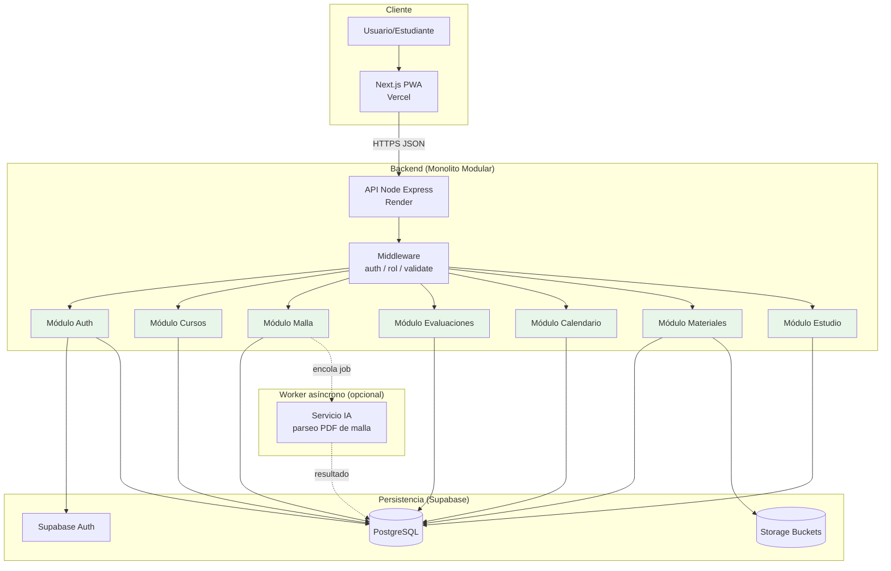
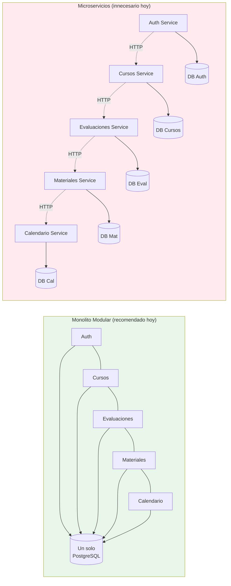
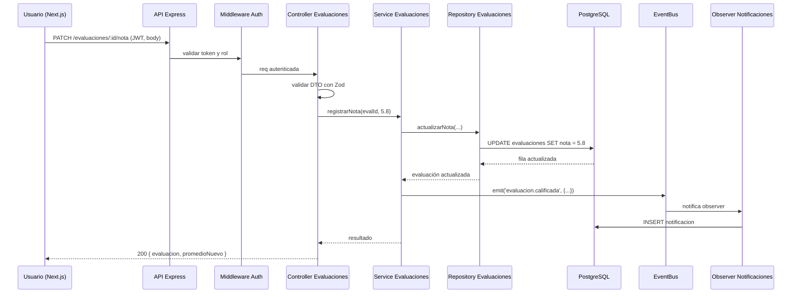

# Guía Personalizada – Grupo 5: Pop Study
## Plataforma web para la autogestión académica y centralización de recursos

**Asignatura:** TPY1101 – Taller Aplicado de Programación
**Integrantes:** Brunno Rivas · Amaro Cepeda
**Duración de la actividad asociada:** 1 hora 30 minutos

> **Cómo usar este documento:** léanlo completo antes de la actividad. Las secciones 1-10 son la **teoría y recomendación técnica** para su proyecto específico, con un foco particular en la **sección 3**, donde se discute críticamente la decisión arquitectónica que ustedes propusieron en la EP1 (microservicios) y se les ofrece una alternativa mejor fundamentada. La sección 11 es la **actividad de 90 minutos** que deben completar en clase. Lo que produzcan en esa actividad se entrega como `ARQUITECTURA.md` dentro del repo del equipo.

---

## 1. Contexto del proyecto (según su EP1)

Su proyecto es una **plataforma web integral para la autogestión académica**, orientada a estudiantes de educación superior que actualmente viven su ciclo semestral de forma fragmentada: un portal institucional para la malla, una hoja de cálculo para promedios, un calendario del teléfono para fechas y un servicio en la nube para apuntes. De acuerdo con la EP1, las piezas principales son:

1. **Módulo de malla curricular interactiva** con estado de asignaturas (aprobadas, en curso, pendientes) y visualización de pre-requisitos.
2. **Simulador de rendimiento académico** con cálculo de promedios ponderados y proyección de notas necesarias para aprobar.
3. **Gestor de evaluaciones y calendario** con recordatorios automáticos y organización temporal del semestre.
4. **Repositorio de apuntes y materiales** con vinculación a asignaturas (PDFs, imágenes, notas enriquecidas).
5. **Ingesta inteligente con IA** para procesar PDFs de malla y configurar el entorno inicial del estudiante sin transcripción manual.
6. **Dashboard de control estudiantil** que consolida estado del semestre, próximas evaluaciones y porcentaje de avance.

Esto implica que necesitan:

- una **aplicación web** (PWA) accesible desde computador o móvil;
- un **backend** que exponga APIs para cada área funcional;
- **autenticación** de usuarios individuales (no multi-tenant institucional, según el alcance);
- **almacenamiento de objetos** para los PDFs y materiales que el estudiante suba;
- **un pipeline de IA** (OCR + parsing de mallas) que procese documentos en formato PDF.

### 1.1. Lo que dice su EP1 sobre arquitectura

En el informe ustedes proponen explícitamente una **arquitectura de microservicios** con 6 servicios:

1. Microservicio de Usuario.
2. Microservicio de Malla Académica.
3. Microservicio de Notas y Evaluaciones.
4. Microservicio de Calendario.
5. Microservicio de Materiales y Apuntes.
6. Orquestador / API Gateway.

Justifican esta decisión apelando al escalado independiente de cada módulo, a la tolerancia a fallos y a la posibilidad de desplegar cada servicio por separado en Render.

**Esta guía va a pedirles, con argumentos, que reconsideren esa decisión.** No porque los microservicios sean malos (no lo son), sino porque son una herramienta específica para problemas específicos, y el suyo en esta etapa no es uno de esos problemas. En la sección 3 se desarrolla en detalle; por ahora, basta con decir que lo que ustedes están describiendo en realidad es un **monolito modular bien diseñado**, y eso es exactamente lo que necesitan en esta fase del proyecto.

---

## 2. Su tarjeta técnica (resumen ejecutivo)

| Elemento | Recomendación |
|---|---|
| **Tipo de app** | Web (PWA) responsiva |
| **Framework web** | Next.js (React) — alternativa: React Native si priorizan móvil |
| **Backend** | Node.js + Express |
| **Base de datos** | PostgreSQL (Supabase) |
| **Auth** | Supabase Auth + JWT |
| **Almacenamiento** | Supabase Storage (buckets) |
| **Arquitectura general** | **Monolito Modular** (no microservicios) |
| **Módulos internos** | `auth`, `cursos`, `malla`, `evaluaciones`, `calendario`, `materiales`, `ia` |
| **Patrones frontend críticos** | Component-Based, Custom Hooks, Zustand, Provider |
| **Patrones backend críticos** | Layered Architecture, Repository por módulo, Service Layer, DTO + Zod, Middleware de autorización por rol |
| **Patrones de creación** | Factory (tipos de evaluación), Strategy (algoritmos de cálculo/repetición), Observer (notificaciones) |
| **Plataforma de despliegue API** | Render |
| **Plataforma de despliegue Web** | Vercel |
| **Plataforma de BD y auth** | Supabase |

La diferencia fundamental respecto a lo que ustedes propusieron: **un solo servicio backend** con módulos internos claramente separados, **una sola base de datos** con schemas o prefijos por módulo, **un solo despliegue** en Render. Todo lo demás (stack, plataformas, patrones) se mantiene igual o mejor. El razonamiento está en la próxima sección.

---

## 3. Análisis específico de su problema

Esta sección es más larga que en otras guías porque la decisión arquitectónica que ustedes propusieron requiere una revisión cuidadosa. No se trata de imponer una opinión, sino de darles los criterios técnicos para que **ustedes mismos** lleguen a la conclusión correcta.

### 3.1. ¿Por qué web y no móvil nativa?

Su informe lo define en el "No Alcance": el entregable es una PWA, no una app en tiendas. Esto es coherente con el problema:

- El estudiante universitario ya tiene computador y teléfono con navegador moderno.
- La ingesta de mallas en PDF se realiza más cómodamente desde un computador.
- Una PWA les permite **una sola base de código** servida a cualquier dispositivo.
- Evitan el trámite de publicación en Play Store / App Store.

Next.js es el framework recomendado porque integra SSR/SSG, rutas anidadas, optimización de imágenes y soporte nativo para PWA. Además, Vercel (mismos autores que Next) ofrece despliegue gratuito con CI/CD desde GitHub.

### 3.2. Volumen esperado y consecuencia técnica

Su mercado objetivo son estudiantes universitarios individuales. Supongamos escenarios realistas para un proyecto académico:

- **MVP / tesis:** 10-50 usuarios de prueba (compañeros, profesores guía).
- **Primer semestre de uso real:** 100-500 estudiantes.
- **Hipotético crecimiento a un año:** 2.000-5.000 estudiantes activos.

Cada estudiante hace, como máximo, unas decenas de operaciones por día (consultar malla, ingresar una nota, subir un apunte). Hablamos de **unos miles de requests por día** en el escenario optimista. Un monolito modular en Node + PostgreSQL atiende cómodamente **millones de requests diarios** con una sola instancia pequeña.

Esto es importante para lo que viene: **no hay ningún problema de escala que justifique microservicios en su proyecto hoy**.

### 3.3. Revisión crítica de su decisión: microservicios

Esta es la sección más importante de la guía. Léanla con calma.

#### 3.3.1. ¿Qué son realmente los microservicios?

Un sistema de microservicios es una arquitectura donde la aplicación se descompone en **múltiples servicios independientes**, cada uno con:

- **Su propio proceso** corriendo en su propia máquina (o contenedor).
- **Su propia base de datos** (o al menos su propio schema lógico aislado).
- **Su propio equipo** (idealmente) que puede desplegar sin coordinar con los demás.
- **Su propio ciclo de despliegue** y versionado.
- **Comunicación a través de la red** (HTTP/REST, gRPC, mensajería asíncrona).

El punto crítico es el último: **en microservicios, las llamadas entre módulos son llamadas de red**. En un monolito modular, las llamadas entre módulos son llamadas a funciones en memoria.

Esa diferencia, que parece técnica, tiene consecuencias enormes en complejidad, costo, observabilidad y tiempo de desarrollo.

#### 3.3.2. El "Microservice Premium" de Martin Fowler

Martin Fowler, uno de los arquitectos más influyentes en la industria, escribió en 2015 un artículo titulado **"MonolithFirst"** (<https://martinfowler.com/bliki/MonolithFirst.html>) y luego **"Microservice Premium"** (<https://martinfowler.com/bliki/MicroservicePremium.html>) donde acuña una idea central:

> *Los microservicios tienen un costo fijo significativo. Debes pagar ese costo por adelantado, y solo se amortiza cuando tu sistema y tu equipo son suficientemente grandes. Para sistemas pequeños, el monolito casi siempre gana.*

Ese costo fijo, el "microservice premium", incluye:

1. **Infraestructura distribuida:** múltiples despliegues, múltiples dominios, múltiples logs, múltiples pipelines CI/CD.
2. **Observabilidad distribuida:** para depurar un error tienes que correlacionar logs de varios servicios (distributed tracing, OpenTelemetry, Jaeger).
3. **Latencia de red:** cada llamada entre módulos pasa por TCP/HTTP. Lo que era 0.01 ms pasa a ser 10-100 ms.
4. **Manejo de fallos parciales:** ¿qué pasa si el servicio de Malla responde pero el de Notas está caído? Tienes que implementar timeouts, retries, circuit breakers, fallbacks.
5. **Consistencia eventual:** no puedes hacer una transacción SQL que abarque dos servicios. Necesitas sagas, outbox pattern, compensaciones.
6. **Despliegue coordinado:** aunque cada servicio se despliega solo, los cambios que tocan dos servicios siguen requiriendo coordinación (migraciones, contratos API).
7. **Sobrecarga operacional:** cada servicio necesita monitoreo, alertas, métricas, healthchecks, secrets, variables de entorno.

La pregunta que Fowler propone hacerse es simple: **¿su equipo tiene hoy la capacidad operativa para pagar todo eso?**

En su caso, el equipo es de **2 personas**. El premium de microservicios es, probablemente, mayor que el beneficio.

#### 3.3.3. Revisión puntual de la justificación que dan en la EP1

En su informe aparecen tres argumentos a favor de microservicios. Vamos a examinarlos uno por uno:

**Argumento 1: "Cada microservicio puede escalar de forma independiente."**

Esto es técnicamente cierto, pero solo importa si **hay diferencias reales de carga entre módulos**. En Pop Study, todos los módulos los consume el mismo usuario (un estudiante) con una intensidad muy similar: abre la app, revisa su malla, consulta sus notas, sube un apunte. No existe un escenario donde el "microservicio de simulador" reciba 1.000 veces más tráfico que el de "materiales". Si todos crecen a la par, escalar el monolito entero (una VM más grande o dos réplicas) tiene **exactamente el mismo efecto** con un décimo de la complejidad.

**Argumento 2: "Alta tolerancia a fallos: si el servicio de apuntes se cae, el de malla sigue funcionando."**

Este argumento confunde dos cosas:

- **Tolerancia a fallos del infraestructura** (el proceso del servidor muere): esto se resuelve con réplicas, healthchecks y autoscaling, lo cual **también puede hacerse en un monolito**.
- **Tolerancia a fallos por módulo** (un bug en un módulo no rompe los demás): esto es aislamiento de código, y se logra con buen diseño modular. Un monolito modular bien hecho también lo tiene: un error en el controller de apuntes devuelve un 500 en esa ruta, pero la ruta de malla sigue respondiendo.

Para que el argumento de "tolerancia" aplique de verdad, necesitan **problemas reales de latencia o caídas** en un módulo específico. No los tienen.

**Argumento 3: "Despliegue independiente de cada módulo."**

En un equipo de 2 personas, esto es más costo que beneficio. Coordinar 6 repositorios, 6 pipelines CI/CD, 6 dominios y 6 conjuntos de variables de entorno entre 2 desarrolladores es una carga operacional que no compensa el "poder desplegar solo el módulo de calendario sin tocar los demás". Cuando la modificación toca dos módulos (cosa frecuente), necesitan desplegar dos servicios y coordinar la migración del contrato API entre ambos.

#### 3.3.4. Costos reales que la EP1 no menciona

Si decidieran realmente llevar adelante una arquitectura de microservicios con su equipo y en el tiempo del semestre, estos son los costos que aparecerían:

| Costo | Descripción | Impacto en su proyecto |
|---|---|---|
| **Red** | Cada llamada entre microservicios pasa por HTTP. Si el simulador necesita consultar la malla, eso es una llamada de 50-200 ms contra una llamada en memoria de 0.01 ms. | Latencia agregada en cualquier operación compleja. |
| **Observabilidad** | Para depurar un error hay que cruzar logs de 6 servicios. Necesitan distributed tracing (ej. OpenTelemetry + Jaeger). | Tiempo de configuración: días. Curva de aprendizaje: alta. |
| **Datos distribuidos** | Imposible hacer un `JOIN` entre tablas de dos servicios. Hay que duplicar datos o hacer llamadas entre servicios. | Lógica de negocio se vuelve mucho más compleja. |
| **Transacciones distribuidas** | Un caso simple como "registrar evaluación + actualizar promedio" involucra 2 servicios. Si uno falla, quedan inconsistentes. Requiere patrón Saga o Outbox. | Complejidad de implementación: muy alta para MVP. |
| **Múltiples despliegues** | 6 servicios = 6 pipelines CI/CD, 6 conjuntos de secrets, 6 URLs. Render free tier duerme tras 15 min por servicio. | 6 cold starts de ~30s potenciales. |
| **Coordinación de equipo** | Con 2 personas, ¿quién es responsable de qué servicio? Si un bug cruza dos servicios, ¿quién lo arregla? | Trabajo pobremente paralelo. |
| **Versionado de APIs** | Cambiar un contrato entre servicios implica versionar la API y desplegar en orden específico. | Overhead constante en desarrollo. |
| **Testing end-to-end** | Levantar el sistema completo para pruebas requiere orquestar 6 servicios + BD. | Tests lentos o incompletos. |

### 3.4. La alternativa: Monolito Modular

Un **monolito modular** es una arquitectura donde:

- **Hay un solo proceso** ejecutándose (un solo servidor Node).
- **Hay una sola base de datos** (un solo PostgreSQL).
- **Hay un solo despliegue** (un solo servicio en Render).
- Internamente, el código está **organizado en módulos con límites muy claros**: cada módulo tiene sus propias rutas, controladores, servicios, repositorios y DTOs.
- Los módulos **se comunican a través de funciones** (no de red) pero con **interfaces explícitas**: un módulo expone un "puerto" (ej. `evaluacionesService.calcularPromedio(cursoId)`) y los demás módulos lo consumen a través de esa interfaz.

La clave es: **modular no es menos disciplinado que microservicios, es igualmente disciplinado pero sin el costo de red**.

#### 3.4.1. Ventajas del monolito modular para Pop Study

1. **Un solo deploy:** una sola URL, un solo pipeline, un solo log. Para un equipo de 2, esto es oro.
2. **Transacciones SQL simples:** "crear evaluación y actualizar promedio" es un `BEGIN; ... COMMIT;` de libro de texto.
3. **Debug local trivial:** un solo `npm run dev`, un solo debugger conectado.
4. **Llamadas entre módulos gratis:** consultar la malla desde el simulador es una llamada a función.
5. **Refactor a microservicios posible más tarde:** si los módulos están bien aislados, pueden extraer uno de ellos a su propio servicio cuando haga falta.
6. **Menor superficie de ataque:** una sola puerta de entrada autenticada.
7. **Costos cloud mínimos:** un solo servicio en Render free tier alcanza de sobra.

#### 3.4.2. Cuándo SÍ tendría sentido ir a microservicios

Para ser justos con la arquitectura: los microservicios existen porque resuelven problemas reales. En algún momento futuro, Pop Study podría necesitarlos. Señales que lo indicarían:

- **Equipos de 10+ personas** donde distintos sub-equipos necesitan desplegar sin pisarse.
- **Cargas dispares entre módulos**: si el simulador empieza a recibir 1000x más tráfico que la gestión de archivos, tiene sentido aislarlo.
- **Tecnologías muy distintas por módulo**: por ejemplo, el módulo de IA quizás debería estar en Python con GPU, mientras el resto sigue en Node. En ese caso, sí se extrae la IA.
- **Requisitos de disponibilidad extremos**: un módulo crítico necesita 99.99% y los demás 99%.
- **Escalabilidad geográfica**: un módulo debe correr en múltiples regiones y otros solo en una.

Ninguna de esas condiciones se cumple hoy en Pop Study. Podrían cumplirse en 2-3 años si el proyecto escala de verdad. Para ese momento, si el monolito está bien modularizado, **extraer un microservicio es relativamente barato**.

#### 3.4.3. La única excepción razonable: módulo de IA

Hay un componente de su proyecto que sí podría vivir aparte: la **ingesta con IA de PDFs de malla**. Tiene perfil distinto:

- **Lenguaje distinto:** Python es lingua franca para IA/ML (PyPDF2, spaCy, transformers).
- **Carga puntual:** el procesamiento ocurre una vez por usuario al inicio del semestre.
- **Tiempo de ejecución largo:** parsing + IA puede tomar 20-60 segundos, lo cual justifica ejecución asíncrona.

Esto no es un "microservicio" en el sentido de Fowler, sino una **función asíncrona o worker** que recibe un trabajo (procesar PDF), lo ejecuta en background y deposita el resultado. Incluso esto pueden hacerlo dentro del mismo monolito Node si usan alguna librería de parsing PDF, o como un script separado invocado desde Node. Solo vale la pena extraerlo a un servicio aparte si deciden irse al ecosistema Python para IA.

### 3.5. Retos técnicos particulares de su proyecto

1. **Modelado de malla curricular:** los pre-requisitos forman un grafo dirigido (un ramo no puede tomarse hasta aprobar sus pre-requisitos). Postgres soporta esto bien con recursive CTEs.
2. **Cálculo de promedios ponderados:** cada evaluación tiene una ponderación; el cálculo debe ser determinístico y preciso (usar `NUMERIC(5,2)`, no `FLOAT`).
3. **Ingesta IA de PDFs:** depende de la calidad del PDF (escaneado vs digital). Probablemente necesiten fallback manual si la IA falla.
4. **Persistencia de archivos:** PDFs y PPTs en Supabase Storage, metadatos en PostgreSQL. Separar bytes grandes del modelo relacional.
5. **Privacidad:** los datos académicos son sensibles. Cumplir con Ley 19.628 en Chile.
6. **Notificaciones de evaluaciones:** recordatorios por email o push (notificación navegador).

---

## 4. Patrones recomendados para su frontend web

> Los ejemplos de esta sección asumen **Next.js 14 con App Router** y TypeScript. Si deciden JavaScript plano, los conceptos son los mismos sin tipos.

### 4.1. Component-Based Architecture

**Por qué para ustedes:** la interfaz de Pop Study tiene componentes altamente reutilizables (tarjetas de ramo, celdas de calendario, tarjetas de evaluación). Separar componentes visuales de componentes con lógica de dominio evita duplicación y facilita mantener una identidad visual consistente.

Recomendación de estructura:

- **Componentes visuales puros** (`Boton`, `Badge`, `Modal`, `ProgresoCircular`): agnósticos del dominio, reutilizables en cualquier parte.
- **Componentes de dominio** (`RamoCard`, `EvaluacionItem`, `NotaInput`, `MallaNodo`): conocen el modelo de datos del negocio.
- **Páginas** (`app/dashboard/page.tsx`, `app/malla/page.tsx`, `app/curso/[id]/page.tsx`): orquestan componentes y hooks.

#### Ejemplo adaptado a su proyecto

```tsx
// components/RamoCard.tsx
import { Badge } from './Badge';

type Estado = 'APROBADO' | 'EN_CURSO' | 'PENDIENTE' | 'BLOQUEADO';

interface RamoCardProps {
  nombre: string;
  codigo: string;
  creditos: number;
  estado: Estado;
  promedio?: number;
  onClick?: () => void;
}

const COLORES: Record<Estado, string> = {
  APROBADO: 'bg-green-100 text-green-800',
  EN_CURSO: 'bg-blue-100 text-blue-800',
  PENDIENTE: 'bg-gray-100 text-gray-800',
  BLOQUEADO: 'bg-red-100 text-red-800',
};

export function RamoCard({ nombre, codigo, creditos, estado, promedio, onClick }: RamoCardProps) {
  return (
    <button
      onClick={onClick}
      className="p-4 rounded-xl border hover:shadow-md transition"
    >
      <div className="flex justify-between items-start">
        <div>
          <p className="text-xs text-gray-500">{codigo}</p>
          <h3 className="font-semibold">{nombre}</h3>
        </div>
        <Badge className={COLORES[estado]}>{estado}</Badge>
      </div>
      <div className="flex justify-between mt-3 text-sm">
        <span>{creditos} créditos</span>
        {promedio !== undefined && <span>Promedio: {promedio.toFixed(1)}</span>}
      </div>
    </button>
  );
}
```

### 4.2. Custom Hooks para separar lógica de UI

**Por qué para ustedes:** el dashboard y la página de un curso tienen mucha lógica asíncrona (cargar evaluaciones, calcular promedio proyectado, consultar avance). Si la dejan en los componentes, terminarán con páginas de 500 líneas.

#### Ejemplo: hook para el simulador de promedio

```tsx
// hooks/useSimuladorPromedio.ts
import { useState, useEffect, useMemo } from 'react';
import { apiClient } from '@/lib/api';

interface Evaluacion {
  id: string;
  nombre: string;
  ponderacion: number; // 0-100
  nota?: number;       // 1.0 - 7.0 (escala chilena)
}

export function useSimuladorPromedio(cursoId: string) {
  const [evaluaciones, setEvaluaciones] = useState<Evaluacion[]>([]);
  const [cargando, setCargando] = useState(true);

  useEffect(() => {
    (async () => {
      setCargando(true);
      const { data } = await apiClient.get(`/cursos/${cursoId}/evaluaciones`);
      setEvaluaciones(data);
      setCargando(false);
    })();
  }, [cursoId]);

  const promedioActual = useMemo(() => {
    const evalConNota = evaluaciones.filter(e => e.nota !== undefined);
    if (!evalConNota.length) return null;
    const suma = evalConNota.reduce((acc, e) => acc + e.nota! * (e.ponderacion / 100), 0);
    const pesoTotal = evalConNota.reduce((acc, e) => acc + e.ponderacion / 100, 0);
    return suma / pesoTotal;
  }, [evaluaciones]);

  const notaNecesariaParaAprobar = useMemo(() => {
    const pendientes = evaluaciones.filter(e => e.nota === undefined);
    if (!pendientes.length) return null;
    const sumaActual = evaluaciones
      .filter(e => e.nota !== undefined)
      .reduce((acc, e) => acc + e.nota! * (e.ponderacion / 100), 0);
    const pesoPendiente = pendientes.reduce((acc, e) => acc + e.ponderacion / 100, 0);
    // 4.0 es nota de aprobación en escala chilena
    return (4.0 - sumaActual) / pesoPendiente;
  }, [evaluaciones]);

  const actualizarNota = (evalId: string, nota: number) => {
    setEvaluaciones(prev => prev.map(e => e.id === evalId ? { ...e, nota } : e));
  };

  return { evaluaciones, promedioActual, notaNecesariaParaAprobar, actualizarNota, cargando };
}
```

#### Ejemplo: hook de calendario de evaluaciones próximas

```tsx
// hooks/useEvaluacionesProximas.ts
import { useState, useEffect } from 'react';
import { apiClient } from '@/lib/api';

export function useEvaluacionesProximas(diasAdelante = 14) {
  const [evaluaciones, setEvaluaciones] = useState([]);
  const [cargando, setCargando] = useState(true);

  useEffect(() => {
    apiClient
      .get('/calendario/proximas', { params: { dias: diasAdelante } })
      .then(r => setEvaluaciones(r.data))
      .finally(() => setCargando(false));
  }, [diasAdelante]);

  return { evaluaciones, cargando };
}
```

### 4.3. State management con Zustand

**Por qué para ustedes:** la sesión del usuario, el semestre activo y el modo oscuro se necesitan desde muchas páginas. Zustand es más simple que Redux y tiene integración directa con localStorage para persistencia.

```tsx
// stores/sessionStore.ts
import { create } from 'zustand';
import { persist } from 'zustand/middleware';

interface SessionState {
  usuario: { id: string; nombre: string; email: string } | null;
  token: string | null;
  semestreActivo: string | null;
  iniciarSesion: (usuario: SessionState['usuario'], token: string) => void;
  cerrarSesion: () => void;
  setSemestreActivo: (id: string) => void;
}

export const useSession = create<SessionState>()(
  persist(
    (set) => ({
      usuario: null,
      token: null,
      semestreActivo: null,
      iniciarSesion: (usuario, token) => set({ usuario, token }),
      cerrarSesion: () => set({ usuario: null, token: null, semestreActivo: null }),
      setSemestreActivo: (id) => set({ semestreActivo: id }),
    }),
    { name: 'popstudy-session' }
  )
);
```

### 4.4. Provider Pattern para rutas protegidas

En Next.js App Router, usen un componente envolvente que verifique autenticación y redirija al login si es necesario.

```tsx
// providers/AuthGate.tsx
'use client';
import { useEffect } from 'react';
import { useRouter, usePathname } from 'next/navigation';
import { useSession } from '@/stores/sessionStore';

const RUTAS_PUBLICAS = ['/login', '/registro', '/'];

export function AuthGate({ children }: { children: React.ReactNode }) {
  const { usuario } = useSession();
  const router = useRouter();
  const pathname = usePathname();

  useEffect(() => {
    if (!usuario && !RUTAS_PUBLICAS.includes(pathname)) {
      router.replace('/login');
    }
  }, [usuario, pathname, router]);

  return <>{children}</>;
}

// app/layout.tsx
import { AuthGate } from '@/providers/AuthGate';

export default function RootLayout({ children }) {
  return (
    <html lang="es">
      <body>
        <AuthGate>{children}</AuthGate>
      </body>
    </html>
  );
}
```

---

## 5. Patrones recomendados para su backend

Este es el corazón de la guía. Presten especial atención a la **Layered Architecture**, que es el esqueleto sobre el que se construye todo.

### 5.1. Layered Architecture (Arquitectura en Capas)

**Por qué es crítica para ustedes:** ustedes tienen múltiples áreas de negocio (auth, cursos, malla, evaluaciones, calendario, materiales). Cada una debe vivir en su propio módulo, con la misma forma interna. Esta disciplina es lo que les permite, mañana, **extraer uno de esos módulos a un microservicio si el crecimiento lo justifica**, sin reescribir nada.

#### 5.1.1. Las cuatro capas

La idea central es que cada petición HTTP atraviesa **cuatro capas bien definidas**, cada una con una responsabilidad única:

```
   HTTP Request
        │
        ▼
┌───────────────────┐
│   CONTROLLER      │  ← traduce HTTP (req/res) a llamadas de dominio
│                   │    - valida DTO con Zod
│                   │    - llama al service
│                   │    - traduce la respuesta a HTTP
└───────────────────┘
        │
        ▼
┌───────────────────┐
│   SERVICE         │  ← reglas de negocio puras
│                   │    - orquesta repositorios
│                   │    - aplica validaciones de dominio
│                   │    - no sabe de HTTP ni de SQL
└───────────────────┘
        │
        ▼
┌───────────────────┐
│   REPOSITORY      │  ← acceso a datos
│                   │    - consultas SQL
│                   │    - no contiene lógica de negocio
└───────────────────┘
        │
        ▼
┌───────────────────┐
│   DATABASE        │
└───────────────────┘
```

**Regla de oro:** las dependencias solo fluyen hacia abajo. El controller llama al service, el service llama al repository, el repository habla con la base. **Nunca al revés**. Un repository no puede llamar a un service. Un service no puede tocar `req` o `res`.

#### 5.1.2. Por qué esto es tan importante

- **Testabilidad:** el service no sabe de HTTP, así que puedes testearlo con Jest sin levantar Express. El repository no sabe de servicios, así que puedes mockearlo fácilmente.
- **Reutilización:** el mismo service que usa el controller de POST /evaluaciones puede usarlo un job programado (cron) o un worker de IA.
- **Refactor progresivo:** si mañana cambian PostgreSQL por MongoDB, solo reescriben la capa Repository; el Service queda intacto.
- **Preparación para microservicios:** cuando extraigan un módulo, el service ya es una unidad autocontenida.

#### 5.1.3. Estructura de carpetas para los módulos

```
api/
├── src/
│   ├── modules/
│   │   ├── auth/
│   │   │   ├── auth.routes.ts
│   │   │   ├── auth.controller.ts
│   │   │   ├── auth.service.ts
│   │   │   ├── auth.repository.ts
│   │   │   └── auth.dto.ts
│   │   ├── cursos/
│   │   ├── malla/
│   │   ├── evaluaciones/
│   │   ├── calendario/
│   │   └── materiales/
│   ├── middleware/
│   │   ├── authMiddleware.ts
│   │   ├── requireRol.ts
│   │   ├── errorHandler.ts
│   │   └── validate.ts
│   ├── config/
│   │   ├── env.ts
│   │   └── db.ts
│   ├── lib/
│   │   ├── eventBus.ts
│   │   └── supabase.ts
│   ├── app.ts
│   └── server.ts
```

Cada módulo tiene **exactamente la misma forma**. Esto no es casualidad: es el patrón que permite que el equipo trabaje en paralelo sin pisarse. Brunno puede estar en `modules/evaluaciones` mientras Amaro está en `modules/materiales`, sin conflicto.

### 5.2. Repository Pattern por módulo

**Por qué para ustedes:** van a consultar mucho la base (lista de ramos del estudiante, historial de notas, evaluaciones próximas). Centralizar queries en un repository evita duplicación y permite testear con mocks.

```ts
// modules/evaluaciones/evaluaciones.repository.ts
import { pool } from '../../config/db';

export async function listarPorCurso(cursoId: string) {
  const { rows } = await pool.query(
    `SELECT id, nombre, ponderacion, nota, fecha_entrega
     FROM evaluaciones
     WHERE curso_id = $1
     ORDER BY fecha_entrega ASC`,
    [cursoId]
  );
  return rows;
}

export async function crear({ cursoId, nombre, ponderacion, fechaEntrega }: {
  cursoId: string; nombre: string; ponderacion: number; fechaEntrega: Date;
}) {
  const { rows } = await pool.query(
    `INSERT INTO evaluaciones (curso_id, nombre, ponderacion, fecha_entrega)
     VALUES ($1, $2, $3, $4)
     RETURNING *`,
    [cursoId, nombre, ponderacion, fechaEntrega]
  );
  return rows[0];
}

export async function actualizarNota(evalId: string, nota: number) {
  const { rows } = await pool.query(
    `UPDATE evaluaciones SET nota = $1, actualizada_en = NOW()
     WHERE id = $2 RETURNING *`,
    [nota, evalId]
  );
  return rows[0];
}

export async function sumaPonderacionesPorCurso(cursoId: string) {
  const { rows } = await pool.query(
    `SELECT COALESCE(SUM(ponderacion), 0)::numeric AS total
     FROM evaluaciones WHERE curso_id = $1`,
    [cursoId]
  );
  return parseFloat(rows[0].total);
}
```

### 5.3. Service Layer con reglas de negocio académicas

**Por qué para ustedes:** los cálculos de promedio, la validación de "la suma de ponderaciones debe ser 100" y las reglas de "una evaluación sin nota se cuenta como pendiente" son **reglas de negocio**, no lógica HTTP ni lógica SQL. Deben vivir en el service.

```ts
// modules/evaluaciones/evaluaciones.service.ts
import * as repo from './evaluaciones.repository';
import { bus } from '../../lib/eventBus';

const NOTA_APROBACION = 4.0;
const NOTA_MIN = 1.0;
const NOTA_MAX = 7.0;

export async function crearEvaluacion(params: {
  cursoId: string; nombre: string; ponderacion: number; fechaEntrega: Date;
}) {
  const totalActual = await repo.sumaPonderacionesPorCurso(params.cursoId);
  if (totalActual + params.ponderacion > 100) {
    throw Object.assign(
      new Error(`La suma de ponderaciones excedería 100% (actual: ${totalActual}%)`),
      { status: 400 }
    );
  }
  return repo.crear(params);
}

export async function registrarNota(evalId: string, nota: number) {
  if (nota < NOTA_MIN || nota > NOTA_MAX) {
    throw Object.assign(new Error(`Nota fuera de rango [${NOTA_MIN}-${NOTA_MAX}]`), { status: 400 });
  }
  const evaluacion = await repo.actualizarNota(evalId, nota);
  bus.emit('evaluacion.calificada', {
    evaluacionId: evalId, cursoId: evaluacion.curso_id, nota
  });
  return evaluacion;
}

export async function calcularPromedioCurso(cursoId: string) {
  const evaluaciones = await repo.listarPorCurso(cursoId);
  const conNota = evaluaciones.filter(e => e.nota !== null);
  if (!conNota.length) return null;
  const suma = conNota.reduce((acc, e) => acc + e.nota * (e.ponderacion / 100), 0);
  const pesoTotal = conNota.reduce((acc, e) => acc + e.ponderacion / 100, 0);
  return Math.round((suma / pesoTotal) * 10) / 10; // 1 decimal
}

export async function notaNecesariaParaAprobar(cursoId: string) {
  const evaluaciones = await repo.listarPorCurso(cursoId);
  const pendientes = evaluaciones.filter(e => e.nota === null);
  if (!pendientes.length) return null;
  const acumulado = evaluaciones
    .filter(e => e.nota !== null)
    .reduce((acc, e) => acc + e.nota * (e.ponderacion / 100), 0);
  const pesoPendiente = pendientes.reduce((acc, e) => acc + e.ponderacion / 100, 0);
  const necesaria = (NOTA_APROBACION - acumulado) / pesoPendiente;
  return { notaNecesaria: Math.round(necesaria * 10) / 10, alcanzable: necesaria <= NOTA_MAX };
}
```

### 5.4. DTO + Validación con Zod

**Por qué para ustedes:** las notas, ponderaciones y fechas son datos críticos. Una nota mal ingresada rompe todo el cálculo de promedio. La validación rigurosa es obligatoria.

```ts
// modules/evaluaciones/evaluaciones.dto.ts
import { z } from 'zod';

export const crearEvaluacionDTO = z.object({
  cursoId: z.string().uuid(),
  nombre: z.string().min(1).max(100),
  ponderacion: z.number().min(0).max(100),
  fechaEntrega: z.string().datetime().transform(s => new Date(s)),
  tipo: z.enum(['PRUEBA', 'TAREA', 'CONTROL', 'EXAMEN', 'TRABAJO']),
});

export const registrarNotaDTO = z.object({
  nota: z.number().min(1.0).max(7.0),
});

export type CrearEvaluacion = z.infer<typeof crearEvaluacionDTO>;
export type RegistrarNota = z.infer<typeof registrarNotaDTO>;
```

```ts
// middleware/validate.ts
import { ZodSchema } from 'zod';
import { Request, Response, NextFunction } from 'express';

export const validate = (schema: ZodSchema, source: 'body' | 'params' | 'query' = 'body') =>
  (req: Request, res: Response, next: NextFunction) => {
    const result = schema.safeParse(req[source]);
    if (!result.success) {
      return res.status(400).json({ error: 'Datos inválidos', detalles: result.error.flatten() });
    }
    req[source] = result.data;
    next();
  };

// Uso:
router.post('/', authMiddleware, validate(crearEvaluacionDTO), controller.crear);
```

### 5.5. Middleware de autorización por rol

**Por qué para ustedes:** aunque su MVP sea centrado en el estudiante individual, eventualmente tendrán roles diferenciados (estudiante, profesor, admin). Prepararse desde el inicio es barato; hacerlo después es caro.

```ts
// middleware/authMiddleware.ts
import jwt from 'jsonwebtoken';
import { Request, Response, NextFunction } from 'express';
import { env } from '../config/env';

export function authMiddleware(req: Request, res: Response, next: NextFunction) {
  const header = req.headers.authorization;
  if (!header || !header.startsWith('Bearer ')) {
    return res.status(401).json({ error: 'No autenticado' });
  }
  try {
    const payload = jwt.verify(header.slice(7), env.JWT_SECRET) as any;
    (req as any).user = { id: payload.sub, email: payload.email, rol: payload.rol };
    next();
  } catch {
    return res.status(401).json({ error: 'Token inválido' });
  }
}
```

```ts
// middleware/requireRol.ts
import { Request, Response, NextFunction } from 'express';

type Rol = 'estudiante' | 'profesor' | 'admin';

export const requireRol = (...permitidos: Rol[]) =>
  (req: Request, res: Response, next: NextFunction) => {
    const user = (req as any).user;
    if (!user) return res.status(401).json({ error: 'No autenticado' });
    if (!permitidos.includes(user.rol)) {
      return res.status(403).json({ error: 'Sin permisos' });
    }
    next();
  };

// Uso:
router.post('/', authMiddleware, requireRol('estudiante'), controller.crear);
router.delete('/:id', authMiddleware, requireRol('admin'), controller.borrar);
```

### 5.6. Patrón Factory: creación de tipos de evaluación

**Por qué para ustedes:** en Pop Study pueden tener distintos tipos de evaluación que comparten interfaz pero difieren en comportamiento: prueba escrita, quiz online, flashcard de repaso, examen final. Un Factory centraliza la creación y permite agregar nuevos tipos sin tocar el resto del código.

```ts
// modules/evaluaciones/evaluacion.factory.ts
export interface Evaluacion {
  tipo: string;
  calcularNota(respuestas: any[]): number;
  esAutomatica(): boolean;
}

class Prueba implements Evaluacion {
  tipo = 'PRUEBA';
  constructor(private puntajeMaximo: number) {}
  calcularNota(respuestas: any[]) {
    // la nota la ingresa el profesor manualmente, pero el método existe
    throw new Error('Prueba requiere nota manual');
  }
  esAutomatica() { return false; }
}

class Quiz implements Evaluacion {
  tipo = 'QUIZ';
  constructor(private preguntas: { correcta: string }[]) {}
  calcularNota(respuestas: string[]) {
    const aciertos = this.preguntas.filter((p, i) => p.correcta === respuestas[i]).length;
    const porcentaje = aciertos / this.preguntas.length;
    return 1 + porcentaje * 6; // escala chilena 1-7
  }
  esAutomatica() { return true; }
}

class Flashcard implements Evaluacion {
  tipo = 'FLASHCARD';
  constructor(private tarjetas: { front: string; back: string }[]) {}
  calcularNota(aciertos: boolean[]) {
    const porcentaje = aciertos.filter(Boolean).length / aciertos.length;
    return 1 + porcentaje * 6;
  }
  esAutomatica() { return true; }
}

export function crearEvaluacion(tipo: string, config: any): Evaluacion {
  switch (tipo) {
    case 'PRUEBA':    return new Prueba(config.puntajeMaximo);
    case 'QUIZ':      return new Quiz(config.preguntas);
    case 'FLASHCARD': return new Flashcard(config.tarjetas);
    default: throw new Error(`Tipo de evaluación desconocido: ${tipo}`);
  }
}
```

Agregar un nuevo tipo (por ejemplo, "ensayo con rubrica") es cuestión de crear una nueva clase y un case más en el switch.

### 5.7. Patrón Strategy: algoritmos de repetición espaciada (si incluyen flashcards)

**Por qué para ustedes:** si dentro de "apuntes y materiales" o en "estudio" deciden implementar un módulo de flashcards (Anki-like), hay varios algoritmos de repetición espaciada. Strategy permite cambiarlos sin alterar el resto del código.

```ts
// modules/estudio/repeticion.strategy.ts
export interface EstrategiaRepeticion {
  nombre: string;
  siguienteRevision(ultimaNota: number, intervaloDias: number): number;
}

class Leitner implements EstrategiaRepeticion {
  nombre = 'Leitner';
  // Caja 1: 1 día; Caja 2: 3 días; Caja 3: 7 días; Caja 4: 14 días; Caja 5: 30 días
  private cajas = [1, 3, 7, 14, 30];
  siguienteRevision(ultimaNota: number, intervaloDias: number) {
    const cajaActual = this.cajas.indexOf(intervaloDias);
    if (ultimaNota >= 4) return this.cajas[Math.min(cajaActual + 1, this.cajas.length - 1)];
    return this.cajas[0]; // error: vuelve a la primera caja
  }
}

class SM2 implements EstrategiaRepeticion {
  nombre = 'SM2';
  siguienteRevision(ultimaNota: number, intervaloDias: number) {
    // SM-2 simplificado (Piotr Wozniak, SuperMemo)
    const ef = Math.max(1.3, 2.5 + (0.1 - (5 - ultimaNota) * (0.08 + (5 - ultimaNota) * 0.02)));
    if (intervaloDias === 0) return 1;
    if (intervaloDias === 1) return 6;
    return Math.round(intervaloDias * ef);
  }
}

export const estrategias: Record<string, EstrategiaRepeticion> = {
  leitner: new Leitner(),
  sm2: new SM2(),
};
```

El service elige qué estrategia usar según preferencia del usuario:

```ts
// modules/estudio/estudio.service.ts
import { estrategias } from './repeticion.strategy';

export async function programarSiguienteRevision(tarjetaId: string, ultimaNota: number) {
  const tarjeta = await repo.obtenerTarjeta(tarjetaId);
  const estrategia = estrategias[tarjeta.estrategia || 'sm2'];
  const siguiente = estrategia.siguienteRevision(ultimaNota, tarjeta.intervaloActualDias);
  await repo.actualizarIntervalo(tarjetaId, siguiente);
  return siguiente;
}
```

### 5.8. Patrón Observer: notificaciones cuando se califica

**Por qué para ustedes:** cuando un estudiante ingresa una nota, probablemente quieran que pasen varias cosas: actualizar el promedio, mandar una notificación, registrar en el historial, actualizar la alerta del dashboard. Observer desacopla estas reacciones.

```ts
// lib/eventBus.ts
import { EventEmitter } from 'events';
export const bus = new EventEmitter();

// modules/notificaciones/notificaciones.observer.ts
import { bus } from '../../lib/eventBus';

bus.on('evaluacion.calificada', async ({ evaluacionId, cursoId, nota }) => {
  if (nota < 4.0) {
    await crearNotificacion({
      tipo: 'ALERTA_ROJA',
      mensaje: `Nota reprobatoria en evaluación ${evaluacionId}. Revisa tu situación.`,
    });
  }
});

// modules/historial/historial.observer.ts
bus.on('evaluacion.calificada', async (evento) => {
  await guardarEnHistorial({ ...evento, timestamp: new Date() });
});
```

En producción, si el volumen sube, pueden migrar el `EventEmitter` a una cola real (Redis, BullMQ). Mientras estén en monolito simple, `EventEmitter` es suficiente.

---

## 6. Arquitectura recomendada

**Tipo:** Cliente-servidor con **monolito modular** en el backend.

### 6.1. Diagrama de arquitectura



Observen: **todos los módulos verdes viven dentro del mismo proceso Node**. La separación es lógica, no física. Comparten una base de datos común, pero cada uno accede solo a sus propias tablas a través de su propio repository.

### 6.2. Comparativa visual: Monolito Modular vs Microservicios



| Criterio | Monolito Modular | Microservicios |
|---|---|---|
| Llamada entre módulos | Función en memoria (~0.01ms) | HTTP por red (~50-200ms) |
| Despliegues | 1 | N (uno por servicio) |
| Pipelines CI/CD | 1 | N |
| Bases de datos | 1 | N (o schemas aislados) |
| Transacciones | SQL nativo | Sagas/compensaciones |
| Debug local | Un comando | Docker Compose con todos |
| Observabilidad | Logs centralizados | Distributed tracing |
| Time-to-market MVP | Semanas | Meses |
| Equipo mínimo razonable | 1-5 personas | 10+ personas |
| Costo cloud mensual | USD 0-10 (free tier) | USD 50-200+ |

### 6.3. Diagrama de secuencia: "el estudiante registra una nota"



Todo este flujo ocurre **dentro de un solo proceso Node**. No hay llamadas de red entre capas. El único "evento" es el bus interno, que es una simple llamada a función en otro archivo.

---

## 7. Estructura de carpetas recomendada

### 7.1. Frontend web (Next.js + TypeScript)

```
popstudy-web/
├── next.config.mjs
├── package.json
├── tsconfig.json
├── app/
│   ├── layout.tsx
│   ├── page.tsx                  (landing)
│   ├── login/page.tsx
│   ├── registro/page.tsx
│   ├── (app)/                    (rutas protegidas)
│   │   ├── dashboard/page.tsx
│   │   ├── malla/page.tsx
│   │   ├── cursos/
│   │   │   ├── page.tsx
│   │   │   └── [id]/page.tsx
│   │   ├── calendario/page.tsx
│   │   └── materiales/page.tsx
│   └── api/                      (routes Next, si usan API routes)
├── components/
│   ├── ui/
│   │   ├── Boton.tsx
│   │   ├── Badge.tsx
│   │   ├── Modal.tsx
│   │   └── Input.tsx
│   └── domain/
│       ├── RamoCard.tsx
│       ├── EvaluacionItem.tsx
│       ├── NotaInput.tsx
│       └── MallaNodo.tsx
├── hooks/
│   ├── useSimuladorPromedio.ts
│   ├── useEvaluacionesProximas.ts
│   ├── useMallaCurricular.ts
│   └── useMateriales.ts
├── stores/
│   └── sessionStore.ts
├── providers/
│   └── AuthGate.tsx
├── lib/
│   ├── api.ts                    (axios con interceptor de token)
│   └── fechas.ts
└── public/
    └── manifest.json             (PWA)
```

### 7.2. Backend (Node + Express + TypeScript)

```
popstudy-api/
├── src/
│   ├── config/
│   │   ├── env.ts
│   │   └── db.ts
│   ├── middleware/
│   │   ├── authMiddleware.ts
│   │   ├── requireRol.ts
│   │   ├── validate.ts
│   │   └── errorHandler.ts
│   ├── lib/
│   │   ├── eventBus.ts
│   │   ├── supabase.ts
│   │   └── logger.ts
│   ├── modules/
│   │   ├── auth/
│   │   │   ├── auth.routes.ts
│   │   │   ├── auth.controller.ts
│   │   │   ├── auth.service.ts
│   │   │   ├── auth.repository.ts
│   │   │   └── auth.dto.ts
│   │   ├── cursos/
│   │   ├── malla/
│   │   ├── evaluaciones/
│   │   ├── calendario/
│   │   ├── materiales/
│   │   └── estudio/
│   ├── observers/
│   │   ├── notificaciones.observer.ts
│   │   └── historial.observer.ts
│   ├── app.ts
│   └── server.ts
├── migrations/
│   ├── 001_init.sql
│   ├── 002_cursos.sql
│   ├── 003_evaluaciones.sql
│   └── 004_materiales.sql
├── tests/
│   ├── evaluaciones.service.test.ts
│   └── malla.service.test.ts
├── .env.example
├── tsconfig.json
└── package.json
```

---

## 8. Stack tecnológico y cómo desplegar

| Componente | Tecnología | Plataforma gratuita | Cómo desplegar |
|---|---|---|---|
| Web frontend | Next.js 14 + TypeScript | **Vercel** | Conectar repo GitHub → Vercel detecta Next → deploy automático |
| API backend | Node.js + Express | **Render** (free tier) | New Web Service → conectar repo → detectar `package.json` |
| Base de datos | PostgreSQL 15+ | **Supabase** (500 MB free) | Crear proyecto → copiar `DATABASE_URL` al `.env` de Render |
| Auth | Supabase Auth | Incluida | Activar email/password en panel Supabase |
| Storage | Supabase Storage (Buckets) | 1 GB free | Crear bucket desde panel |
| Dominio | Vercel subdominio | `.vercel.app` gratis | Configurar alias en Vercel |
| IA (opcional) | OpenAI API / Gemini | Trial / pago por uso | Configurar API key en variables de entorno |

### 8.1. Pasos concretos para su primer deploy

1. **Supabase:** crear proyecto → en el SQL editor, correr el script de `migrations/001_init.sql` → anotar `DATABASE_URL`.
2. **GitHub:** subir dos repos separados: `popstudy-web` y `popstudy-api`.
3. **Render:** New Web Service → conectar `popstudy-api` → variables de entorno: `DATABASE_URL`, `JWT_SECRET`, `SUPABASE_URL`, `SUPABASE_KEY`.
4. **Vercel:** Import Project → seleccionar `popstudy-web` → variable `NEXT_PUBLIC_API_URL` apuntando al Render.
5. **Verificación:** abrir la URL de Vercel → registrarse → revisar logs en Render.

### 8.2. Modelo de datos inicial (simplificado)

```sql
-- migrations/001_init.sql
CREATE TABLE usuarios (
  id UUID PRIMARY KEY DEFAULT gen_random_uuid(),
  email TEXT UNIQUE NOT NULL,
  nombre TEXT NOT NULL,
  rol TEXT NOT NULL DEFAULT 'estudiante',
  creado_en TIMESTAMPTZ DEFAULT NOW()
);

CREATE TABLE semestres (
  id UUID PRIMARY KEY DEFAULT gen_random_uuid(),
  usuario_id UUID REFERENCES usuarios(id) ON DELETE CASCADE,
  nombre TEXT NOT NULL,
  ano INT NOT NULL,
  periodo INT NOT NULL CHECK (periodo IN (1, 2)),
  activo BOOLEAN DEFAULT TRUE
);

CREATE TABLE cursos (
  id UUID PRIMARY KEY DEFAULT gen_random_uuid(),
  semestre_id UUID REFERENCES semestres(id) ON DELETE CASCADE,
  codigo TEXT NOT NULL,
  nombre TEXT NOT NULL,
  creditos INT NOT NULL,
  estado TEXT NOT NULL DEFAULT 'EN_CURSO'
    CHECK (estado IN ('APROBADO', 'EN_CURSO', 'PENDIENTE', 'REPROBADO')),
  prerequisitos TEXT[] DEFAULT '{}'
);

CREATE TABLE evaluaciones (
  id UUID PRIMARY KEY DEFAULT gen_random_uuid(),
  curso_id UUID REFERENCES cursos(id) ON DELETE CASCADE,
  nombre TEXT NOT NULL,
  tipo TEXT NOT NULL,
  ponderacion NUMERIC(5,2) NOT NULL,
  nota NUMERIC(3,1),
  fecha_entrega TIMESTAMPTZ,
  creada_en TIMESTAMPTZ DEFAULT NOW(),
  actualizada_en TIMESTAMPTZ DEFAULT NOW()
);

CREATE TABLE materiales (
  id UUID PRIMARY KEY DEFAULT gen_random_uuid(),
  curso_id UUID REFERENCES cursos(id) ON DELETE CASCADE,
  nombre TEXT NOT NULL,
  tipo TEXT NOT NULL,
  url_storage TEXT,
  contenido_texto TEXT,
  creado_en TIMESTAMPTZ DEFAULT NOW()
);

CREATE TABLE notificaciones (
  id UUID PRIMARY KEY DEFAULT gen_random_uuid(),
  usuario_id UUID REFERENCES usuarios(id) ON DELETE CASCADE,
  tipo TEXT NOT NULL,
  mensaje TEXT NOT NULL,
  leida BOOLEAN DEFAULT FALSE,
  creada_en TIMESTAMPTZ DEFAULT NOW()
);

CREATE INDEX idx_cursos_semestre ON cursos(semestre_id);
CREATE INDEX idx_evaluaciones_curso ON evaluaciones(curso_id);
CREATE INDEX idx_evaluaciones_fecha ON evaluaciones(fecha_entrega);
CREATE INDEX idx_materiales_curso ON materiales(curso_id);
```

---

## 9. Riesgos identificados y mitigaciones

| Riesgo | Probabilidad | Impacto | Mitigación |
|---|---|---|---|
| Render duerme el servicio tras 15 min (free tier) | Alta | Medio | Ping periódico con cron-job.org, o upgrade a plan pagado cuando haya usuarios reales |
| Supabase free tier solo 500 MB BD + 1 GB Storage | Baja al principio | Bajo | Monitorear uso, mover logs viejos a almacenamiento frío |
| Parseo IA de PDF falla para mallas escaneadas | Alta | Medio | Fallback: permitir ingreso manual; usar OCR como backup (Tesseract) |
| Perder notas por mal manejo de `FLOAT` | Media | Alto | Usar `NUMERIC(3,1)` en Postgres y `decimal.js` o strings en JS |
| Suma de ponderaciones distinta de 100% | Alta | Alto | Validar en el service antes de persistir |
| Cold start de 30s afecta UX | Alta | Medio | Precargar el servicio; en producción real, plan pagado |
| Privacidad de datos académicos | Media | Alto | Cumplir Ley 19.628; cifrar en reposo; auditoría de accesos |
| Intentar microservicios y quedarse sin tiempo | Alta si insisten en MS | Muy alto | **Ir por monolito modular** (ver sección 3) |
| Scope creep con IA avanzada | Alta | Medio | MVP con parseo simple; IA avanzada como fase 2 |
| Bugs de concurrencia si dos sesiones del mismo usuario | Media | Medio | Usar `updated_at` + optimistic locking |

---

## 10. Checklist de buenas prácticas

Antes de la primera demo, verifiquen que:

- [ ] Cada archivo tiene una responsabilidad clara (si supera 200 líneas, probablemente hay que partir).
- [ ] No hay secretos en el código (todo en `.env` y nunca en git).
- [ ] Las rutas sensibles tienen `authMiddleware` + `requireRol(...)` según corresponda.
- [ ] Todos los DTOs son validados con Zod antes de llegar al service.
- [ ] La capa Controller **no contiene lógica de negocio**, solo traducción HTTP ↔ Service.
- [ ] La capa Service **no toca `req` ni `res`**.
- [ ] La capa Repository **no tiene reglas de negocio** (solo SQL).
- [ ] Hay un `errorHandler` global en Express.
- [ ] Las queries SQL usan parámetros `$1, $2` (jamás concatenación de strings).
- [ ] Las contraseñas se guardan hasheadas con bcrypt o están delegadas a Supabase Auth.
- [ ] Los montos numéricos (notas, ponderaciones) usan `NUMERIC`, nunca `FLOAT`.
- [ ] Hay un README que explica cómo levantar el proyecto en local.
- [ ] El repo tiene `.gitignore` con `node_modules`, `.env`, `.next`.
- [ ] Los módulos backend siguen el mismo layout (routes/controller/service/repository/dto).
- [ ] Cada módulo tiene al menos 1 test de su service.
- [ ] Hay un evento de bus por cada acción importante (evaluación calificada, curso aprobado).

---

# 11. Actividad de Laboratorio (90 minutos)

## 11.1. Propósito

Al terminar, su equipo tendrá un `ARQUITECTURA.md` en el repo del proyecto con:

1. Contexto y requisitos técnicos de Pop Study.
2. **Justificación documentada de por qué optaron por monolito modular** (clave: esta es la sección que diferencia a este grupo).
3. Patrones elegidos con justificación propia.
4. Diagrama de arquitectura y diagrama de secuencia.
5. Stack con plataformas y límites.
6. Estructura de carpetas creada.
7. Prototipo mínimo funcional.

## 11.2. Distribución del tiempo

| Bloque | Tiempo | Actividad |
|---|---|---|
| 1 | 10 min | Lectura dirigida de esta guía, con énfasis en la sección 3 |
| 2 | 15 min | Análisis y contexto, revisión de la decisión arquitectónica |
| 3 | 20 min | Patrones y diagramas |
| 4 | 20 min | Stack, plataforma y creación de carpetas |
| 5 | 15 min | Prototipo mínimo |
| 6 | 10 min | Cierre, commit y push |

## 11.3. Bloque 1 – Lectura dirigida (10 min)

Lean juntos las secciones 1-5 de esta guía, con atención especial a **3.3 y 3.4**. Identifiquen los patrones que ya entienden y los que necesitan investigar.

**Checkpoint 1:** el equipo explica en voz alta, con sus propias palabras, **por qué microservicios no es lo adecuado hoy para Pop Study** y qué es un monolito modular.

## 11.4. Bloque 2 – Análisis de contexto y revisión arquitectónica (15 min)

Crear en el repo del proyecto un archivo `ARQUITECTURA.md` con:

```markdown
# Arquitectura – Pop Study

## 1. Contexto
- **Problema:** (una frase)
- **Usuarios objetivo:** estudiantes de educación superior
- **Volumen esperado primer año:** (rango honesto)
- **Tipo de aplicación:** PWA web responsiva

## 2. Requisitos funcionales clave
- (5-7 bullets basados en la EP1)

## 3. Requisitos no funcionales
- Seguridad:
- Rendimiento:
- Escalabilidad:
- Disponibilidad:
- Privacidad (Ley 19.628):

## 4. Revisión de la decisión arquitectónica
- **Propuesta original (EP1):** arquitectura de microservicios con 6 servicios.
- **Decisión actualizada:** monolito modular con 6-7 módulos internos.
- **Por qué:** (3-5 argumentos tomados de la sección 3 de la guía,
  pero escritos con sus propias palabras).
- **Cuándo migraremos a microservicios:** (condiciones que gatillarán
  la extracción).
```

**Checkpoint 2:** la sección 4 está escrita con argumentos propios, citando explícitamente al menos un concepto de la guía (ejemplo: Microservice Premium de Fowler).

## 11.5. Bloque 3 – Patrones, arquitectura y diagramas (20 min)

Añadan al `ARQUITECTURA.md`:

```markdown
## 5. Patrones frontend
- Component-Based: por qué nos sirve
- Custom Hooks: qué extraeremos (useSimuladorPromedio, useMalla, ...)
- Zustand: qué estado global manejaremos (sesión, semestre activo)
- Provider Pattern: AuthGate

## 6. Patrones backend
- Layered (Controller/Service/Repository) con ejemplo de un módulo
- Repository: un repository por módulo
- DTO + Zod: qué endpoints validaremos
- Middleware: auth + requireRol para separar estudiante/profesor/admin
- Factory: para crear tipos de evaluación (Prueba/Quiz/Flashcard)
- Strategy: para algoritmos de repetición espaciada (si incluyen flashcards)
- Observer: bus interno para reaccionar a eventos (nota registrada, etc.)

## 7. Arquitectura general
- Tipo: Cliente-servidor con monolito modular
- Justificación: equipo de 2, MVP, escala < 5.000 usuarios,
  time-to-market de un semestre.

## 8. Diagramas

### 8.1. Arquitectura del sistema
[Pegar diagrama Mermaid adaptado de la sección 6.1]

### 8.2. Secuencia: "registrar una nota"
[Pegar diagrama Mermaid adaptado de la sección 6.3]

### 8.3. Comparativa monolito modular vs microservicios
[Pegar diagrama Mermaid de la sección 6.2]
```

**Checkpoint 3:** los tres diagramas están en el archivo y se visualizan correctamente en GitHub.

## 11.6. Bloque 4 – Stack, plataforma y carpetas (20 min)

Añadan:

```markdown
## 9. Stack tecnológico
- Frontend: Next.js 14 + TypeScript
- Backend: Node.js + Express + TypeScript
- DB: PostgreSQL (Supabase)
- Auth: Supabase Auth + JWT
- Storage: Supabase Storage Buckets
- IA (opcional fase 2): OpenAI API o Gemini para parseo PDF

## 10. Plataformas de despliegue
| Componente | Plataforma | Límite free | Plan B |
|---|---|---|---|
| Web | Vercel | 100 GB bandwidth | Netlify |
| API | Render | Duerme tras 15 min | Railway / Fly.io |
| DB | Supabase | 500 MB | Neon |
| Storage | Supabase | 1 GB | Cloudflare R2 |

## 11. Estructura de carpetas
[Pegar ambas estructuras (web y api) de la sección 7]

## 12. Riesgos y mitigaciones
[Copiar y adaptar de la sección 9]
```

**Obligatorio:** crear las carpetas reales. Ejemplo de comandos:

```powershell
# Frontend
mkdir popstudy-web, popstudy-web\app, popstudy-web\app\login
mkdir popstudy-web\app\registro, popstudy-web\app\dashboard
mkdir popstudy-web\app\malla, popstudy-web\app\cursos
mkdir popstudy-web\app\calendario, popstudy-web\app\materiales
mkdir popstudy-web\components, popstudy-web\components\ui
mkdir popstudy-web\components\domain, popstudy-web\hooks
mkdir popstudy-web\stores, popstudy-web\providers, popstudy-web\lib

# Backend
mkdir popstudy-api, popstudy-api\src, popstudy-api\src\config
mkdir popstudy-api\src\middleware, popstudy-api\src\lib
mkdir popstudy-api\src\observers
mkdir popstudy-api\src\modules\auth, popstudy-api\src\modules\cursos
mkdir popstudy-api\src\modules\malla, popstudy-api\src\modules\evaluaciones
mkdir popstudy-api\src\modules\calendario, popstudy-api\src\modules\materiales
mkdir popstudy-api\src\modules\estudio
mkdir popstudy-api\migrations, popstudy-api\tests
```

**Checkpoint 4:** las carpetas reales existen en el repo.

## 11.7. Bloque 5 – Prototipo mínimo (15 min)

Elijan **una** opción y demuestren que funciona:

### Opción A – API "Hola mundo" con estructura de módulo

```ts
// popstudy-api/src/server.ts
import express from 'express';
import cursosRouter from './modules/cursos/cursos.routes';

const app = express();
app.use(express.json());

app.get('/health', (_, res) => res.json({ status: 'ok', proyecto: 'Pop Study' }));
app.use('/cursos', cursosRouter);

app.listen(3000, () => console.log('API en :3000'));
```

```ts
// popstudy-api/src/modules/cursos/cursos.routes.ts
import { Router } from 'express';
import * as controller from './cursos.controller';
const router = Router();
router.get('/', controller.listar);
export default router;

// popstudy-api/src/modules/cursos/cursos.controller.ts
import { Request, Response } from 'express';
import * as service from './cursos.service';
export async function listar(req: Request, res: Response) {
  const cursos = await service.listarMock();
  res.json(cursos);
}

// popstudy-api/src/modules/cursos/cursos.service.ts
export async function listarMock() {
  return [
    { id: '1', codigo: 'MAT101', nombre: 'Cálculo 1', creditos: 6, estado: 'APROBADO' },
    { id: '2', codigo: 'PRG200', nombre: 'Taller de Programación', creditos: 4, estado: 'EN_CURSO' },
  ];
}
```

Corran `ts-node src/server.ts` y prueben `Invoke-RestMethod http://localhost:3000/cursos`.

### Opción B – Next.js "Hola mundo" con una página

```bash
npx create-next-app@latest popstudy-web --typescript --tailwind --app
cd popstudy-web
npm run dev
```

Creen `app/dashboard/page.tsx` con un saludo y la lista hardcodeada de 2 cursos usando el componente `RamoCard`.

### Opción C – Supabase conectado

Crean proyecto Supabase, corren el script SQL de la sección 8.2, insertan 2 cursos manualmente, y desde un script Node leen con `@supabase/supabase-js` o `pg` directo.

**Checkpoint 5:** hay evidencia visible (captura, URL o log en consola).

## 11.8. Bloque 6 – Cierre, commit y push (10 min)

Añadan:

```markdown
## 13. Prototipo realizado
- Opción: (A / B / C)
- Evidencia: (ruta a captura o URL)

## 14. Próximos pasos
- (3 bullets concretos para la siguiente semana)

## 15. Reflexión del equipo
- ¿Qué patrón entendimos mejor?
- ¿Cómo cambió nuestra visión de microservicios después de leer la sección 3?
- ¿Qué riesgo nos preocupa más?
- ¿Qué necesitamos investigar?
```

Y hagan:

```bash
git add .
git commit -m "docs(arquitectura): documento inicial, decisión monolito modular y estructura de carpetas"
git push
```

## 11.9. Entregables

1. `ARQUITECTURA.md` con las secciones 1-15.
2. 3 diagramas Mermaid funcionales (arquitectura, secuencia, comparativa).
3. Sección 4 con justificación explícita de la decisión arquitectónica.
4. Estructura de carpetas creada.
5. Evidencia del prototipo.
6. Commit y push.

## 11.10. Criterios de evaluación

| Criterio | Peso |
|---|---|
| **Revisión arquitectónica bien argumentada (sección 4)** | **25 %** |
| Patrones elegidos con justificación propia | 15 % |
| Arquitectura coherente y tres diagramas | 15 % |
| Stack con plataformas y límites documentados | 10 % |
| Estructura de carpetas creada | 10 % |
| Prototipo funcionando | 10 % |
| Riesgos y mitigaciones (mínimo 5) | 10 % |
| Calidad de la redacción | 5 % |

---

## 12. Desafíos opcionales (si terminan antes)

- **A:** configurar ESLint + Prettier + Husky en ambos repos para commits limpios.
- **B:** crear una rama `develop` y configurar GitHub Actions para que al hacer push se corra `npm test`.
- **C:** investigar e implementar un pequeño POC de parseo de PDF de malla con `pdf-parse` o `pdfjs-dist`.
- **D:** dibujar el **diagrama de entidades** (ER) completo para la base de datos (usuarios, semestres, cursos, evaluaciones, materiales, notificaciones).
- **E:** preparar un documento de 1 página titulado **"Plan de migración a microservicios"**, con las condiciones bajo las que extraerían cada módulo a un servicio aparte en el futuro. Este ejercicio demuestra que entienden la arquitectura futura sin cometer el error de implementarla antes de tiempo.

## 13. Próximos pasos (después de la actividad)

1. **Semana siguiente:** implementar el módulo `auth` completo (registro, login, JWT, middleware).
2. **Dos semanas:** módulo `cursos` con CRUD básico y asociación a semestre.
3. **Tres semanas:** módulo `evaluaciones` con validaciones de ponderación y service de cálculo.
4. **Cuatro semanas:** módulo `malla` con modelo de pre-requisitos y visualización en Next.js.
5. **Cinco semanas:** módulo `materiales` con subida a Supabase Storage.
6. **Seis semanas:** módulo `calendario` con recordatorios y dashboard.
7. **Siete semanas:** integración IA para parseo de PDFs (fase 2 si queda tiempo).

---

## 14. Recursos recomendados específicos para su proyecto

- **Next.js docs:** <https://nextjs.org/docs>
- **Supabase con Next.js:** <https://supabase.com/docs/guides/auth/server-side/nextjs>
- **Zod docs:** <https://zod.dev>
- **Zustand docs:** <https://zustand-demo.pmnd.rs/>
- **Martin Fowler – MonolithFirst:** <https://martinfowler.com/bliki/MonolithFirst.html>
- **Martin Fowler – Microservice Premium:** <https://martinfowler.com/bliki/MicroservicePremium.html>
- **Sam Newman – Building Microservices (2da edición):** lectura para cuando SÍ tengan que migrar.
- **PostgreSQL JSON y ARRAY:** útil para pre-requisitos y metadatos.
- **Algoritmo SM-2 (SuperMemo):** <https://www.supermemo.com/en/blog/application-of-a-computer-to-improve-the-results-obtained-in-working-with-the-supermemo-method>
- **Ley 19.628 (Protección de la vida privada en Chile):** <https://www.bcn.cl/leychile/navegar?idNorma=141599>

---

## 15. Cierre

Pop Study es un proyecto con un alcance funcional ambicioso (malla, simulador, calendario, materiales, IA) pero perfectamente abordable con un **stack estándar y una arquitectura simple**. La mayor trampa en la que pueden caer no es técnica: es **confundir madurez arquitectónica con complejidad arquitectónica**. Un sistema maduro es uno que hace su trabajo con la menor cantidad de piezas móviles posible.

Los microservicios son una herramienta poderosa, pero usarlos en un equipo de 2 personas, con un MVP de un semestre y un modelo de datos pequeño, es **el equivalente a construir una casa de 2 pisos contratando a 6 cuadrillas distintas**: el costo de coordinación supera con creces el beneficio.

Lo que proponemos no es "menos ambicioso" que su idea original: es **más ambicioso**, porque les obliga a escribir código tan disciplinado que, mañana, si el negocio justifica microservicios, la migración será barata. Eso es lo que significa "preparar para escalar": no construir lo que no necesitas, pero construir de tal forma que puedas llegar ahí sin reescribir.

Léanse MonolithFirst. Discutan internamente. Si al final deciden mantener microservicios, al menos será una decisión informada. Si deciden migrar a monolito modular, estarán siguiendo el camino que Amazon, Netflix y Shopify siguieron en sus primeras versiones.

Éxito, equipo. Pop Study tiene el potencial de convertirse en una herramienta real y útil para miles de estudiantes. La clave está en **enfocarse en el producto, no en la arquitectura de moda**.
