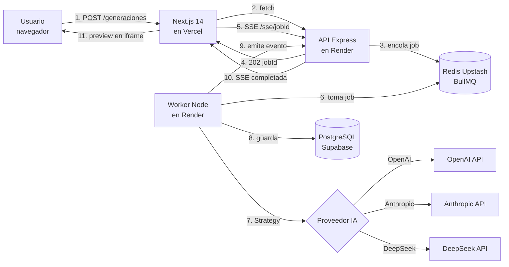
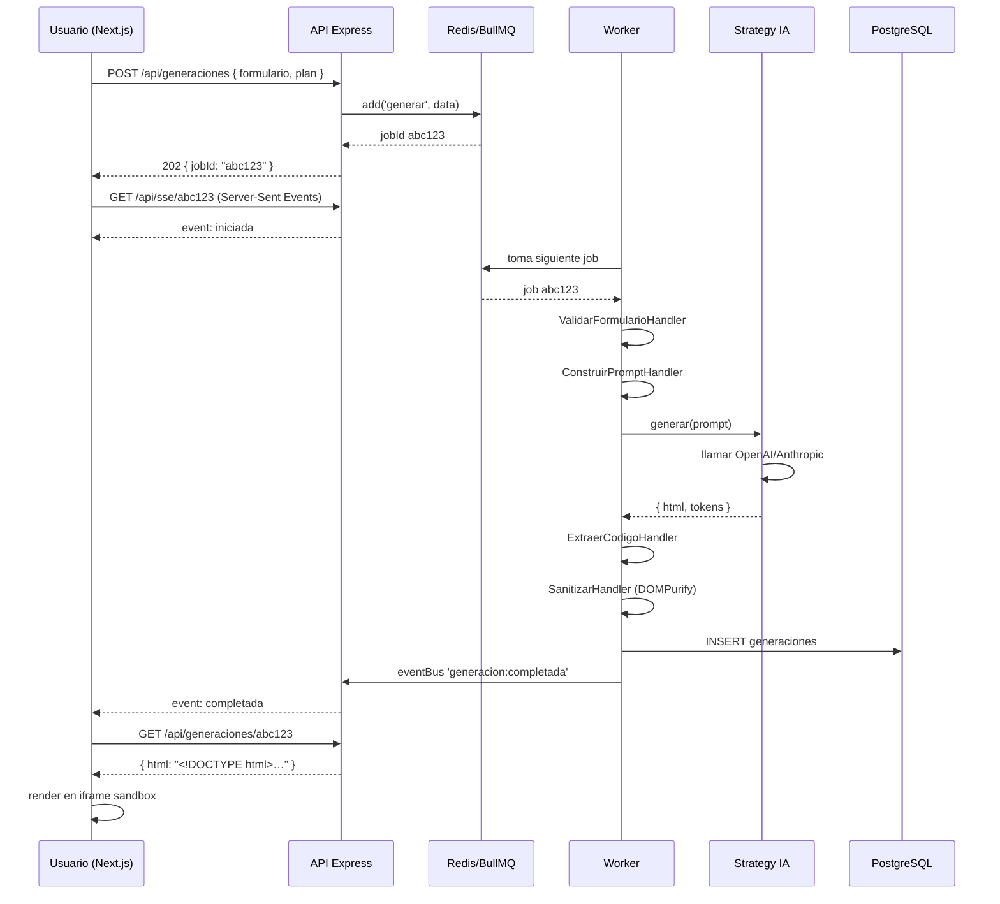

# Guía Personalizada – Grupo 6: Plataforma de Landing Pages con IA
## Generación automatizada de Landing Pages mediante modelos de Inteligencia Artificial

**Asignatura:** TPY1101 – Taller Aplicado de Programación
**Integrantes:** Juan Carlos Agüero Cárcamo · Marcos Orellana · Isaac González
**Duración de la actividad asociada:** 1 hora 30 minutos

> **Cómo usar este documento:** léanlo completo antes de la actividad. Las secciones 1 a 10 constituyen la **teoría y recomendación técnica** específica para su proyecto. La sección 11 es la **actividad práctica de 90 minutos** que deben ejecutar en clase. El entregable final de esa actividad es un archivo `ARQUITECTURA.md` dentro del repositorio del equipo.

---

## 1. Contexto del proyecto (según su EP1)

Su proyecto es una **plataforma web SaaS que automatiza la creación de Landing Pages mediante Inteligencia Artificial**. El usuario completa un formulario con la información de su negocio (rubro, tono, colores, servicios, CTA) y el sistema genera automáticamente el código HTML/CSS/JS listo para descarga o hosting. De acuerdo con su EP1, las piezas fundamentales son:

1. **Formulario dinámico inteligente** que captura requerimientos comerciales del cliente.
2. **Motor de Prompt Engineering escalonado** con tres niveles (Básico, Intermedio, Premium).
3. **Integración con APIs de IA externas** (OpenAI, Anthropic u otras) para generar el código.
4. **Módulo de post-procesamiento y sanitización** que limpia, valida y asegura el código generado.
5. **Visor de previsualización en tiempo real (Live Preview)** dentro de un iframe sandboxed.
6. **Simulador de pasarela de pago** y generación de archivos descargables (.zip).
7. **Panel de gestión de proyectos (historial)** para que los usuarios revisen sus Landing Pages previas.

Esto implica que necesitan:

- una **aplicación web** rica en interactividad, con preview en vivo del código generado;
- un **backend robusto** que gestione usuarios, proyectos, cobros simulados y la comunicación con las APIs de IA;
- un **sistema asíncrono** capaz de manejar **esperas de 10 a 60 segundos** por respuesta de los modelos de IA;
- **manejo estricto de seguridad** porque el código HTML/JS generado por IA debe ser renderizado sin exponer al usuario a ataques XSS;
- **control de costos** porque cada generación consume tokens pagados a un proveedor externo.

> **Nota sobre el stack de su EP1:** en su informe mencionan Java + Spring Boot para el backend y React/Vite para el frontend. Esta guía propone una adaptación a **Node.js + Express + Next.js 14** por coherencia con el ecosistema del resto de la asignatura, por la riqueza de librerías para trabajar con colas y modelos LLM (OpenAI SDK, Anthropic SDK, LangChain), y por simplificar el despliegue. Si el equipo prefiere mantener Spring Boot, los patrones de esta guía se trasladan uno a uno (Strategy, Factory, Decorator, Chain of Responsibility, Repository, Observer y Template Method son patrones clásicos del libro GoF, disponibles en Java desde siempre).

---

## 2. Su tarjeta técnica (resumen ejecutivo)

| Elemento | Recomendación |
|---|---|
| **Tipo de aplicación** | Web SaaS (Single Page Application + API) |
| **Framework frontend** | Next.js 14 (App Router) + React + Tailwind CSS |
| **Backend** | Node.js + Express |
| **Base de datos** | PostgreSQL (Supabase) |
| **Cola de jobs asíncronos** | **BullMQ + Redis (Upstash) — OBLIGATORIO** |
| **Modelos de IA** | OpenAI GPT-4, Anthropic Claude, Google Gemini, DeepSeek |
| **Auth** | Supabase Auth o JWT propio + bcrypt |
| **Despliegue frontend** | Vercel |
| **Despliegue backend y worker** | Render |
| **Sanitización HTML/JS** | DOMPurify + sandbox iframe (`srcdoc`) |
| **Patrón estrella del proyecto** | **Strategy** (un proveedor IA = una Strategy) |
| **Patrones complementarios** | Queue/Worker, Factory, Decorator, Chain of Responsibility, Template Method, Repository, Observer |

---

## 3. Análisis específico de su problema

### 3.1. ¿Por qué esto NO es una aplicación web común?

Una plataforma de "CRUD tradicional" responde las peticiones en milisegundos. La suya NO. Cada vez que un usuario pide generar una Landing Page, su sistema:

1. Construye un prompt estructurado.
2. Llama a una API externa (OpenAI / Anthropic / Gemini).
3. Espera **entre 10 y 60 segundos** a que el modelo responda.
4. Recibe un texto que puede estar malformado, truncado o con errores.
5. Lo sanitiza, valida, empaqueta y lo guarda.

Si esto lo hacen **síncronamente** (el cliente HTTP queda esperando la respuesta), van a tener:

- Timeouts en el navegador y en los balanceadores de carga de Vercel/Render.
- Una pésima experiencia: el usuario ve un spinner eterno.
- Imposibilidad de reintentar ante fallas sin perder el trabajo.
- Incapacidad de escalar si dos usuarios generan al mismo tiempo y el backend queda bloqueado.

**Conclusión:** la generación debe ser **asíncrona** mediante una **cola de trabajos** (ver sección 4.2).

### 3.2. Retos técnicos particulares de su proyecto

1. **Latencia variable:** nunca saben cuánto va a demorar una respuesta del modelo.
2. **Costos variables:** cada generación cuesta dinero real en tokens. Un usuario malicioso o un bug podrían costarles cientos de dólares.
3. **Seguridad crítica:** el código que les devuelve la IA es **código ejecutable** que ustedes van a renderizar en el navegador del usuario. Si no lo sanitizan, permiten inyección de scripts.
4. **Calidad impredecible:** un LLM puede alucinar, devolver texto conversacional fuera del código, truncar una respuesta o entregar HTML con errores.
5. **Dependencia de terceros:** si OpenAI falla, su producto deja de funcionar. Necesitan **resiliencia multi-proveedor**.
6. **Prompt engineering:** la calidad del resultado depende más del prompt que del modelo. Hay que tratar los prompts como artefactos versionables.

### 3.3. Volumen esperado y consecuencia técnica

Si proyectan 100-300 Landing Pages generadas por día en el primer año, con un costo promedio de 0.02 a 0.10 USD por generación, hablan de 2 a 30 USD diarios en tokens. Esto requiere, mínimo:

- **Rate limiting por usuario** (para que un usuario no abuse).
- **Monitoreo de costos** (dashboard de cuántos tokens se gastaron hoy).
- **Circuit breaker** si un proveedor empieza a fallar en cadena.

---

## 4. Conceptos clave que deben entender antes de programar

Antes de revisar los patrones, es necesario que todo el equipo comparta el mismo vocabulario. Lean esta sección en voz alta.

### 4.1. ¿Qué es un LLM y qué es un "prompt"?

Un **LLM** (Large Language Model) es un modelo de IA como GPT-4 o Claude. Le mandan texto y les devuelve texto. El texto que le envían se llama **prompt** y usualmente tiene dos partes:

- **System prompt:** las instrucciones permanentes ("eres un generador experto de Landing Pages HTML/CSS responsivas, no saludas, respondes solo con código dentro de bloques").
- **User prompt:** el pedido específico ("genera una Landing Page para una repostería llamada 'Dulces Clara' con colores rosa y dorado, tono cercano, CTA 'Reserva tu torta'").

La calidad del output depende **más del prompt que del modelo**. Por eso el equipo debe tratar los prompts como código versionado.

### 4.2. ¿Qué es una cola de trabajos (job queue)?

Una **cola** es una estructura de datos donde se encolan tareas que se ejecutan en segundo plano. El flujo es el siguiente:

1. El navegador pide `POST /api/generaciones` con los datos del formulario.
2. El servidor encola un **job** en Redis (usando BullMQ) y responde inmediatamente con un `jobId`.
3. Un proceso separado llamado **worker** lee la cola, toma el job, llama a la IA, procesa la respuesta y guarda el resultado.
4. El cliente (navegador) **pregunta cada 2 segundos** por el estado del job, o escucha eventos Server-Sent Events (SSE).
5. Cuando el worker termina, el cliente muestra el resultado.

**Ventajas de usar colas:**

- El cliente HTTP no queda bloqueado esperando 30 segundos.
- Si el worker falla, el job se reintenta automáticamente.
- Pueden escalar los workers independientemente del API (2 workers, 5 workers, 10 workers).
- Pueden priorizar jobs (usuarios premium antes que free).
- Pueden ver en un dashboard cuántos jobs hay pendientes, fallidos, completados.

**BullMQ** es una librería de Node.js que implementa colas sobre **Redis**. **Upstash** es un Redis administrado en la nube con capa gratuita que es perfecto para este proyecto.

```
┌──────────┐    POST /generaciones     ┌─────────┐    encola     ┌──────────┐
│ Navegador│ ─────────────────────────▶│   API   │ ─────────────▶│  Redis   │
│          │ ◀─── { jobId: "abc" } ────│         │  (BullMQ)     │ (cola)   │
└──────────┘                           └─────────┘               └──────────┘
                                                                       │
                                                                       │ polling
                                                                       ▼
                                                                 ┌──────────┐
                                                                 │  Worker  │
                                                                 │  (Node)  │
                                                                 └──────────┘
                                                                       │
                                                                       │ llama
                                                                       ▼
                                                                 ┌──────────┐
                                                                 │  API IA  │
                                                                 │ (OpenAI) │
                                                                 └──────────┘
```

### 4.3. ¿Qué significa "sanitizar HTML"?

Cuando la IA les devuelve HTML, puede contener scripts maliciosos (`<script>alert('XSS')</script>`) o atributos peligrosos (`onerror="..."`). Si renderizan ese HTML tal cual en el navegador, permiten ejecución de código arbitrario.

**Sanitizar** significa pasarlo por una librería como **DOMPurify** que elimina todo lo peligroso. Además, el preview debe hacerse en un **iframe con `srcdoc`** para aislar ese HTML del contexto del sitio principal.

### 4.4. ¿Qué es prompt engineering?

Es el arte y disciplina de **diseñar prompts** que hagan que el LLM devuelva exactamente lo que queremos, con la calidad que queremos, en el formato que queremos. Involucra técnicas como:

- **Few-shot examples:** dar ejemplos de input-output antes del pedido real.
- **Role assignment:** "actúa como un diseñador senior…".
- **Structured output:** "responde SOLO en JSON con esta estructura…".
- **Guardrails:** "si no entiendes el pedido, responde `{ "error": "..." }`".

---

## 5. Patrones recomendados para su backend

Esta es la parte central de la guía. Los patrones listados aquí NO son opcionales; son las herramientas que les van a permitir construir un sistema mantenible y resistente.

### 5.1. Patrón Strategy — el patrón estrella del proyecto

**Por qué para ustedes:** tienen que soportar múltiples proveedores de IA (OpenAI, Anthropic, Gemini, DeepSeek). Cada uno tiene un SDK distinto, un formato de mensajes distinto y un precio por token distinto. Si el código hace `if (proveedor === 'openai') { … } else if (…) { … }` van a terminar con un archivo infame.

El patrón **Strategy** dice: cada proveedor es una clase que implementa la **misma interfaz**, y el resto del código los trata como intercambiables.

**Ventajas concretas para ustedes:**

- **Resiliencia:** si OpenAI cae, cambian a Anthropic con un flag de configuración.
- **Experimentación:** pueden generar la misma Landing Page con dos modelos y comparar.
- **Optimización de costos:** el plan Básico puede usar DeepSeek (más barato); el Premium, GPT-4.
- **Testing:** pueden crear una `FakeStrategy` que devuelve HTML de prueba sin gastar tokens.

#### Código adaptado a su proyecto

```ts
// src/ia/IProveedorIA.ts
export interface PromptLanding {
  sistema: string;
  usuario: string;
  temperatura?: number;
  maxTokens?: number;
}

export interface ResultadoGeneracion {
  html: string;
  tokensEntrada: number;
  tokensSalida: number;
  modelo: string;
  latenciaMs: number;
}

export interface IProveedorIA {
  nombre(): string;
  generar(prompt: PromptLanding): Promise<ResultadoGeneracion>;
  costoEstimado(tokensEntrada: number, tokensSalida: number): number;
}
```

```ts
// src/ia/OpenAIStrategy.ts
import OpenAI from 'openai';
import { IProveedorIA, PromptLanding, ResultadoGeneracion } from './IProveedorIA';

export class OpenAIStrategy implements IProveedorIA {
  private cliente: OpenAI;

  constructor(apiKey: string, private modelo = 'gpt-4o-mini') {
    this.cliente = new OpenAI({ apiKey });
  }

  nombre() { return 'openai'; }

  async generar(prompt: PromptLanding): Promise<ResultadoGeneracion> {
    const inicio = Date.now();
    const respuesta = await this.cliente.chat.completions.create({
      model: this.modelo,
      temperature: prompt.temperatura ?? 0.7,
      max_tokens: prompt.maxTokens ?? 4000,
      messages: [
        { role: 'system', content: prompt.sistema },
        { role: 'user', content: prompt.usuario }
      ]
    });
    return {
      html: respuesta.choices[0].message.content ?? '',
      tokensEntrada: respuesta.usage?.prompt_tokens ?? 0,
      tokensSalida: respuesta.usage?.completion_tokens ?? 0,
      modelo: this.modelo,
      latenciaMs: Date.now() - inicio
    };
  }

  costoEstimado(tokensEntrada: number, tokensSalida: number) {
    // gpt-4o-mini: 0.15 USD/1M input, 0.60 USD/1M output
    return (tokensEntrada * 0.15 + tokensSalida * 0.60) / 1_000_000;
  }
}
```

```ts
// src/ia/AnthropicStrategy.ts
import Anthropic from '@anthropic-ai/sdk';
import { IProveedorIA, PromptLanding, ResultadoGeneracion } from './IProveedorIA';

export class AnthropicStrategy implements IProveedorIA {
  private cliente: Anthropic;

  constructor(apiKey: string, private modelo = 'claude-3-5-sonnet-20241022') {
    this.cliente = new Anthropic({ apiKey });
  }

  nombre() { return 'anthropic'; }

  async generar(prompt: PromptLanding): Promise<ResultadoGeneracion> {
    const inicio = Date.now();
    const respuesta = await this.cliente.messages.create({
      model: this.modelo,
      max_tokens: prompt.maxTokens ?? 4000,
      temperature: prompt.temperatura ?? 0.7,
      system: prompt.sistema,
      messages: [{ role: 'user', content: prompt.usuario }]
    });
    const contenido = respuesta.content[0];
    const html = contenido.type === 'text' ? contenido.text : '';
    return {
      html,
      tokensEntrada: respuesta.usage.input_tokens,
      tokensSalida: respuesta.usage.output_tokens,
      modelo: this.modelo,
      latenciaMs: Date.now() - inicio
    };
  }

  costoEstimado(tokensEntrada: number, tokensSalida: number) {
    // Claude Sonnet: 3 USD/1M input, 15 USD/1M output
    return (tokensEntrada * 3 + tokensSalida * 15) / 1_000_000;
  }
}
```

```ts
// src/ia/DeepSeekStrategy.ts
import { IProveedorIA, PromptLanding, ResultadoGeneracion } from './IProveedorIA';

export class DeepSeekStrategy implements IProveedorIA {
  constructor(private apiKey: string, private modelo = 'deepseek-chat') {}
  nombre() { return 'deepseek'; }

  async generar(prompt: PromptLanding): Promise<ResultadoGeneracion> {
    const inicio = Date.now();
    const r = await fetch('https://api.deepseek.com/chat/completions', {
      method: 'POST',
      headers: {
        'Content-Type': 'application/json',
        Authorization: `Bearer ${this.apiKey}`
      },
      body: JSON.stringify({
        model: this.modelo,
        messages: [
          { role: 'system', content: prompt.sistema },
          { role: 'user', content: prompt.usuario }
        ],
        temperature: prompt.temperatura ?? 0.7
      })
    });
    const data = await r.json();
    return {
      html: data.choices[0].message.content,
      tokensEntrada: data.usage.prompt_tokens,
      tokensSalida: data.usage.completion_tokens,
      modelo: this.modelo,
      latenciaMs: Date.now() - inicio
    };
  }

  costoEstimado(e: number, s: number) { return (e * 0.27 + s * 1.1) / 1_000_000; }
}
```

### 5.2. Patrón Factory — seleccionar la Strategy correcta

**Por qué para ustedes:** los Strategies ya existen, pero alguien tiene que decidir cuál usar en cada generación. Esa decisión puede depender del plan del usuario (básico / intermedio / premium), de la disponibilidad actual, de políticas de costos o de un A/B test. La lógica de selección NO debe estar dispersa por el código.

```ts
// src/ia/ProveedorIAFactory.ts
import { IProveedorIA } from './IProveedorIA';
import { OpenAIStrategy } from './OpenAIStrategy';
import { AnthropicStrategy } from './AnthropicStrategy';
import { DeepSeekStrategy } from './DeepSeekStrategy';

type NombreProveedor = 'openai' | 'anthropic' | 'deepseek';

export class ProveedorIAFactory {
  private static instancias = new Map<NombreProveedor, IProveedorIA>();

  static obtener(nombre: NombreProveedor): IProveedorIA {
    if (!this.instancias.has(nombre)) {
      switch (nombre) {
        case 'openai':
          this.instancias.set(nombre, new OpenAIStrategy(process.env.OPENAI_API_KEY!));
          break;
        case 'anthropic':
          this.instancias.set(nombre, new AnthropicStrategy(process.env.ANTHROPIC_API_KEY!));
          break;
        case 'deepseek':
          this.instancias.set(nombre, new DeepSeekStrategy(process.env.DEEPSEEK_API_KEY!));
          break;
        default:
          throw new Error(`Proveedor desconocido: ${nombre}`);
      }
    }
    return this.instancias.get(nombre)!;
  }

  // Selección por plan del usuario (política de costos)
  static obtenerPorPlan(plan: 'basico' | 'intermedio' | 'premium'): IProveedorIA {
    const mapeo: Record<string, NombreProveedor> = {
      basico: 'deepseek',
      intermedio: 'openai',
      premium: 'anthropic'
    };
    return this.obtener(mapeo[plan]);
  }
}
```

### 5.3. Patrón Decorator — envolver Strategies con preocupaciones transversales

**Por qué para ustedes:** quieren rate limiting, logging y tracking de costos **en todas las generaciones**, sin importar el proveedor. Pueden añadirlo como `if (...)` en cada Strategy (mala idea: se repite), o pueden **envolver** cualquier Strategy con Decoradores que agreguen comportamiento sin modificar el original.

```ts
// src/ia/decoradores/LoggingDecorator.ts
import { IProveedorIA, PromptLanding, ResultadoGeneracion } from '../IProveedorIA';

export class LoggingDecorator implements IProveedorIA {
  constructor(private interno: IProveedorIA) {}
  nombre() { return this.interno.nombre(); }

  async generar(prompt: PromptLanding): Promise<ResultadoGeneracion> {
    console.log(`[IA] ${this.interno.nombre()} — tokens pedidos: ~${prompt.usuario.length}`);
    try {
      const r = await this.interno.generar(prompt);
      console.log(`[IA] ok ${this.interno.nombre()} — ${r.latenciaMs}ms, tokens out=${r.tokensSalida}`);
      return r;
    } catch (e) {
      console.error(`[IA] FALLO ${this.interno.nombre()}:`, e);
      throw e;
    }
  }
  costoEstimado(e: number, s: number) { return this.interno.costoEstimado(e, s); }
}
```

```ts
// src/ia/decoradores/RateLimitDecorator.ts
import { IProveedorIA, PromptLanding, ResultadoGeneracion } from '../IProveedorIA';

const limites = new Map<string, { ventanaInicio: number; contador: number }>();

export class RateLimitDecorator implements IProveedorIA {
  constructor(
    private interno: IProveedorIA,
    private usuarioId: string,
    private maxPorMinuto = 5
  ) {}

  nombre() { return this.interno.nombre(); }

  async generar(prompt: PromptLanding): Promise<ResultadoGeneracion> {
    const ahora = Date.now();
    const estado = limites.get(this.usuarioId) ?? { ventanaInicio: ahora, contador: 0 };
    if (ahora - estado.ventanaInicio > 60_000) {
      estado.ventanaInicio = ahora;
      estado.contador = 0;
    }
    if (estado.contador >= this.maxPorMinuto) {
      throw Object.assign(new Error('Rate limit excedido'), { status: 429 });
    }
    estado.contador += 1;
    limites.set(this.usuarioId, estado);
    return this.interno.generar(prompt);
  }
  costoEstimado(e: number, s: number) { return this.interno.costoEstimado(e, s); }
}
```

```ts
// src/ia/decoradores/CostTrackingDecorator.ts
import { IProveedorIA, PromptLanding, ResultadoGeneracion } from '../IProveedorIA';
import { costoRepository } from '../../modules/costos/costos.repository';

export class CostTrackingDecorator implements IProveedorIA {
  constructor(private interno: IProveedorIA, private usuarioId: string) {}
  nombre() { return this.interno.nombre(); }

  async generar(prompt: PromptLanding): Promise<ResultadoGeneracion> {
    const r = await this.interno.generar(prompt);
    const costo = this.interno.costoEstimado(r.tokensEntrada, r.tokensSalida);
    await costoRepository.registrar({
      usuarioId: this.usuarioId,
      proveedor: this.interno.nombre(),
      tokensEntrada: r.tokensEntrada,
      tokensSalida: r.tokensSalida,
      costoUSD: costo
    });
    return r;
  }
  costoEstimado(e: number, s: number) { return this.interno.costoEstimado(e, s); }
}
```

**Uso combinado (capas):**

```ts
const estrategiaBase = ProveedorIAFactory.obtenerPorPlan('intermedio');
const conLogs = new LoggingDecorator(estrategiaBase);
const conRateLimit = new RateLimitDecorator(conLogs, usuarioId, 5);
const conCostos = new CostTrackingDecorator(conRateLimit, usuarioId);
const resultado = await conCostos.generar(prompt);
```

### 5.4. Patrón Chain of Responsibility — pipeline de procesamiento

**Por qué para ustedes:** una generación NO es un solo paso, es una cadena:

1. Validar el formulario del usuario.
2. Construir el prompt enriquecido a partir del formulario.
3. Llamar a la IA.
4. Extraer el bloque de código HTML/CSS/JS del texto devuelto (el modelo suele saludar antes).
5. Sanitizar el HTML con DOMPurify (eliminar `<script>`, atributos `on*`, etc.).
6. Validar que el HTML esté bien formado.
7. Guardar el resultado en la base de datos.

Cada uno de esos pasos puede fallar. Juntarlos en una función gigante es inmantenible. El patrón **Chain of Responsibility** dice: arma una cadena de "pasos" (handlers). Cada handler recibe un contexto, hace su trabajo y lo pasa al siguiente.

```ts
// src/pipeline/Handler.ts
export interface ContextoGeneracion {
  usuarioId: string;
  plan: 'basico' | 'intermedio' | 'premium';
  formulario: any;
  prompt?: { sistema: string; usuario: string };
  resultadoIA?: { html: string; tokensEntrada: number; tokensSalida: number };
  htmlSanitizado?: string;
  errores: string[];
  meta: Record<string, any>;
}

export abstract class Handler {
  protected siguiente?: Handler;
  setSiguiente(h: Handler): Handler { this.siguiente = h; return h; }
  async manejar(ctx: ContextoGeneracion): Promise<ContextoGeneracion> {
    await this.procesar(ctx);
    if (this.siguiente) return this.siguiente.manejar(ctx);
    return ctx;
  }
  abstract procesar(ctx: ContextoGeneracion): Promise<void>;
}
```

```ts
// src/pipeline/handlers/ValidarFormularioHandler.ts
import { Handler, ContextoGeneracion } from '../Handler';
import { z } from 'zod';

const schema = z.object({
  nombreNegocio: z.string().min(2).max(80),
  rubro: z.string().min(2),
  tono: z.enum(['cercano', 'profesional', 'divertido', 'elegante']),
  cta: z.string().min(2).max(40),
  coloresPrincipales: z.array(z.string()).min(1).max(4)
});

export class ValidarFormularioHandler extends Handler {
  async procesar(ctx: ContextoGeneracion) {
    const r = schema.safeParse(ctx.formulario);
    if (!r.success) ctx.errores.push(`Formulario inválido: ${r.error.message}`);
  }
}
```

```ts
// src/pipeline/handlers/ConstruirPromptHandler.ts
import { Handler, ContextoGeneracion } from '../Handler';

const SYSTEM_BASE = `Eres un diseñador web senior. Generas SOLO código HTML/CSS
responsivo con Tailwind por CDN. No agregas texto conversacional. No usas <script>.`;

export class ConstruirPromptHandler extends Handler {
  async procesar(ctx: ContextoGeneracion) {
    if (ctx.errores.length) return;
    const f = ctx.formulario;
    ctx.prompt = {
      sistema: SYSTEM_BASE,
      usuario: `Genera una Landing Page para:
- Negocio: ${f.nombreNegocio}
- Rubro: ${f.rubro}
- Tono: ${f.tono}
- Colores: ${f.coloresPrincipales.join(', ')}
- CTA principal: "${f.cta}"
- Plan: ${ctx.plan}
Entrega un único archivo HTML completo con CSS embebido.`
    };
  }
}
```

```ts
// src/pipeline/handlers/LlamarIAHandler.ts
import { Handler, ContextoGeneracion } from '../Handler';
import { ProveedorIAFactory } from '../../ia/ProveedorIAFactory';

export class LlamarIAHandler extends Handler {
  async procesar(ctx: ContextoGeneracion) {
    if (ctx.errores.length || !ctx.prompt) return;
    try {
      const proveedor = ProveedorIAFactory.obtenerPorPlan(ctx.plan);
      const r = await proveedor.generar(ctx.prompt);
      ctx.resultadoIA = { html: r.html, tokensEntrada: r.tokensEntrada, tokensSalida: r.tokensSalida };
      ctx.meta.modelo = r.modelo;
    } catch (e: any) {
      ctx.errores.push(`Error IA: ${e.message}`);
    }
  }
}
```

```ts
// src/pipeline/handlers/ExtraerCodigoHandler.ts
import { Handler, ContextoGeneracion } from '../Handler';

export class ExtraerCodigoHandler extends Handler {
  async procesar(ctx: ContextoGeneracion) {
    if (!ctx.resultadoIA) return;
    const texto = ctx.resultadoIA.html;
    const bloque = texto.match(/```html\n([\s\S]*?)```/);
    ctx.resultadoIA.html = bloque ? bloque[1] : texto;
  }
}
```

```ts
// src/pipeline/handlers/SanitizarHandler.ts
import createDOMPurify from 'dompurify';
import { JSDOM } from 'jsdom';
import { Handler, ContextoGeneracion } from '../Handler';

const window = new JSDOM('').window;
const DOMPurify = createDOMPurify(window as any);

export class SanitizarHandler extends Handler {
  async procesar(ctx: ContextoGeneracion) {
    if (!ctx.resultadoIA) return;
    ctx.htmlSanitizado = DOMPurify.sanitize(ctx.resultadoIA.html, {
      WHOLE_DOCUMENT: true,
      FORBID_TAGS: ['script', 'iframe', 'object', 'embed'],
      FORBID_ATTR: ['onerror', 'onclick', 'onload']
    });
  }
}
```

```ts
// src/pipeline/handlers/PersistirHandler.ts
import { Handler, ContextoGeneracion } from '../Handler';
import { generacionRepository } from '../../modules/generaciones/generaciones.repository';

export class PersistirHandler extends Handler {
  async procesar(ctx: ContextoGeneracion) {
    if (!ctx.htmlSanitizado) return;
    await generacionRepository.crear({
      usuarioId: ctx.usuarioId,
      plan: ctx.plan,
      html: ctx.htmlSanitizado,
      modelo: ctx.meta.modelo,
      tokensEntrada: ctx.resultadoIA!.tokensEntrada,
      tokensSalida: ctx.resultadoIA!.tokensSalida
    });
  }
}
```

```ts
// src/pipeline/construirCadena.ts
export function construirCadenaGeneracion() {
  const validar = new ValidarFormularioHandler();
  const construir = new ConstruirPromptHandler();
  const llamar = new LlamarIAHandler();
  const extraer = new ExtraerCodigoHandler();
  const sanitizar = new SanitizarHandler();
  const persistir = new PersistirHandler();

  validar.setSiguiente(construir).setSiguiente(llamar)
         .setSiguiente(extraer).setSiguiente(sanitizar).setSiguiente(persistir);
  return validar;
}
```

### 5.5. Patrón Template Method — clase base GeneradorBase

**Por qué para ustedes:** el flujo de generación tiene pasos fijos, pero algunos varían entre un plan básico (genera solo HTML+CSS) y un plan premium (HTML+CSS+JS con animaciones). El **Template Method** es una clase base que define el orden de los pasos y deja que las subclases sobreescriban solo lo que cambia.

```ts
// src/generadores/GeneradorBase.ts
export abstract class GeneradorBase {
  async ejecutar(formulario: any, usuarioId: string) {
    this.validarInput(formulario);
    const prompt = this.construirPrompt(formulario);
    const respuesta = await this.llamarIA(prompt);
    const limpio = this.parsearOutput(respuesta);
    return this.sanitizar(limpio);
  }

  // Pasos con implementación por defecto
  protected validarInput(f: any) { /* validación genérica */ }
  protected sanitizar(html: string): string { /* DOMPurify */ return html; }

  // Pasos que DEBEN implementar las subclases
  protected abstract construirPrompt(f: any): { sistema: string; usuario: string };
  protected abstract llamarIA(p: any): Promise<string>;
  protected abstract parsearOutput(html: string): string;
}
```

```ts
// src/generadores/GeneradorBasico.ts
import { GeneradorBase } from './GeneradorBase';
import { ProveedorIAFactory } from '../ia/ProveedorIAFactory';

export class GeneradorBasico extends GeneradorBase {
  protected construirPrompt(f: any) {
    return {
      sistema: 'Genera HTML simple con estilos inline. No JavaScript.',
      usuario: `Landing para ${f.nombreNegocio}, rubro ${f.rubro}.`
    };
  }
  protected async llamarIA(p: any) {
    const r = await ProveedorIAFactory.obtener('deepseek').generar(p);
    return r.html;
  }
  protected parsearOutput(t: string) { return t.replace(/^```html\n/, '').replace(/```$/, ''); }
}
```

```ts
// src/generadores/GeneradorPremium.ts
import { GeneradorBase } from './GeneradorBase';
import { ProveedorIAFactory } from '../ia/ProveedorIAFactory';

export class GeneradorPremium extends GeneradorBase {
  protected construirPrompt(f: any) {
    return {
      sistema: 'Genera HTML+CSS+JS con Tailwind, animaciones suaves y SEO óptimo.',
      usuario: `Landing premium para ${f.nombreNegocio}…`
    };
  }
  protected async llamarIA(p: any) {
    const r = await ProveedorIAFactory.obtener('anthropic').generar(p);
    return r.html;
  }
  protected parsearOutput(t: string) { return t; }
}
```

### 5.6. Patrón Repository — aislar el acceso a datos

**Por qué para ustedes:** van a consultar mucho la base de datos (lista de generaciones del usuario, plantillas disponibles, historial de costos). Centralizar esas queries evita duplicación y permite testearlas.

```ts
// src/modules/generaciones/generaciones.repository.ts
import { pool } from '../../config/db';

export const generacionRepository = {
  async crear(data: {
    usuarioId: string; plan: string; html: string;
    modelo: string; tokensEntrada: number; tokensSalida: number;
  }) {
    const { rows } = await pool.query(
      `INSERT INTO generaciones (usuario_id, plan, html, modelo, tokens_in, tokens_out)
       VALUES ($1,$2,$3,$4,$5,$6) RETURNING *`,
      [data.usuarioId, data.plan, data.html, data.modelo, data.tokensEntrada, data.tokensSalida]
    );
    return rows[0];
  },

  async porUsuario(usuarioId: string, limite = 50) {
    const { rows } = await pool.query(
      `SELECT id, plan, modelo, creada_en, tokens_in, tokens_out
       FROM generaciones WHERE usuario_id=$1
       ORDER BY creada_en DESC LIMIT $2`,
      [usuarioId, limite]
    );
    return rows;
  },

  async porId(id: string) {
    const { rows } = await pool.query(`SELECT * FROM generaciones WHERE id=$1`, [id]);
    return rows[0];
  }
};
```

```ts
// src/modules/templates/templates.repository.ts
export const templateRepository = {
  async listar() { /* SELECT * FROM templates */ },
  async porId(id: string) { /* … */ },
  async crear(t: any) { /* … */ }
};
```

### 5.7. Patrón Observer / EventEmitter — notificar eventos al usuario

**Por qué para ustedes:** el usuario lanzó una generación y ahora espera. El worker debe **avisar** cuando empiece, cuando termine o cuando falle. El patrón **Observer** (implementado en Node con `EventEmitter`) permite emitir eventos y que múltiples partes del sistema reaccionen (SSE, websocket, logs, métricas).

```ts
// src/lib/eventBus.ts
import { EventEmitter } from 'events';
export const eventBus = new EventEmitter();
eventBus.setMaxListeners(100);
```

```ts
// src/workers/generacionWorker.ts (extracto)
import { eventBus } from '../lib/eventBus';

eventBus.emit('generacion:iniciada', { generacionId, usuarioId });
try {
  // ... procesamiento
  eventBus.emit('generacion:completada', { generacionId, usuarioId, urlPreview });
} catch (e) {
  eventBus.emit('generacion:fallida', { generacionId, usuarioId, error: e.message });
}
```

```ts
// src/modules/generaciones/sse.controller.ts
import { Request, Response } from 'express';
import { eventBus } from '../../lib/eventBus';

export function streamGeneracion(req: Request, res: Response) {
  const { generacionId } = req.params;
  res.writeHead(200, {
    'Content-Type': 'text/event-stream',
    'Cache-Control': 'no-cache',
    Connection: 'keep-alive'
  });

  const enviar = (tipo: string) => (data: any) => {
    if (data.generacionId !== generacionId) return;
    res.write(`event: ${tipo}\ndata: ${JSON.stringify(data)}\n\n`);
  };
  const onIni = enviar('iniciada'), onOk = enviar('completada'), onErr = enviar('fallida');
  eventBus.on('generacion:iniciada', onIni);
  eventBus.on('generacion:completada', onOk);
  eventBus.on('generacion:fallida', onErr);

  req.on('close', () => {
    eventBus.off('generacion:iniciada', onIni);
    eventBus.off('generacion:completada', onOk);
    eventBus.off('generacion:fallida', onErr);
  });
}
```

---

## 6. Patrón Queue / Worker con BullMQ — la columna vertebral

Este es tan importante que merece su propia sección. Lean con detalle.

### 6.1. Instalación y conexión a Redis (Upstash)

```bash
npm install bullmq ioredis
```

```ts
// src/lib/redis.ts
import IORedis from 'ioredis';
export const redisConnection = new IORedis(process.env.UPSTASH_REDIS_URL!, {
  maxRetriesPerRequest: null // requerido por BullMQ
});
```

### 6.2. Definición de la cola (productor)

```ts
// src/colas/generacionesQueue.ts
import { Queue } from 'bullmq';
import { redisConnection } from '../lib/redis';

export interface JobGeneracion {
  usuarioId: string;
  plan: 'basico' | 'intermedio' | 'premium';
  formulario: any;
}

export const generacionesQueue = new Queue<JobGeneracion>('generaciones', {
  connection: redisConnection,
  defaultJobOptions: {
    attempts: 3,
    backoff: { type: 'exponential', delay: 3_000 },
    removeOnComplete: { count: 1000 },
    removeOnFail: { count: 500 }
  }
});
```

### 6.3. Endpoint que encola (API)

```ts
// src/modules/generaciones/generaciones.controller.ts
import { Request, Response } from 'express';
import { generacionesQueue } from '../../colas/generacionesQueue';

export async function crearGeneracion(req: Request, res: Response) {
  const { plan, formulario } = req.body;
  const job = await generacionesQueue.add('generar', {
    usuarioId: req.user!.id,
    plan,
    formulario
  });
  res.status(202).json({ jobId: job.id, estado: 'encolada' });
}

export async function estadoGeneracion(req: Request, res: Response) {
  const job = await generacionesQueue.getJob(req.params.jobId);
  if (!job) return res.status(404).json({ error: 'No encontrada' });
  const estado = await job.getState(); // 'waiting' | 'active' | 'completed' | 'failed'
  res.json({ jobId: job.id, estado, resultado: job.returnvalue });
}
```

### 6.4. Worker (consumidor)

Se ejecuta como proceso aparte. En Render esto es un **Background Worker**.

```ts
// src/workers/generacionWorker.ts
import { Worker, Job } from 'bullmq';
import { redisConnection } from '../lib/redis';
import { JobGeneracion } from '../colas/generacionesQueue';
import { construirCadenaGeneracion } from '../pipeline/construirCadena';
import { eventBus } from '../lib/eventBus';

export const generacionWorker = new Worker<JobGeneracion>(
  'generaciones',
  async (job: Job<JobGeneracion>) => {
    eventBus.emit('generacion:iniciada', { generacionId: job.id, usuarioId: job.data.usuarioId });
    const cadena = construirCadenaGeneracion();
    const ctx = {
      usuarioId: job.data.usuarioId,
      plan: job.data.plan,
      formulario: job.data.formulario,
      errores: [],
      meta: {}
    };
    const r = await cadena.manejar(ctx);
    if (r.errores.length) throw new Error(r.errores.join('; '));
    eventBus.emit('generacion:completada', { generacionId: job.id, usuarioId: job.data.usuarioId });
    return { html: r.htmlSanitizado, meta: r.meta };
  },
  {
    connection: redisConnection,
    concurrency: 3, // 3 jobs en paralelo
    limiter: { max: 30, duration: 60_000 } // como máximo 30 jobs por minuto en total
  }
);

generacionWorker.on('failed', (job, err) => {
  eventBus.emit('generacion:fallida', {
    generacionId: job?.id, usuarioId: job?.data.usuarioId, error: err.message
  });
});
```

### 6.5. Script de arranque del worker

```json
// package.json
"scripts": {
  "dev:api": "tsx watch src/server.ts",
  "dev:worker": "tsx watch src/workers/arrancar.ts",
  "start:api": "node dist/server.js",
  "start:worker": "node dist/workers/arrancar.js"
}
```

```ts
// src/workers/arrancar.ts
import './generacionWorker';
console.log('Worker de generaciones iniciado');
```

---

## 7. Patrones recomendados para su frontend (Next.js 14)

### 7.1. App Router y estructura de rutas

Next.js 14 App Router usa la carpeta `app/`. Les recomendamos:

```
app/
├── layout.tsx
├── page.tsx                      — landing de marketing
├── login/page.tsx
├── dashboard/
│   ├── layout.tsx
│   ├── page.tsx                  — lista de generaciones
│   └── nuevo/
│       ├── page.tsx              — formulario
│       └── [jobId]/page.tsx      — preview en vivo
└── api/
    └── sse/[generacionId]/route.ts
```

### 7.2. Componente PromptEditor

```tsx
// components/PromptEditor.tsx
'use client';
import { useState } from 'react';

interface Props { onEnviar(data: any): void; }

export function PromptEditor({ onEnviar }: Props) {
  const [form, setForm] = useState({
    nombreNegocio: '', rubro: '', tono: 'cercano',
    cta: '', coloresPrincipales: ['#3b82f6']
  });
  return (
    <form onSubmit={e => { e.preventDefault(); onEnviar(form); }} className="space-y-4">
      <input className="input" placeholder="Nombre del negocio"
             value={form.nombreNegocio}
             onChange={e => setForm({ ...form, nombreNegocio: e.target.value })} />
      <input className="input" placeholder="Rubro"
             value={form.rubro} onChange={e => setForm({ ...form, rubro: e.target.value })} />
      <select value={form.tono} onChange={e => setForm({ ...form, tono: e.target.value })}>
        <option value="cercano">Cercano</option>
        <option value="profesional">Profesional</option>
        <option value="divertido">Divertido</option>
        <option value="elegante">Elegante</option>
      </select>
      <input className="input" placeholder="Texto del CTA"
             value={form.cta} onChange={e => setForm({ ...form, cta: e.target.value })} />
      <button type="submit" className="btn-primary">Generar</button>
    </form>
  );
}
```

### 7.3. Hook useGeneracion

```tsx
// hooks/useGeneracion.ts
'use client';
import { useEffect, useState } from 'react';

interface Estado {
  estado: 'encolada' | 'generando' | 'completada' | 'fallida';
  html?: string;
  error?: string;
}

export function useGeneracion(jobId?: string) {
  const [estado, setEstado] = useState<Estado>({ estado: 'encolada' });

  useEffect(() => {
    if (!jobId) return;
    const evt = new EventSource(`/api/sse/${jobId}`);
    evt.addEventListener('iniciada', () => setEstado({ estado: 'generando' }));
    evt.addEventListener('completada', async () => {
      const r = await fetch(`/api/generaciones/${jobId}`).then(x => x.json());
      setEstado({ estado: 'completada', html: r.html });
      evt.close();
    });
    evt.addEventListener('fallida', (e: any) => {
      setEstado({ estado: 'fallida', error: JSON.parse(e.data).error });
      evt.close();
    });
    return () => evt.close();
  }, [jobId]);

  return estado;
}
```

### 7.4. Componente GeneracionCard (preview en iframe sandboxed)

```tsx
// components/GeneracionCard.tsx
'use client';
interface Props { html: string; titulo?: string; }

export function GeneracionCard({ html, titulo }: Props) {
  return (
    <div className="border rounded-lg overflow-hidden shadow">
      {titulo && <div className="bg-slate-100 p-2 text-sm">{titulo}</div>}
      <iframe
        sandbox="allow-same-origin"
        srcDoc={html}
        className="w-full h-[600px] bg-white"
      />
    </div>
  );
}
```

El atributo `sandbox` del iframe es CLAVE. Sin `allow-scripts`, ningún JavaScript embebido se ejecuta; es la segunda línea de defensa después de DOMPurify.

### 7.5. Página de formulario + polling/SSE

```tsx
// app/dashboard/nuevo/page.tsx
'use client';
import { useRouter } from 'next/navigation';
import { PromptEditor } from '@/components/PromptEditor';

export default function Nuevo() {
  const router = useRouter();
  async function enviar(formulario: any) {
    const r = await fetch('/api/generaciones', {
      method: 'POST',
      headers: { 'Content-Type': 'application/json' },
      body: JSON.stringify({ plan: 'intermedio', formulario })
    });
    const { jobId } = await r.json();
    router.push(`/dashboard/nuevo/${jobId}`);
  }
  return <PromptEditor onEnviar={enviar} />;
}
```

```tsx
// app/dashboard/nuevo/[jobId]/page.tsx
'use client';
import { useGeneracion } from '@/hooks/useGeneracion';
import { GeneracionCard } from '@/components/GeneracionCard';

export default function Preview({ params }: { params: { jobId: string } }) {
  const { estado, html, error } = useGeneracion(params.jobId);
  if (estado === 'encolada') return <p>Tu generación está en la cola…</p>;
  if (estado === 'generando') return <p>La IA está trabajando, unos segundos más…</p>;
  if (estado === 'fallida') return <p className="text-red-600">Falló: {error}</p>;
  return <GeneracionCard html={html!} titulo="Tu Landing Page" />;
}
```

---

## 8. Arquitectura recomendada

### 8.1. Arquitectura general (diagrama)



### 8.2. Diagrama de secuencia: "usuario genera una Landing"



---

## 9. Estructura de carpetas recomendada

### Frontend (Next.js 14 en Vercel)

```
landingsia-web/
├── app/
│   ├── layout.tsx
│   ├── page.tsx
│   ├── login/page.tsx
│   └── dashboard/
│       ├── layout.tsx
│       ├── page.tsx
│       └── nuevo/
│           ├── page.tsx
│           └── [jobId]/page.tsx
├── components/
│   ├── PromptEditor.tsx
│   ├── GeneracionCard.tsx
│   ├── PlanSelector.tsx
│   └── BotonDescarga.tsx
├── hooks/
│   ├── useGeneracion.ts
│   ├── useAuth.ts
│   └── useHistorial.ts
├── lib/
│   ├── api.ts
│   └── formatters.ts
├── public/
├── styles/
│   └── globals.css
├── .env.local.example
├── next.config.js
├── tsconfig.json
└── package.json
```

### Backend (Node + Express + BullMQ en Render)

```
landingsia-api/
├── src/
│   ├── config/
│   │   ├── env.ts
│   │   └── db.ts
│   ├── lib/
│   │   ├── redis.ts
│   │   ├── eventBus.ts
│   │   └── logger.ts
│   ├── middleware/
│   │   ├── auth.ts
│   │   ├── errorHandler.ts
│   │   └── validate.ts
│   ├── ia/
│   │   ├── IProveedorIA.ts
│   │   ├── OpenAIStrategy.ts
│   │   ├── AnthropicStrategy.ts
│   │   ├── DeepSeekStrategy.ts
│   │   ├── ProveedorIAFactory.ts
│   │   └── decoradores/
│   │       ├── LoggingDecorator.ts
│   │       ├── RateLimitDecorator.ts
│   │       └── CostTrackingDecorator.ts
│   ├── pipeline/
│   │   ├── Handler.ts
│   │   ├── construirCadena.ts
│   │   └── handlers/
│   │       ├── ValidarFormularioHandler.ts
│   │       ├── ConstruirPromptHandler.ts
│   │       ├── LlamarIAHandler.ts
│   │       ├── ExtraerCodigoHandler.ts
│   │       ├── SanitizarHandler.ts
│   │       └── PersistirHandler.ts
│   ├── generadores/
│   │   ├── GeneradorBase.ts
│   │   ├── GeneradorBasico.ts
│   │   ├── GeneradorIntermedio.ts
│   │   └── GeneradorPremium.ts
│   ├── colas/
│   │   └── generacionesQueue.ts
│   ├── workers/
│   │   ├── generacionWorker.ts
│   │   └── arrancar.ts
│   ├── modules/
│   │   ├── auth/
│   │   ├── generaciones/
│   │   ├── templates/
│   │   ├── costos/
│   │   └── usuarios/
│   ├── app.ts
│   └── server.ts
├── migrations/
│   └── 001_init.sql
├── tests/
├── .env.example
├── tsconfig.json
└── package.json
```

---

## 10. Stack tecnológico y despliegue

| Componente | Tecnología | Plataforma gratuita | Cómo desplegar |
|---|---|---|---|
| Frontend Next.js | Next.js 14 | **Vercel** (free) | Conectar repo GitHub, Vercel detecta Next automáticamente |
| API Express | Node.js + Express | **Render** (Web Service free) | Conectar repo, `start: npm run start:api` |
| Worker BullMQ | Node.js + BullMQ | **Render** (Background Worker, requiere plan starter $7/mes) o Railway trial | `start: npm run start:worker` |
| Redis (cola) | Redis | **Upstash** (free 10k cmds/día) | Crear DB, copiar `UPSTASH_REDIS_URL` |
| Base de datos | PostgreSQL | **Supabase** (free 500 MB) | Crear proyecto, copiar `DATABASE_URL` |
| Auth | Supabase Auth | Incluida | Activar email/password en Supabase |
| IA — OpenAI | GPT-4o-mini | Pago por uso (~0.002 USD por landing) | Crear cuenta, obtener API key |
| IA — Anthropic | Claude Sonnet | Pago por uso (~0.015 USD por landing) | Crear cuenta, obtener API key |
| IA — DeepSeek | DeepSeek Chat | Pago por uso (~0.0005 USD por landing) | Crear cuenta, obtener API key |

### 10.1. Pasos concretos para su primer deploy

1. **Supabase:** crear proyecto, ejecutar `migrations/001_init.sql`, copiar `DATABASE_URL`.
2. **Upstash:** crear Redis DB, copiar `UPSTASH_REDIS_URL`.
3. **Render — API:** New Web Service, conectar repo, variables:
   - `DATABASE_URL`, `UPSTASH_REDIS_URL`, `JWT_SECRET`
   - `OPENAI_API_KEY`, `ANTHROPIC_API_KEY`, `DEEPSEEK_API_KEY`
4. **Render — Worker:** New Background Worker, mismo repo, comando `npm run start:worker`, mismas variables.
5. **Vercel:** importar repo frontend, variable `NEXT_PUBLIC_API_URL` apuntando a la URL de Render.

### 10.2. Variables de entorno mínimas

```env
# landingsia-api/.env
PORT=3000
DATABASE_URL=postgres://...supabase...
UPSTASH_REDIS_URL=rediss://...upstash...
JWT_SECRET=cambiaEstoPorUnSecretoLargo
OPENAI_API_KEY=sk-...
ANTHROPIC_API_KEY=sk-ant-...
DEEPSEEK_API_KEY=sk-...
RATE_LIMIT_POR_MINUTO=5
```

```env
# landingsia-web/.env.local
NEXT_PUBLIC_API_URL=http://localhost:3000
```

---

## 11. Riesgos identificados y mitigaciones

| Riesgo | Probabilidad | Impacto | Mitigación |
|---|---|---|---|
| Proveedor de IA caído (OpenAI down) | Media | Alto | Patrón Strategy + Factory permite cambiar con una variable de entorno; implementar fallback automático |
| Costos de tokens se disparan por abuso | Media | Alto | RateLimitDecorator + límite duro por usuario/día; alertas al superar umbral |
| IA devuelve HTML con `<script>` malicioso | Alta | Alto | Obligatorio DOMPurify + iframe `sandbox` sin `allow-scripts` |
| Render duerme el Web Service tras 15 min | Alta | Medio | Ping con cron-job.org cada 10 min o Railway |
| Redis Upstash excede cuota gratuita | Media | Medio | Configurar `removeOnComplete` agresivo; monitorear dashboard Upstash |
| La IA devuelve respuesta truncada | Alta | Medio | `max_tokens` alto + validación en `ExtraerCodigoHandler`; reintentar con backoff |
| Worker queda "pegado" procesando | Baja | Alto | BullMQ `stalledInterval` + `lockDuration`; timeouts por job |
| Latencia percibida por usuario | Alta | Medio | SSE para updates en tiempo real, animación visual de "pensando" |
| Alucinaciones del modelo (HTML incorrecto) | Alta | Medio | System prompt restrictivo + few-shot examples + validación de estructura DOM |
| Fuga de API keys en el repo | Baja | Muy alto | `.gitignore` + secretos solo en Render/Vercel |
| Prompt injection desde el formulario | Media | Medio | Sanitizar inputs antes de construir prompt; delimitar con etiquetas XML |
| Datos de usuarios (Ley 19.628 Chile) | Baja | Alto | Política de privacidad, borrado por solicitud, no loguear datos personales |

---

## 12. Checklist de buenas prácticas

Antes de la primera demo, verifiquen que:

- [ ] Cada archivo tiene una responsabilidad clara (si supera 250 líneas, probablemente hay que partir).
- [ ] No hay secretos en el código (todo en `.env` y nunca en git).
- [ ] La interfaz `IProveedorIA` está implementada por al menos dos proveedores reales.
- [ ] Existe una `FakeStrategy` para tests que no gasta tokens.
- [ ] Todas las generaciones pasan por la **cola** (no hay llamadas síncronas a la IA desde el endpoint HTTP).
- [ ] El worker tiene `attempts: 3` y `backoff` exponencial.
- [ ] Todo HTML generado se sanitiza con DOMPurify **antes** de guardarse en DB.
- [ ] El preview está SIEMPRE dentro de un `<iframe sandbox>`.
- [ ] Los DTOs se validan con Zod antes de llegar al service.
- [ ] Hay un `errorHandler` global en Express.
- [ ] Las queries SQL usan parámetros `$1, $2` (jamás concatenación).
- [ ] Hay un rate limiter por usuario.
- [ ] Hay un tracking de costos persistido en DB.
- [ ] El repo tiene `.gitignore` con `node_modules`, `.env*`, `.next`, `dist`.
- [ ] El README explica cómo levantar: API + worker + frontend + redis local.

---

# 13. Actividad de Laboratorio (90 minutos)

## 13.1. Propósito

Al terminar, el equipo tendrá un `ARQUITECTURA.md` en el repo del proyecto con:

1. Contexto y requisitos técnicos de la plataforma de Landing Pages con IA.
2. Patrones elegidos con justificación propia.
3. Diagrama de arquitectura y diagrama de secuencia.
4. Stack con plataformas y límites documentados.
5. Estructura de carpetas creada.
6. Prototipo mínimo funcional (una Strategy + una cola funcionando).

## 13.2. Distribución del tiempo

| Bloque | Tiempo | Actividad |
|---|---|---|
| 1 | 10 min | Lectura dirigida de la guía |
| 2 | 15 min | Análisis y contexto |
| 3 | 20 min | Patrones y diagramas |
| 4 | 20 min | Stack, plataforma y carpetas |
| 5 | 15 min | Prototipo mínimo |
| 6 | 10 min | Cierre, commit y push |

## 13.3. Bloque 1 — Lectura dirigida (10 min)

Lean juntos las secciones 1 a 6 de esta guía. Identifiquen los patrones que ya entienden y cuáles necesitan investigar más. Presten especial atención a Strategy (sección 5.1) y Queue/Worker (sección 6).

**Checkpoint 1:** el equipo menciona en voz alta por qué la generación NO puede ser síncrona y por qué Strategy es el patrón estrella.

## 13.4. Bloque 2 — Análisis de contexto (15 min)

Creen en el repo del proyecto el archivo `ARQUITECTURA.md` con:

```markdown
# Arquitectura — Plataforma Landing Pages IA

## 1. Contexto
- **Problema:** (una frase basada en su EP1)
- **Usuarios objetivo:** microempresarios, freelancers, agencias pequeñas
- **Volumen esperado primer año:** (ej. 100-300 generaciones/día)
- **Tipo de aplicación:** Web SaaS con generación asíncrona

## 2. Requisitos funcionales clave
- Formulario inteligente de captura
- Motor de Prompt Engineering escalonado (3 niveles)
- Integración multi-proveedor de IA
- Post-procesamiento y sanitización
- Live Preview en iframe sandboxed
- Descarga en .zip
- Panel de historial

## 3. Requisitos no funcionales
- Seguridad: sanitización de HTML, sandbox iframe, rate limiting
- Rendimiento: generación asíncrona, preview en <5s tras completar
- Escalabilidad: workers independientes del API
- Disponibilidad: fallback multi-proveedor de IA
- Costos: monitoreo de tokens consumidos por usuario
```

**Checkpoint 2:** las secciones 1-3 están escritas con detalle propio (no copiado).

## 13.5. Bloque 3 — Patrones, arquitectura y diagramas (20 min)

Añadan al `ARQUITECTURA.md`:

```markdown
## 4. Patrones backend — justificación propia

- **Strategy (patrón estrella):** cada proveedor de IA (OpenAI, Anthropic, DeepSeek) es una Strategy. Nos da resiliencia y nos permite experimentar.
- **Factory:** ProveedorIAFactory.obtenerPorPlan(plan) elige la Strategy adecuada.
- **Decorator:** envolvemos Strategies con LoggingDecorator, RateLimitDecorator y CostTrackingDecorator.
- **Chain of Responsibility:** pipeline Validar → ConstruirPrompt → LlamarIA → ExtraerCódigo → Sanitizar → Persistir.
- **Template Method:** GeneradorBase con subclases por plan.
- **Queue/Worker (BullMQ + Redis):** la generación es asíncrona por latencia de 10-60s.
- **Repository:** GeneracionRepository, TemplateRepository, UsuarioRepository.
- **Observer:** EventEmitter + SSE para notificar al usuario.

## 5. Patrones frontend
- Component-Based con Next.js (PromptEditor, GeneracionCard, PlanSelector).
- Custom Hooks (useGeneracion con SSE).
- Server-Sent Events para updates en tiempo real.
- Sandbox iframe para preview seguro.

## 6. Arquitectura general
- Tipo: SaaS con frontend SPA, API REST, cola BullMQ y worker separado.
- Justificación: la generación con IA puede durar 30+ segundos; una arquitectura síncrona es inviable.

## 7. Diagramas

### 7.1. Arquitectura
[Pegar adaptación del diagrama Mermaid de la sección 8.1 de esta guía]

### 7.2. Secuencia "usuario genera Landing"
[Pegar adaptación del diagrama Mermaid de la sección 8.2]
```

**Checkpoint 3:** los dos diagramas están en el archivo y se renderizan correctamente en GitHub.

## 13.6. Bloque 4 — Stack, plataforma y carpetas (20 min)

Añadan al `ARQUITECTURA.md`:

```markdown
## 8. Stack tecnológico
- Frontend: Next.js 14 (App Router) + Tailwind CSS
- Backend: Node.js + Express + BullMQ
- DB: PostgreSQL (Supabase)
- Cola: Redis (Upstash)
- IA: OpenAI + Anthropic + DeepSeek (con fallback)

## 9. Plataformas de despliegue
| Componente | Plataforma | Límite free | Plan B |
|---|---|---|---|
| Frontend | Vercel | 100 GB/mes | Netlify |
| API | Render Web Service | Duerme 15 min | Railway |
| Worker | Render Background Worker (pago) | - | Railway trial |
| Redis | Upstash | 10k cmds/día | Redis Cloud free |
| DB | Supabase | 500 MB | Neon |

## 10. Estructura de carpetas
[Pegar ambas estructuras (landingsia-web y landingsia-api) de la sección 9]

## 11. Riesgos y mitigaciones
[Copiar y adaptar de la sección 11]
```

Creen las carpetas reales. Ejemplo de comandos:

```powershell
# Frontend
mkdir landingsia-web, landingsia-web\app, landingsia-web\components
mkdir landingsia-web\app\dashboard, landingsia-web\app\dashboard\nuevo
mkdir landingsia-web\hooks, landingsia-web\lib, landingsia-web\public

# Backend
mkdir landingsia-api, landingsia-api\src
mkdir landingsia-api\src\config, landingsia-api\src\lib, landingsia-api\src\middleware
mkdir landingsia-api\src\ia, landingsia-api\src\ia\decoradores
mkdir landingsia-api\src\pipeline, landingsia-api\src\pipeline\handlers
mkdir landingsia-api\src\generadores, landingsia-api\src\colas, landingsia-api\src\workers
mkdir landingsia-api\src\modules, landingsia-api\src\modules\generaciones
mkdir landingsia-api\src\modules\auth, landingsia-api\src\modules\usuarios
```

**Checkpoint 4:** las carpetas reales existen en el repo con commit.

## 13.7. Bloque 5 — Prototipo mínimo (15 min)

Elijan **una** opción y demuestren que funciona:

### Opción A — FakeStrategy + interfaz IProveedorIA

```ts
// landingsia-api/src/ia/IProveedorIA.ts
export interface IProveedorIA {
  nombre(): string;
  generar(prompt: string): Promise<string>;
}

// landingsia-api/src/ia/FakeStrategy.ts
export class FakeStrategy implements IProveedorIA {
  nombre() { return 'fake'; }
  async generar(prompt: string) {
    return `<!DOCTYPE html><html><body><h1>Demo para: ${prompt}</h1></body></html>`;
  }
}

// landingsia-api/src/server.ts
import express from 'express';
import { FakeStrategy } from './ia/FakeStrategy';
const app = express();
app.use(express.json());
const proveedor = new FakeStrategy();
app.post('/api/generaciones', async (req, res) => {
  const html = await proveedor.generar(req.body.descripcion);
  res.json({ html });
});
app.listen(3000, () => console.log('API en :3000'));
```

Prueba: `curl -X POST http://localhost:3000/api/generaciones -H "Content-Type: application/json" -d '{"descripcion":"Repostería Clara"}'`

### Opción B — Cola BullMQ local con Redis

```bash
# Instalar Redis local (Docker)
docker run -d -p 6379:6379 redis:7-alpine

npm install bullmq ioredis
```

```ts
// landingsia-api/src/prototipoCola.ts
import { Queue, Worker } from 'bullmq';
import IORedis from 'ioredis';
const conn = new IORedis({ maxRetriesPerRequest: null });
const q = new Queue('demo', { connection: conn });

new Worker('demo', async job => {
  console.log('[worker] recibido:', job.data);
  await new Promise(r => setTimeout(r, 3000));
  return { html: `<h1>${job.data.nombre}</h1>` };
}, { connection: conn });

(async () => {
  const job = await q.add('gen', { nombre: 'Dulces Clara' });
  console.log('job encolado:', job.id);
})();
```

### Opción C — Preview en iframe sandbox

```tsx
// landingsia-web/app/page.tsx
'use client';
import { useState } from 'react';

export default function Home() {
  const [html, setHtml] = useState('<h1>Escribe algo y presiona Generar</h1>');
  const [texto, setTexto] = useState('');
  return (
    <div style={{ padding: 20 }}>
      <input value={texto} onChange={e => setTexto(e.target.value)} />
      <button onClick={() => setHtml(`<h1 style="color:#0a84ff">${texto}</h1>`)}>
        Generar
      </button>
      <iframe sandbox="allow-same-origin" srcDoc={html}
              style={{ width: '100%', height: 400, border: '1px solid #ccc' }} />
    </div>
  );
}
```

**Checkpoint 5:** hay evidencia visible (captura de pantalla o URL).

## 13.8. Bloque 6 — Cierre, commit y push (10 min)

Añadan:

```markdown
## 12. Prototipo realizado
- Opción: (A / B / C)
- Evidencia: (ruta a captura o URL)

## 13. Próximos pasos
- (3 bullets concretos)

## 14. Reflexión del equipo
- ¿Qué patrón entendimos mejor?
- ¿Qué riesgo nos preocupa más?
- ¿Qué vamos a investigar esta semana?
```

Y hagan:

```bash
git add .
git commit -m "docs(arquitectura): estructura inicial y patrones elegidos"
git push
```

## 13.9. Entregables

1. `ARQUITECTURA.md` con las secciones 1-14.
2. 2 diagramas Mermaid funcionales.
3. Estructura de carpetas creada.
4. Evidencia del prototipo.
5. Commit y push en GitHub.

## 13.10. Criterios de evaluación

| Criterio | Peso |
|---|---|
| Patrones elegidos con justificación propia (Strategy + Queue destacados) | 25 % |
| Arquitectura coherente y dos diagramas Mermaid | 20 % |
| Stack con plataformas, costos y límites documentados | 15 % |
| Estructura de carpetas creada y subida al repo | 10 % |
| Prototipo funcionando (Strategy o cola) | 15 % |
| Riesgos y mitigaciones (mínimo 5, incluyendo seguridad y costos) | 10 % |
| Calidad de la redacción | 5 % |

---

## 14. Desafíos opcionales (si terminan antes)

- **A:** implementar `FakeStrategy` como Strategy de pruebas e inyectarla en los tests del pipeline.
- **B:** dibujar el **diagrama de entidades (ER)**: usuarios, generaciones, templates, costos_tokens, pagos_simulados.
- **C:** diseñar el **System Prompt** para el plan Premium con 2 few-shot examples.
- **D:** añadir un **4º proveedor de IA** (Gemini) como Strategy y probar el fallback.
- **E:** investigar y documentar el concepto de **prompt injection** y cómo lo mitigarían.
- **F:** configurar **GitHub Actions** para correr `npm test` y un linter al hacer push.
- **G:** implementar el **Circuit Breaker pattern** para abrir el circuito si OpenAI falla 3 veces seguidas.

## 15. Próximos pasos (después de la actividad)

1. **Semana 1:** implementar `IProveedorIA` con 2 Strategies reales (OpenAI + DeepSeek).
2. **Semana 2:** montar Redis local + cola BullMQ + worker básico que use una Strategy.
3. **Semana 3:** construir el pipeline Chain of Responsibility completo con sanitización.
4. **Semana 4:** frontend Next.js con PromptEditor + iframe preview + SSE.
5. **Semana 5:** auth con Supabase + panel de historial.
6. **Semana 6:** despliegue completo en Vercel + Render + Upstash + Supabase.
7. **Semana 7:** rate limiting + dashboard de costos + documentación técnica.

---

## 16. Recursos recomendados específicos para su proyecto

- **Next.js 14 App Router:** https://nextjs.org/docs
- **Express:** https://expressjs.com
- **BullMQ:** https://docs.bullmq.io
- **Upstash Redis:** https://upstash.com/docs/redis
- **Supabase:** https://supabase.com/docs
- **OpenAI Node SDK:** https://github.com/openai/openai-node
- **Anthropic Node SDK:** https://github.com/anthropics/anthropic-sdk-typescript
- **DOMPurify:** https://github.com/cure53/DOMPurify
- **Patrones GoF explicados:** Refactoring.Guru — https://refactoring.guru/design-patterns
- **Prompt engineering (OpenAI):** https://platform.openai.com/docs/guides/prompt-engineering
- **Anthropic prompt library:** https://docs.anthropic.com/claude/prompt-library
- **Server-Sent Events MDN:** https://developer.mozilla.org/docs/Web/API/Server-sent_events
- **iframe sandbox:** https://developer.mozilla.org/docs/Web/HTML/Element/iframe#sandbox

---

## 17. Cierre

Este proyecto tiene un perfil técnico distinto al de la mayoría de los grupos: no están haciendo un CRUD, están construyendo un **sistema productor-consumidor** con integración a servicios externos de IA, con latencia variable y costos variables. Eso significa que las decisiones arquitectónicas importan más que en cualquier otra asignatura: una mala decisión síncrona les costará timeouts; una mala decisión de seguridad les costará un incidente XSS; una mala decisión de proveedor único les costará caídas en producción.

Los patrones de esta guía (Strategy, Queue/Worker, Factory, Decorator, Chain of Responsibility, Template Method, Repository y Observer) no son teoría académica: son exactamente las herramientas que plataformas reales del mercado (Vercel v0, Wix ADI, Framer AI, Durable) usan para resolver los mismos problemas que ustedes enfrentan. Estúdienlos, implementen al menos uno a la perfección, y el resto del semestre será mucho más fácil.

Éxito, equipo 6.
